# Application Startup and Process Architecture

Relevant source files

The following files were used as context for generating this wiki page:

- [build/lib/i18n.resources.json](build/lib/i18n.resources.json)
- [src/vs/base/node/terminalEncoding.ts](src/vs/base/node/terminalEncoding.ts)
- [src/vs/code/browser/workbench/workbench-dev.html](src/vs/code/browser/workbench/workbench-dev.html)
- [src/vs/code/browser/workbench/workbench.html](src/vs/code/browser/workbench/workbench.html)
- [src/vs/code/browser/workbench/workbench.ts](src/vs/code/browser/workbench/workbench.ts)
- [src/vs/code/electron-main/app.ts](src/vs/code/electron-main/app.ts)
- [src/vs/code/electron-main/main.ts](src/vs/code/electron-main/main.ts)
- [src/vs/code/node/cli.ts](src/vs/code/node/cli.ts)
- [src/vs/code/node/cliProcessMain.ts](src/vs/code/node/cliProcessMain.ts)
- [src/vs/platform/environment/common/argv.ts](src/vs/platform/environment/common/argv.ts)
- [src/vs/platform/environment/common/environment.ts](src/vs/platform/environment/common/environment.ts)
- [src/vs/platform/environment/common/environmentService.ts](src/vs/platform/environment/common/environmentService.ts)
- [src/vs/platform/environment/electron-main/environmentMainService.ts](src/vs/platform/environment/electron-main/environmentMainService.ts)
- [src/vs/platform/environment/node/argv.ts](src/vs/platform/environment/node/argv.ts)
- [src/vs/platform/environment/node/argvHelper.ts](src/vs/platform/environment/node/argvHelper.ts)
- [src/vs/platform/environment/node/environmentService.ts](src/vs/platform/environment/node/environmentService.ts)
- [src/vs/platform/environment/node/stdin.ts](src/vs/platform/environment/node/stdin.ts)
- [src/vs/server/node/server.cli.ts](src/vs/server/node/server.cli.ts)
- [src/vs/workbench/browser/web.api.ts](src/vs/workbench/browser/web.api.ts)
- [src/vs/workbench/browser/web.factory.ts](src/vs/workbench/browser/web.factory.ts)
- [src/vs/workbench/browser/web.main.ts](src/vs/workbench/browser/web.main.ts)
- [src/vs/workbench/electron-browser/desktop.main.ts](src/vs/workbench/electron-browser/desktop.main.ts)
- [src/vs/workbench/services/environment/browser/environmentService.ts](src/vs/workbench/services/environment/browser/environmentService.ts)
- [src/vs/workbench/services/environment/common/environmentService.ts](src/vs/workbench/services/environment/common/environmentService.ts)
- [src/vs/workbench/services/environment/electron-browser/environmentService.ts](src/vs/workbench/services/environment/electron-browser/environmentService.ts)
- [src/vs/workbench/services/extensionManagement/browser/builtinExtensionsScannerService.ts](src/vs/workbench/services/extensionManagement/browser/builtinExtensionsScannerService.ts)
- [src/vs/workbench/services/extensionManagement/browser/webExtensionsScannerService.ts](src/vs/workbench/services/extensionManagement/browser/webExtensionsScannerService.ts)
- [src/vs/workbench/services/extensions/electron-browser/nativeExtensionService.ts](src/vs/workbench/services/extensions/electron-browser/nativeExtensionService.ts)
- [src/vs/workbench/services/remote/browser/browserRemoteResourceHandler.ts](src/vs/workbench/services/remote/browser/browserRemoteResourceHandler.ts)
- [src/vs/workbench/workbench.common.main.ts](src/vs/workbench/workbench.common.main.ts)
- [src/vs/workbench/workbench.desktop.main.ts](src/vs/workbench/workbench.desktop.main.ts)
- [src/vs/workbench/workbench.web.main.ts](src/vs/workbench/workbench.web.main.ts)

This document explains how VS Code initializes and its multi-process architecture, including the main process, renderer processes, extension host process, and shared process. It covers the startup sequence, environment setup, service initialization, and how processes communicate.

For information about dependency management and build system, see [Build System and Package Management](#1.2).

## Overview

VS Code uses a multi-process architecture built on Electron, which combines Chromium for rendering and Node.js for native capabilities. The application startup involves careful orchestration of multiple processes, each with specific responsibilities:

1. **Main Process**: Entry point that coordinates application lifecycle and manages windows
2. **Renderer Process**: Handles UI rendering and workbench components  
3. **Extension Host Process**: Runs extensions in isolation from the main UI
4. **Shared Process**: Handles resource-intensive operations shared across windows

The startup sequence involves command line parsing, environment setup, service initialization, and process coordination to ensure proper application initialization.

Sources:
- [src/vs/code/electron-main/main.ts:84-93]()
- [src/vs/code/electron-main/app.ts:526-530]()
- [src/vs/workbench/browser/web.main.ts:119-131]()

## Application Startup Flow

### Entry Points by Platform

**Application Entry Points and Process Creation**

VS Code has different entry points depending on the platform and deployment target:

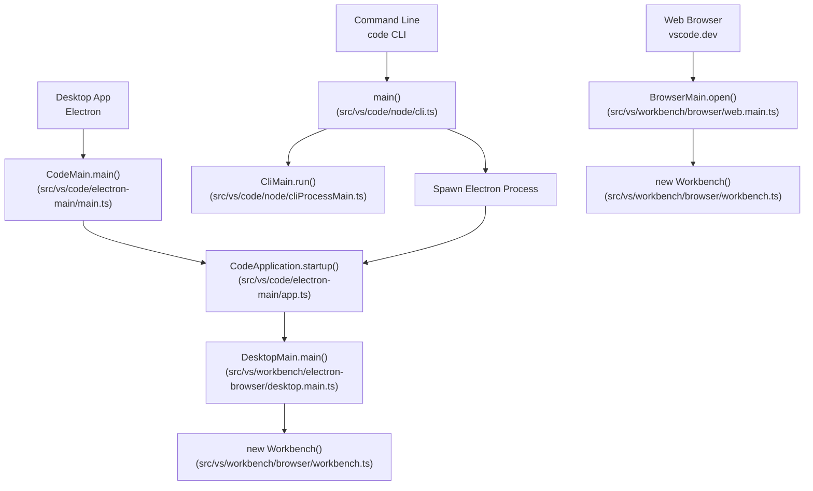
```mermaid
flowchart TD
    CLI["Command Line<br/>code CLI"] 
    DesktopApp["Desktop App<br/>Electron"]
    WebBrowser["Web Browser<br/>vscode.dev"]
    
    CLI --> CliMain["main()<br/>(src/vs/code/node/cli.ts)"]
    DesktopApp --> ElectronMain["CodeMain.main()<br/>(src/vs/code/electron-main/main.ts)"]
    WebBrowser --> BrowserMainOpen["BrowserMain.open()<br/>(src/vs/workbench/browser/web.main.ts)"]
    
    CliMain --> CliProcessMain["CliMain.run()<br/>(src/vs/code/node/cliProcessMain.ts)"]
    CliMain --> ElectronSpawn["Spawn Electron Process"]
    
    ElectronMain --> CodeAppStartup["CodeApplication.startup()<br/>(src/vs/code/electron-main/app.ts)"]
    ElectronSpawn --> CodeAppStartup
    
    BrowserMainOpen --> WorkbenchCreate["new Workbench()<br/>(src/vs/workbench/browser/workbench.ts)"]
    
    CodeAppStartup --> DesktopMain["DesktopMain.main()<br/>(src/vs/workbench/electron-browser/desktop.main.ts)"]
    DesktopMain --> WorkbenchDesktop["new Workbench()<br/>(src/vs/workbench/browser/workbench.ts)"]
```

Sources:
- [src/vs/code/node/cli.ts:43-139]()
- [src/vs/code/electron-main/main.ts:85-94]()
- [src/vs/workbench/browser/web.main.ts:119-131]()
- [src/vs/code/electron-main/app.ts:526-530]()
- [src/vs/workbench/electron-browser/desktop.main.ts:1-185]()

### Main Process Startup Sequence

**CodeMain and CodeApplication Initialization**

The main process startup follows a specific sequence managed by the `CodeMain` and `CodeApplication` classes:

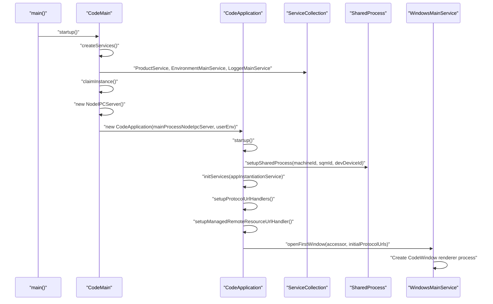
```mermaid
sequenceDiagram
    participant Entry as "main()"
    participant CodeMain as "CodeMain"
    participant CodeApp as "CodeApplication" 
    participant Services as "ServiceCollection"
    participant SharedProcess as "SharedProcess"
    participant WindowsMainService as "WindowsMainService"
    
    Entry->>CodeMain: "startup()"
    CodeMain->>CodeMain: "createServices()"
    CodeMain->>Services: "ProductService, EnvironmentMainService, LoggerMainService"
    CodeMain->>CodeMain: "claimInstance()"
    CodeMain->>CodeMain: "new NodeIPCServer()"
    CodeMain->>CodeApp: "new CodeApplication(mainProcessNodeIpcServer, userEnv)"
    CodeApp->>CodeApp: "startup()"
    CodeApp->>SharedProcess: "setupSharedProcess(machineId, sqmId, devDeviceId)"
    CodeApp->>CodeApp: "initServices(appInstantiationService)"
    CodeApp->>CodeApp: "setupProtocolUrlHandlers()"
    CodeApp->>CodeApp: "setupManagedRemoteResourceUrlHandler()"
    CodeApp->>WindowsMainService: "openFirstWindow(accessor, initialProtocolUrls)"
    WindowsMainService->>WindowsMainService: "Create CodeWindow renderer process"
```

Sources:
- [src/vs/code/electron-main/main.ts:85-151]()
- [src/vs/code/electron-main/app.ts:526-624]()
- [src/vs/code/electron-main/main.ts:152-236]()

## Environment Setup and Configuration

Environment setup is a critical part of the startup process, handled by various environment services depending on the platform.

### Environment Service Hierarchy

**Environment Service Class Structure and Implementations**

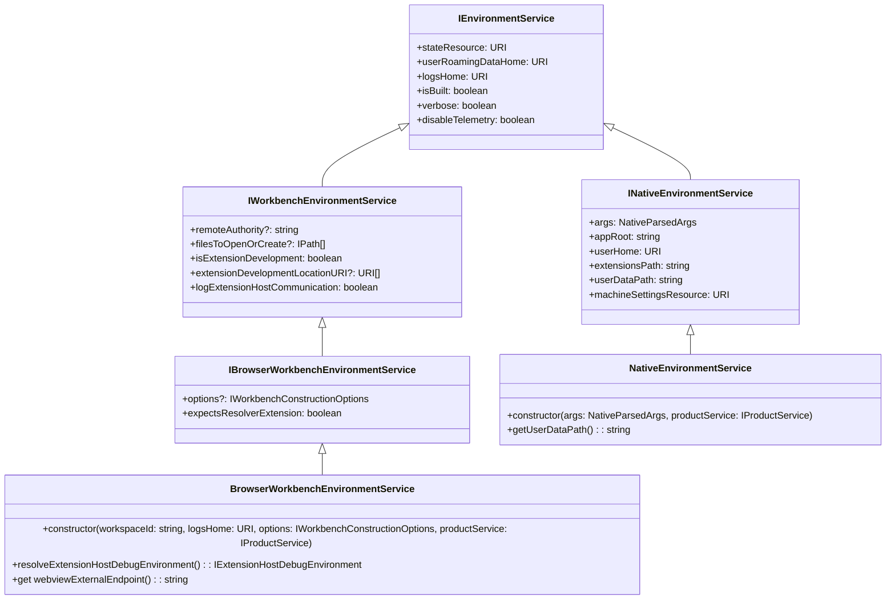
```mermaid
classDiagram
    class IEnvironmentService {
        +stateResource: URI
        +userRoamingDataHome: URI
        +logsHome: URI
        +isBuilt: boolean
        +verbose: boolean
        +disableTelemetry: boolean
    }
    
    class INativeEnvironmentService {
        +args: NativeParsedArgs
        +appRoot: string
        +userHome: URI
        +extensionsPath: string
        +userDataPath: string
        +machineSettingsResource: URI
    }
    
    class IWorkbenchEnvironmentService {
        +remoteAuthority?: string
        +filesToOpenOrCreate?: IPath[]
        +isExtensionDevelopment: boolean
        +extensionDevelopmentLocationURI?: URI[]
        +logExtensionHostCommunication: boolean
    }
    
    class IBrowserWorkbenchEnvironmentService {
        +options?: IWorkbenchConstructionOptions
        +expectsResolverExtension: boolean
    }
    
    class NativeEnvironmentService {
        +constructor(args: NativeParsedArgs, productService: IProductService)
        +getUserDataPath(): string
    }
    
    class BrowserWorkbenchEnvironmentService {
        +constructor(workspaceId: string, logsHome: URI, options: IWorkbenchConstructionOptions, productService: IProductService)
        +resolveExtensionHostDebugEnvironment(): IExtensionHostDebugEnvironment
        +get webviewExternalEndpoint(): string
    }
    
    IEnvironmentService <|-- INativeEnvironmentService
    IEnvironmentService <|-- IWorkbenchEnvironmentService
    IWorkbenchEnvironmentService <|-- IBrowserWorkbenchEnvironmentService
    INativeEnvironmentService <|-- NativeEnvironmentService
    IBrowserWorkbenchEnvironmentService <|-- BrowserWorkbenchEnvironmentService
```

Sources:
- [src/vs/platform/environment/common/environment.ts:35-159]()
- [src/vs/workbench/services/environment/common/environmentService.ts:11-50]()
- [src/vs/workbench/services/environment/browser/environmentService.ts:23-412]()
- [src/vs/platform/environment/node/environmentService.ts:13-31]()

### Command Line Argument Processing

**Argument Parsing Pipeline with Specific Functions**

Command line arguments are processed through a structured system using the `parseArgs` function and `OPTIONS` definitions:

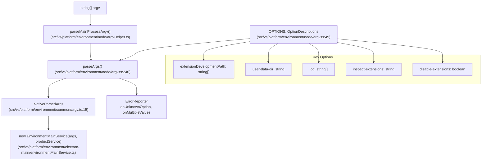
```mermaid
flowchart TD
    RawArgs["string[] argv"]
    ParseHelper["parseMainProcessArgv()<br/>(src/vs/platform/environment/node/argvHelper.ts)"]
    ParseArgs["parseArgs<T>()<br/>(src/vs/platform/environment/node/argv.ts:240)"]
    OptionsConfig["OPTIONS: OptionDescriptions<NativeParsedArgs><br/>(src/vs/platform/environment/node/argv.ts:49)"]
    
    NativeParsedArgs["NativeParsedArgs<br/>(src/vs/platform/environment/common/argv.ts:15)"]
    ErrorReporter["ErrorReporter<br/>onUnknownOption, onMultipleValues"]
    
    EnvironmentMainService["new EnvironmentMainService(args, productService)<br/>(src/vs/platform/environment/electron-main/environmentMainService.ts)"]
    
    RawArgs --> ParseHelper
    ParseHelper --> ParseArgs
    OptionsConfig --> ParseArgs
    ParseArgs --> NativeParsedArgs
    ParseArgs --> ErrorReporter
    NativeParsedArgs --> EnvironmentMainService
    
    subgraph "Key Options"
        ExtensionDev["extensionDevelopmentPath: string[]"]
        UserDataDir["user-data-dir: string"]
        LogLevel["log: string[]"]
        InspectExt["inspect-extensions: string"]
        DisableExt["disable-extensions: boolean"]
    end
    
    OptionsConfig --> ExtensionDev
    OptionsConfig --> UserDataDir
    OptionsConfig --> LogLevel
    OptionsConfig --> InspectExt
    OptionsConfig --> DisableExt
```

Sources:
- [src/vs/platform/environment/node/argv.ts:240-362]()
- [src/vs/platform/environment/common/argv.ts:15-158]()
- [src/vs/platform/environment/node/argvHelper.ts:12-70]()
- [src/vs/platform/environment/electron-main/environmentMainService.ts:43-87]()

## Process Architecture Components

### Core Process Structure

**Multi-Process Architecture with Specific Service Classes**

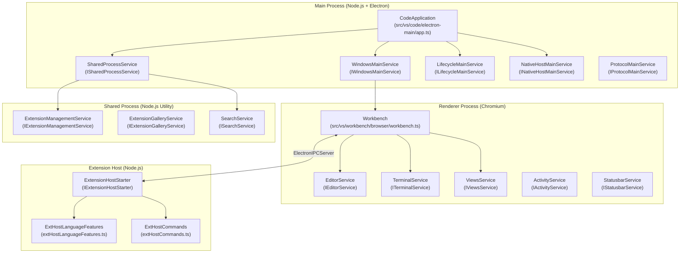
```mermaid
graph TD
    subgraph MainProcess["Main Process (Node.js + Electron)"]
        CodeApplication["CodeApplication<br/>(src/vs/code/electron-main/app.ts)"]
        WindowsMainService["WindowsMainService<br/>(IWindowsMainService)"]
        SharedProcessService["SharedProcessService<br/>(ISharedProcessService)"] 
        LifecycleMainService["LifecycleMainService<br/>(ILifecycleMainService)"]
        NativeHostMainService["NativeHostMainService<br/>(INativeHostMainService)"]
        ProtocolMainService["ProtocolMainService<br/>(IProtocolMainService)"]
    end
    
    subgraph RendererProcess["Renderer Process (Chromium)"]
        Workbench["Workbench<br/>(src/vs/workbench/browser/workbench.ts)"]
        EditorService["EditorService<br/>(IEditorService)"]
        TerminalService["TerminalService<br/>(ITerminalService)"]
        ViewsService["ViewsService<br/>(IViewsService)"]
        ActivityService["ActivityService<br/>(IActivityService)"]
        StatusbarService["StatusbarService<br/>(IStatusbarService)"]
    end
    
    subgraph ExtensionHost["Extension Host (Node.js)"]
        ExtensionHostStarter["ExtensionHostStarter<br/>(IExtensionHostStarter)"]
        ExtHostLanguageFeatures["ExtHostLanguageFeatures<br/>(extHostLanguageFeatures.ts)"]
        ExtHostCommands["ExtHostCommands<br/>(extHostCommands.ts)"]
    end
    
    subgraph SharedProcess["Shared Process (Node.js Utility)"]
        ExtensionManagementService["ExtensionManagementService<br/>(IExtensionManagementService)"]
        ExtensionGalleryService["ExtensionGalleryService<br/>(IExtensionGalleryService)"]
        SearchService["SearchService<br/>(ISearchService)"]
    end
    
    CodeApplication --> WindowsMainService
    CodeApplication --> SharedProcessService
    CodeApplication --> LifecycleMainService
    CodeApplication --> NativeHostMainService
    
    WindowsMainService --> Workbench
    Workbench --> EditorService
    Workbench --> TerminalService
    Workbench --> ViewsService
    
    SharedProcessService --> ExtensionManagementService
    SharedProcessService --> SearchService
    
    Workbench <-->|"ElectronIPCServer"| ExtensionHostStarter
    ExtensionHostStarter --> ExtHostLanguageFeatures
    ExtensionHostStarter --> ExtHostCommands
```

Sources:
- [src/vs/code/electron-main/app.ts:130-159]()
- [src/vs/workbench/workbench.common.main.ts:131-176]()
- [src/vs/workbench/browser/web.main.ts:254-434]()

## Main Process

The main process serves as the entry point and coordinator for the entire VS Code application. It's implemented primarily in the `CodeApplication` class and manages the application lifecycle.

### Service Initialization

**Main Process Service Creation Order**

The main process initializes services in a specific order during startup in `CodeMain.createServices()`:

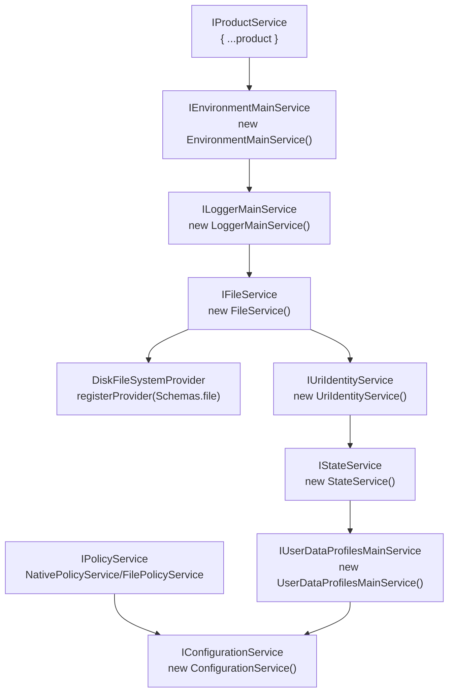
```mermaid
flowchart TD
    ProductService["IProductService<br/>{ ...product }"]
    EnvironmentMainService["IEnvironmentMainService<br/>new EnvironmentMainService()"]
    LoggerMainService["ILoggerMainService<br/>new LoggerMainService()"]
    FileService["IFileService<br/>new FileService()"]
    DiskFileSystemProvider["DiskFileSystemProvider<br/>registerProvider(Schemas.file)"]
    UriIdentityService["IUriIdentityService<br/>new UriIdentityService()"]
    StateService["IStateService<br/>new StateService()"]
    UserDataProfilesMainService["IUserDataProfilesMainService<br/>new UserDataProfilesMainService()"]
    PolicyService["IPolicyService<br/>NativePolicyService/FilePolicyService"]
    ConfigurationService["IConfigurationService<br/>new ConfigurationService()"]
    
    ProductService --> EnvironmentMainService
    EnvironmentMainService --> LoggerMainService
    LoggerMainService --> FileService
    FileService --> DiskFileSystemProvider
    FileService --> UriIdentityService
    UriIdentityService --> StateService
    StateService --> UserDataProfilesMainService
    PolicyService --> ConfigurationService
    UserDataProfilesMainService --> ConfigurationService
```

Sources:
- [src/vs/code/electron-main/main.ts:153-236]()

### Core Responsibilities

| Component | Class | Key Methods | Purpose |
|-----------|-------|-------------|---------|
| Application Coordinator | `CodeApplication` | `startup()`, `initServices()` | Overall application lifecycle |
| Window Management | `IWindowsMainService` | `open()`, `openEmptyWindow()` | Window creation and management |
| Lifecycle Management | `ILifecycleMainService` | `phase`, `onWillShutdown` | Application state transitions |
| Menu Management | `IMenubarMainService` | `updateMenubar()` | Native menu handling |
| Native Integration | `INativeHostMainService` | `openExternal()`, `showMessageBox()` | OS-specific functionality |
| Process Management | `SharedProcessService` | `whenReady()` | Shared process coordination |

### Detailed Startup Implementation

**CodeApplication.startup() Method Execution Flow**

The `CodeApplication.startup()` method follows this sequence:

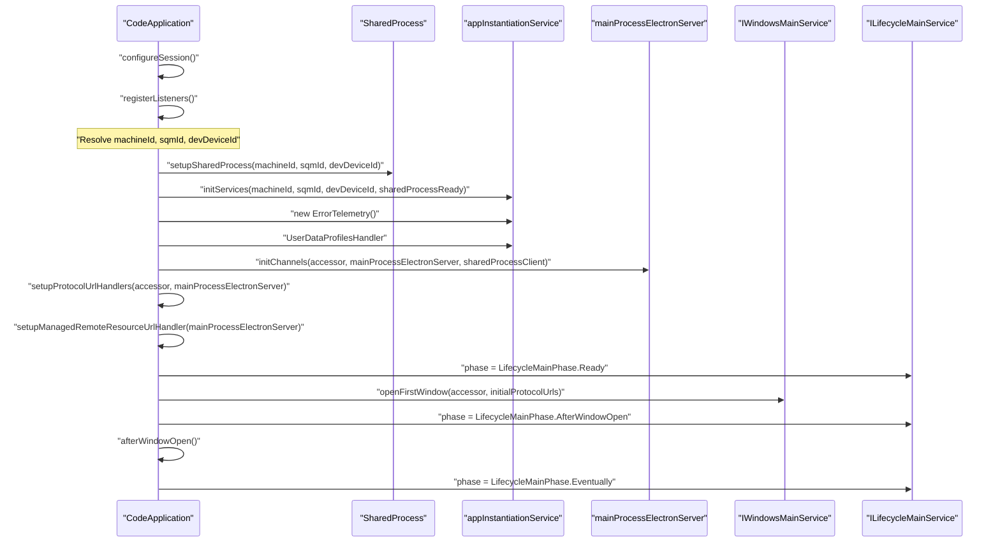
```mermaid
sequenceDiagram
    participant App as "CodeApplication"
    participant SharedProcess as "SharedProcess" 
    participant InstantiationService as "appInstantiationService"
    participant ElectronIPCServer as "mainProcessElectronServer"
    participant WindowsMainService as "IWindowsMainService"
    participant LifecycleMainService as "ILifecycleMainService"
    
    App->>App: "configureSession()"
    App->>App: "registerListeners()"
    Note over App: "Resolve machineId, sqmId, devDeviceId"
    App->>SharedProcess: "setupSharedProcess(machineId, sqmId, devDeviceId)"
    App->>InstantiationService: "initServices(machineId, sqmId, devDeviceId, sharedProcessReady)"
    App->>InstantiationService: "new ErrorTelemetry()"
    App->>InstantiationService: "UserDataProfilesHandler"
    App->>ElectronIPCServer: "initChannels(accessor, mainProcessElectronServer, sharedProcessClient)"
    App->>App: "setupProtocolUrlHandlers(accessor, mainProcessElectronServer)"
    App->>App: "setupManagedRemoteResourceUrlHandler(mainProcessElectronServer)"
    App->>LifecycleMainService: "phase = LifecycleMainPhase.Ready"
    App->>WindowsMainService: "openFirstWindow(accessor, initialProtocolUrls)"
    App->>LifecycleMainService: "phase = LifecycleMainPhase.AfterWindowOpen"
    App->>App: "afterWindowOpen()"
    App->>LifecycleMainService: "phase = LifecycleMainPhase.Eventually"
```

Sources:
- [src/vs/code/electron-main/app.ts:526-624]()

## Renderer Process

Each VS Code window runs in its own renderer process, hosting the workbench UI and handling user interactions. The initialization differs between desktop and web environments.

### Desktop Renderer Initialization

**DesktopMain Service Creation and Workbench Startup**

Desktop renderer processes start through the `DesktopMain` class:

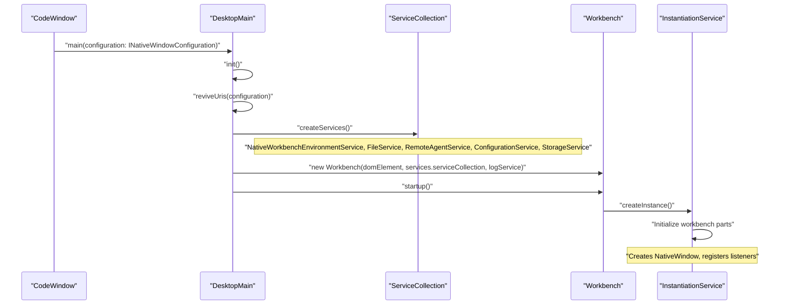
```mermaid
sequenceDiagram
    participant CodeWindow as "CodeWindow"
    participant DesktopMain as "DesktopMain" 
    participant ServiceCollection as "ServiceCollection"
    participant Workbench as "Workbench"
    participant InstantiationService as "InstantiationService"
    
    CodeWindow->>DesktopMain: "main(configuration: INativeWindowConfiguration)"
    DesktopMain->>DesktopMain: "init()"
    DesktopMain->>DesktopMain: "reviveUris(configuration)"
    DesktopMain->>ServiceCollection: "createServices()"
    Note over ServiceCollection: "NativeWorkbenchEnvironmentService, FileService, RemoteAgentService, ConfigurationService, StorageService"
    DesktopMain->>Workbench: "new Workbench(domElement, services.serviceCollection, logService)"
    DesktopMain->>Workbench: "startup()"
    Workbench->>InstantiationService: "createInstance()"
    InstantiationService->>InstantiationService: "Initialize workbench parts"
    Note over InstantiationService: "Creates NativeWindow, registers listeners"
```

Sources:
- [src/vs/workbench/electron-browser/desktop.main.ts:67-164]()

### Web Renderer Initialization

**BrowserMain Service Initialization and Web Workbench Creation**

Web renderer processes start through the `BrowserMain` class:

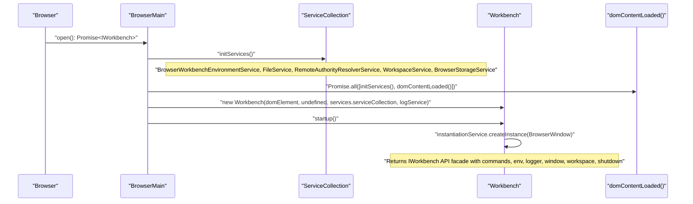
```mermaid
sequenceDiagram
    participant Browser as "Browser"
    participant BrowserMain as "BrowserMain"
    participant ServiceCollection as "ServiceCollection" 
    participant Workbench as "Workbench"
    participant DOMContentLoaded as "domContentLoaded()"
    
    Browser->>BrowserMain: "open(): Promise<IWorkbench>"
    BrowserMain->>ServiceCollection: "initServices()"
    Note over ServiceCollection: "BrowserWorkbenchEnvironmentService, FileService, RemoteAuthorityResolverService, WorkspaceService, BrowserStorageService"
    BrowserMain->>DOMContentLoaded: "Promise.all([initServices(), domContentLoaded()])"
    BrowserMain->>Workbench: "new Workbench(domElement, undefined, services.serviceCollection, logService)"
    BrowserMain->>Workbench: "startup()"
    Workbench->>Workbench: "instantiationService.createInstance(BrowserWindow)"
    Note over Workbench: "Returns IWorkbench API facade with commands, env, logger, window, workspace, shutdown"
```

Sources:
- [src/vs/workbench/browser/web.main.ts:119-245]()

### Workbench Service Architecture

**Service Registration via registerSingleton() Pattern**

The workbench uses a dependency injection system with service registration in `workbench.common.main.ts`:

| Service Interface | Implementation | Registration Call | InstantiationType |
|------------------|----------------|------------------|------------------|
| `IContextViewService` | `ContextViewService` | `registerSingleton(IContextViewService, ContextViewService, InstantiationType.Delayed)` | Delayed |
| `IListService` | `ListService` | `registerSingleton(IListService, ListService, InstantiationType.Delayed)` | Delayed |
| `IEditorWorkerService` | `WorkbenchEditorWorkerService` | `registerSingleton(IEditorWorkerService, WorkbenchEditorWorkerService, InstantiationType.Eager)` | Eager |
| `IMarkerDecorationsService` | `MarkerDecorationsService` | `registerSingleton(IMarkerDecorationsService, MarkerDecorationsService, InstantiationType.Delayed)` | Delayed |
| `IMarkerService` | `MarkerService` | `registerSingleton(IMarkerService, MarkerService, InstantiationType.Delayed)` | Delayed |
| `IContextKeyService` | `ContextKeyService` | `registerSingleton(IContextKeyService, ContextKeyService, InstantiationType.Delayed)` | Delayed |
| `IOpenerService` | `OpenerService` | `registerSingleton(IOpenerService, OpenerService, InstantiationType.Delayed)` | Delayed |

Sources:
- [src/vs/workbench/workbench.common.main.ts:131-176]()

### Window Configuration Structure

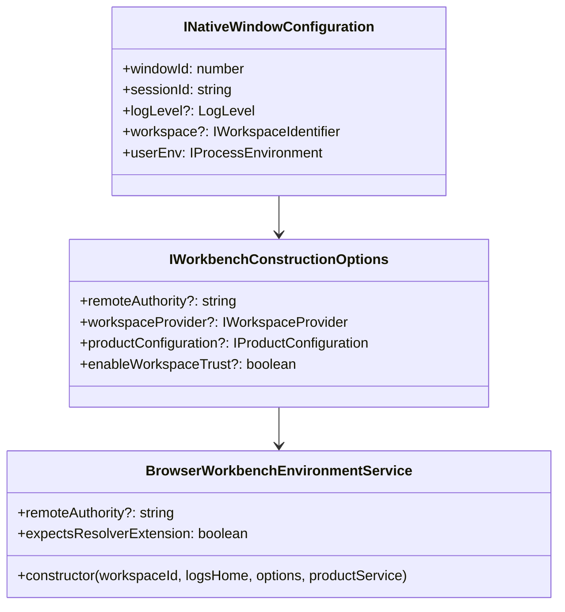
```mermaid
classDiagram
    class INativeWindowConfiguration {
        +windowId: number
        +sessionId: string
        +logLevel?: LogLevel
        +workspace?: IWorkspaceIdentifier
        +userEnv: IProcessEnvironment
    }
    
    class IWorkbenchConstructionOptions {
        +remoteAuthority?: string
        +workspaceProvider?: IWorkspaceProvider
        +productConfiguration?: IProductConfiguration
        +enableWorkspaceTrust?: boolean
    }
    
    class BrowserWorkbenchEnvironmentService {
        +constructor(workspaceId, logsHome, options, productService)
        +remoteAuthority?: string
        +expectsResolverExtension: boolean
    }
    
    INativeWindowConfiguration --> IWorkbenchConstructionOptions
    IWorkbenchConstructionOptions --> BrowserWorkbenchEnvironmentService
```

Sources:
- [src/vs/workbench/electron-sandbox/desktop.main.ts:68-164]()
- [src/vs/workbench/browser/web.main.ts:119-245]()
- [src/vs/workbench/workbench.common.main.ts:131-176]()
- [src/vs/workbench/services/environment/browser/environmentService.ts:42-275]()

## Extension Host Process

The extension host process provides an isolated runtime environment for extensions, preventing them from affecting the main UI stability. Extension startup is coordinated through the `ExtensionHostStarter` service.

### Extension Host Startup Process

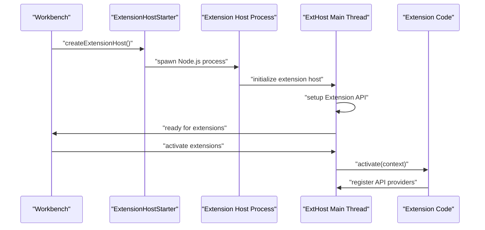
```mermaid
sequenceDiagram
    participant Workbench as "Workbench"
    participant ExtHostStarter as "ExtensionHostStarter"
    participant ExtHostProcess as "Extension Host Process"
    participant ExtHostMain as "ExtHost Main Thread"
    participant Extensions as "Extension Code"
    
    Workbench->>ExtHostStarter: "createExtensionHost()"
    ExtHostStarter->>ExtHostProcess: "spawn Node.js process"
    ExtHostProcess->>ExtHostMain: "initialize extension host"
    ExtHostMain->>ExtHostMain: "setup Extension API"
    ExtHostMain->>Workbench: "ready for extensions"
    Workbench->>ExtHostMain: "activate extensions"
    ExtHostMain->>Extensions: "activate(context)"
    Extensions->>ExtHostMain: "register API providers"
```

### Extension Host Communication Architecture

The extension host uses a bidirectional RPC protocol for communication:

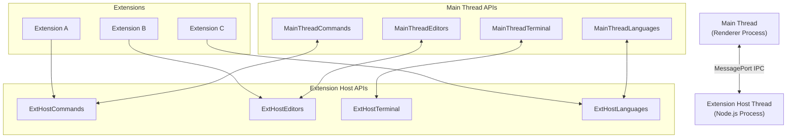
```mermaid
flowchart TD
    MainThread["Main Thread<br/>(Renderer Process)"]
    ExtHostThread["Extension Host Thread<br/>(Node.js Process)"]
    
    subgraph "Main Thread APIs"
        MainThreadCommands["MainThreadCommands"]
        MainThreadEditors["MainThreadEditors"] 
        MainThreadTerminal["MainThreadTerminal"]
        MainThreadLanguages["MainThreadLanguages"]
    end
    
    subgraph "Extension Host APIs"
        ExtHostCommands["ExtHostCommands"]
        ExtHostEditors["ExtHostEditors"]
        ExtHostTerminal["ExtHostTerminal"] 
        ExtHostLanguages["ExtHostLanguages"]
    end
    
    subgraph "Extensions"
        Extension1["Extension A"]
        Extension2["Extension B"]
        Extension3["Extension C"]
    end
    
    MainThread <-->|"MessagePort IPC"| ExtHostThread
    
    MainThreadCommands <--> ExtHostCommands
    MainThreadEditors <--> ExtHostEditors
    MainThreadTerminal <--> ExtHostTerminal
    MainThreadLanguages <--> ExtHostLanguages
    
    Extension1 --> ExtHostCommands
    Extension2 --> ExtHostEditors
    Extension3 --> ExtHostLanguages
```

### Extension Host Debug Configuration

Extension debugging is configured through environment parameters:

| Parameter | Purpose | Service |
|-----------|---------|---------|
| `debugExtensionHost` | Debug configuration object | `IExtensionHostDebugParams` |
| `isExtensionDevelopment` | Development mode flag | `IEnvironmentService` |
| `extensionDevelopmentLocationURI` | Extension source paths | Environment configuration |
| `extensionTestsLocationURI` | Test runner location | Environment configuration |

Sources:
- [src/vs/platform/extensions/electron-main/extensionHostStarter.ts:43-44]()
- [src/vs/workbench/services/environment/browser/environmentService.ts:147-200]()
- [src/vs/platform/environment/common/environment.ts:70-77]()

## Shared Process

The shared process handles resource-intensive operations that are shared across multiple windows. It's implemented as a utility process spawned by the main process.

### Shared Process Service Implementation

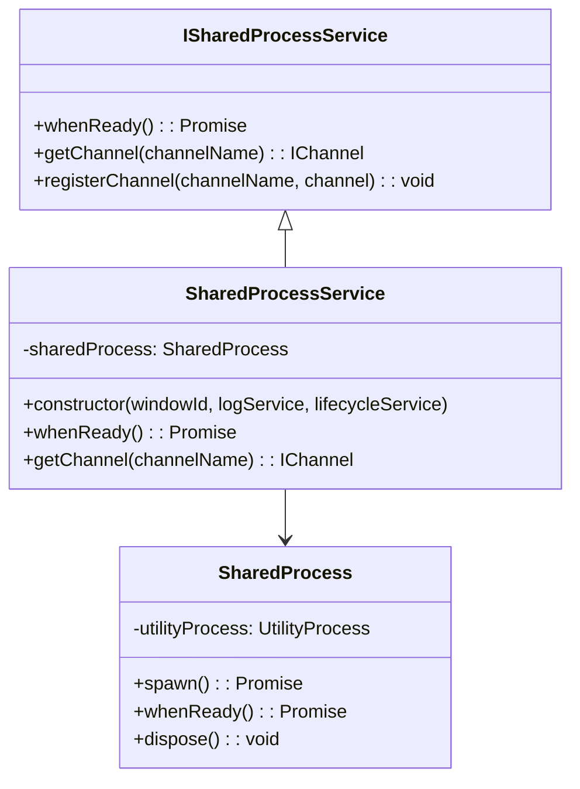
```mermaid
classDiagram
    class ISharedProcessService {
        +whenReady(): Promise
        +getChannel(channelName): IChannel
        +registerChannel(channelName, channel): void
    }
    
    class SharedProcessService {
        -sharedProcess: SharedProcess
        +constructor(windowId, logService, lifecycleService)
        +whenReady(): Promise
        +getChannel(channelName): IChannel
    }
    
    class SharedProcess {
        -utilityProcess: UtilityProcess
        +spawn(): Promise
        +whenReady(): Promise
        +dispose(): void
    }
    
    ISharedProcessService <|-- SharedProcessService
    SharedProcessService --> SharedProcess
```

### Shared Process Services Architecture

The shared process hosts several key services that are expensive to duplicate per window:

| Service | Interface | Purpose |
|---------|-----------|---------|
| Extension Management | `IExtensionManagementService` | Extension installation, updates, and metadata |
| Extension Gallery | `IExtensionGalleryService` | Marketplace API communication |
| Search Service | `ISearchService` | File and text search indexing |
| Telemetry Service | `ITelemetryService` | Usage analytics and crash reporting |
| Storage Service | `IStorageService` | Persistent application data |
| Request Service | `IRequestService` | HTTP request handling |

### Shared Process Initialization Flow

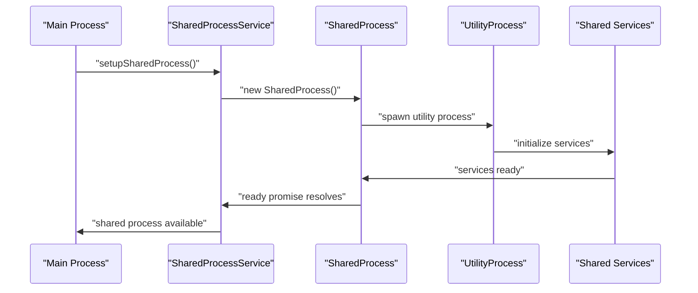
```mermaid
sequenceDiagram
    participant Main as "Main Process"
    participant SharedProcessService as "SharedProcessService"
    participant SharedProcess as "SharedProcess"
    participant UtilityProcess as "UtilityProcess"
    participant Services as "Shared Services"
    
    Main->>SharedProcessService: "setupSharedProcess()"
    SharedProcessService->>SharedProcess: "new SharedProcess()"
    SharedProcess->>UtilityProcess: "spawn utility process"
    UtilityProcess->>Services: "initialize services"
    Services->>SharedProcess: "services ready"
    SharedProcess->>SharedProcessService: "ready promise resolves"
    SharedProcessService->>Main: "shared process available"
```

### Channel-Based Communication

The shared process exposes services through named IPC channels:

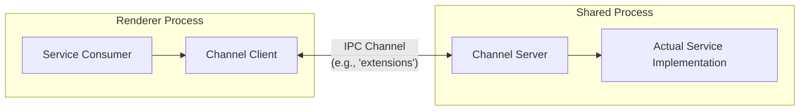
```mermaid
flowchart LR
    subgraph "Renderer Process"
        RendererService["Service Consumer"]
        ChannelClient["Channel Client"]
    end
    
    subgraph "Shared Process"
        ChannelServer["Channel Server"]
        SharedService["Actual Service Implementation"]
    end
    
    RendererService --> ChannelClient
    ChannelClient <-->|"IPC Channel<br/>(e.g., 'extensions')"| ChannelServer
    ChannelServer --> SharedService
```

Sources:
- [src/vs/platform/sharedProcess/electron-main/sharedProcess.ts:24-193]()
- [src/vs/code/electron-main/app.ts:576-578]()
- [src/vs/workbench/electron-sandbox/desktop.main.ts:24-26]()

## Inter-Process Communication

VS Code uses several IPC mechanisms to enable communication between its different processes.

### IPC Channels

1. **Electron IPC**: Used for communication between the main process and renderer processes
2. **Node.js IPC**: Used for communication with the extension host and shared process
3. **Message Ports**: Used for high-performance communication between processes

### Main Process as Coordinator

The main process acts as a coordinator for IPC, setting up channels and routing messages between processes.

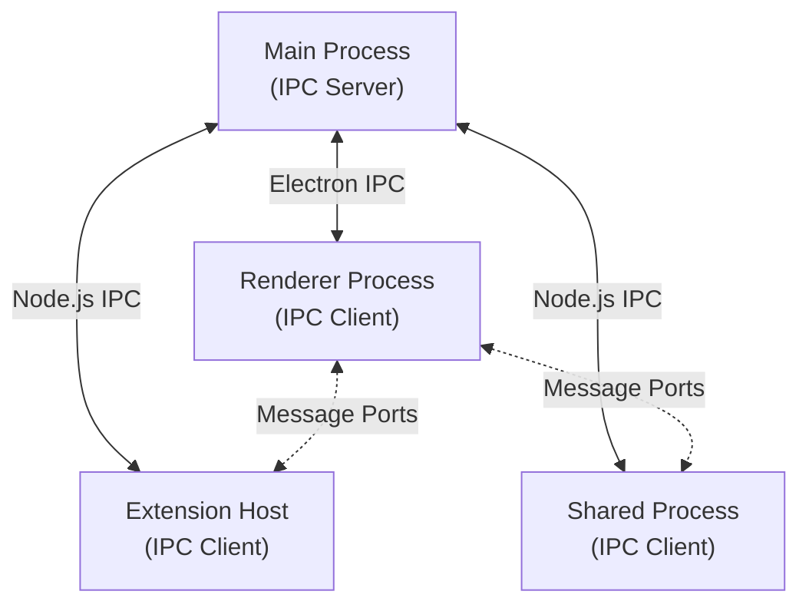
```mermaid
graph TD
    Main["Main Process<br>(IPC Server)"]
    Renderer["Renderer Process<br>(IPC Client)"]
    ExtHost["Extension Host<br>(IPC Client)"]
    Shared["Shared Process<br>(IPC Client)"]
    
    Main <-->|"Electron IPC"| Renderer
    Main <-->|"Node.js IPC"| ExtHost
    Main <-->|"Node.js IPC"| Shared
    Renderer <-.->|"Message Ports"| ExtHost
    Renderer <-.->|"Message Ports"| Shared
```

### Service Architecture

VS Code uses a service-oriented architecture where services are exposed through IPC channels. This allows services to be consumed across process boundaries.

Sources:
- [src/vs/code/electron-main/app.ts:551-561]()
- [src/vs/code/electron-main/app.ts:588-594]()
- [src/vs/platform/sharedProcess/electron-main/sharedProcess.ts:51-92]()

## Window Management

Window management is a core responsibility of the main process, handled primarily by the `WindowsMainService`.

### Window Creation

Windows are created through the `WindowsMainService`, which manages the lifecycle of all windows in the application.

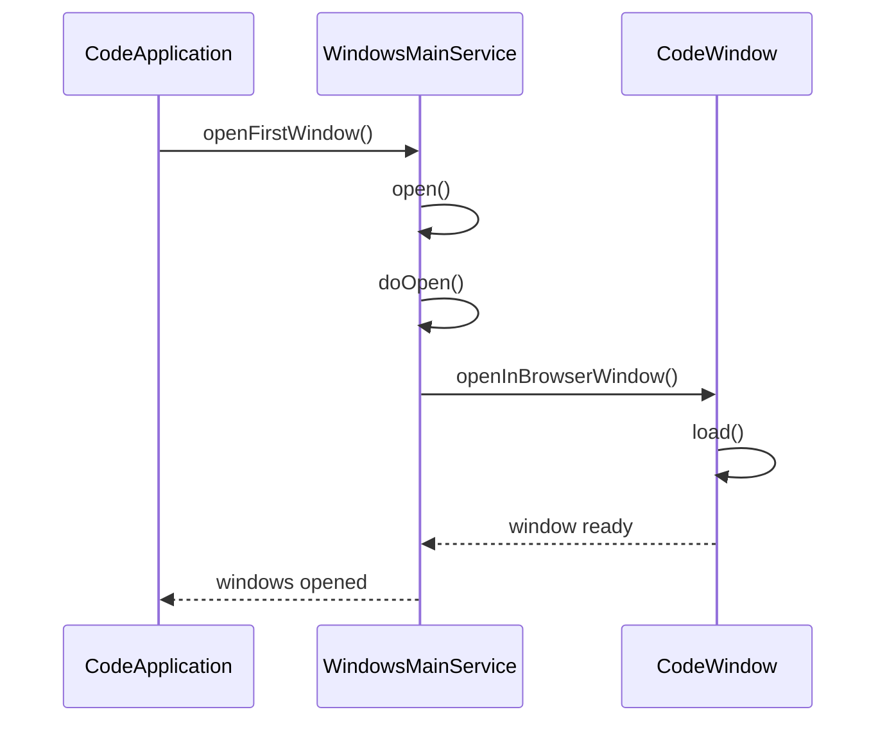
```mermaid
sequenceDiagram
    participant App as CodeApplication
    participant WindowsService as WindowsMainService
    participant Window as CodeWindow
    
    App->>WindowsService: openFirstWindow()
    WindowsService->>WindowsService: open()
    WindowsService->>WindowsService: doOpen()
    WindowsService->>Window: openInBrowserWindow()
    Window->>Window: load()
    Window-->>WindowsService: window ready
    WindowsService-->>App: windows opened
```

### Window States

Windows go through several states during their lifecycle:

1. **Creation**: Window is created but not yet loaded
2. **Loading**: Window is loading the workbench
3. **Ready**: Window is fully loaded and ready for user interaction
4. **Closing**: Window is in the process of closing

### Multi-Window Support

VS Code supports multiple windows, each with its own renderer process. The `WindowsMainService` keeps track of all open windows and manages focus, z-order, and window state.

Sources:
- [src/vs/platform/windows/electron-main/windowsMainService.ts:183-657]()
- [src/vs/platform/windows/electron-main/windows.ts:58-237]()
- [src/vs/platform/window/electron-main/window.ts:45-83]()

## Process Lifecycle Management

VS Code carefully manages the lifecycle of all its processes to ensure proper startup, shutdown, and resource management.

### Application Lifecycle

The `LifecycleMainService` manages the overall application lifecycle, including:

1. **Startup**: Initializing services and opening windows
2. **Running**: Managing the running application
3. **Shutdown**: Gracefully shutting down all processes

### Lifecycle Phases

The application goes through several phases during its lifecycle:

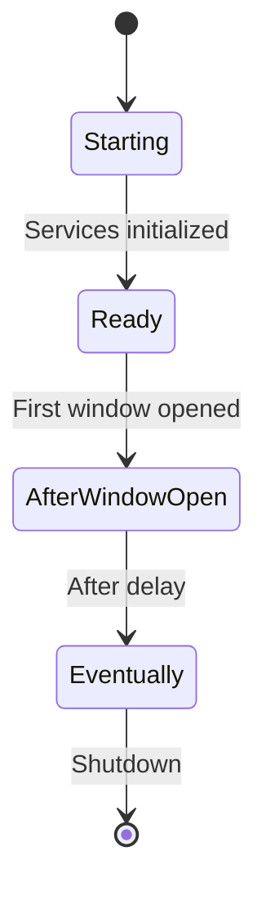
```mermaid
stateDiagram-v2
    [*] --> Starting
    Starting --> Ready: Services initialized
    Ready --> AfterWindowOpen: First window opened
    AfterWindowOpen --> Eventually: After delay
    Eventually --> [*]: Shutdown
```

1. **Starting**: Application is initializing
2. **Ready**: Core services are initialized
3. **AfterWindowOpen**: First window is opened
4. **Eventually**: Application is fully initialized
5. **Shutdown**: Application is shutting down

### Process Coordination

During shutdown, processes are terminated in a coordinated manner:

1. Renderer processes are closed first
2. Extension host processes are terminated
3. Shared process is terminated
4. Main process exits

Sources:
- [src/vs/code/electron-main/app.ts:596-620]()
- [src/vs/code/electron-main/app.ts:374-386]()
- [src/vs/platform/windows/electron-main/windowImpl.ts:1000-1100]()

## Security Considerations

VS Code's multi-process architecture provides security benefits by isolating different components.

### Process Isolation

By running extensions in a separate process, VS Code prevents extensions from directly accessing the UI or other sensitive parts of the application.

### Content Security

The main process implements several security measures:

1. **Permission handling**: Controls what permissions are granted to web content
2. **Content filtering**: Blocks potentially dangerous content
3. **Protocol handling**: Securely handles custom protocols

### Sandbox

VS Code uses Electron's sandbox feature to restrict what renderer processes can do, providing an additional layer of security.

Sources:
- [src/vs/code/electron-main/app.ts:161-205]()
- [src/vs/code/electron-main/app.ts:267-320]()
- [src/vs/code/electron-main/app.ts:397-442]()

## Command Line Integration

VS Code supports being launched from the command line with various arguments. This is handled through a special CLI process.

### CLI Process

When VS Code is launched from the command line, a CLI process is created that communicates with the main process to handle the command.

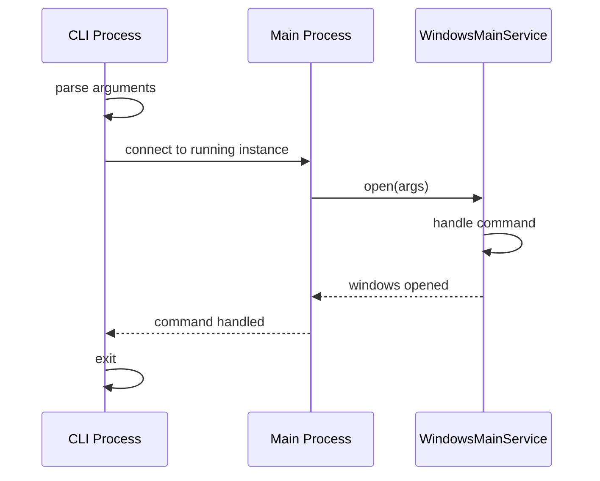
```mermaid
sequenceDiagram
    participant CLI as CLI Process
    participant Main as Main Process
    participant Windows as WindowsMainService
    
    CLI->>CLI: parse arguments
    CLI->>Main: connect to running instance
    Main->>Windows: open(args)
    Windows->>Windows: handle command
    Windows-->>Main: windows opened
    Main-->>CLI: command handled
    CLI->>CLI: exit
```

### Single Instance

VS Code ensures that only one instance of the application is running at a time. When a new instance is launched, it communicates with the existing instance and then exits.

Sources:
- [src/vs/code/node/cliProcessMain.ts:72-342]()
- [src/vs/code/electron-main/main.ts:291-419]()
- [src/vs/platform/launch/electron-main/launchMainService.ts:39-93]()

## Auxiliary Windows

VS Code supports auxiliary windows (like dialog windows) that are managed separately from the main application windows.

### Auxiliary Window Management

Auxiliary windows are managed by the `AuxiliaryWindowsMainService`, which handles their creation, focus, and lifecycle.

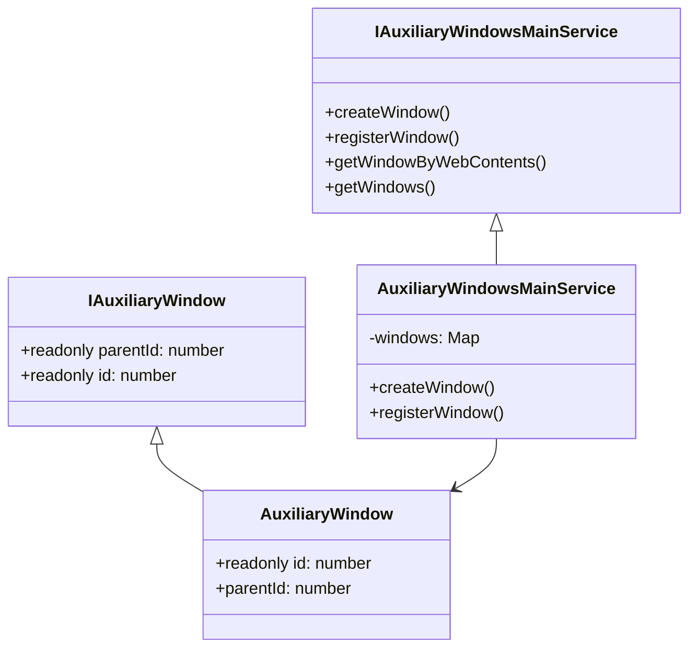
```mermaid
classDiagram
    class IAuxiliaryWindowsMainService {
        +createWindow()
        +registerWindow()
        +getWindowByWebContents()
        +getWindows()
    }
    
    class AuxiliaryWindowsMainService {
        -windows: Map
        +createWindow()
        +registerWindow()
    }
    
    class IAuxiliaryWindow {
        +readonly parentId: number
        +readonly id: number
    }
    
    class AuxiliaryWindow {
        +readonly id: number
        +parentId: number
    }
    
    IAuxiliaryWindowsMainService <|-- AuxiliaryWindowsMainService
    IAuxiliaryWindow <|-- AuxiliaryWindow
    AuxiliaryWindowsMainService --> AuxiliaryWindow
```

Sources:
- [src/vs/platform/auxiliaryWindow/electron-main/auxiliaryWindow.ts:17-67]()
- [src/vs/platform/auxiliaryWindow/electron-main/auxiliaryWindowsMainService.ts:18-36]()
- [src/vs/platform/auxiliaryWindow/electron-main/auxiliaryWindows.ts:13-32]()

## Summary

VS Code's multi-process architecture provides a robust foundation for the application, with clear separation of concerns between processes:

1. **Main Process**: Coordinates the application and manages windows
2. **Renderer Process**: Handles the UI and user interactions
3. **Extension Host Process**: Runs extensions in isolation
4. **Shared Process**: Handles shared operations across windows

This architecture enables VS Code to be stable, secure, and performant, while providing a rich platform for extensions.

| Process | Main Responsibilities | Key Components |
|---------|----------------------|----------------|
| Main Process | Application lifecycle, Window management | CodeApplication, WindowsMainService, LifecycleMainService |
| Renderer Process | UI rendering, User interaction | Workbench, EditorPart, SidebarPart |
| Extension Host | Running extensions, API provision | Extension Host, Extension Runtime |
| Shared Process | Shared operations, Resource management | Extension Management, File Search |

Sources:
- [src/vs/code/electron-main/app.ts:126-130]()
- [src/vs/platform/windows/electron-main/windowsMainService.ts:183-237]()
- [src/vs/platform/sharedProcess/electron-main/sharedProcess.ts:24-34]()