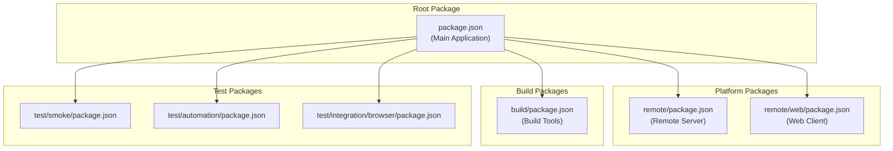
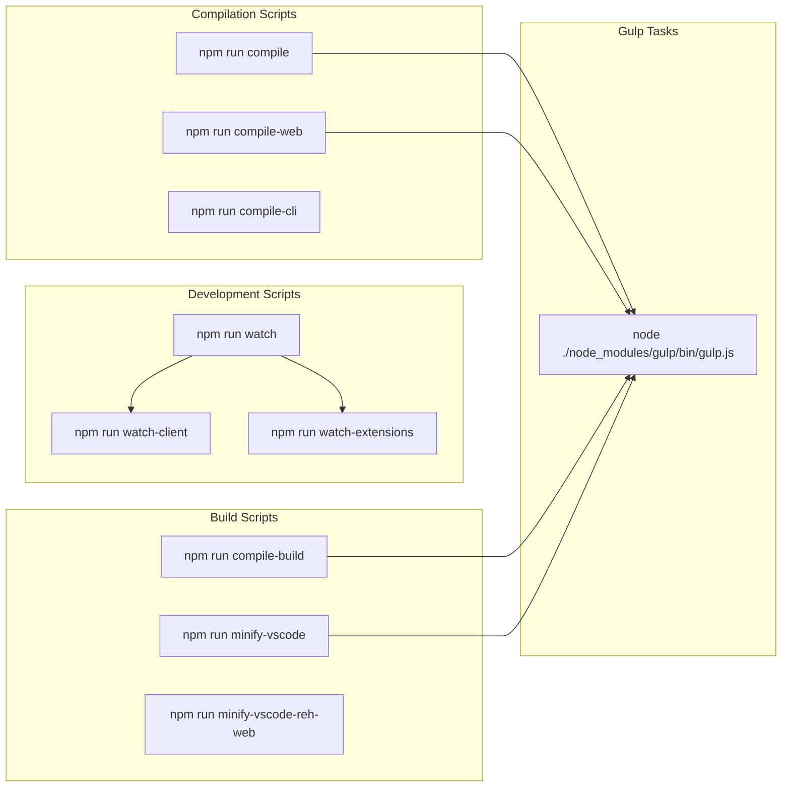
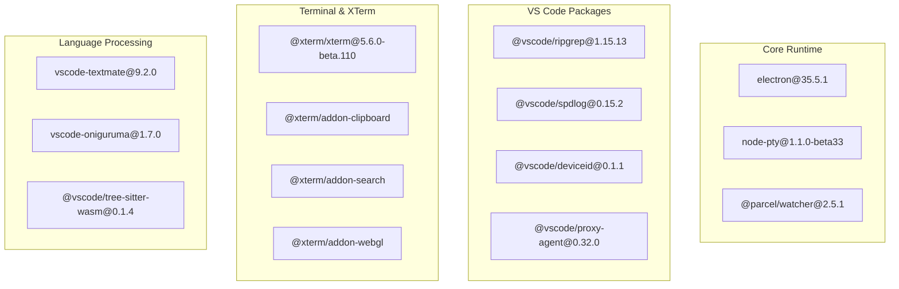
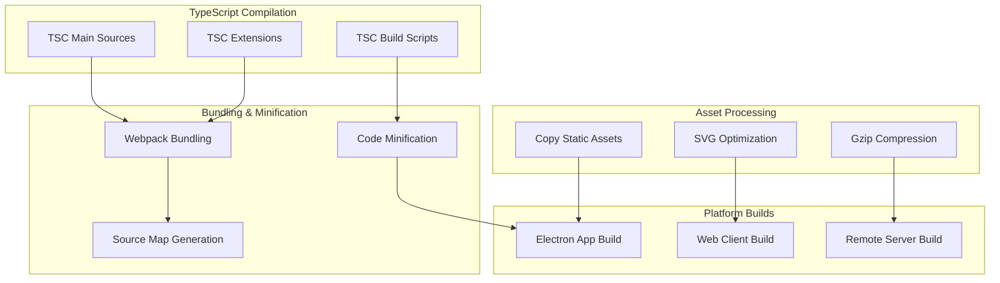
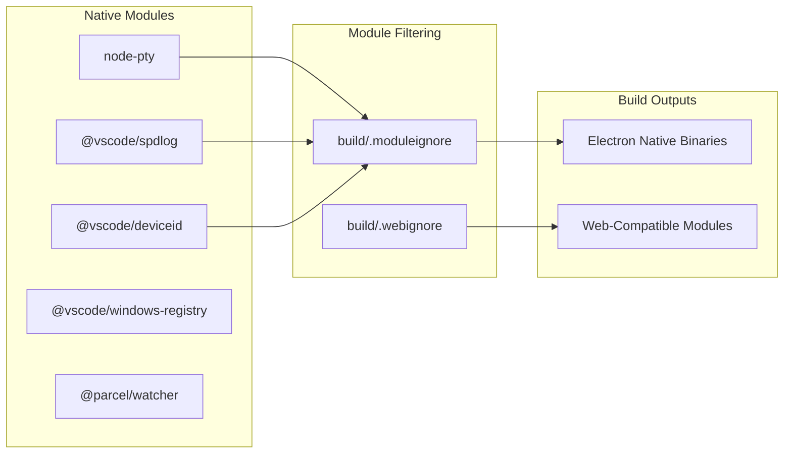
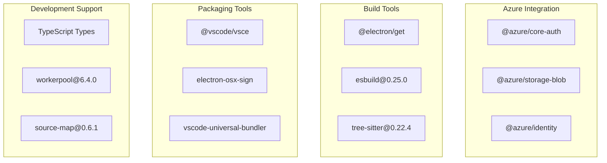
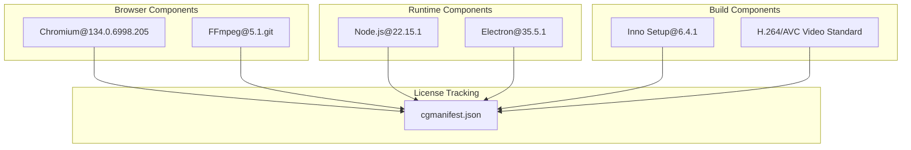

# Build System and Package Management

Relevant source files

The following files were used as context for generating this wiki page:

- [.npmrc](.npmrc)
- [.nvmrc](.nvmrc)
- [build/.moduleignore](build/.moduleignore)
- [build/.webignore](build/.webignore)
- [build/checksums/electron.txt](build/checksums/electron.txt)
- [build/checksums/nodejs.txt](build/checksums/nodejs.txt)
- [build/package-lock.json](build/package-lock.json)
- [build/package.json](build/package.json)
- [cgmanifest.json](cgmanifest.json)
- [extensions/vscode-colorize-tests/src/colorizer.test.ts](extensions/vscode-colorize-tests/src/colorizer.test.ts)
- [package-lock.json](package-lock.json)
- [package.json](package.json)
- [remote/.npmrc](remote/.npmrc)
- [remote/package-lock.json](remote/package-lock.json)
- [remote/package.json](remote/package.json)
- [remote/web/package-lock.json](remote/web/package-lock.json)
- [remote/web/package.json](remote/web/package.json)
- [src/vs/editor/common/config/editorConfigurationSchema.ts](src/vs/editor/common/config/editorConfigurationSchema.ts)
- [src/vs/platform/environment/test/node/nativeModules.integrationTest.ts](src/vs/platform/environment/test/node/nativeModules.integrationTest.ts)
- [test/automation/package.json](test/automation/package.json)
- [test/integration/browser/package.json](test/integration/browser/package.json)
- [test/smoke/package.json](test/smoke/package.json)

This document covers VS Code's build system architecture, package management configuration, and dependency handling across the multi-platform, multi-process application. It explains how the build scripts, NPM packages, and tooling work together to produce the final VS Code distributions.

For information about application startup and the runtime architecture that the build system produces, see [Application Startup and Process Architecture](#1.1).

## Package Structure Overview

VS Code uses a multi-package architecture with separate `package.json` files for different build targets and runtime environments. The build system coordinates compilation, bundling, and distribution across these packages.

**Sources:** [package.json:1-237](), [remote/package.json:1-49](), [remote/web/package.json:1-25](), [build/package.json:1-70]()

## Main Package Configuration

The root [`package.json`]() defines the core application metadata and build pipeline. It specifies VS Code as an ES module with Electron as the runtime.

### Application Metadata

| Property | Value | Purpose |
|----------|--------|---------|
| `name` | `"code-oss-dev"` | Package identifier |
| `version` | `"1.102.0"` | Current version |
| `main` | `"./out/main.js"` | Entry point |
| `type` | `"module"` | ES module format |
| `private` | `true` | Not published to npm |

### Build Scripts

The package defines key build scripts that orchestrate the compilation and development workflow:

**Sources:** [package.json:12-69]()

### Key Build Commands

- `compile`: Runs Gulp-based TypeScript compilation
- `watch`: Parallel compilation watching for client and extensions
- `compile-build`: Production build with mangling
- `minify-vscode`: Creates minified application bundles
- `valid-layers-check`: Validates architectural layer dependencies

**Sources:** [package.json:20-47]()

## Dependency Management

VS Code manages dependencies across multiple categories with precise version control and platform-specific requirements.

### Production Dependencies

The application includes both runtime dependencies and native modules:

**Sources:** [package.json:71-115]()

### Development Dependencies

Build and development tooling includes TypeScript, testing frameworks, and bundling tools:

| Category | Key Dependencies |
|----------|------------------|
| **TypeScript** | `typescript@5.9.0-dev`, `ts-loader@9.5.1` |
| **Build Tools** | `gulp@4.0.0`, `webpack@5.94.0`, `esbuild` (in build package) |
| **Testing** | `mocha@10.8.2`, `@playwright/test@1.52.0`, `sinon@12.0.1` |
| **Linting** | `eslint@9.11.1`, `typescript-eslint@8.8.0` |

**Sources:** [package.json:117-219]()

## Build Tools and Compilation

The build system uses Gulp as the primary task runner with TypeScript compilation and bundling workflows.

### Gulp-Based Build Pipeline

**Sources:** [package.json:35](), [build/package.json:61-64]()

### Multi-Platform Configuration

The build system handles platform-specific requirements through NPM configuration and native module compilation:

#### NPM Configuration

The `.npmrc` files configure native module compilation for different environments:

| Environment | Target | Runtime |
|-------------|--------|---------|
| **Electron** | `35.5.1` | `electron` |
| **Node.js** | `22.15.1` | `node` |
| **Build** | Uses `node-gyp` for native compilation |

**Sources:** [.npmrc:1-8](), [remote/.npmrc:1-7]()

#### Native Module Handling

The build system manages native dependencies through selective inclusion rules:

**Sources:** [build/.moduleignore:1-189](), [build/.webignore:1-60]()

## Package Variants

VS Code builds multiple package variants from the same codebase to support different deployment scenarios.

### Remote Development Packages

#### Remote Server Package
The `remote/package.json` defines dependencies for the VS Code server running in remote environments:

- Excludes Electron-specific dependencies
- Includes core VS Code functionality
- Supports terminal and language features

**Sources:** [remote/package.json:5-41]()

#### Web Client Package
The `remote/web/package.json` provides the minimal dependency set for browser-based VS Code:

- Web-compatible dependencies only
- Reduced bundle size
- No native module dependencies

**Sources:** [remote/web/package.json:5-24]()

### Build Tools Package

The `build/package.json` contains development and build-time dependencies:

**Sources:** [build/package.json:5-69]()

## Dependency Lock and Security

### Lock File Management

VS Code uses `package-lock.json` files to ensure reproducible builds across environments:

- Root package lock manages main application dependencies
- Separate locks for remote and build packages
- Version 3 lockfile format for npm 7+ compatibility

**Sources:** [package-lock.json:1-5](), [remote/package-lock.json:1-5]()

### Component Governance

The `cgmanifest.json` file tracks third-party components and their licenses:

**Sources:** [cgmanifest.json:2-537]()

## Development Workflow Integration

### Watch Mode Development

The build system supports incremental development through watch mode scripts:

- `watch-client`: Monitors main application source changes
- `watch-extensions`: Monitors built-in extension changes
- `deemon`: Daemon management for watch processes

### Testing Integration

Test packages maintain their own dependency trees:

| Test Package | Purpose | Key Dependencies |
|--------------|---------|------------------|
| `test/smoke` | End-to-end testing | `ncp`, `node-fetch`, `rimraf` |
| `test/automation` | UI automation driver | `tmp`, `tree-kill`, `vscode-uri` |
| `test/integration/browser` | Browser integration tests | `rimraf`, `tmp`, `tree-kill` |

**Sources:** [test/smoke/package.json:13-16](), [test/automation/package.json:20-24](), [test/integration/browser/package.json:13-16]()