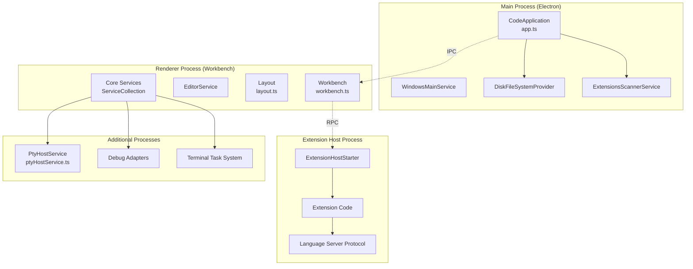
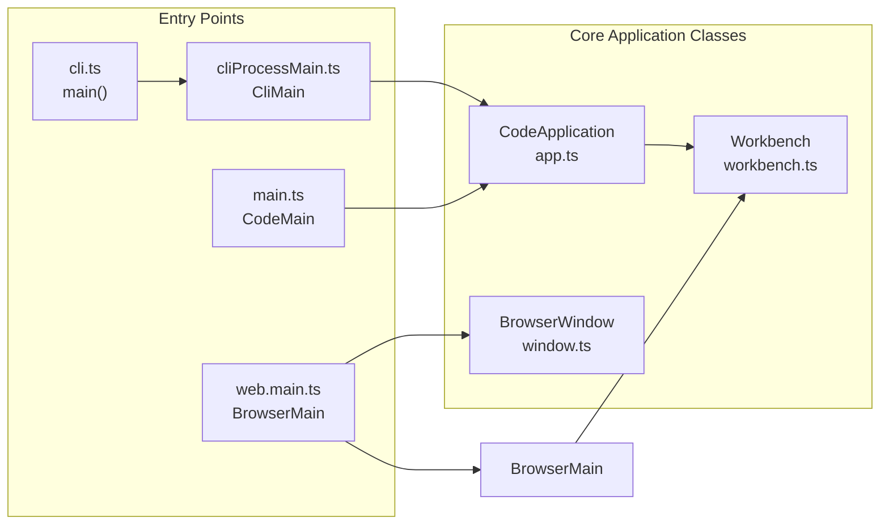
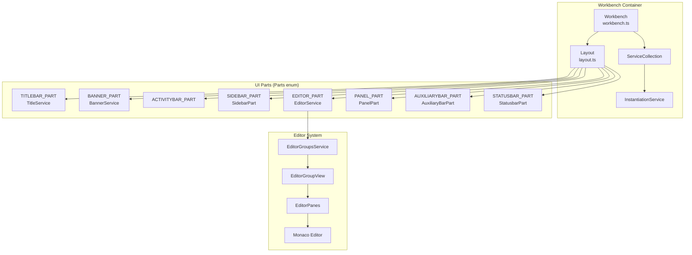
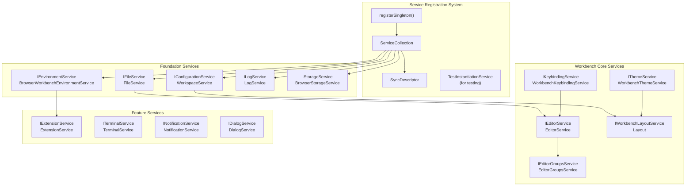
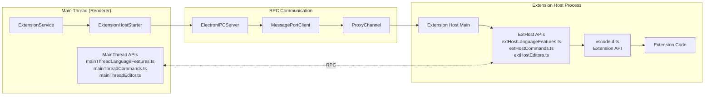
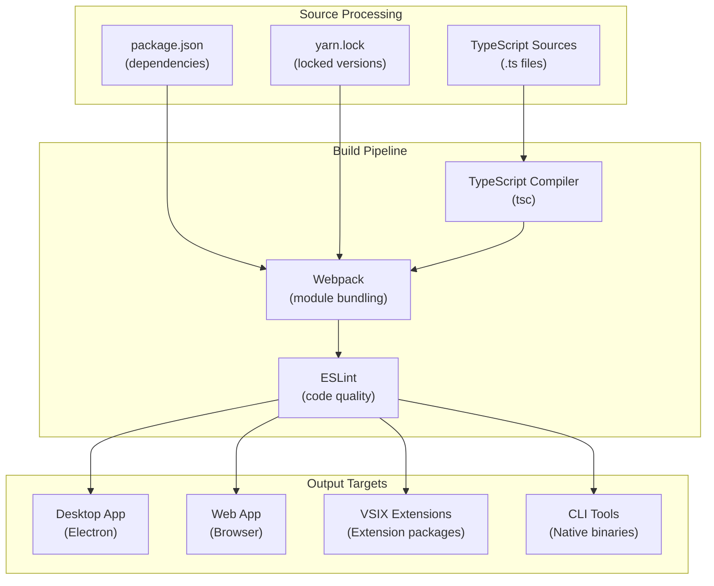

# VS Code Architecture Overview

Relevant source files

The following files were used as context for generating this wiki page:

- [.npmrc](.npmrc)
- [.nvmrc](.nvmrc)
- [build/.moduleignore](build/.moduleignore)
- [build/.webignore](build/.webignore)
- [build/checksums/electron.txt](build/checksums/electron.txt)
- [build/checksums/nodejs.txt](build/checksums/nodejs.txt)
- [build/lib/i18n.resources.json](build/lib/i18n.resources.json)
- [build/package-lock.json](build/package-lock.json)
- [build/package.json](build/package.json)
- [cgmanifest.json](cgmanifest.json)
- [extensions/vscode-colorize-tests/src/colorizer.test.ts](extensions/vscode-colorize-tests/src/colorizer.test.ts)
- [package-lock.json](package-lock.json)
- [package.json](package.json)
- [remote/.npmrc](remote/.npmrc)
- [remote/package-lock.json](remote/package-lock.json)
- [remote/package.json](remote/package.json)
- [remote/web/package-lock.json](remote/web/package-lock.json)
- [remote/web/package.json](remote/web/package.json)
- [src/vs/base/node/terminalEncoding.ts](src/vs/base/node/terminalEncoding.ts)
- [src/vs/code/browser/workbench/workbench-dev.html](src/vs/code/browser/workbench/workbench-dev.html)
- [src/vs/code/browser/workbench/workbench.html](src/vs/code/browser/workbench/workbench.html)
- [src/vs/code/browser/workbench/workbench.ts](src/vs/code/browser/workbench/workbench.ts)
- [src/vs/code/electron-main/app.ts](src/vs/code/electron-main/app.ts)
- [src/vs/code/electron-main/main.ts](src/vs/code/electron-main/main.ts)
- [src/vs/code/node/cli.ts](src/vs/code/node/cli.ts)
- [src/vs/code/node/cliProcessMain.ts](src/vs/code/node/cliProcessMain.ts)
- [src/vs/editor/common/config/editorConfigurationSchema.ts](src/vs/editor/common/config/editorConfigurationSchema.ts)
- [src/vs/platform/editor/common/editor.ts](src/vs/platform/editor/common/editor.ts)
- [src/vs/platform/environment/common/argv.ts](src/vs/platform/environment/common/argv.ts)
- [src/vs/platform/environment/common/environment.ts](src/vs/platform/environment/common/environment.ts)
- [src/vs/platform/environment/common/environmentService.ts](src/vs/platform/environment/common/environmentService.ts)
- [src/vs/platform/environment/electron-main/environmentMainService.ts](src/vs/platform/environment/electron-main/environmentMainService.ts)
- [src/vs/platform/environment/node/argv.ts](src/vs/platform/environment/node/argv.ts)
- [src/vs/platform/environment/node/argvHelper.ts](src/vs/platform/environment/node/argvHelper.ts)
- [src/vs/platform/environment/node/environmentService.ts](src/vs/platform/environment/node/environmentService.ts)
- [src/vs/platform/environment/node/stdin.ts](src/vs/platform/environment/node/stdin.ts)
- [src/vs/platform/environment/test/node/nativeModules.integrationTest.ts](src/vs/platform/environment/test/node/nativeModules.integrationTest.ts)
- [src/vs/server/node/server.cli.ts](src/vs/server/node/server.cli.ts)
- [src/vs/workbench/browser/actions/layoutActions.ts](src/vs/workbench/browser/actions/layoutActions.ts)
- [src/vs/workbench/browser/contextkeys.ts](src/vs/workbench/browser/contextkeys.ts)
- [src/vs/workbench/browser/dnd.ts](src/vs/workbench/browser/dnd.ts)
- [src/vs/workbench/browser/layout.ts](src/vs/workbench/browser/layout.ts)
- [src/vs/workbench/browser/parts/auxiliarybar/auxiliaryBarActions.ts](src/vs/workbench/browser/parts/auxiliarybar/auxiliaryBarActions.ts)
- [src/vs/workbench/browser/parts/editor/editor.contribution.ts](src/vs/workbench/browser/parts/editor/editor.contribution.ts)
- [src/vs/workbench/browser/parts/editor/editor.ts](src/vs/workbench/browser/parts/editor/editor.ts)
- [src/vs/workbench/browser/parts/editor/editorActions.ts](src/vs/workbench/browser/parts/editor/editorActions.ts)
- [src/vs/workbench/browser/parts/editor/editorCommands.ts](src/vs/workbench/browser/parts/editor/editorCommands.ts)
- [src/vs/workbench/browser/parts/editor/editorDropTarget.ts](src/vs/workbench/browser/parts/editor/editorDropTarget.ts)
- [src/vs/workbench/browser/parts/editor/editorGroupView.ts](src/vs/workbench/browser/parts/editor/editorGroupView.ts)
- [src/vs/workbench/browser/parts/editor/editorGroupWatermark.ts](src/vs/workbench/browser/parts/editor/editorGroupWatermark.ts)
- [src/vs/workbench/browser/parts/editor/editorPart.ts](src/vs/workbench/browser/parts/editor/editorPart.ts)
- [src/vs/workbench/browser/parts/editor/media/editorgroupview.css](src/vs/workbench/browser/parts/editor/media/editorgroupview.css)
- [src/vs/workbench/browser/parts/panel/panelActions.ts](src/vs/workbench/browser/parts/panel/panelActions.ts)
- [src/vs/workbench/browser/parts/titlebar/titlebarActions.ts](src/vs/workbench/browser/parts/titlebar/titlebarActions.ts)
- [src/vs/workbench/browser/web.api.ts](src/vs/workbench/browser/web.api.ts)
- [src/vs/workbench/browser/web.factory.ts](src/vs/workbench/browser/web.factory.ts)
- [src/vs/workbench/browser/web.main.ts](src/vs/workbench/browser/web.main.ts)
- [src/vs/workbench/browser/workbench.contribution.ts](src/vs/workbench/browser/workbench.contribution.ts)
- [src/vs/workbench/browser/workbench.ts](src/vs/workbench/browser/workbench.ts)
- [src/vs/workbench/common/contextkeys.ts](src/vs/workbench/common/contextkeys.ts)
- [src/vs/workbench/common/editor.ts](src/vs/workbench/common/editor.ts)
- [src/vs/workbench/electron-browser/desktop.main.ts](src/vs/workbench/electron-browser/desktop.main.ts)
- [src/vs/workbench/services/editor/browser/editorService.ts](src/vs/workbench/services/editor/browser/editorService.ts)
- [src/vs/workbench/services/editor/common/editorGroupsService.ts](src/vs/workbench/services/editor/common/editorGroupsService.ts)
- [src/vs/workbench/services/editor/common/editorService.ts](src/vs/workbench/services/editor/common/editorService.ts)
- [src/vs/workbench/services/editor/test/browser/editorGroupsService.test.ts](src/vs/workbench/services/editor/test/browser/editorGroupsService.test.ts)
- [src/vs/workbench/services/editor/test/browser/editorService.test.ts](src/vs/workbench/services/editor/test/browser/editorService.test.ts)
- [src/vs/workbench/services/environment/browser/environmentService.ts](src/vs/workbench/services/environment/browser/environmentService.ts)
- [src/vs/workbench/services/environment/common/environmentService.ts](src/vs/workbench/services/environment/common/environmentService.ts)
- [src/vs/workbench/services/environment/electron-browser/environmentService.ts](src/vs/workbench/services/environment/electron-browser/environmentService.ts)
- [src/vs/workbench/services/extensionManagement/browser/builtinExtensionsScannerService.ts](src/vs/workbench/services/extensionManagement/browser/builtinExtensionsScannerService.ts)
- [src/vs/workbench/services/extensionManagement/browser/webExtensionsScannerService.ts](src/vs/workbench/services/extensionManagement/browser/webExtensionsScannerService.ts)
- [src/vs/workbench/services/extensions/electron-browser/nativeExtensionService.ts](src/vs/workbench/services/extensions/electron-browser/nativeExtensionService.ts)
- [src/vs/workbench/services/layout/browser/layoutService.ts](src/vs/workbench/services/layout/browser/layoutService.ts)
- [src/vs/workbench/services/remote/browser/browserRemoteResourceHandler.ts](src/vs/workbench/services/remote/browser/browserRemoteResourceHandler.ts)
- [src/vs/workbench/test/browser/workbenchTestServices.ts](src/vs/workbench/test/browser/workbenchTestServices.ts)
- [src/vs/workbench/workbench.common.main.ts](src/vs/workbench/workbench.common.main.ts)
- [src/vs/workbench/workbench.desktop.main.ts](src/vs/workbench/workbench.desktop.main.ts)
- [src/vs/workbench/workbench.web.main.ts](src/vs/workbench/workbench.web.main.ts)
- [test/automation/package.json](test/automation/package.json)
- [test/integration/browser/package.json](test/integration/browser/package.json)
- [test/smoke/package.json](test/smoke/package.json)

## Purpose and Scope

This document provides a high-level overview of Visual Studio Code's architecture, covering the main application structure, process model, and key design principles. It focuses on the core systems that enable VS Code to function as both a desktop application (via Electron) and a web application, while supporting a rich extension ecosystem.

For detailed information about specific subsystems, refer to the relevant pages in this wiki.

## Multi-Process Architecture

VS Code employs a multi-process architecture designed for performance, security, and extensibility. The architecture differs between desktop (Electron) and web environments.

### Process Architecture & Communication

The main process (`CodeApplication`) manages application lifecycle, window creation, and native system integration. The renderer process hosts the `Workbench` which contains the editor UI and core services. Extension hosts run in separate processes for isolation and stability.

**Sources:** [src/vs/code/electron-main/app.ts:130-624](), [src/vs/workbench/browser/workbench.ts:14-125](), [src/vs/workbench/browser/layout.ts:138-304](), [src/vs/platform/terminal/node/ptyHostService.ts:111-114]()

## Application Entry Points

VS Code has multiple entry points depending on the execution context. Each entry point initializes the appropriate services and components for its environment.

### Application Startup Flow

| Entry Point | Purpose | Key Classes |
|-------------|---------|-------------|
| **main.ts** | Electron main process | `CodeMain`, `CodeApplication` |
| **web.main.ts** | Web browser startup | `BrowserMain`, `Workbench` |
| **cli.ts** | Command-line interface | `main()`, `CliMain` |
| **cliProcessMain.ts** | CLI process handling | `CliMain`, extension management |

**Sources:** [src/vs/code/electron-main/main.ts:84-335](), [src/vs/workbench/browser/web.main.ts:99-137](), [src/vs/code/node/cli.ts:32-138](), [src/vs/code/node/cliProcessMain.ts:72-327]()

## Core Workbench Architecture

The `Workbench` class serves as the main UI container and orchestrates the initialization of all core services. The `Layout` class manages the visual arrangement of workbench parts.

### Workbench Layout System

The workbench uses a `SerializableGrid` layout system where each part can be resized and repositioned. The `EditorGroupsService` manages multiple editor groups within the editor part.

**Sources:** [src/vs/workbench/browser/workbench.ts:14-125](), [src/vs/workbench/browser/layout.ts:138-304](), [src/vs/workbench/browser/parts/editor/editorGroupView.ts:62-247](), [src/vs/workbench/services/editor/browser/editorService.ts:39-95]()

## Service Layer Architecture

VS Code uses a comprehensive dependency injection system built around `IInstantiationService`. Services are registered as singletons and provide core functionality across the application.

### Core Service Dependencies

| Service Category | Purpose | Key Implementations |
|------------------|---------|-------------------|
| **Foundation** | Core platform capabilities | `FileService`, `ConfigurationService`, `LogService` |
| **Layout** | UI structure and management | `Layout`, `EditorGroupsService`, `WorkbenchLayoutService` |
| **Extensions** | Extension lifecycle and API | `ExtensionService`, `ExtensionHostStarter` |
| **Features** | Specialized functionality | `TerminalService`, `NotificationService`, `ThemeService` |

**Sources:** [src/vs/workbench/workbench.common.main.ts:131-176](), [src/vs/workbench/test/browser/workbenchTestServices.ts:250-336](), [src/vs/workbench/services/environment/browser/environmentService.ts:42-402](), [src/vs/workbench/browser/layout.ts:305-336]()

## Extension System Architecture

The extension system runs in isolated processes and communicates with the main workbench via RPC (Remote Procedure Call) mechanisms. Extensions access VS Code functionality through a well-defined API surface.

### Extension Host Communication

The extension host provides a sandboxed environment where extensions run. The `vscode.d.ts` API defines the contract between VS Code and extensions, with main thread services handling the actual implementation.

**Sources:** [src/vs/code/electron-main/app.ts:24-26](), [src/vs/platform/extensions/common/extensionHostStarter.ts:43-44](), [src/vs/workbench/workbench.common.main.ts:10-40](), [src/vs/workbench/browser/parts/editor/editor.contribution.ts:8-15]()

## Build System Integration

VS Code's build system handles TypeScript compilation, module bundling, and platform-specific packaging through a complex webpack-based pipeline.

| Component | Purpose | Key Files |
|-----------|---------|-----------|
| **TypeScript Compiler** | Source transformation and type checking | `tsconfig.json`, `build/gulpfile.js` |
| **Webpack Bundler** | Module bundling and optimization | `webpack.config.js` files |
| **Package Management** | Dependency resolution | `package.json`, `yarn.lock` |
| **Platform Packaging** | Desktop and web distribution | Build scripts, Electron packaging |
| **Extension Packaging** | VSIX creation for extensions | Extension manifest processing |

**Sources:** [build/lib/i18n.resources.json:1-20](), [src/vs/platform/environment/node/argv.ts:47-222](), [src/vs/workbench/workbench.desktop.main.ts:1-186](), [src/vs/workbench/workbench.web.main.ts:1-103]()