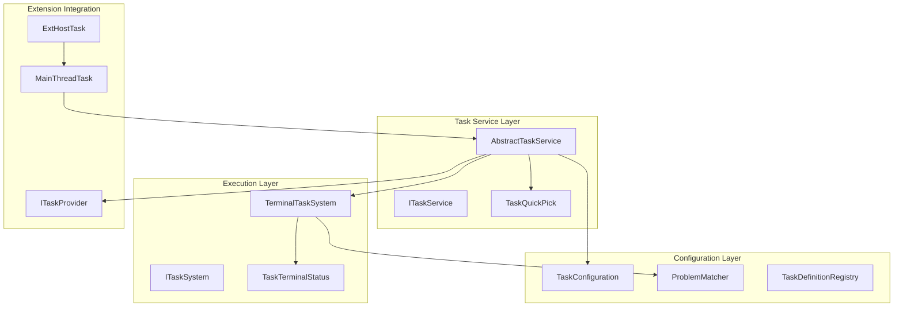
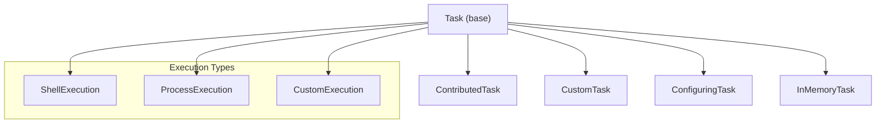
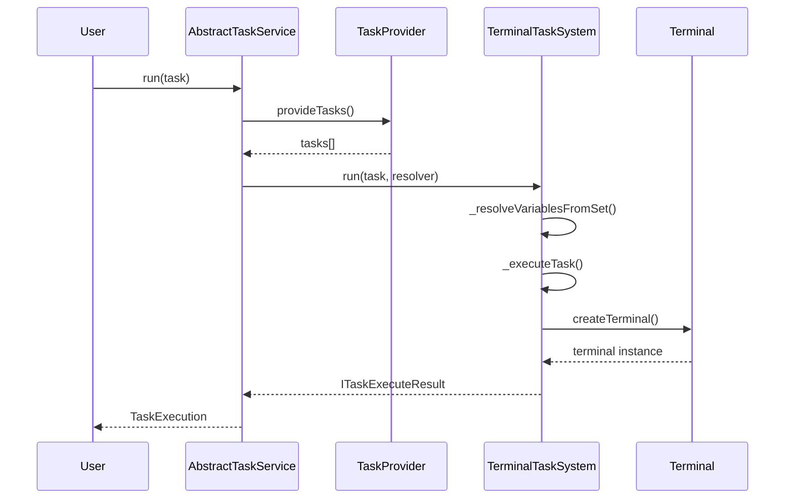
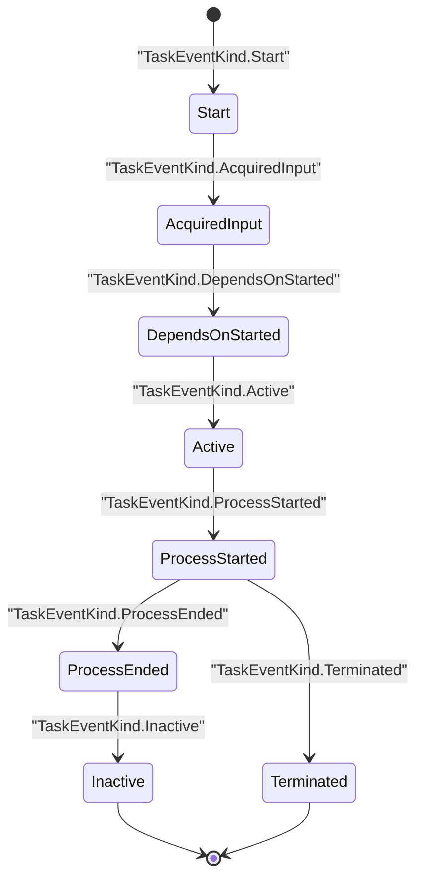
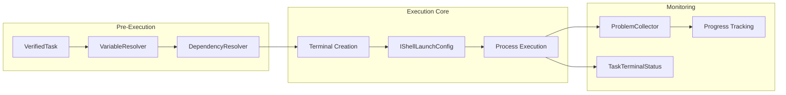
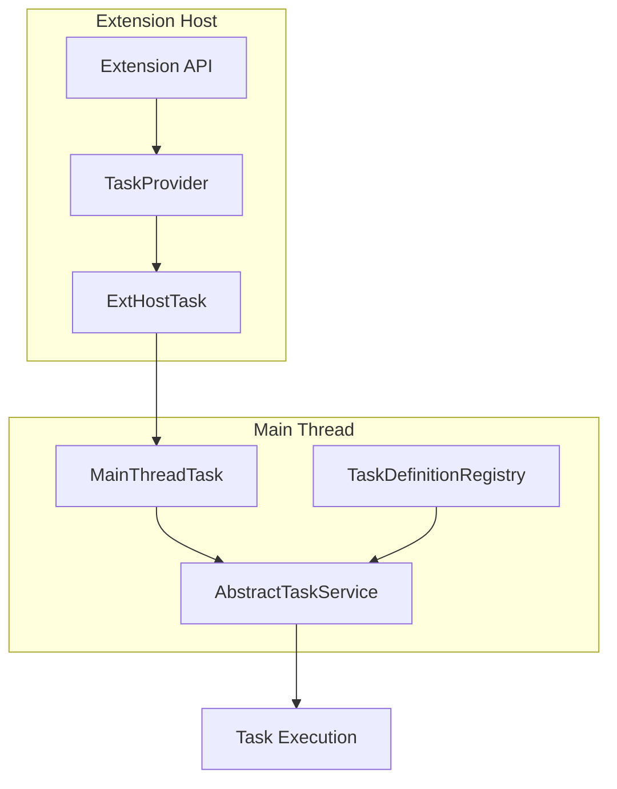
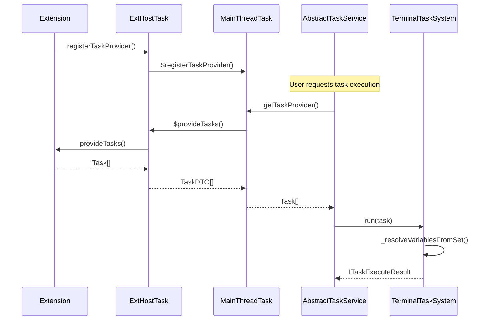
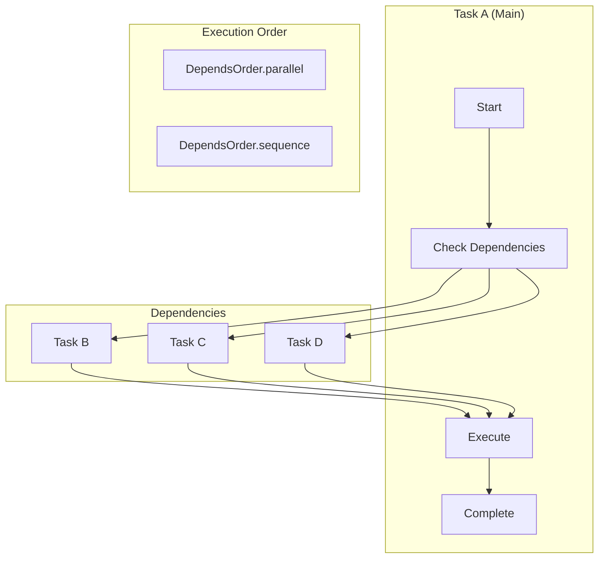
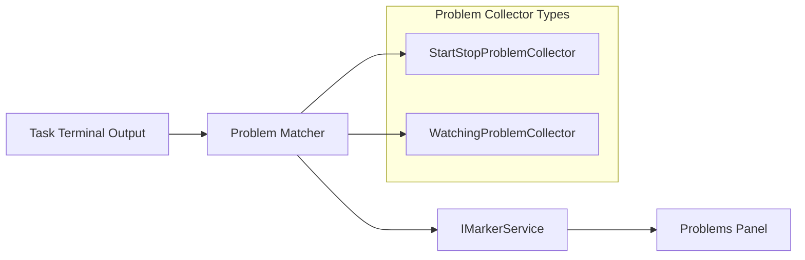
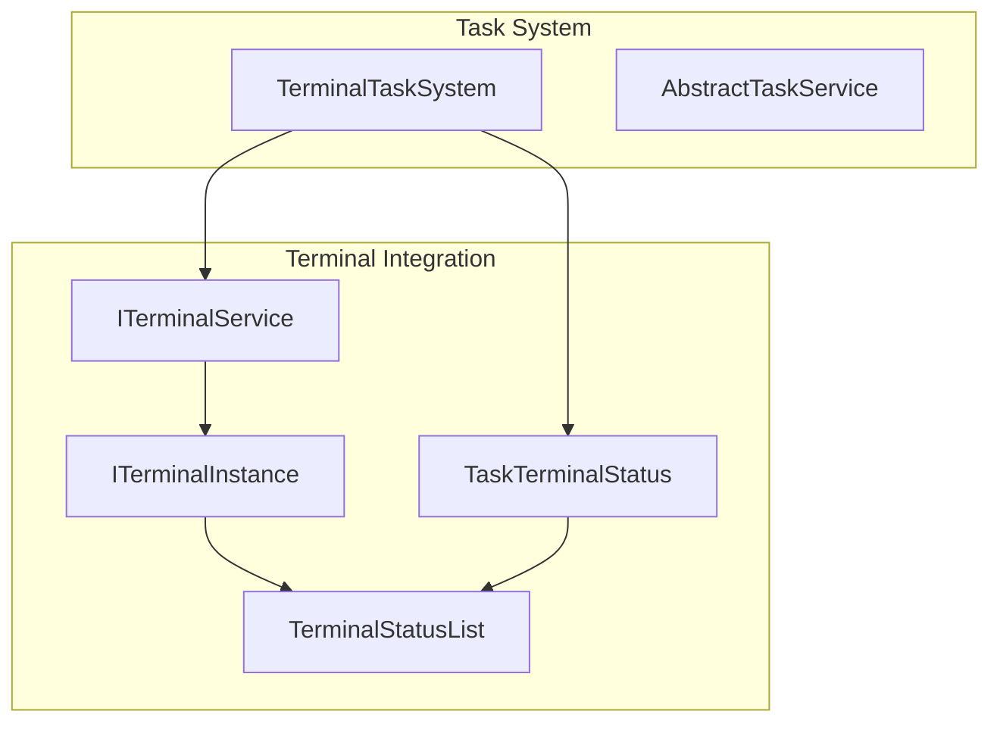

# Task Service and Execution

<details>
<summary>Relevant source files</summary>

The following files were used as context for generating this wiki page:

- [extensions/vscode-api-tests/src/singlefolder-tests/terminal.test.ts](extensions/vscode-api-tests/src/singlefolder-tests/terminal.test.ts)
- [extensions/vscode-api-tests/src/singlefolder-tests/workspace.tasks.test.ts](extensions/vscode-api-tests/src/singlefolder-tests/workspace.tasks.test.ts)
- [src/vs/workbench/api/browser/mainThreadTask.ts](src/vs/workbench/api/browser/mainThreadTask.ts)
- [src/vs/workbench/api/common/extHostTask.ts](src/vs/workbench/api/common/extHostTask.ts)
- [src/vs/workbench/api/common/shared/tasks.ts](src/vs/workbench/api/common/shared/tasks.ts)
- [src/vs/workbench/api/node/extHostTask.ts](src/vs/workbench/api/node/extHostTask.ts)
- [src/vs/workbench/contrib/tasks/browser/abstractTaskService.ts](src/vs/workbench/contrib/tasks/browser/abstractTaskService.ts)
- [src/vs/workbench/contrib/tasks/browser/runAutomaticTasks.ts](src/vs/workbench/contrib/tasks/browser/runAutomaticTasks.ts)
- [src/vs/workbench/contrib/tasks/browser/task.contribution.ts](src/vs/workbench/contrib/tasks/browser/task.contribution.ts)
- [src/vs/workbench/contrib/tasks/browser/taskQuickPick.ts](src/vs/workbench/contrib/tasks/browser/taskQuickPick.ts)
- [src/vs/workbench/contrib/tasks/browser/taskService.ts](src/vs/workbench/contrib/tasks/browser/taskService.ts)
- [src/vs/workbench/contrib/tasks/browser/taskTerminalStatus.ts](src/vs/workbench/contrib/tasks/browser/taskTerminalStatus.ts)
- [src/vs/workbench/contrib/tasks/browser/terminalTaskSystem.ts](src/vs/workbench/contrib/tasks/browser/terminalTaskSystem.ts)
- [src/vs/workbench/contrib/tasks/common/jsonSchema_v2.ts](src/vs/workbench/contrib/tasks/common/jsonSchema_v2.ts)
- [src/vs/workbench/contrib/tasks/common/problemCollectors.ts](src/vs/workbench/contrib/tasks/common/problemCollectors.ts)
- [src/vs/workbench/contrib/tasks/common/taskConfiguration.ts](src/vs/workbench/contrib/tasks/common/taskConfiguration.ts)
- [src/vs/workbench/contrib/tasks/common/taskService.ts](src/vs/workbench/contrib/tasks/common/taskService.ts)
- [src/vs/workbench/contrib/tasks/common/taskSystem.ts](src/vs/workbench/contrib/tasks/common/taskSystem.ts)
- [src/vs/workbench/contrib/tasks/common/tasks.ts](src/vs/workbench/contrib/tasks/common/tasks.ts)
- [src/vs/workbench/contrib/tasks/electron-browser/taskService.ts](src/vs/workbench/contrib/tasks/electron-browser/taskService.ts)
- [src/vs/workbench/contrib/tasks/test/browser/taskTerminalStatus.test.ts](src/vs/workbench/contrib/tasks/test/browser/taskTerminalStatus.test.ts)

</details>


This document covers the task execution system in VS Code, focusing on how tasks are discovered, resolved, and executed. This includes the core task service architecture, the terminal-based execution engine, task lifecycle management, and integration with extensions.

For information about task configuration schemas and problem matchers, see [Task System](#10). For terminal integration details, see [Integrated Terminal](#5).

## Architecture Overview

The task execution system is built around a layered architecture with clear separation between task management, execution engines, and extension integration.

### Core Service Architecture



Sources: [src/vs/workbench/contrib/tasks/browser/abstractTaskService.ts:197-395](), [src/vs/workbench/contrib/tasks/browser/terminalTaskSystem.ts:142-258](), [src/vs/workbench/contrib/tasks/common/taskService.ts:64-108]()

### Task Type Hierarchy



Sources: [src/vs/workbench/contrib/tasks/common/tasks.ts:889-1200](), [src/vs/workbench/contrib/tasks/common/tasks.ts:290-317]()

## Task Lifecycle Management

### Task Discovery and Resolution

The task system discovers tasks from multiple sources and resolves them through a multi-stage process:

| Stage | Component | Description |
|-------|-----------|-------------|
| Discovery | `AbstractTaskService.getWorkspaceTasks()` | Scans workspace for task configurations |
| Provider Integration | `ITaskProvider.provideTasks()` | Collects tasks from extensions |
| Variable Resolution | `TerminalTaskSystem._resolveVariablesFromSet()` | Resolves variables like `${workspaceFolder}` |
| Dependency Resolution | `TerminalTaskSystem._executeTask()` | Handles task dependencies |
| Execution | `TerminalTaskSystem.run()` | Executes the task in a terminal |



Sources: [src/vs/workbench/contrib/tasks/browser/abstractTaskService.ts:794-873](), [src/vs/workbench/contrib/tasks/browser/terminalTaskSystem.ts:276-308](), [src/vs/workbench/contrib/tasks/browser/terminalTaskSystem.ts:517-603]()

### Task Execution States

Tasks progress through defined states during execution, tracked by the `TaskEventKind` enum:



Sources: [src/vs/workbench/contrib/tasks/common/tasks.ts:1301-1330](), [src/vs/workbench/contrib/tasks/browser/terminalTaskSystem.ts:446-454]()

## Terminal Task System

The `TerminalTaskSystem` is the primary execution engine that runs tasks in VS Code's integrated terminals.

### Execution Flow

The execution process involves several key components working together:



Sources: [src/vs/workbench/contrib/tasks/browser/terminalTaskSystem.ts:110-140](), [src/vs/workbench/contrib/tasks/browser/terminalTaskSystem.ts:676-689](), [src/vs/workbench/contrib/tasks/browser/terminalTaskSystem.ts:712-779]()

### Key Execution Classes

| Class | Purpose | Key Methods |
|-------|---------|-------------|
| `TerminalTaskSystem` | Main execution engine | `run()`, `_executeTask()`, `terminate()` |
| `VerifiedTask` | Validated task ready for execution | `verify()`, `getVerifiedTask()` |
| `VariableResolver` | Resolves task variables | `resolve()`, `_replacer()` |
| `TaskTerminalStatus` | Terminal status management | `addTerminal()`, `eventActive()` |

### Terminal Management

The system maintains several data structures to track active terminals and tasks:

```typescript
// From TerminalTaskSystem class
private _activeTasks: IStringDictionary<IActiveTerminalData>
private _terminals: IStringDictionary<ITerminalData>
private _idleTaskTerminals: LinkedMap<string, string>
private _sameTaskTerminals: IStringDictionary<string>
```

Sources: [src/vs/workbench/contrib/tasks/browser/terminalTaskSystem.ts:184-191](), [src/vs/workbench/contrib/tasks/browser/terminalTaskSystem.ts:55-78]()

## Task Configuration and Providers

### Task Provider System

Extensions register task providers through the `ITaskProvider` interface to contribute tasks:



Sources: [src/vs/workbench/api/common/extHostTask.ts:34-51](), [src/vs/workbench/api/browser/mainThreadTask.ts:484-520](), [src/vs/workbench/contrib/tasks/browser/abstractTaskService.ts:727-744]()

### Task Resolution Process

Task resolution involves multiple phases to transform raw task definitions into executable tasks:



Sources: [src/vs/workbench/api/common/extHostTask.ts:95-122](), [src/vs/workbench/api/browser/mainThreadTask.ts:521-580](), [src/vs/workbench/contrib/tasks/browser/abstractTaskService.ts:1264-1320]()

## Task Dependencies and Problem Matching

### Dependency Execution

Tasks can depend on other tasks, executed either in parallel or sequence:



Sources: [src/vs/workbench/contrib/tasks/browser/terminalTaskSystem.ts:528-577](), [src/vs/workbench/contrib/tasks/common/tasks.ts:492-495]()

### Problem Matcher Integration

Problem matchers parse task output to identify and report issues:

| Component | Purpose |
|-----------|---------|
| `StartStopProblemCollector` | Handles problem matching for finite tasks |
| `WatchingProblemCollector` | Handles problem matching for background/watching tasks |
| `ProblemMatcherRegistry` | Registry of available problem matchers |



Sources: [src/vs/workbench/contrib/tasks/common/problemCollectors.ts:38-94](), [src/vs/workbench/contrib/tasks/browser/terminalTaskSystem.ts:1188-1254]()

## Integration Points

### Extension API Surface

The task system exposes a comprehensive API for extensions:

| API Component | Purpose | Key Methods |
|---------------|---------|-------------|
| `tasks.registerTaskProvider()` | Register task providers | Extension registration |
| `tasks.executeTask()` | Execute tasks programmatically | Task execution |
| `tasks.fetchTasks()` | Get available tasks | Task discovery |
| `tasks.onDidStartTask` | Task lifecycle events | Event handling |

### Terminal Integration

Tasks integrate deeply with the terminal system for execution and status display:



Sources: [src/vs/workbench/contrib/tasks/browser/terminalTaskSystem.ts:221-257](), [src/vs/workbench/contrib/tasks/browser/taskTerminalStatus.ts:40-68](), [extensions/vscode-api-tests/src/singlefolder-tests/workspace.tasks.test.ts:26-144]()