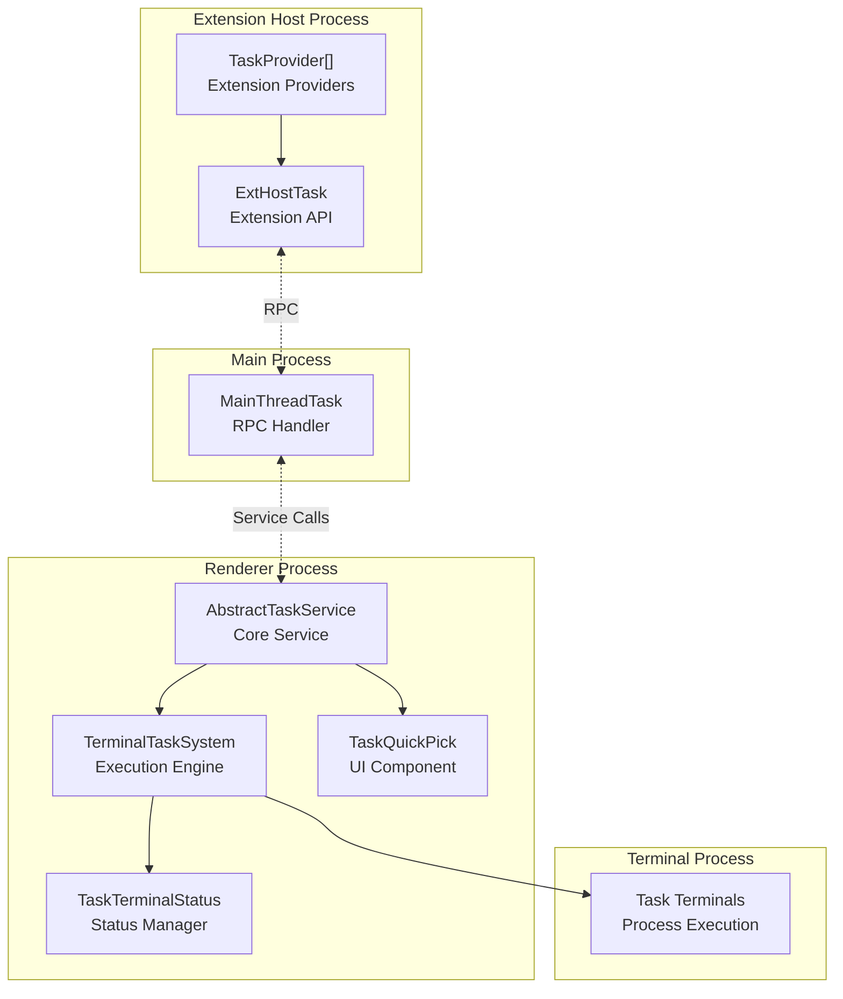
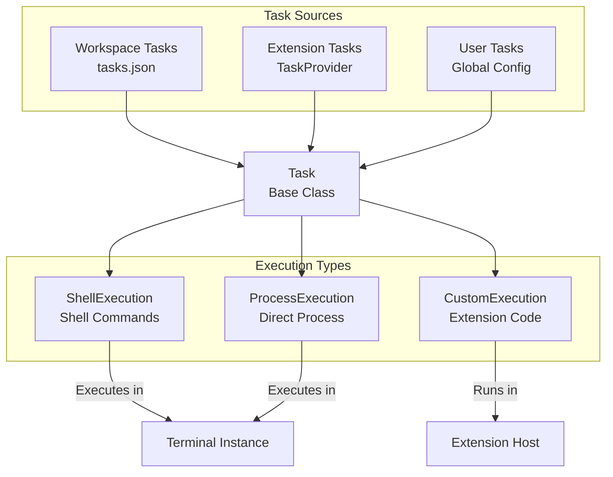
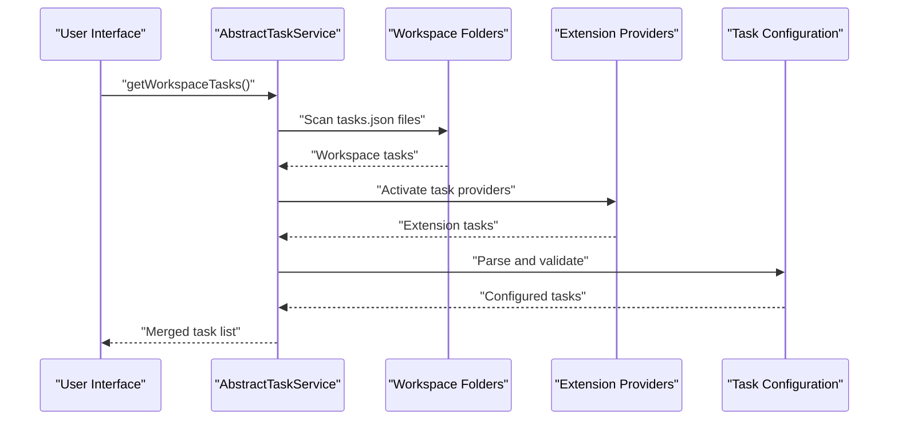
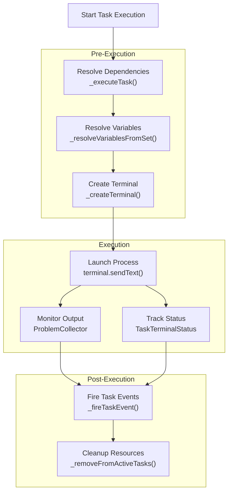
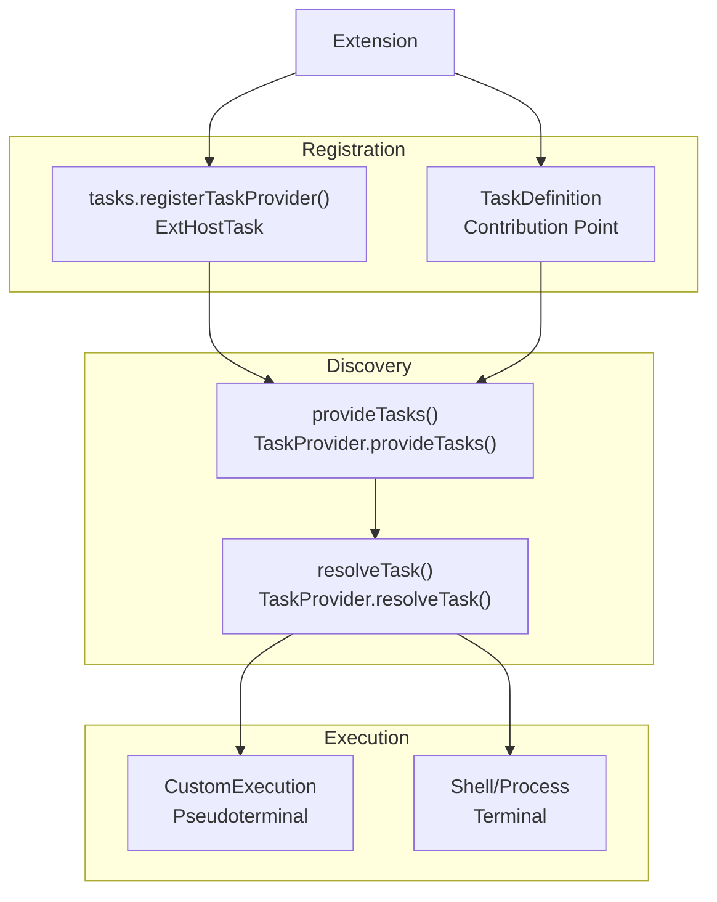
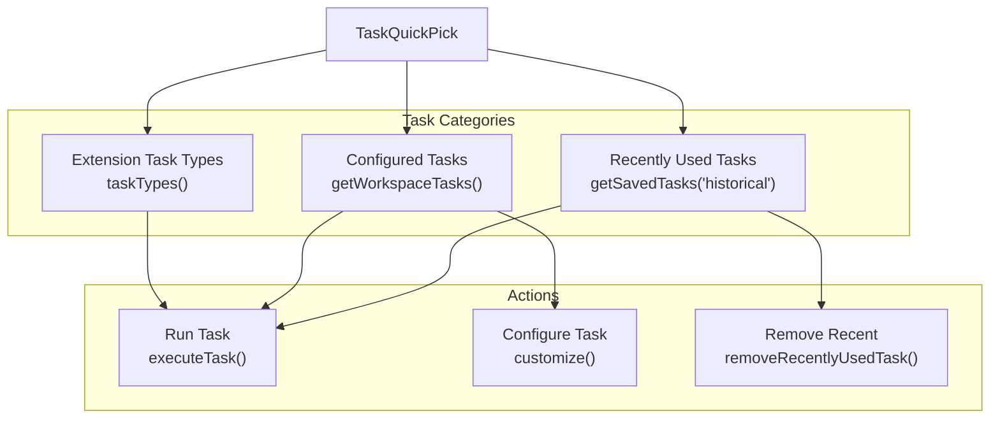

# Task System

<details>
<summary>Relevant source files</summary>

The following files were used as context for generating this wiki page:

- [extensions/vscode-api-tests/src/singlefolder-tests/terminal.test.ts](extensions/vscode-api-tests/src/singlefolder-tests/terminal.test.ts)
- [extensions/vscode-api-tests/src/singlefolder-tests/workspace.tasks.test.ts](extensions/vscode-api-tests/src/singlefolder-tests/workspace.tasks.test.ts)
- [src/vs/workbench/api/browser/mainThreadTask.ts](src/vs/workbench/api/browser/mainThreadTask.ts)
- [src/vs/workbench/api/common/extHostTask.ts](src/vs/workbench/api/common/extHostTask.ts)
- [src/vs/workbench/api/common/shared/tasks.ts](src/vs/workbench/api/common/shared/tasks.ts)
- [src/vs/workbench/api/node/extHostTask.ts](src/vs/workbench/api/node/extHostTask.ts)
- [src/vs/workbench/contrib/tasks/browser/abstractTaskService.ts](src/vs/workbench/contrib/tasks/browser/abstractTaskService.ts)
- [src/vs/workbench/contrib/tasks/browser/runAutomaticTasks.ts](src/vs/workbench/contrib/tasks/browser/runAutomaticTasks.ts)
- [src/vs/workbench/contrib/tasks/browser/task.contribution.ts](src/vs/workbench/contrib/tasks/browser/task.contribution.ts)
- [src/vs/workbench/contrib/tasks/browser/taskQuickPick.ts](src/vs/workbench/contrib/tasks/browser/taskQuickPick.ts)
- [src/vs/workbench/contrib/tasks/browser/taskService.ts](src/vs/workbench/contrib/tasks/browser/taskService.ts)
- [src/vs/workbench/contrib/tasks/browser/taskTerminalStatus.ts](src/vs/workbench/contrib/tasks/browser/taskTerminalStatus.ts)
- [src/vs/workbench/contrib/tasks/browser/terminalTaskSystem.ts](src/vs/workbench/contrib/tasks/browser/terminalTaskSystem.ts)
- [src/vs/workbench/contrib/tasks/common/jsonSchema_v2.ts](src/vs/workbench/contrib/tasks/common/jsonSchema_v2.ts)
- [src/vs/workbench/contrib/tasks/common/problemCollectors.ts](src/vs/workbench/contrib/tasks/common/problemCollectors.ts)
- [src/vs/workbench/contrib/tasks/common/taskConfiguration.ts](src/vs/workbench/contrib/tasks/common/taskConfiguration.ts)
- [src/vs/workbench/contrib/tasks/common/taskService.ts](src/vs/workbench/contrib/tasks/common/taskService.ts)
- [src/vs/workbench/contrib/tasks/common/taskSystem.ts](src/vs/workbench/contrib/tasks/common/taskSystem.ts)
- [src/vs/workbench/contrib/tasks/common/tasks.ts](src/vs/workbench/contrib/tasks/common/tasks.ts)
- [src/vs/workbench/contrib/tasks/electron-browser/taskService.ts](src/vs/workbench/contrib/tasks/electron-browser/taskService.ts)
- [src/vs/workbench/contrib/tasks/test/browser/taskTerminalStatus.test.ts](src/vs/workbench/contrib/tasks/test/browser/taskTerminalStatus.test.ts)

</details>


The Task System provides VS Code's capability to define, discover, execute, and manage automated tasks such as build scripts, test runners, and other development workflows. It handles task configuration through `tasks.json` files, task execution in integrated terminals, extension-provided tasks, and user interface for task selection and management.

For information about the integrated terminal that executes tasks, see [Integrated Terminal](#5). For details about extension APIs that interact with tasks, see [Extension System](#4).

## Architecture Overview

The Task System follows VS Code's multi-process architecture with components distributed across the main process, renderer process, and extension host process.

### Process Architecture



**Sources:** [src/vs/workbench/contrib/tasks/browser/abstractTaskService.ts:197-396](), [src/vs/workbench/contrib/tasks/browser/terminalTaskSystem.ts:142-257](), [src/vs/workbench/api/common/extHostTask.ts:34-51](), [src/vs/workbench/api/browser/mainThreadTask.ts:1-42]()

### Core Components

| Component | Location | Purpose |
|-----------|----------|---------|
| `AbstractTaskService` | Renderer | Central task service managing task lifecycle, configuration, and coordination |
| `TerminalTaskSystem` | Renderer | Executes tasks in integrated terminals, handles process management |
| `TaskQuickPick` | Renderer | Provides UI for task selection and configuration |
| `ExtHostTask` | Extension Host | Exposes task APIs to extensions and manages task providers |
| `MainThreadTask` | Main Process | Handles RPC communication for task operations |

**Sources:** [src/vs/workbench/contrib/tasks/browser/abstractTaskService.ts:197](), [src/vs/workbench/contrib/tasks/browser/terminalTaskSystem.ts:142](), [src/vs/workbench/contrib/tasks/browser/taskQuickPick.ts:49]()

## Task Types and Execution

The Task System supports three main execution types, each with different capabilities and use cases.

### Task Execution Types



**Sources:** [src/vs/workbench/contrib/tasks/common/tasks.ts:290-317](), [src/vs/workbench/contrib/tasks/common/tasks.ts:407-427]()

### Task Configuration Properties

Tasks are configured with a standard set of properties that control their behavior and execution:

```mermaid
graph LR
    TaskConfig["Task Configuration"]
    
    subgraph "Core Properties"
        Label["label: string"]
        Type["type: string"] 
        Command["command: CommandString"]
        Args["args: CommandString[]"]
    end
    
    subgraph "Execution Control"
        Group["group: TaskGroup"]
        DependsOn["dependsOn: ITaskDependency[]"]
        IsBackground["isBackground: boolean"]
        ProblemMatchers["problemMatchers: ProblemMatcher[]"]
    end
    
    subgraph "Presentation"
        Presentation["presentation: IPresentationOptions"]
        Icon["icon: {id: string, color?: string}"]
        Hide["hide: boolean"]
    end
    
    TaskConfig --> Label
    TaskConfig --> Type
    TaskConfig --> Command
    TaskConfig --> Args
    TaskConfig --> Group
    TaskConfig --> DependsOn
    TaskConfig --> IsBackground
    TaskConfig --> ProblemMatchers
    TaskConfig --> Presentation
    TaskConfig --> Icon
    TaskConfig --> Hide
```

**Sources:** [src/vs/workbench/contrib/tasks/common/tasks.ts:497-626](), [src/vs/workbench/contrib/tasks/common/taskConfiguration.ts:290-371]()

## Task Configuration and Discovery

Tasks are discovered from multiple sources and merged into a unified task registry for execution.

### Task Discovery Flow



**Sources:** [src/vs/workbench/contrib/tasks/browser/abstractTaskService.ts:794-816](), [src/vs/workbench/contrib/tasks/browser/abstractTaskService.ts:630-646]()

### Configuration Resolution

The task configuration system resolves tasks from multiple sources with a defined precedence:

1. **Workspace Tasks** - Defined in `.vscode/tasks.json`
2. **User Tasks** - Global user configuration  
3. **Extension Tasks** - Provided by extensions via `TaskProvider`

**Sources:** [src/vs/workbench/contrib/tasks/browser/abstractTaskService.ts:828-873](), [src/vs/workbench/contrib/tasks/common/taskConfiguration.ts:372-437]()

## Task Execution Flow

Task execution involves dependency resolution, variable substitution, terminal creation, and process management.

### Execution Pipeline



**Sources:** [src/vs/workbench/contrib/tasks/browser/terminalTaskSystem.ts:276-308](), [src/vs/workbench/contrib/tasks/browser/terminalTaskSystem.ts:517-603](), [src/vs/workbench/contrib/tasks/browser/taskTerminalStatus.ts:40-67]()

### Dependency Resolution

Tasks can depend on other tasks, which are resolved and executed according to the specified order:

**Sequential Dependencies:**
```typescript
// Task B depends on Task A completing first
dependsOrder: "sequence"
```

**Parallel Dependencies:**
```typescript
// Task B can start while Task A is running
dependsOrder: "parallel"  
```

**Sources:** [src/vs/workbench/contrib/tasks/browser/terminalTaskSystem.ts:528-577](), [src/vs/workbench/contrib/tasks/common/tasks.ts:492-495]()

## Extension Integration

Extensions can provide tasks through the `TaskProvider` interface and handle custom execution logic.

### Extension Task Provider Flow



**Sources:** [src/vs/workbench/api/common/extHostTask.ts:46-51](), [src/vs/workbench/contrib/tasks/browser/abstractTaskService.ts:727-744](), [src/vs/workbench/api/node/extHostTask.ts:29-56]()

### Task Provider Implementation

Extensions implement the `TaskProvider` interface to contribute tasks:

```typescript
interface ITaskProvider {
    provideTasks(validTypes: IStringDictionary<boolean>): Promise<ITaskSet>;
    resolveTask(task: ConfiguringTask): Promise<ContributedTask | undefined>;
}
```

**Sources:** [src/vs/workbench/contrib/tasks/common/taskService.ts:29-32](), [src/vs/workbench/api/common/extHostTask.ts:95-122]()

## UI Components

The Task System provides several UI components for task interaction and management.

### Task Quick Pick Interface



**Sources:** [src/vs/workbench/contrib/tasks/browser/taskQuickPick.ts:180-214](), [src/vs/workbench/contrib/tasks/browser/taskQuickPick.ts:231-291]()

### Status Management

Task terminals display status indicators that reflect the current state of task execution:

| Status | Icon | Meaning |
|--------|------|---------|
| `ACTIVE_TASK_STATUS` | Spinning loader | Task is currently running |
| `SUCCEEDED_TASK_STATUS` | Check mark | Task completed successfully |
| `FAILED_TASK_STATUS` | Error icon | Task failed with errors |
| `WARNING_TASK_STATUS` | Warning icon | Task completed with warnings |

**Sources:** [src/vs/workbench/contrib/tasks/browser/taskTerminalStatus.ts:30-38](), [src/vs/workbench/contrib/tasks/browser/taskTerminalStatus.ts:67-119]()