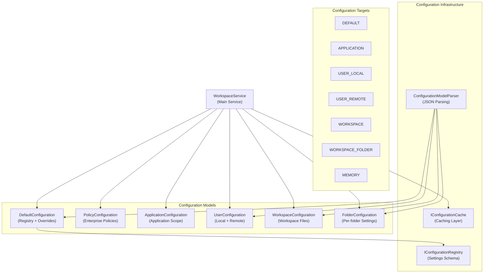
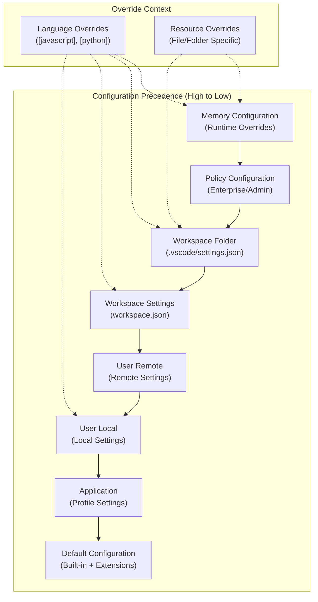
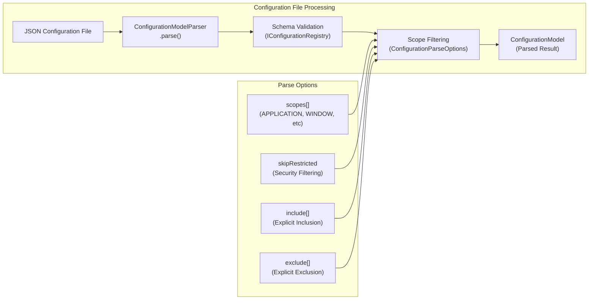
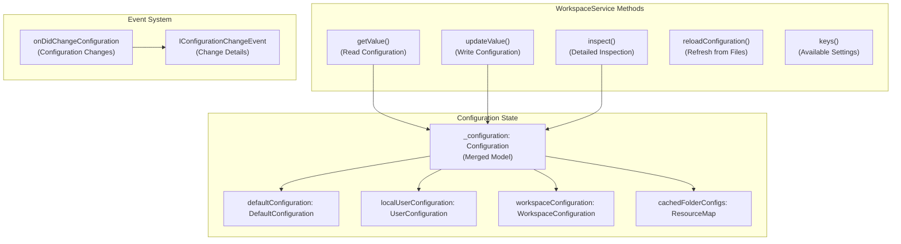
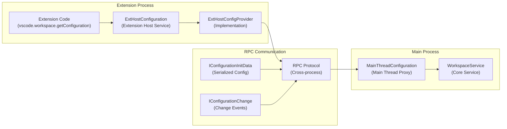
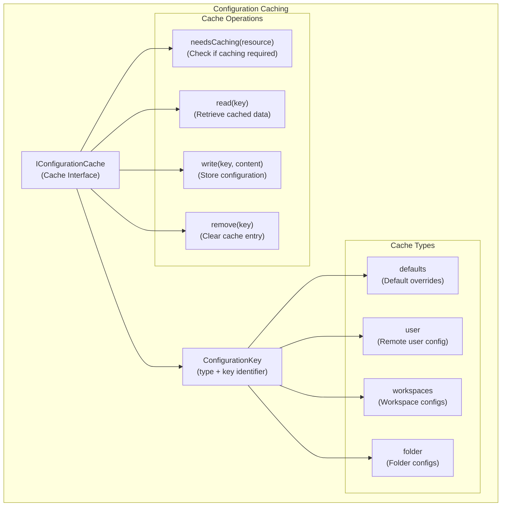
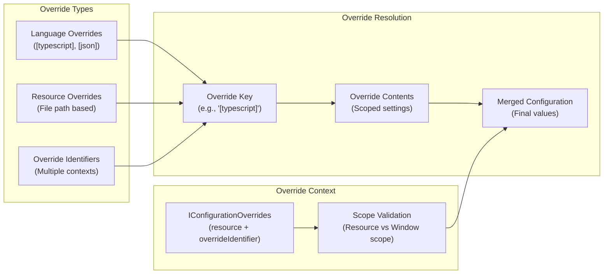

# Configuration System

<details>
<summary>Relevant source files</summary>

The following files were used as context for generating this wiki page:

- [src/vs/base/common/resources.ts](src/vs/base/common/resources.ts)
- [src/vs/base/test/common/resources.test.ts](src/vs/base/test/common/resources.test.ts)
- [src/vs/platform/configuration/common/configuration.ts](src/vs/platform/configuration/common/configuration.ts)
- [src/vs/platform/configuration/common/configurationModels.ts](src/vs/platform/configuration/common/configurationModels.ts)
- [src/vs/platform/configuration/common/configurationService.ts](src/vs/platform/configuration/common/configurationService.ts)
- [src/vs/platform/configuration/test/common/configurationModels.test.ts](src/vs/platform/configuration/test/common/configurationModels.test.ts)
- [src/vs/platform/configuration/test/common/configurationRegistry.test.ts](src/vs/platform/configuration/test/common/configurationRegistry.test.ts)
- [src/vs/platform/configuration/test/common/configurationService.test.ts](src/vs/platform/configuration/test/common/configurationService.test.ts)
- [src/vs/platform/configuration/test/common/configurations.test.ts](src/vs/platform/configuration/test/common/configurations.test.ts)
- [src/vs/platform/userData/common/fileUserDataProvider.ts](src/vs/platform/userData/common/fileUserDataProvider.ts)
- [src/vs/platform/userData/test/browser/fileUserDataProvider.test.ts](src/vs/platform/userData/test/browser/fileUserDataProvider.test.ts)
- [src/vs/workbench/api/browser/mainThreadConfiguration.ts](src/vs/workbench/api/browser/mainThreadConfiguration.ts)
- [src/vs/workbench/api/common/extHostConfiguration.ts](src/vs/workbench/api/common/extHostConfiguration.ts)
- [src/vs/workbench/contrib/telemetry/browser/telemetry.contribution.ts](src/vs/workbench/contrib/telemetry/browser/telemetry.contribution.ts)
- [src/vs/workbench/services/configuration/browser/configuration.ts](src/vs/workbench/services/configuration/browser/configuration.ts)
- [src/vs/workbench/services/configuration/browser/configurationService.ts](src/vs/workbench/services/configuration/browser/configurationService.ts)
- [src/vs/workbench/services/configuration/common/configuration.ts](src/vs/workbench/services/configuration/common/configuration.ts)
- [src/vs/workbench/services/configuration/common/configurationEditing.ts](src/vs/workbench/services/configuration/common/configurationEditing.ts)
- [src/vs/workbench/services/configuration/common/configurationModels.ts](src/vs/workbench/services/configuration/common/configurationModels.ts)
- [src/vs/workbench/services/configuration/common/jsonEditing.ts](src/vs/workbench/services/configuration/common/jsonEditing.ts)
- [src/vs/workbench/services/configuration/common/jsonEditingService.ts](src/vs/workbench/services/configuration/common/jsonEditingService.ts)
- [src/vs/workbench/services/configuration/test/browser/configuration.test.ts](src/vs/workbench/services/configuration/test/browser/configuration.test.ts)
- [src/vs/workbench/services/configuration/test/browser/configurationService.test.ts](src/vs/workbench/services/configuration/test/browser/configurationService.test.ts)
- [src/vs/workbench/services/configuration/test/common/configurationModels.test.ts](src/vs/workbench/services/configuration/test/common/configurationModels.test.ts)
- [src/vs/workbench/services/keybinding/test/browser/keybindingEditing.test.ts](src/vs/workbench/services/keybinding/test/browser/keybindingEditing.test.ts)

</details>


VS Code's Configuration System provides a hierarchical, multi-target configuration management framework that supports user settings, workspace settings, folder-level settings, and extension-contributed configuration. The system handles configuration merging, validation, caching, and real-time updates across different scopes and override contexts.

This document covers the core configuration service architecture, configuration models, parsing system, and integration with the extension API. For information about workspace management, see [Workbench Layout and Services](#2.2). For extension-specific configuration handling, see [Extension Host and API Protocol](#4.1).

## Architecture Overview

The Configuration System is built around the `WorkspaceService` class, which implements both `IWorkbenchConfigurationService` and `IWorkspaceContextService`. This service orchestrates multiple configuration sources and provides a unified interface for reading and writing configuration values.

### Core Configuration Service Architecture



Sources: [src/vs/workbench/services/configuration/browser/configurationService.ts:63-160](), [src/vs/workbench/services/configuration/browser/configuration.ts:123-153](), [src/vs/platform/configuration/common/configurationModels.ts:306-488]()

### Configuration Hierarchy and Merging

The configuration system uses a layered approach where settings from different sources are merged according to precedence rules. Each layer can override settings from lower-precedence layers.



Sources: [src/vs/platform/configuration/common/configurationModels.ts:710-788](), [src/vs/workbench/services/configuration/common/configurationModels.ts:98-171](), [src/vs/workbench/services/configuration/browser/configurationService.ts:686-708]()

## Configuration Models

The system uses several specialized configuration model classes to handle different configuration sources and their specific requirements.

### Configuration Model Classes

| Class | Purpose | Configuration Source | File Locations |
|-------|---------|---------------------|----------------|
| `DefaultConfiguration` | Default settings from registry and overrides | Built-in settings + extension contributions | Registry + cached overrides |
| `PolicyConfiguration` | Enterprise/admin enforced settings | Policy files | System policy locations |
| `ApplicationConfiguration` | Application-level profile settings | Profile-specific application settings | `{profile}/settings.json` (application scope only) |
| `UserConfiguration` | User preferences (local and remote) | User settings.json files | Local: `{userDataHome}/User/settings.json`<br/>Remote: `{userDataHome}/User/settings.json` |
| `WorkspaceConfiguration` | Workspace-specific settings | .code-workspace files | `{workspace}.code-workspace` |
| `FolderConfiguration` | Folder-level settings | .vscode/settings.json files | `{workspaceFolder}/.vscode/settings.json` |

The `UserConfiguration` class supports both standalone settings files and combined settings+tasks files through `FileServiceBasedConfiguration`. It automatically switches between `UserSettings` (settings-only) and the full file-based configuration when tasks configuration is needed.

Sources: [src/vs/workbench/services/configuration/browser/configuration.ts:32-121](), [src/vs/workbench/services/configuration/browser/configuration.ts:155-221](), [src/vs/workbench/services/configuration/browser/configuration.ts:627-733]()

### Configuration Parsing and Validation

The `ConfigurationModelParser` handles parsing JSON configuration files with support for validation, scope filtering, and override processing.



Sources: [src/vs/platform/configuration/common/configurationModels.ts:306-488](), [src/vs/platform/configuration/common/configurationModels.ts:417-468]()

## Configuration Targets and Scopes

### Configuration Targets

The system defines specific targets where configuration values can be stored and retrieved:

```typescript
enum ConfigurationTarget {
    APPLICATION = 1,    // Application-level settings
    USER,              // User settings (local + remote)
    USER_LOCAL,        // Local user settings only
    USER_REMOTE,       // Remote user settings only
    WORKSPACE,         // Workspace settings
    WORKSPACE_FOLDER,  // Folder-specific settings
    DEFAULT,           // Default values
    MEMORY            // Runtime overrides
}
```

Sources: [src/vs/platform/configuration/common/configuration.ts:38-47]()

### Configuration Scopes

Configuration properties are classified by scope to determine where they can be applied:

| Scope | Description | Valid Targets |
|-------|-------------|---------------|
| `APPLICATION` | Application-wide settings | APPLICATION, MEMORY |
| `MACHINE` | Machine-specific settings | USER_LOCAL, USER_REMOTE |
| `WINDOW` | Window-level settings | USER, WORKSPACE, MEMORY |
| `RESOURCE` | Resource/file-specific | WORKSPACE, WORKSPACE_FOLDER, MEMORY |
| `LANGUAGE_OVERRIDABLE` | Language-specific overrides | All targets with language context |

Sources: [src/vs/workbench/services/configuration/common/configuration.ts:28-34](), [src/vs/platform/configuration/common/configurationRegistry.ts:164-169]()

## Configuration Service Implementation

### WorkspaceService Core Functionality

The `WorkspaceService` class serves as the central configuration service, implementing both workspace context and configuration management:



Sources: [src/vs/workbench/services/configuration/browser/configurationService.ts:320-421](), [src/vs/workbench/services/configuration/browser/configurationService.ts:63-109]()

### Configuration Reading and Writing

The service provides multiple overloaded methods for reading and writing configuration values:

**getValue Method Overloads:**
```typescript
getValue<T>(): T;
getValue<T>(section: string): T;
getValue<T>(overrides: IConfigurationOverrides): T;
getValue<T>(section: string, overrides: IConfigurationOverrides): T;
```

**updateValue Method Overloads:**
```typescript
updateValue(key: string, value: any): Promise<void>;
updateValue(key: string, value: unknown, overrides: IConfigurationOverrides | IConfigurationUpdateOverrides): Promise<void>;
updateValue(key: string, value: unknown, target: ConfigurationTarget): Promise<void>;
updateValue(key: string, value: unknown, overrides: IConfigurationOverrides | IConfigurationUpdateOverrides, target: ConfigurationTarget, options?: IConfigurationUpdateOptions): Promise<void>;
```

**Other Core Methods:**
- `inspect<T>(key: string, overrides?: IConfigurationOverrides): IConfigurationValue<T>` - Get detailed value breakdown by source
- `reloadConfiguration(target?: ConfigurationTarget | IWorkspaceFolder): Promise<void>` - Refresh configuration from files
- `keys(): { default: string[]; user: string[]; workspace: string[]; workspaceFolder: string[]; }` - Get available configuration keys

Sources: [src/vs/workbench/services/configuration/browser/configurationService.ts:324-421](), [src/vs/workbench/services/configuration/browser/configurationService.ts:334-403]()

## Extension API Integration

### ExtHostConfiguration Architecture

Extensions access configuration through the `ExtHostConfiguration` service, which provides the VS Code extension API for configuration management:



Sources: [src/vs/workbench/api/common/extHostConfiguration.ts:97-131](), [src/vs/workbench/api/common/extHostConfiguration.ts:133-292](), [src/vs/workbench/api/browser/mainThreadConfiguration.ts:16-92]()

### Extension Configuration API

The extension API provides a workspace configuration object with methods for reading, updating, and inspecting configuration through the `ExtHostConfigProvider` class:

```typescript
interface WorkspaceConfiguration {
    get<T>(section: string, defaultValue?: T): T;
    has(section: string): boolean;
    inspect<T>(section: string): ConfigurationInspect<T>;
    update(section: string, value: any, target?: ConfigurationTarget): Thenable<void>;
}
```

**Key Implementation Classes:**
- `ExtHostConfiguration` - Main service implementing `ExtHostConfigurationShape`
- `ExtHostConfigProvider` - Core implementation handling configuration operations
- `MainThreadConfiguration` - Main thread proxy implementing `MainThreadConfigurationShape`

The `ExtHostConfigProvider` manages the configuration state in the extension host process and synchronizes with the main thread through RPC calls. It maintains a local `Configuration` instance and emits `ConfigurationChangeEvent` objects when settings change.

Sources: [src/vs/workbench/api/common/extHostConfiguration.ts:184-285](), [src/vs/workbench/api/common/extHostConfiguration.ts:97-131](), [src/vs/workbench/api/common/extHostConfiguration.ts:133-292]()

## Configuration Caching and Performance

### Configuration Cache Interface

The system includes a caching layer to improve performance, especially for remote configurations:



Sources: [src/vs/workbench/services/configuration/common/configuration.ts:48-57](), [src/vs/workbench/services/configuration/browser/configuration.ts:564-625]()

## Configuration Overrides and Language Support

The configuration system supports sophisticated override mechanisms for language-specific and resource-specific settings:

### Override Processing



Sources: [src/vs/platform/configuration/common/configurationModels.ts:112-144](), [src/vs/workbench/api/common/extHostConfiguration.ts:78-95](), [src/vs/workbench/api/common/extHostConfiguration.ts:310-325]()

The Configuration System provides a robust, scalable foundation for managing settings across VS Code's complex multi-process architecture, supporting everything from simple user preferences to sophisticated enterprise policy enforcement and language-specific overrides.