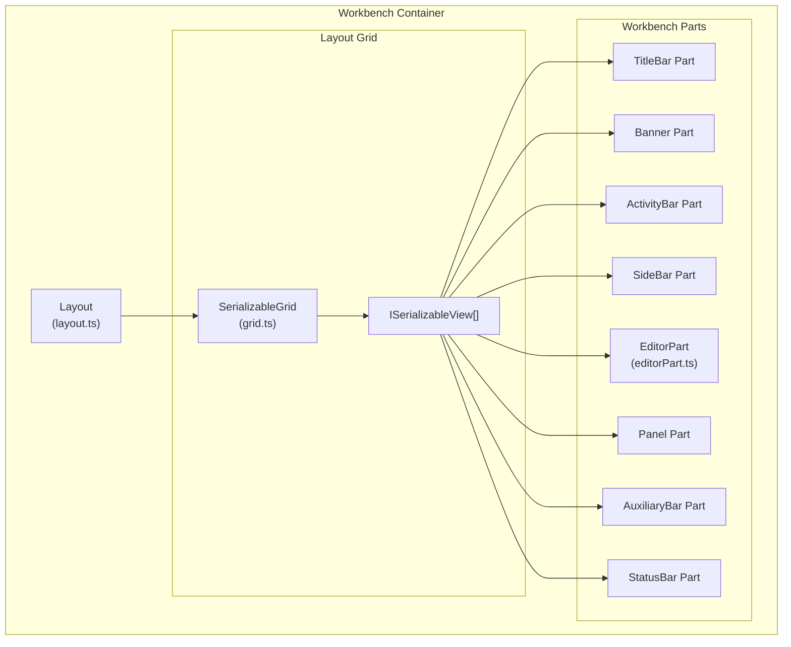
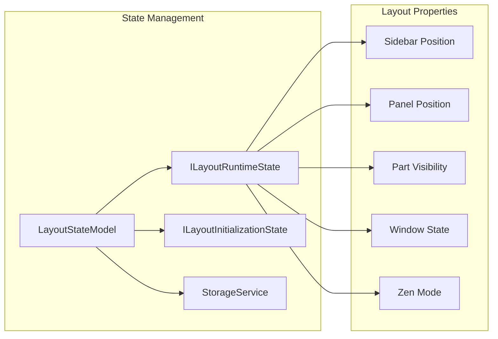
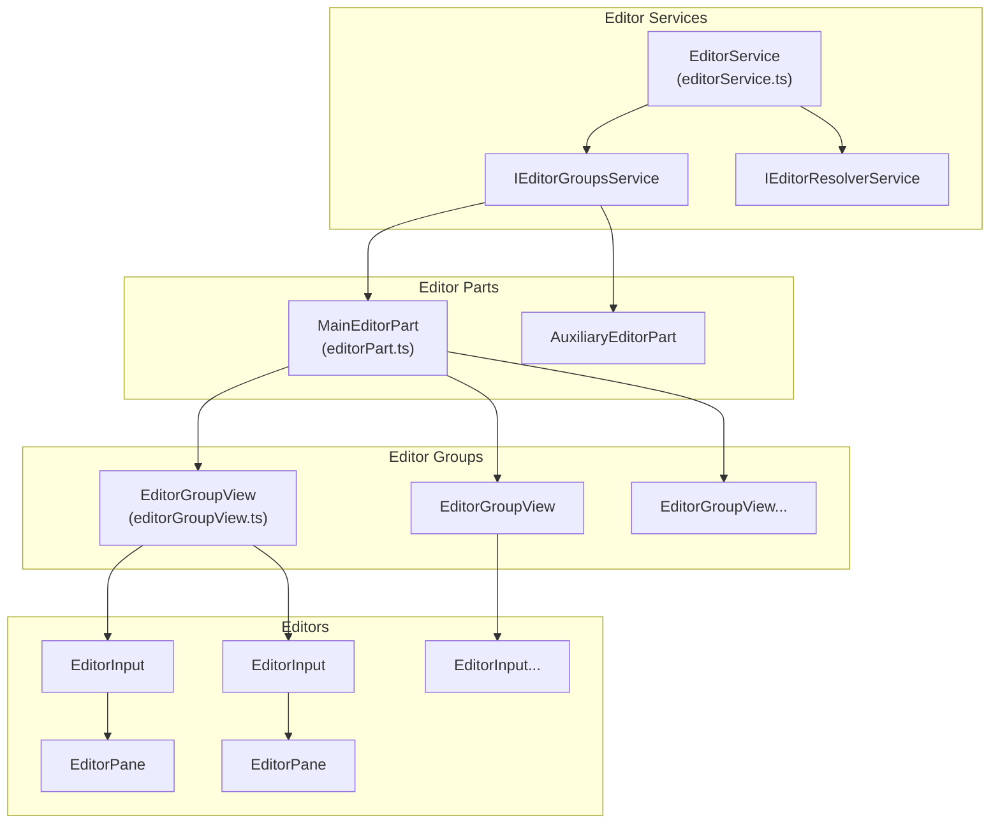
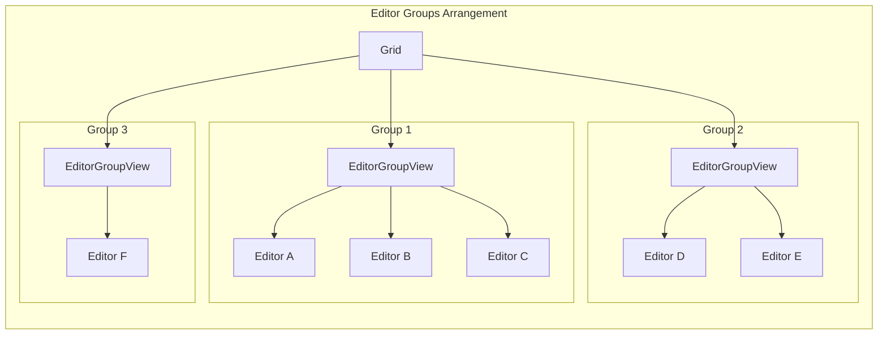
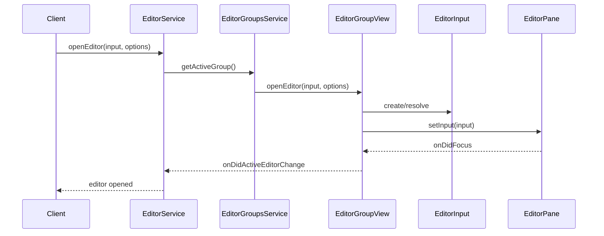
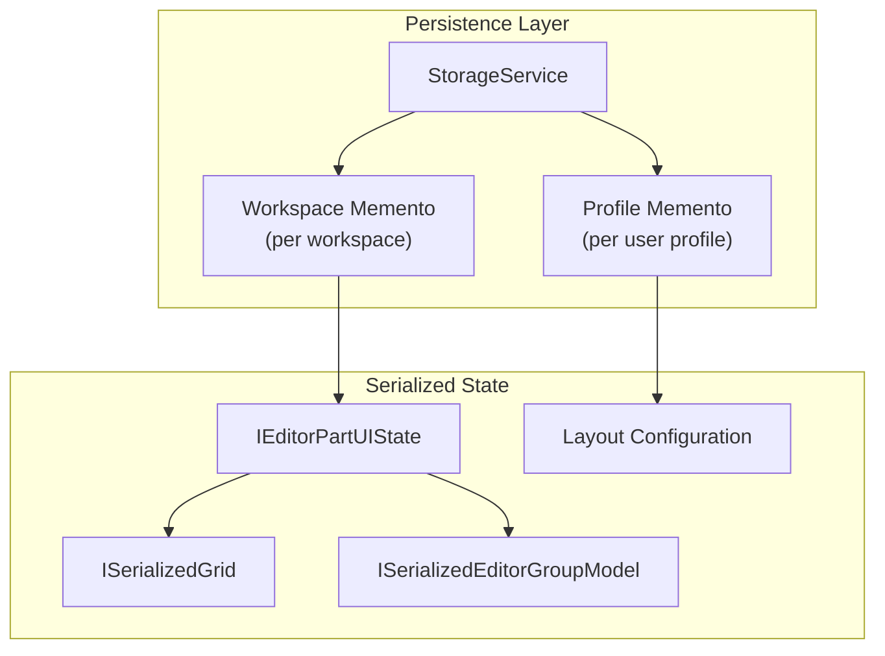
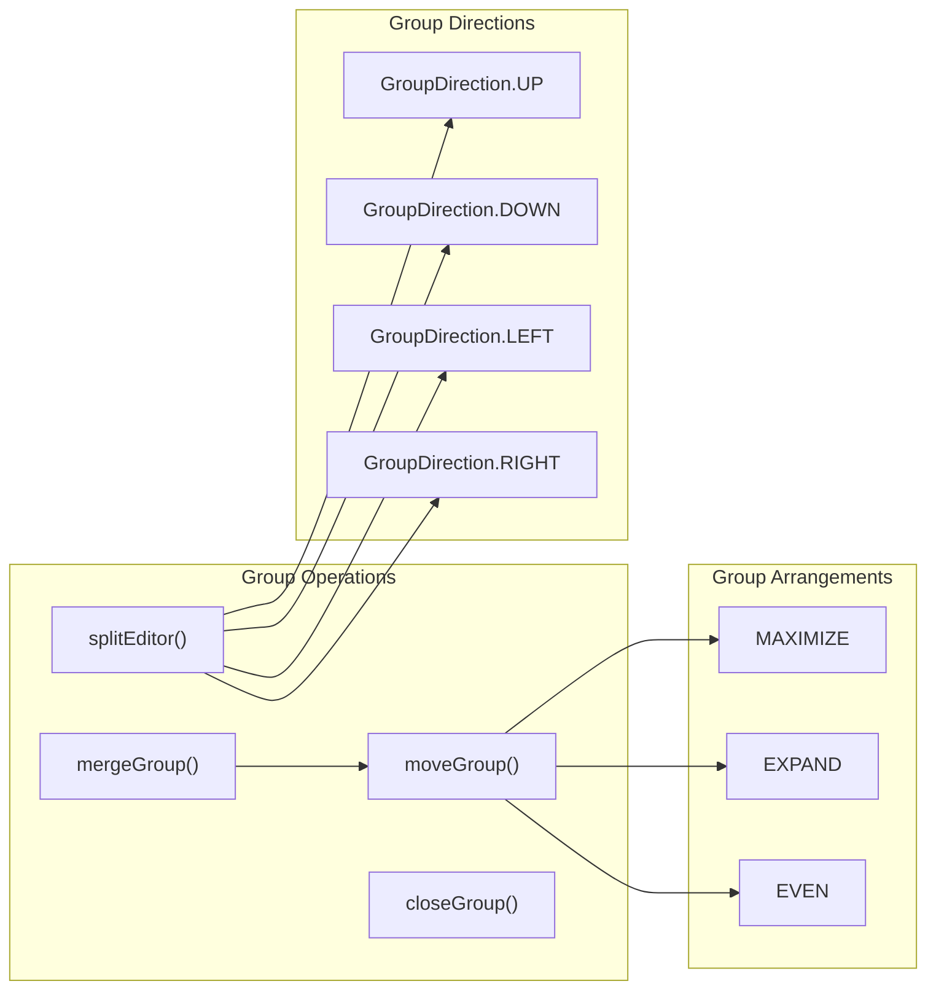

# Workbench Layout and Editor Management

<details>
<summary>Relevant source files</summary>

The following files were used as context for generating this wiki page:

- [src/vs/platform/editor/common/editor.ts](src/vs/platform/editor/common/editor.ts)
- [src/vs/workbench/browser/actions/layoutActions.ts](src/vs/workbench/browser/actions/layoutActions.ts)
- [src/vs/workbench/browser/contextkeys.ts](src/vs/workbench/browser/contextkeys.ts)
- [src/vs/workbench/browser/dnd.ts](src/vs/workbench/browser/dnd.ts)
- [src/vs/workbench/browser/layout.ts](src/vs/workbench/browser/layout.ts)
- [src/vs/workbench/browser/parts/auxiliarybar/auxiliaryBarActions.ts](src/vs/workbench/browser/parts/auxiliarybar/auxiliaryBarActions.ts)
- [src/vs/workbench/browser/parts/editor/editor.contribution.ts](src/vs/workbench/browser/parts/editor/editor.contribution.ts)
- [src/vs/workbench/browser/parts/editor/editor.ts](src/vs/workbench/browser/parts/editor/editor.ts)
- [src/vs/workbench/browser/parts/editor/editorActions.ts](src/vs/workbench/browser/parts/editor/editorActions.ts)
- [src/vs/workbench/browser/parts/editor/editorCommands.ts](src/vs/workbench/browser/parts/editor/editorCommands.ts)
- [src/vs/workbench/browser/parts/editor/editorDropTarget.ts](src/vs/workbench/browser/parts/editor/editorDropTarget.ts)
- [src/vs/workbench/browser/parts/editor/editorGroupView.ts](src/vs/workbench/browser/parts/editor/editorGroupView.ts)
- [src/vs/workbench/browser/parts/editor/editorGroupWatermark.ts](src/vs/workbench/browser/parts/editor/editorGroupWatermark.ts)
- [src/vs/workbench/browser/parts/editor/editorPart.ts](src/vs/workbench/browser/parts/editor/editorPart.ts)
- [src/vs/workbench/browser/parts/editor/media/editorgroupview.css](src/vs/workbench/browser/parts/editor/media/editorgroupview.css)
- [src/vs/workbench/browser/parts/panel/panelActions.ts](src/vs/workbench/browser/parts/panel/panelActions.ts)
- [src/vs/workbench/browser/parts/titlebar/titlebarActions.ts](src/vs/workbench/browser/parts/titlebar/titlebarActions.ts)
- [src/vs/workbench/browser/workbench.contribution.ts](src/vs/workbench/browser/workbench.contribution.ts)
- [src/vs/workbench/browser/workbench.ts](src/vs/workbench/browser/workbench.ts)
- [src/vs/workbench/common/contextkeys.ts](src/vs/workbench/common/contextkeys.ts)
- [src/vs/workbench/common/editor.ts](src/vs/workbench/common/editor.ts)
- [src/vs/workbench/services/editor/browser/editorService.ts](src/vs/workbench/services/editor/browser/editorService.ts)
- [src/vs/workbench/services/editor/common/editorGroupsService.ts](src/vs/workbench/services/editor/common/editorGroupsService.ts)
- [src/vs/workbench/services/editor/common/editorService.ts](src/vs/workbench/services/editor/common/editorService.ts)
- [src/vs/workbench/services/editor/test/browser/editorGroupsService.test.ts](src/vs/workbench/services/editor/test/browser/editorGroupsService.test.ts)
- [src/vs/workbench/services/editor/test/browser/editorService.test.ts](src/vs/workbench/services/editor/test/browser/editorService.test.ts)
- [src/vs/workbench/services/layout/browser/layoutService.ts](src/vs/workbench/services/layout/browser/layoutService.ts)
- [src/vs/workbench/test/browser/workbenchTestServices.ts](src/vs/workbench/test/browser/workbenchTestServices.ts)

</details>


This document covers VS Code's workbench layout system and editor management architecture. The workbench layout defines how the main UI parts (sidebar, panel, editor area, etc.) are arranged and sized, while editor management handles the lifecycle and organization of editors within the editor area.

For information about Monaco Editor's text editing capabilities, see [3](#3). For UI component fundamentals like lists and trees, see [2.3](#2.3).

## Overview

The workbench layout system consists of two main layers:

1. **Layout Management**: Controls the arrangement and sizing of major workbench parts (sidebar, panel, editor area, auxiliary bar, etc.)
2. **Editor Management**: Manages editors within the editor area, including grouping, splitting, and lifecycle operations

The system uses a grid-based layout with serializable state that persists across sessions.

## Layout Architecture

### Core Layout Components



The `Layout` class orchestrates the overall workbench structure, managing eight distinct parts arranged in a serializable grid system.

Sources: [src/vs/workbench/browser/layout.ts:138-304](), [src/vs/workbench/browser/parts/editor/editorPart.ts:86-172]()

### Layout State Management



The layout system maintains persistent state through `LayoutStateModel`, tracking part positions, visibility, and special modes like Zen Mode.

Sources: [src/vs/workbench/browser/layout.ts:54-95](), [src/vs/workbench/browser/layout.ts:625-744]()

## Editor Management System

### Editor Service Architecture



The editor system uses a hierarchical structure where `EditorService` coordinates with `EditorGroupsService` to manage multiple editor parts, each containing multiple editor groups.

Sources: [src/vs/workbench/services/editor/browser/editorService.ts:39-96](), [src/vs/workbench/browser/parts/editor/editorPart.ts:86-236]()

### Editor Group Layout



Editor groups are arranged using the same grid system as the overall layout, allowing flexible splitting and resizing of editor areas.

Sources: [src/vs/workbench/browser/parts/editor/editorPart.ts:154-157](), [src/vs/workbench/browser/parts/editor/editorGroupView.ts:116-175]()

## Key Interfaces and Services

### IWorkbenchLayoutService

The main interface for layout operations:

| Method | Purpose |
|--------|---------|
| `isVisible(part: Parts)` | Check part visibility |
| `setPartHidden(hidden: boolean, part: Parts)` | Toggle part visibility |
| `toggleZenMode()` | Enter/exit zen mode |
| `centerMainEditorLayout(active: boolean)` | Toggle centered editor layout |
| `setPanelAlignment(alignment: PanelAlignment)` | Set panel alignment |

Sources: [src/vs/workbench/services/layout/browser/layoutService.ts:225-398]()

### IEditorGroupsService

Manages editor group operations:

| Method | Purpose |
|--------|---------|
| `addGroup(location: GroupLocation, direction: GroupDirection)` | Create new editor group |
| `removeGroup(group: IEditorGroup)` | Remove editor group |
| `moveGroup(group: IEditorGroup, location: GroupLocation)` | Move group position |
| `arrangeGroups(arrangement: GroupsArrangement)` | Arrange group layout |

Sources: [src/vs/workbench/services/editor/common/editorGroupsService.ts:188-445]()

### EditorGroupView Lifecycle



The editor opening process involves coordination between multiple services to resolve inputs and create appropriate editor panes.

Sources: [src/vs/workbench/browser/parts/editor/editorGroupView.ts:785-950](), [src/vs/workbench/services/editor/browser/editorService.ts:478-629]()

## Layout Persistence and Restoration

### State Serialization

The layout system persists its state through several mechanisms:



Different aspects of layout state are persisted at different scopes - workspace-specific state (like open editors) versus user preferences (like part positions).

Sources: [src/vs/workbench/browser/parts/editor/editorPart.ts:142-143](), [src/vs/workbench/browser/layout.ts:625-744]()

## Editor Group Management

### Group Operations



Editor groups support various operations for splitting, merging, and arranging editors in the workspace.

Sources: [src/vs/workbench/services/editor/common/editorGroupsService.ts:23-40](), [src/vs/workbench/services/editor/common/editorGroupsService.ts:47-64]()

### Editor Input Management

Each `EditorGroupView` manages a collection of `EditorInput` instances:

| Component | Responsibility |
|-----------|----------------|
| `EditorGroupModel` | Tracks editor state and order |
| `EditorTitleControl` | Renders tabs and title area |
| `EditorPanes` | Manages editor pane instances |
| `EditorDropTarget` | Handles drag & drop operations |

Sources: [src/vs/workbench/browser/parts/editor/editorGroupView.ts:116-247]()

## Configuration and Customization

The layout system exposes numerous configuration options through VS Code's settings:

### Layout Settings

```typescript
interface IEditorPartOptions {
  showTabs: 'multiple' | 'single' | 'none';
  tabSizing: 'fit' | 'shrink' | 'fixed';
  splitOnDragAndDrop: boolean;
  centeredLayoutFixedWidth: boolean;
  // ... many more options
}
```

### Key Configuration Properties

| Setting | Purpose | Default |
|---------|---------|---------|
| `workbench.editor.showTabs` | Tab display mode | `'multiple'` |
| `workbench.sideBar.location` | Sidebar position | `'left'` |
| `workbench.panel.defaultLocation` | Panel position | `'bottom'` |
| `workbench.editor.splitSizing` | Split editor sizing | `'auto'` |

Sources: [src/vs/workbench/browser/parts/editor/editor.ts:31-149](), [src/vs/workbench/browser/workbench.contribution.ts:49-383]()

This architecture provides a flexible, extensible system for managing VS Code's complex UI layout while maintaining performance and user experience across different workflows and window configurations.