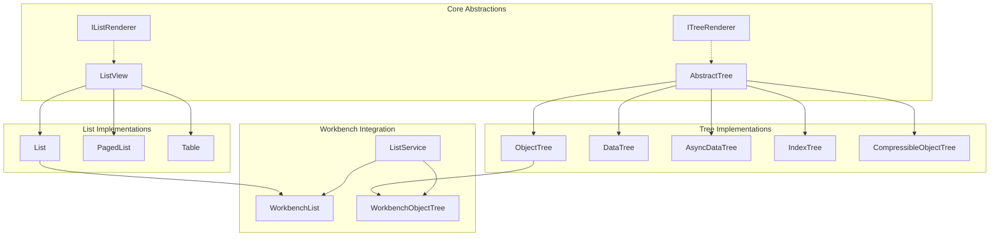
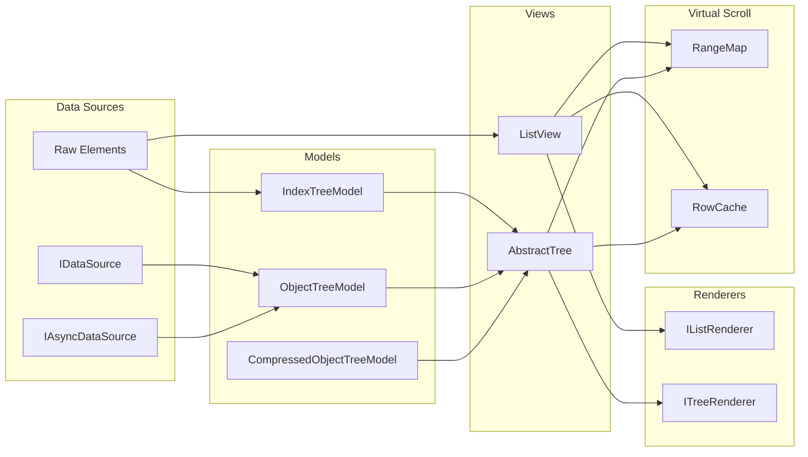
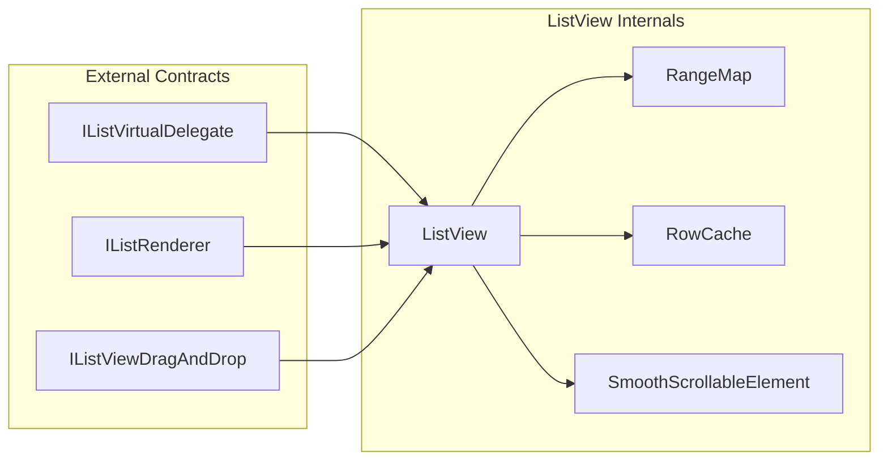
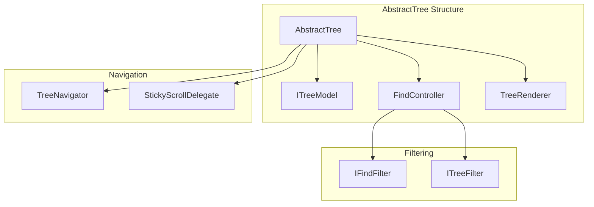
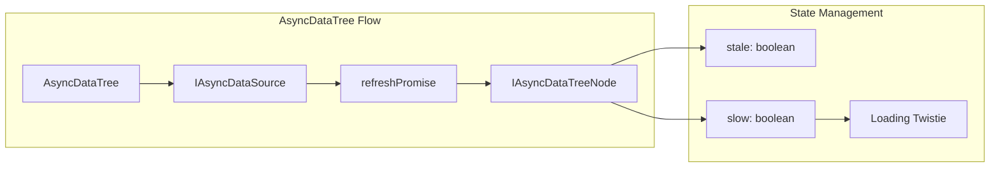
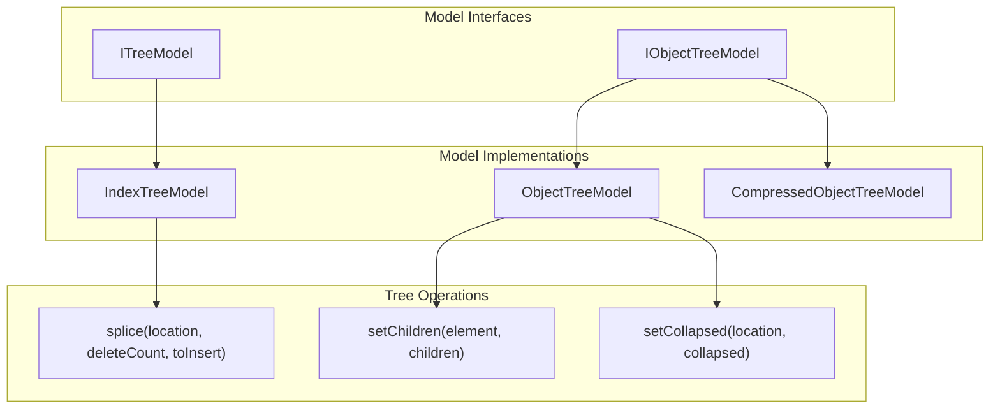

# UI Components: Lists and Trees

<details>
<summary>Relevant source files</summary>

The following files were used as context for generating this wiki page:

- [src/vs/base/browser/ui/list/list.ts](src/vs/base/browser/ui/list/list.ts)
- [src/vs/base/browser/ui/list/listPaging.ts](src/vs/base/browser/ui/list/listPaging.ts)
- [src/vs/base/browser/ui/list/listView.ts](src/vs/base/browser/ui/list/listView.ts)
- [src/vs/base/browser/ui/list/listWidget.ts](src/vs/base/browser/ui/list/listWidget.ts)
- [src/vs/base/browser/ui/list/splice.ts](src/vs/base/browser/ui/list/splice.ts)
- [src/vs/base/browser/ui/tree/abstractTree.ts](src/vs/base/browser/ui/tree/abstractTree.ts)
- [src/vs/base/browser/ui/tree/asyncDataTree.ts](src/vs/base/browser/ui/tree/asyncDataTree.ts)
- [src/vs/base/browser/ui/tree/compressedObjectTreeModel.ts](src/vs/base/browser/ui/tree/compressedObjectTreeModel.ts)
- [src/vs/base/browser/ui/tree/dataTree.ts](src/vs/base/browser/ui/tree/dataTree.ts)
- [src/vs/base/browser/ui/tree/indexTree.ts](src/vs/base/browser/ui/tree/indexTree.ts)
- [src/vs/base/browser/ui/tree/indexTreeModel.ts](src/vs/base/browser/ui/tree/indexTreeModel.ts)
- [src/vs/base/browser/ui/tree/objectTree.ts](src/vs/base/browser/ui/tree/objectTree.ts)
- [src/vs/base/browser/ui/tree/objectTreeModel.ts](src/vs/base/browser/ui/tree/objectTreeModel.ts)
- [src/vs/base/browser/ui/tree/tree.ts](src/vs/base/browser/ui/tree/tree.ts)
- [src/vs/base/test/browser/ui/tree/asyncDataTree.test.ts](src/vs/base/test/browser/ui/tree/asyncDataTree.test.ts)
- [src/vs/base/test/browser/ui/tree/compressedObjectTreeModel.test.ts](src/vs/base/test/browser/ui/tree/compressedObjectTreeModel.test.ts)
- [src/vs/base/test/browser/ui/tree/indexTreeModel.test.ts](src/vs/base/test/browser/ui/tree/indexTreeModel.test.ts)
- [src/vs/base/test/browser/ui/tree/objectTree.test.ts](src/vs/base/test/browser/ui/tree/objectTree.test.ts)
- [src/vs/base/test/browser/ui/tree/objectTreeModel.test.ts](src/vs/base/test/browser/ui/tree/objectTreeModel.test.ts)
- [src/vs/platform/list/browser/listService.ts](src/vs/platform/list/browser/listService.ts)
- [src/vs/workbench/browser/actions/listCommands.ts](src/vs/workbench/browser/actions/listCommands.ts)

</details>


This document covers the foundational list and tree UI components that provide the scrollable, interactive data display widgets used throughout VS Code. These components handle virtualized rendering, keyboard navigation, drag-and-drop, filtering, and selection management for hierarchical and flat data structures.

For workbench-specific list usage patterns, see [Workbench Layout and Editor Management](#2.2). For the Monaco editor's internal tree structures, see [Monaco Editor](#3).

## Architecture Overview

The list and tree system is built on a layered architecture where base components provide core functionality, specialized implementations add specific behaviors, and platform services manage integration with the broader workbench.

### Component Hierarchy



Sources: [src/vs/base/browser/ui/list/listWidget.ts:254-383](), [src/vs/base/browser/ui/tree/abstractTree.ts:1087-1228](), [src/vs/platform/list/browser/listService.ts:254-383]()

### Data Flow Architecture



Sources: [src/vs/base/browser/ui/tree/tree.ts:206-216](), [src/vs/base/browser/ui/tree/indexTreeModel.ts:92-142](), [src/vs/base/browser/ui/list/listView.ts:288-472]()

## Core List Components

### ListView

`ListView` is the foundational virtual scrolling component that efficiently renders large datasets by only creating DOM elements for visible items.

**Key Responsibilities:**
- Virtual scrolling with `RangeMap` for position calculations
- Drag and drop operations via `IListViewDragAndDrop`
- Template-based rendering through `IListRenderer`
- Keyboard and mouse event handling



Sources: [src/vs/base/browser/ui/list/listView.ts:288-472](), [src/vs/base/browser/ui/list/listWidget.ts:254-383]()

### List Widget

The `List` class extends `ListView` with higher-level features like selection management, focus handling, and keyboard navigation.

**Key Features:**
- Selection and focus management via `Trait<T>` classes
- Type-ahead navigation through `TypeNavigationController`
- Multiple selection support with configurable modifiers
- Integration with accessibility providers

Sources: [src/vs/base/browser/ui/list/listWidget.ts:117-200](), [src/vs/base/browser/ui/list/listWidget.ts:450-596]()

### PagedList

`PagedList` provides on-demand loading for large datasets through the `IPagedModel` interface.

**Implementation Pattern:**
- Wraps renderers with `PagedRenderer` to handle placeholder rendering
- Uses `CancellationTokenSource` for request management
- Resolves data asynchronously while maintaining UI responsiveness

Sources: [src/vs/base/browser/ui/list/listPaging.ts:26-71]()

## Tree Components

### AbstractTree

`AbstractTree` provides the foundation for all tree implementations, handling common tree operations like expansion, collapse, and hierarchical navigation.

**Core Features:**
- Tree model abstraction via `ITreeModel<T, TFilterData, TRef>`
- Find functionality with `FindController` and `IFindFilter`
- Sticky scroll support for keeping parent nodes visible
- Indent guides and twistie rendering



Sources: [src/vs/base/browser/ui/tree/abstractTree.ts:1087-1228](), [src/vs/base/browser/ui/tree/abstractTree.ts:335-577]()

### ObjectTree

`ObjectTree` manages tree structures where each node is a distinct object, using `ObjectTreeModel` for data management.

**Key Operations:**
- `setChildren(element, children, options)` for tree updates
- `rerender(element)` for visual refresh without data changes
- `resort(element, recursive)` for sorting operations
- Element-based navigation and selection

Sources: [src/vs/base/browser/ui/tree/objectTree.ts:38-87]()

### AsyncDataTree

`AsyncDataTree` handles asynchronous data loading with loading states and error handling.

**Async Features:**
- `IAsyncDataSource` for promise-based data fetching
- Loading indicators via twistie state management
- Cancellation support for in-flight requests
- Stale node detection and refresh logic



Sources: [src/vs/base/browser/ui/tree/asyncDataTree.ts:522-600](), [src/vs/base/browser/ui/tree/asyncDataTree.ts:30-59]()

### CompressibleObjectTree

`CompressibleObjectTree` automatically compresses single-child chains into compact representations, useful for file system trees.

**Compression Logic:**
- `compress()` function collapses single-child chains
- `decompress()` expands compressed nodes for rendering
- `ICompressedTreeNode<T>` contains element arrays
- `ITreeCompressionDelegate` controls compression behavior

Sources: [src/vs/base/browser/ui/tree/compressedObjectTreeModel.ts:38-99](), [src/vs/base/browser/ui/tree/objectTree.ts:88-200]()

## Tree Models and Data Management

### Model Hierarchy



Sources: [src/vs/base/browser/ui/tree/tree.ts:133-160](), [src/vs/base/browser/ui/tree/objectTreeModel.ts:14-26]()

### IndexTreeModel

`IndexTreeModel` manages tree structure using array-based indexing for fast lookups and modifications.

**Key Features:**
- Location-based addressing via `number[]` paths
- Efficient splicing operations with diff algorithms
- Filter support with `TreeVisibility` states
- Event-driven updates for view synchronization

Sources: [src/vs/base/browser/ui/tree/indexTreeModel.ts:92-160]()

### ObjectTreeModel

`ObjectTreeModel` provides object-centric tree management with identity-based operations.

**Identity Management:**
- `IIdentityProvider<T>` for stable node identification
- Preserve collapse state across updates
- Sorting support via `ITreeSorter<T>`
- Optimized diffing for large tree updates

Sources: [src/vs/base/browser/ui/tree/objectTreeModel.ts:27-128]()

## Platform Integration

### ListService

`ListService` manages all list and tree instances within the workbench, providing centralized access and context key management.

**Service Responsibilities:**
- Track `lastFocusedList` for command targeting
- Manage context keys for keybindings
- Coordinate focus between multiple list instances
- Integrate with accessibility and theming systems

```mermaid
graph LR
    subgraph "ListService Management"
        LS[ListService]
        Registry[IRegisteredList[]]
        LastFocused[lastFocusedWidget]
    end
    
    subgraph "Context Keys"
        Focus[WorkbenchListFocusContextKey]
        Selection[WorkbenchListHasSelectionOrFocus]
        MultiSelect[WorkbenchListSupportsMultiSelectContextKey]
    end
    
    subgraph "Workbench Lists"
        WL[WorkbenchList]
        WOT[WorkbenchObjectTree]
        WAD[WorkbenchAsyncDataTree]
    end
    
    LS --> Registry
    LS --> LastFocused
    LS --> Focus
    LS --> Selection
    LS --> MultiSelect
    
    WL --> LS
    WOT --> LS
    WAD --> LS
```

Sources: [src/vs/platform/list/browser/listService.ts:53-106](), [src/vs/platform/list/browser/listService.ts:108-130]()

### Workbench Integration

Workbench-specific list classes add configuration management, styling, and command integration.

**Integration Features:**
- Configuration service binding for user preferences
- Theme integration via `getListStyles()`
- Keybinding service integration for navigation
- Resource navigator for file operations

Sources: [src/vs/platform/list/browser/listService.ts:254-383](), [src/vs/platform/list/browser/listService.ts:512-600]()

## Rendering and Performance

### Virtual Scrolling

The virtual scrolling system optimizes performance for large datasets by only rendering visible elements.

**Performance Components:**
- `RangeMap` calculates item positions and visible ranges
- `RowCache` manages template reuse and disposal
- Dynamic height support for variable-sized items
- Smooth scrolling with `SmoothScrollableElement`

### Template System

The renderer system uses a template-based approach for efficient DOM management.

**Renderer Pattern:**
- `renderTemplate()` creates reusable DOM structure
- `renderElement()` populates template with data
- `disposeTemplate()` cleans up resources
- Template pooling reduces allocation overhead

Sources: [src/vs/base/browser/ui/list/list.ts:25-31](), [src/vs/base/browser/ui/tree/tree.ts:166-171]()