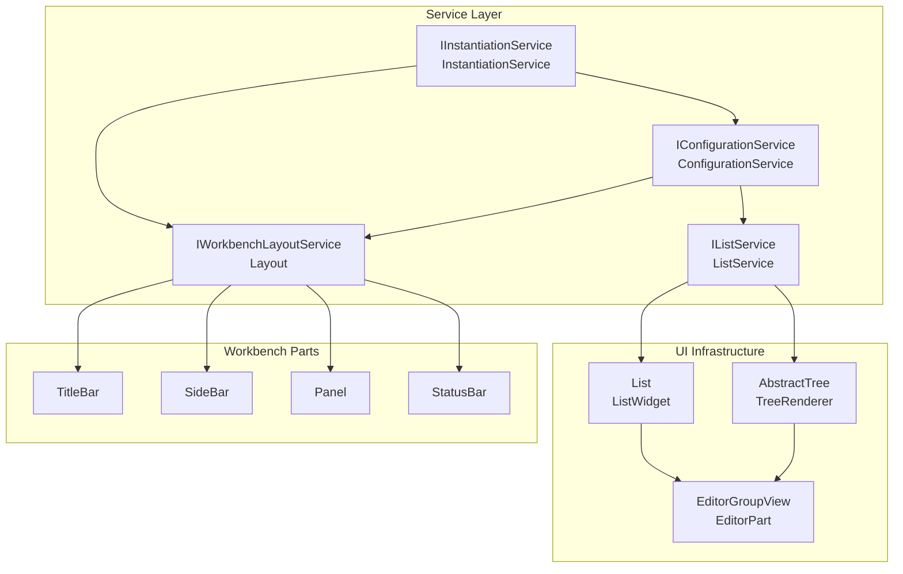
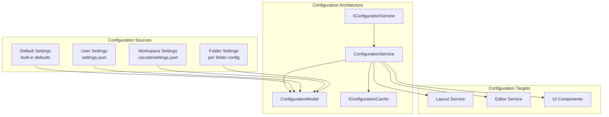
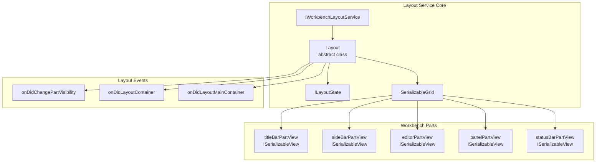
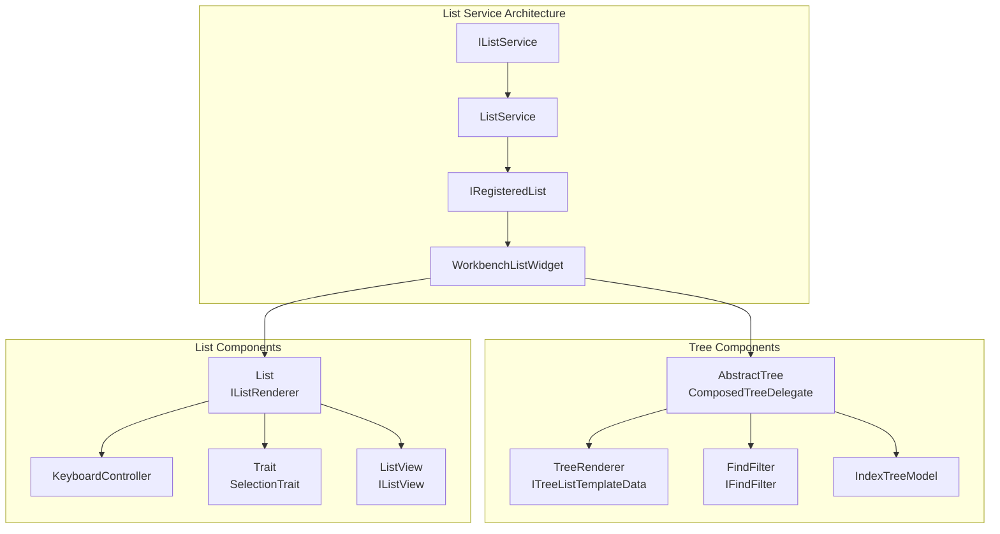
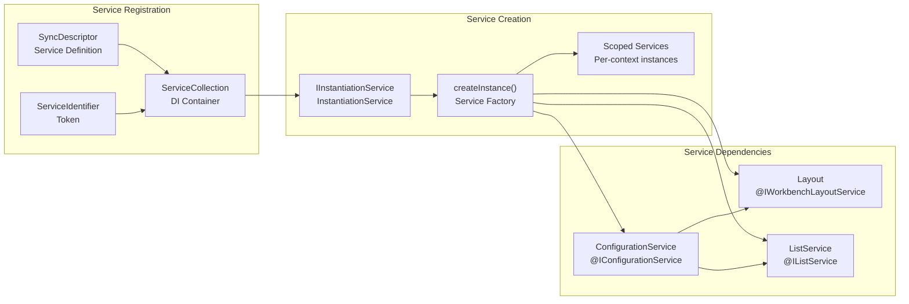
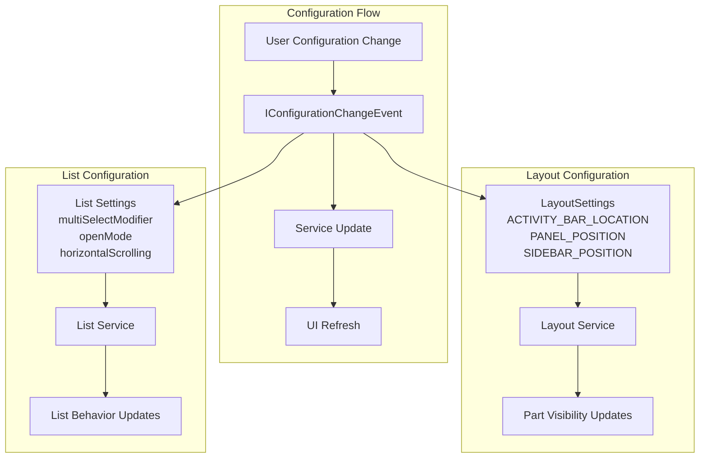

# Core Platform Services

Relevant source files

The following files were used as context for generating this wiki page:

- [src/vs/base/browser/ui/list/list.ts](src/vs/base/browser/ui/list/list.ts)
- [src/vs/base/browser/ui/list/listPaging.ts](src/vs/base/browser/ui/list/listPaging.ts)
- [src/vs/base/browser/ui/list/listView.ts](src/vs/base/browser/ui/list/listView.ts)
- [src/vs/base/browser/ui/list/listWidget.ts](src/vs/base/browser/ui/list/listWidget.ts)
- [src/vs/base/browser/ui/list/splice.ts](src/vs/base/browser/ui/list/splice.ts)
- [src/vs/base/browser/ui/tree/abstractTree.ts](src/vs/base/browser/ui/tree/abstractTree.ts)
- [src/vs/base/browser/ui/tree/asyncDataTree.ts](src/vs/base/browser/ui/tree/asyncDataTree.ts)
- [src/vs/base/browser/ui/tree/compressedObjectTreeModel.ts](src/vs/base/browser/ui/tree/compressedObjectTreeModel.ts)
- [src/vs/base/browser/ui/tree/dataTree.ts](src/vs/base/browser/ui/tree/dataTree.ts)
- [src/vs/base/browser/ui/tree/indexTree.ts](src/vs/base/browser/ui/tree/indexTree.ts)
- [src/vs/base/browser/ui/tree/indexTreeModel.ts](src/vs/base/browser/ui/tree/indexTreeModel.ts)
- [src/vs/base/browser/ui/tree/objectTree.ts](src/vs/base/browser/ui/tree/objectTree.ts)
- [src/vs/base/browser/ui/tree/objectTreeModel.ts](src/vs/base/browser/ui/tree/objectTreeModel.ts)
- [src/vs/base/browser/ui/tree/tree.ts](src/vs/base/browser/ui/tree/tree.ts)
- [src/vs/base/common/resources.ts](src/vs/base/common/resources.ts)
- [src/vs/base/test/browser/ui/tree/asyncDataTree.test.ts](src/vs/base/test/browser/ui/tree/asyncDataTree.test.ts)
- [src/vs/base/test/browser/ui/tree/compressedObjectTreeModel.test.ts](src/vs/base/test/browser/ui/tree/compressedObjectTreeModel.test.ts)
- [src/vs/base/test/browser/ui/tree/indexTreeModel.test.ts](src/vs/base/test/browser/ui/tree/indexTreeModel.test.ts)
- [src/vs/base/test/browser/ui/tree/objectTree.test.ts](src/vs/base/test/browser/ui/tree/objectTree.test.ts)
- [src/vs/base/test/browser/ui/tree/objectTreeModel.test.ts](src/vs/base/test/browser/ui/tree/objectTreeModel.test.ts)
- [src/vs/base/test/common/resources.test.ts](src/vs/base/test/common/resources.test.ts)
- [src/vs/platform/configuration/common/configuration.ts](src/vs/platform/configuration/common/configuration.ts)
- [src/vs/platform/configuration/common/configurationModels.ts](src/vs/platform/configuration/common/configurationModels.ts)
- [src/vs/platform/configuration/common/configurationService.ts](src/vs/platform/configuration/common/configurationService.ts)
- [src/vs/platform/configuration/test/common/configurationModels.test.ts](src/vs/platform/configuration/test/common/configurationModels.test.ts)
- [src/vs/platform/configuration/test/common/configurationRegistry.test.ts](src/vs/platform/configuration/test/common/configurationRegistry.test.ts)
- [src/vs/platform/configuration/test/common/configurationService.test.ts](src/vs/platform/configuration/test/common/configurationService.test.ts)
- [src/vs/platform/configuration/test/common/configurations.test.ts](src/vs/platform/configuration/test/common/configurations.test.ts)
- [src/vs/platform/editor/common/editor.ts](src/vs/platform/editor/common/editor.ts)
- [src/vs/platform/list/browser/listService.ts](src/vs/platform/list/browser/listService.ts)
- [src/vs/platform/userData/common/fileUserDataProvider.ts](src/vs/platform/userData/common/fileUserDataProvider.ts)
- [src/vs/platform/userData/test/browser/fileUserDataProvider.test.ts](src/vs/platform/userData/test/browser/fileUserDataProvider.test.ts)
- [src/vs/workbench/api/browser/mainThreadConfiguration.ts](src/vs/workbench/api/browser/mainThreadConfiguration.ts)
- [src/vs/workbench/api/common/extHostConfiguration.ts](src/vs/workbench/api/common/extHostConfiguration.ts)
- [src/vs/workbench/browser/actions/layoutActions.ts](src/vs/workbench/browser/actions/layoutActions.ts)
- [src/vs/workbench/browser/actions/listCommands.ts](src/vs/workbench/browser/actions/listCommands.ts)
- [src/vs/workbench/browser/contextkeys.ts](src/vs/workbench/browser/contextkeys.ts)
- [src/vs/workbench/browser/dnd.ts](src/vs/workbench/browser/dnd.ts)
- [src/vs/workbench/browser/layout.ts](src/vs/workbench/browser/layout.ts)
- [src/vs/workbench/browser/parts/auxiliarybar/auxiliaryBarActions.ts](src/vs/workbench/browser/parts/auxiliarybar/auxiliaryBarActions.ts)
- [src/vs/workbench/browser/parts/editor/editor.contribution.ts](src/vs/workbench/browser/parts/editor/editor.contribution.ts)
- [src/vs/workbench/browser/parts/editor/editor.ts](src/vs/workbench/browser/parts/editor/editor.ts)
- [src/vs/workbench/browser/parts/editor/editorActions.ts](src/vs/workbench/browser/parts/editor/editorActions.ts)
- [src/vs/workbench/browser/parts/editor/editorCommands.ts](src/vs/workbench/browser/parts/editor/editorCommands.ts)
- [src/vs/workbench/browser/parts/editor/editorDropTarget.ts](src/vs/workbench/browser/parts/editor/editorDropTarget.ts)
- [src/vs/workbench/browser/parts/editor/editorGroupView.ts](src/vs/workbench/browser/parts/editor/editorGroupView.ts)
- [src/vs/workbench/browser/parts/editor/editorGroupWatermark.ts](src/vs/workbench/browser/parts/editor/editorGroupWatermark.ts)
- [src/vs/workbench/browser/parts/editor/editorPart.ts](src/vs/workbench/browser/parts/editor/editorPart.ts)
- [src/vs/workbench/browser/parts/editor/media/editorgroupview.css](src/vs/workbench/browser/parts/editor/media/editorgroupview.css)
- [src/vs/workbench/browser/parts/panel/panelActions.ts](src/vs/workbench/browser/parts/panel/panelActions.ts)
- [src/vs/workbench/browser/parts/titlebar/titlebarActions.ts](src/vs/workbench/browser/parts/titlebar/titlebarActions.ts)
- [src/vs/workbench/browser/workbench.contribution.ts](src/vs/workbench/browser/workbench.contribution.ts)
- [src/vs/workbench/browser/workbench.ts](src/vs/workbench/browser/workbench.ts)
- [src/vs/workbench/common/contextkeys.ts](src/vs/workbench/common/contextkeys.ts)
- [src/vs/workbench/common/editor.ts](src/vs/workbench/common/editor.ts)
- [src/vs/workbench/contrib/telemetry/browser/telemetry.contribution.ts](src/vs/workbench/contrib/telemetry/browser/telemetry.contribution.ts)
- [src/vs/workbench/services/configuration/browser/configuration.ts](src/vs/workbench/services/configuration/browser/configuration.ts)
- [src/vs/workbench/services/configuration/browser/configurationService.ts](src/vs/workbench/services/configuration/browser/configurationService.ts)
- [src/vs/workbench/services/configuration/common/configuration.ts](src/vs/workbench/services/configuration/common/configuration.ts)
- [src/vs/workbench/services/configuration/common/configurationEditing.ts](src/vs/workbench/services/configuration/common/configurationEditing.ts)
- [src/vs/workbench/services/configuration/common/configurationModels.ts](src/vs/workbench/services/configuration/common/configurationModels.ts)
- [src/vs/workbench/services/configuration/common/jsonEditing.ts](src/vs/workbench/services/configuration/common/jsonEditing.ts)
- [src/vs/workbench/services/configuration/common/jsonEditingService.ts](src/vs/workbench/services/configuration/common/jsonEditingService.ts)
- [src/vs/workbench/services/configuration/test/browser/configuration.test.ts](src/vs/workbench/services/configuration/test/browser/configuration.test.ts)
- [src/vs/workbench/services/configuration/test/browser/configurationService.test.ts](src/vs/workbench/services/configuration/test/browser/configurationService.test.ts)
- [src/vs/workbench/services/configuration/test/common/configurationModels.test.ts](src/vs/workbench/services/configuration/test/common/configurationModels.test.ts)
- [src/vs/workbench/services/editor/browser/editorService.ts](src/vs/workbench/services/editor/browser/editorService.ts)
- [src/vs/workbench/services/editor/common/editorGroupsService.ts](src/vs/workbench/services/editor/common/editorGroupsService.ts)
- [src/vs/workbench/services/editor/common/editorService.ts](src/vs/workbench/services/editor/common/editorService.ts)
- [src/vs/workbench/services/editor/test/browser/editorGroupsService.test.ts](src/vs/workbench/services/editor/test/browser/editorGroupsService.test.ts)
- [src/vs/workbench/services/editor/test/browser/editorService.test.ts](src/vs/workbench/services/editor/test/browser/editorService.test.ts)
- [src/vs/workbench/services/keybinding/test/browser/keybindingEditing.test.ts](src/vs/workbench/services/keybinding/test/browser/keybindingEditing.test.ts)
- [src/vs/workbench/services/layout/browser/layoutService.ts](src/vs/workbench/services/layout/browser/layoutService.ts)
- [src/vs/workbench/test/browser/workbenchTestServices.ts](src/vs/workbench/test/browser/workbenchTestServices.ts)

This document covers the foundational platform services that power the VS Code workbench. These services provide essential infrastructure for configuration management, layout coordination, UI component systems, and service lifecycle management. For information about specific editor functionality, see [Editor System](#4). For details about extension integration, see [Extension System](#4).

## Service Architecture Overview

VS Code's core platform services form a layered architecture where foundational services support higher-level workbench functionality. The service system uses dependency injection to manage service lifecycles and provide clean separation of concerns.

**Sources:** [src/vs/workbench/browser/layout.ts:305-336](), [src/vs/platform/list/browser/listService.ts:53-106](), [src/vs/workbench/services/configuration/browser/configurationService.ts:1-100]()

## Configuration System

The configuration system manages all settings, preferences, and workspace-specific configurations in VS Code. It provides a hierarchical configuration model with support for user, workspace, and folder-level settings.

The `ConfigurationService` implements the `IConfigurationService` interface and manages configuration resolution across multiple scopes:

| Configuration Scope | Priority | File Location | Purpose |
|---------------------|----------|---------------|---------|
| Application | Lowest | Built-in | Default values |
| User | Low | `%APPDATA%/Code/User/settings.json` | User preferences |
| Workspace | High | `.vscode/settings.json` | Project settings |
| Folder | Highest | Per workspace folder | Folder-specific overrides |

**Sources:** [src/vs/workbench/services/configuration/browser/configurationService.ts:15-50](), [src/vs/workbench/services/configuration/browser/configuration.ts:12-30](), [src/vs/platform/configuration/common/configurationModels.ts:1-100]()

## Layout Management

The layout service orchestrates the positioning and sizing of workbench parts including the title bar, sidebar, panel, editor area, and status bar. It manages responsive layout changes and user customizations.

The layout system uses a `SerializableGrid` to manage part positioning and supports operations like:

- **Part Visibility**: `isVisible(Parts.SIDEBAR_PART)`, `toggleSidebar()`
- **Part Positioning**: `setSideBarPosition(Position.LEFT)`
- **Layout Persistence**: State serialization for workspace restoration
- **Responsive Behavior**: Automatic adjustments based on window size

**Sources:** [src/vs/workbench/browser/layout.ts:260-300](), [src/vs/workbench/browser/layout.ts:540-580](), [src/vs/workbench/services/layout/browser/layoutService.ts:1-50]()

## UI Component Infrastructure

The UI component system provides foundational widgets like trees and lists that are used throughout the workbench. These components handle complex interaction patterns, virtualization, and accessibility.

Key component features include:

| Component | Purpose | Key Classes |
|-----------|---------|-------------|
| AbstractTree | Hierarchical data display | `AbstractTree`, `TreeRenderer`, `FindFilter` |
| List | Flat data virtualization | `List`, `ListView`, `KeyboardController` |
| Traits | Selection/focus management | `SelectionTrait`, `FocusTrait` |
| Renderers | Element visualization | `IListRenderer`, `ITreeRenderer` |

**Sources:** [src/vs/base/browser/ui/tree/abstractTree.ts:335-580](), [src/vs/base/browser/ui/list/listWidget.ts:308-430](), [src/vs/platform/list/browser/listService.ts:77-106]()

## Service Lifecycle and Dependencies

The platform services use dependency injection through the `IInstantiationService` to manage service creation, lifecycle, and dependencies. Services are registered as singletons and injected based on interface contracts.

Service lifecycle phases:

1. **Registration**: Services register descriptors with `ServiceCollection`
2. **Instantiation**: `IInstantiationService.createInstance()` creates instances
3. **Injection**: Constructor parameters are automatically resolved
4. **Scoping**: Services can be scoped to specific contexts (e.g., editor groups)
5. **Disposal**: Services implement `IDisposable` for cleanup

**Sources:** [src/vs/workbench/test/browser/workbenchTestServices.ts:250-350](), [src/vs/platform/instantiation/common/instantiation.ts:1-50](), [src/vs/workbench/browser/parts/editor/editorGroupView.ts:200-230]()

## Configuration Integration Points

The platform services integrate deeply with the configuration system to provide customizable behavior. Key integration points include:

Configuration-driven features:
- **Layout Customization**: Panel position, sidebar location, activity bar placement
- **Component Behavior**: List interaction modes, tree rendering options
- **Accessibility**: High contrast themes, keyboard navigation preferences
- **Performance**: Virtualization settings, smooth scrolling options

**Sources:** [src/vs/workbench/browser/layout.ts:360-400](), [src/vs/platform/list/browser/listService.ts:170-250](), [src/vs/workbench/browser/workbench.contribution.ts:20-100]()