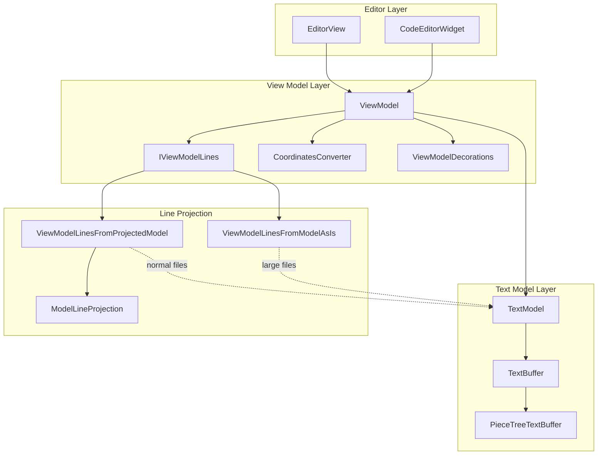
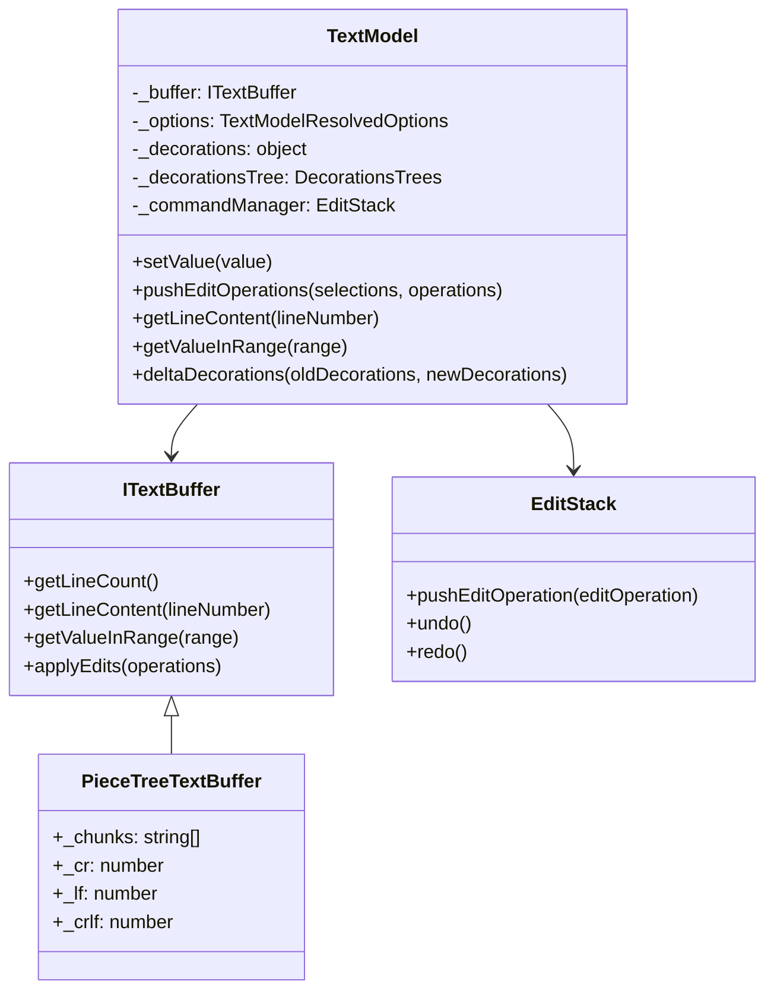
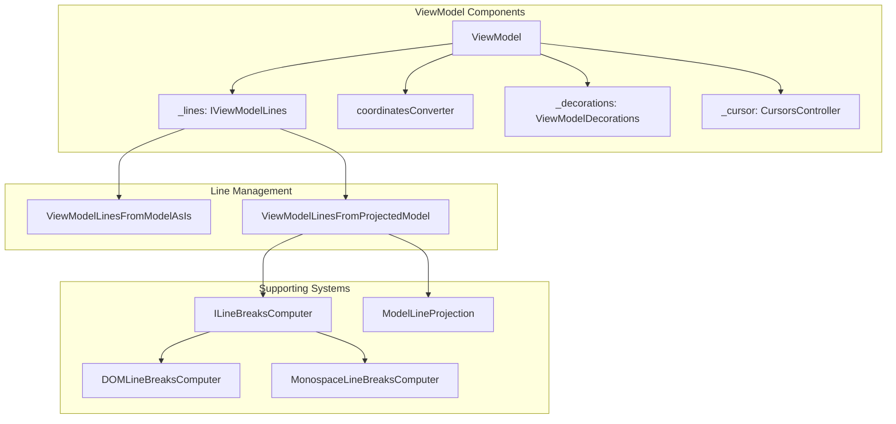
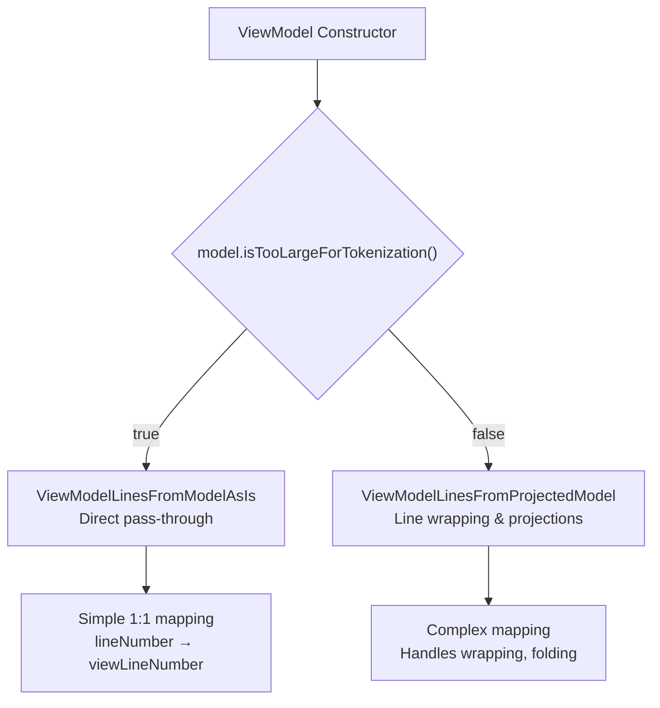
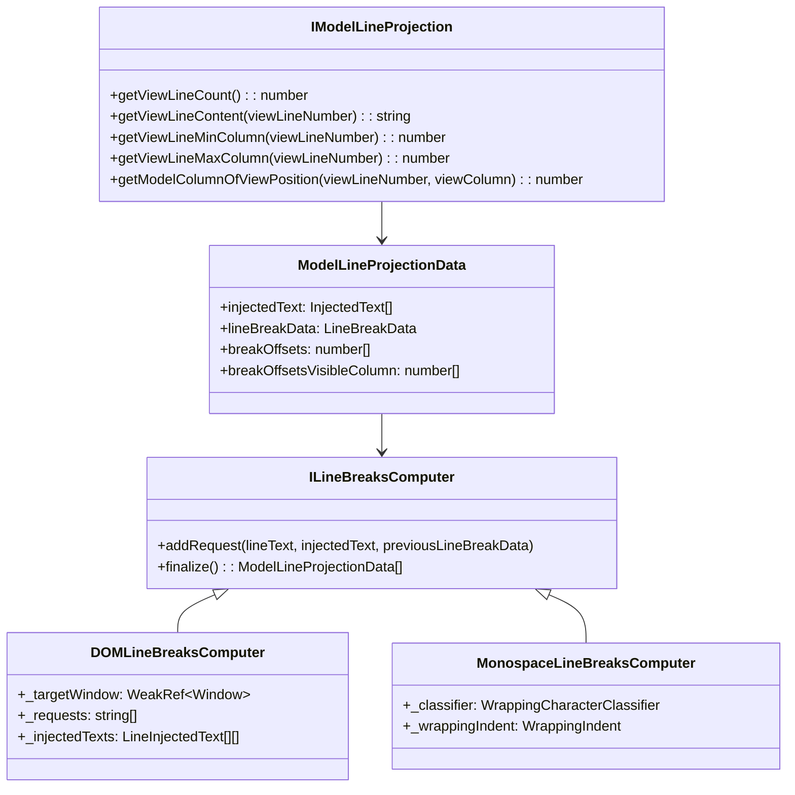
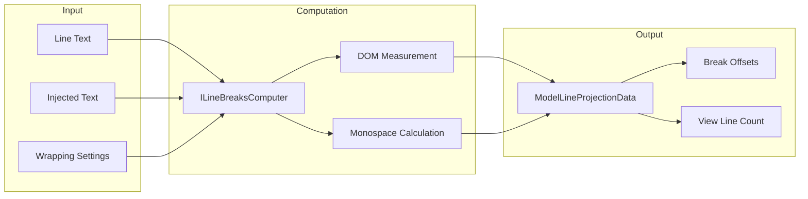
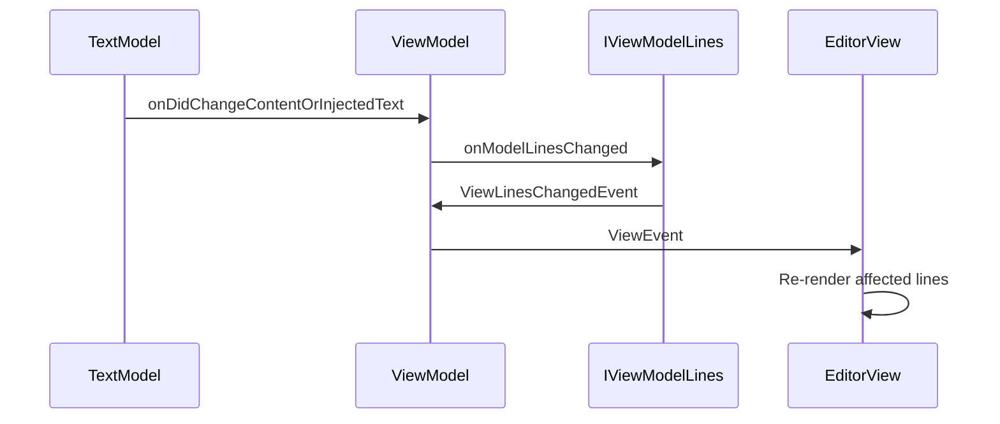
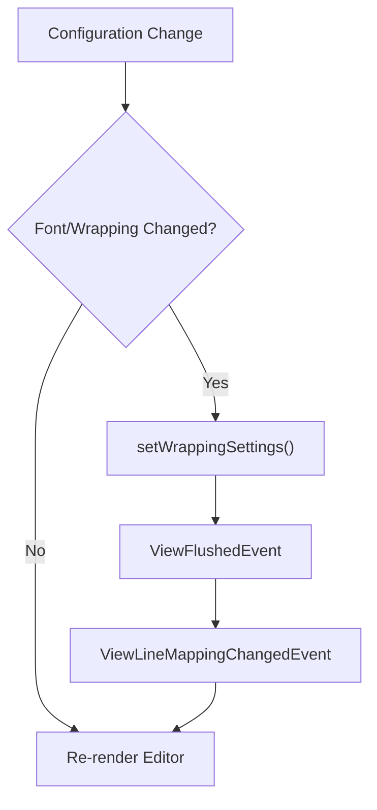

# Text Model and View Model

Relevant source files

The following files were used as context for generating this wiki page:

- [build/monaco/monaco.d.ts.recipe](build/monaco/monaco.d.ts.recipe)
- [extensions/vscode-colorize-perf-tests/test/colorize-fixtures/test-treeView.ts](extensions/vscode-colorize-perf-tests/test/colorize-fixtures/test-treeView.ts)
- [src/vs/editor/browser/config/charWidthReader.ts](src/vs/editor/browser/config/charWidthReader.ts)
- [src/vs/editor/browser/editorBrowser.ts](src/vs/editor/browser/editorBrowser.ts)
- [src/vs/editor/browser/view/domLineBreaksComputer.ts](src/vs/editor/browser/view/domLineBreaksComputer.ts)
- [src/vs/editor/browser/view/renderingContext.ts](src/vs/editor/browser/view/renderingContext.ts)
- [src/vs/editor/browser/viewParts/contentWidgets/contentWidgets.ts](src/vs/editor/browser/viewParts/contentWidgets/contentWidgets.ts)
- [src/vs/editor/browser/viewParts/margin/margin.ts](src/vs/editor/browser/viewParts/margin/margin.ts)
- [src/vs/editor/browser/viewParts/minimap/minimap.ts](src/vs/editor/browser/viewParts/minimap/minimap.ts)
- [src/vs/editor/browser/viewParts/minimap/minimapCharRenderer.ts](src/vs/editor/browser/viewParts/minimap/minimapCharRenderer.ts)
- [src/vs/editor/browser/viewParts/minimap/minimapCharRendererFactory.ts](src/vs/editor/browser/viewParts/minimap/minimapCharRendererFactory.ts)
- [src/vs/editor/browser/viewParts/minimap/minimapCharSheet.ts](src/vs/editor/browser/viewParts/minimap/minimapCharSheet.ts)
- [src/vs/editor/browser/viewParts/minimap/minimapPreBaked.ts](src/vs/editor/browser/viewParts/minimap/minimapPreBaked.ts)
- [src/vs/editor/browser/viewParts/overlayWidgets/overlayWidgets.ts](src/vs/editor/browser/viewParts/overlayWidgets/overlayWidgets.ts)
- [src/vs/editor/browser/viewParts/overviewRuler/decorationsOverviewRuler.ts](src/vs/editor/browser/viewParts/overviewRuler/decorationsOverviewRuler.ts)
- [src/vs/editor/browser/viewParts/scrollDecoration/scrollDecoration.ts](src/vs/editor/browser/viewParts/scrollDecoration/scrollDecoration.ts)
- [src/vs/editor/browser/viewParts/viewCursors/viewCursor.ts](src/vs/editor/browser/viewParts/viewCursors/viewCursor.ts)
- [src/vs/editor/browser/viewParts/viewCursors/viewCursors.ts](src/vs/editor/browser/viewParts/viewCursors/viewCursors.ts)
- [src/vs/editor/browser/viewParts/viewZones/viewZones.ts](src/vs/editor/browser/viewParts/viewZones/viewZones.ts)
- [src/vs/editor/browser/widget/codeEditor/codeEditorWidget.ts](src/vs/editor/browser/widget/codeEditor/codeEditorWidget.ts)
- [src/vs/editor/common/config/editorOptions.ts](src/vs/editor/common/config/editorOptions.ts)
- [src/vs/editor/common/config/fontInfo.ts](src/vs/editor/common/config/fontInfo.ts)
- [src/vs/editor/common/editorCommon.ts](src/vs/editor/common/editorCommon.ts)
- [src/vs/editor/common/model.ts](src/vs/editor/common/model.ts)
- [src/vs/editor/common/model/guidesTextModelPart.ts](src/vs/editor/common/model/guidesTextModelPart.ts)
- [src/vs/editor/common/model/textModel.ts](src/vs/editor/common/model/textModel.ts)
- [src/vs/editor/common/standalone/standaloneEnums.ts](src/vs/editor/common/standalone/standaloneEnums.ts)
- [src/vs/editor/common/textModelGuides.ts](src/vs/editor/common/textModelGuides.ts)
- [src/vs/editor/common/viewLayout/linesLayout.ts](src/vs/editor/common/viewLayout/linesLayout.ts)
- [src/vs/editor/common/viewLayout/viewLayout.ts](src/vs/editor/common/viewLayout/viewLayout.ts)
- [src/vs/editor/common/viewLayout/viewLinesViewportData.ts](src/vs/editor/common/viewLayout/viewLinesViewportData.ts)
- [src/vs/editor/common/viewModel.ts](src/vs/editor/common/viewModel.ts)
- [src/vs/editor/common/viewModel/minimapTokensColorTracker.ts](src/vs/editor/common/viewModel/minimapTokensColorTracker.ts)
- [src/vs/editor/common/viewModel/modelLineProjection.ts](src/vs/editor/common/viewModel/modelLineProjection.ts)
- [src/vs/editor/common/viewModel/monospaceLineBreaksComputer.ts](src/vs/editor/common/viewModel/monospaceLineBreaksComputer.ts)
- [src/vs/editor/common/viewModel/viewModelDecorations.ts](src/vs/editor/common/viewModel/viewModelDecorations.ts)
- [src/vs/editor/common/viewModel/viewModelImpl.ts](src/vs/editor/common/viewModel/viewModelImpl.ts)
- [src/vs/editor/common/viewModel/viewModelLines.ts](src/vs/editor/common/viewModel/viewModelLines.ts)
- [src/vs/editor/standalone/browser/standaloneCodeEditor.ts](src/vs/editor/standalone/browser/standaloneCodeEditor.ts)
- [src/vs/editor/standalone/browser/standaloneEditor.ts](src/vs/editor/standalone/browser/standaloneEditor.ts)
- [src/vs/editor/test/browser/view/minimapCharRenderer.test.ts](src/vs/editor/test/browser/view/minimapCharRenderer.test.ts)
- [src/vs/editor/test/browser/viewModel/modelLineProjection.test.ts](src/vs/editor/test/browser/viewModel/modelLineProjection.test.ts)
- [src/vs/editor/test/common/model/modelInjectedText.test.ts](src/vs/editor/test/common/model/modelInjectedText.test.ts)
- [src/vs/editor/test/common/viewLayout/linesLayout.test.ts](src/vs/editor/test/common/viewLayout/linesLayout.test.ts)
- [src/vs/editor/test/common/viewModel/lineBreakData.test.ts](src/vs/editor/test/common/viewModel/lineBreakData.test.ts)
- [src/vs/editor/test/common/viewModel/monospaceLineBreaksComputer.test.ts](src/vs/editor/test/common/viewModel/monospaceLineBreaksComputer.test.ts)
- [src/vs/monaco.d.ts](src/vs/monaco.d.ts)

## Purpose and Scope

This document covers the core text representation and view abstraction layers in VS Code's Monaco editor. The Text Model manages the actual document content and operations, while the View Model provides a view-specific abstraction that handles concerns like line wrapping, folding, and coordinate transformations. 

For information about the editor configuration system that controls these models, see [Editor Configuration and Features](#3.2). For details about the overall Monaco editor architecture, see [Monaco Editor](#3).

## Architecture Overview

The text editing system follows a layered architecture where the Text Model stores raw document content and the View Model provides view-specific transformations and abstractions.

**Sources:** [src/vs/editor/common/viewModel/viewModelImpl.ts:47-164](), [src/vs/editor/common/model/textModel.ts:180-396](), [src/vs/editor/common/viewModel/viewModelLines.ts:22-25]()

## Text Model

The `TextModel` class serves as the core document representation, managing text content, edit operations, and model-level decorations.

### Core Structure

The `TextModel` delegates actual text storage to an `ITextBuffer` implementation, typically `PieceTreeTextBuffer` which uses a piece table data structure for efficient text editing.

**Sources:** [src/vs/editor/common/model/textModel.ts:180-396](), [src/vs/editor/common/model/pieceTreeTextBuffer/pieceTreeTextBuffer.ts]()

### Text Operations

The TextModel provides methods for text manipulation while maintaining undo/redo state:

| Method | Purpose |
|--------|---------|
| `setValue()` | Replace entire document content |
| `pushEditOperations()` | Apply multiple edit operations atomically |
| `getLineContent()` | Retrieve content of a specific line |
| `getValueInRange()` | Extract text from a range |
| `deltaDecorations()` | Add/remove/modify decorations |

**Sources:** [src/vs/editor/common/model/textModel.ts:453-462](), [src/vs/editor/common/model/textModel.ts:464-512]()

## View Model

The `ViewModel` class wraps a `TextModel` and provides view-specific abstractions, handling concerns like line wrapping, coordinate conversion, and view decorations.

### View Model Architecture

**Sources:** [src/vs/editor/common/viewModel/viewModelImpl.ts:47-164](), [src/vs/editor/common/viewModel/viewModelLines.ts:22-46]()

### Line Management Strategy

The ViewModel selects between two line management strategies based on file characteristics:

**Sources:** [src/vs/editor/common/viewModel/viewModelImpl.ts:90-114]()

### Coordinates Conversion

The `ICoordinatesConverter` interface handles transformations between model coordinates (based on the actual text) and view coordinates (based on what the user sees with wrapping/folding applied).

| Conversion Method | Purpose |
|------------------|---------|
| `convertViewPositionToModelPosition()` | View cursor position → model position |
| `convertModelPositionToViewPosition()` | Model position → view position |
| `convertViewRangeToModelRange()` | View selection → model range |
| `convertModelRangeToViewRange()` | Model range → view selection |

**Sources:** [src/vs/editor/common/viewModel.ts:115-151]()

## Line Projection System

Line projection handles the transformation between model lines and view lines, supporting features like word wrapping and code folding.

### Projection Components

**Sources:** [src/vs/editor/common/viewModel/modelLineProjection.ts:1-20](), [src/vs/editor/browser/view/domLineBreaksComputer.ts:20-29](), [src/vs/editor/common/viewModel/monospaceLineBreaksComputer.ts:15-27]()

### Line Break Computation

The system supports two line break computation strategies:

1. **DOM-based computation** (`DOMLineBreaksComputer`) - Uses actual DOM measurement for accurate wrapping
2. **Monospace computation** (`MonospaceLineBreaksComputer`) - Fast computation for monospace fonts

**Sources:** [src/vs/editor/browser/view/domLineBreaksComputer.ts:29-44](), [src/vs/editor/common/viewModel/monospaceLineBreaksComputer.ts:28-35]()

## View Model Integration

The View Model integrates with the broader editor system through event handling and view updates.

### Event Flow

### Configuration Updates

The ViewModel responds to configuration changes by updating its line management strategy:

**Sources:** [src/vs/editor/common/viewModel/viewModelImpl.ts:261-301](), [src/vs/editor/common/viewModel/viewModelLines.ts:25-35]()

## Performance Considerations

The Text Model and View Model system includes several optimizations for large files:

| Optimization | Condition | Effect |
|-------------|-----------|---------|
| Large file detection | File > 20MB or > 300K lines | Disable tokenization, use simple line mapping |
| Identity lines collection | `isTooLargeForTokenization()` | Use `ViewModelLinesFromModelAsIs` |
| Piece table buffer | All files | Efficient text editing operations |
| Viewport-based rendering | All files | Only compute view data for visible lines |

**Sources:** [src/vs/editor/common/model/textModel.ts:182-186](), [src/vs/editor/common/viewModel/viewModelImpl.ts:90-92]()