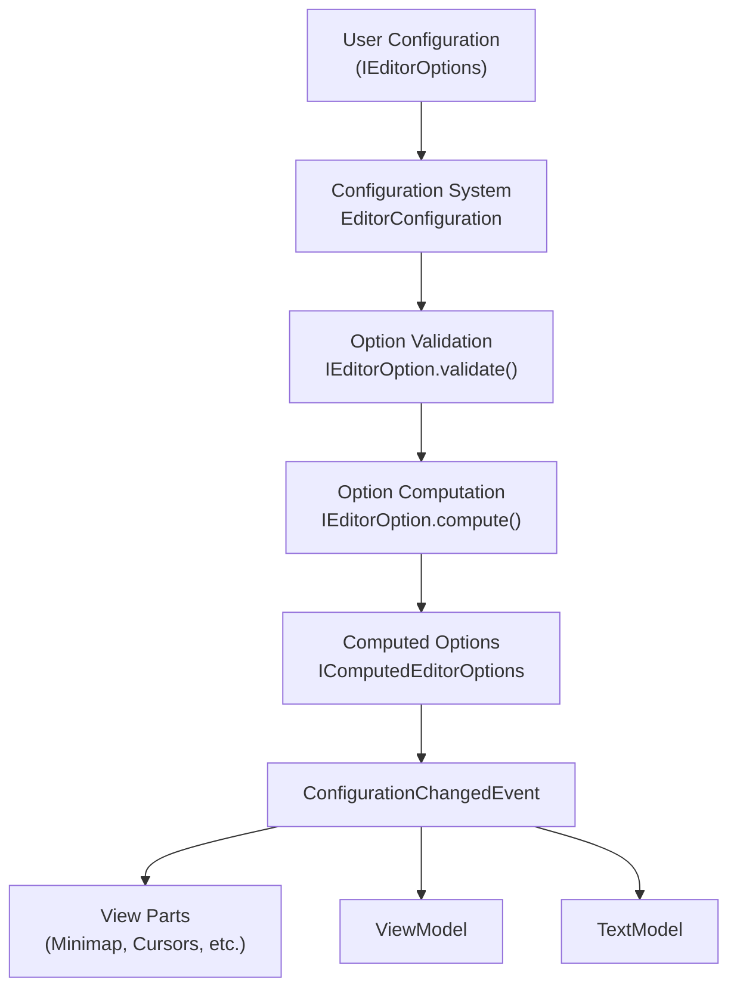
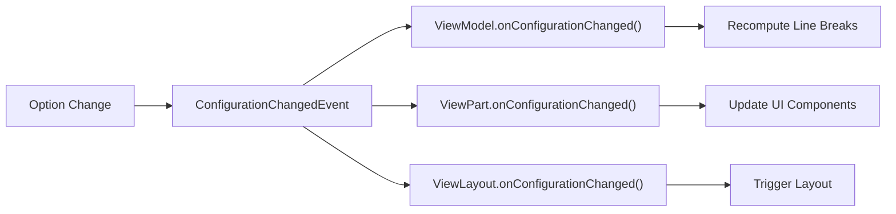
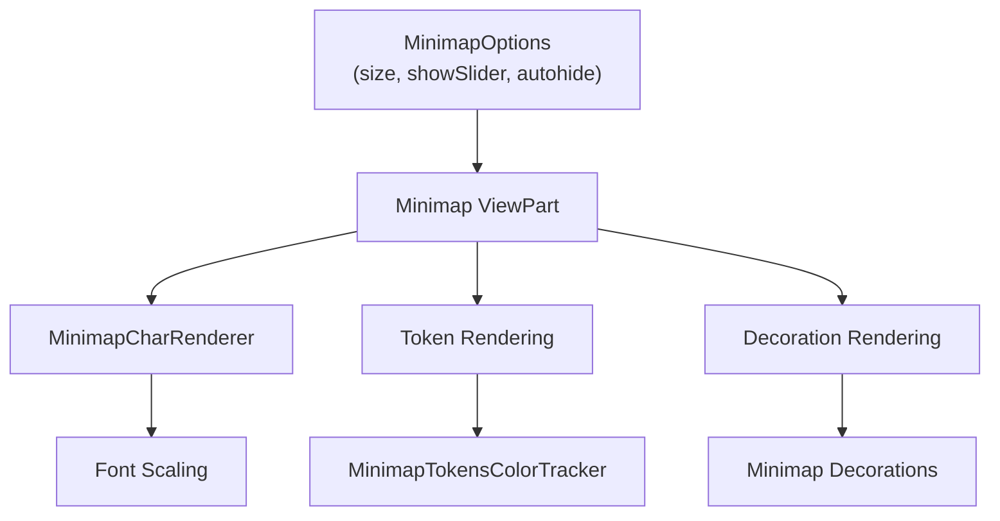
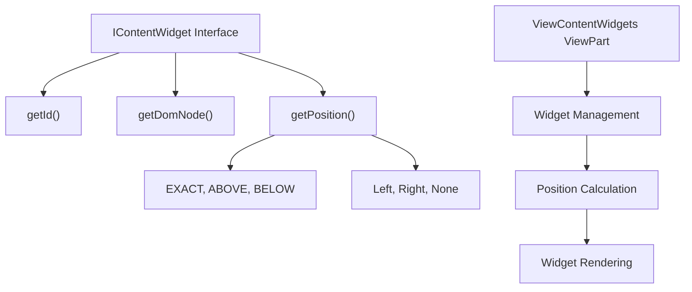
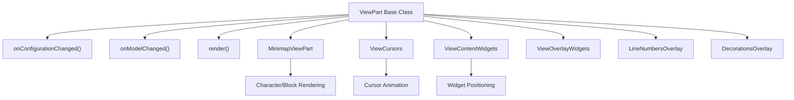

# Editor Configuration and Features

Relevant source files

The following files were used as context for generating this wiki page:

- [build/monaco/monaco.d.ts.recipe](build/monaco/monaco.d.ts.recipe)
- [extensions/vscode-colorize-perf-tests/test/colorize-fixtures/test-treeView.ts](extensions/vscode-colorize-perf-tests/test/colorize-fixtures/test-treeView.ts)
- [src/vs/editor/browser/config/charWidthReader.ts](src/vs/editor/browser/config/charWidthReader.ts)
- [src/vs/editor/browser/editorBrowser.ts](src/vs/editor/browser/editorBrowser.ts)
- [src/vs/editor/browser/view/domLineBreaksComputer.ts](src/vs/editor/browser/view/domLineBreaksComputer.ts)
- [src/vs/editor/browser/view/renderingContext.ts](src/vs/editor/browser/view/renderingContext.ts)
- [src/vs/editor/browser/viewParts/contentWidgets/contentWidgets.ts](src/vs/editor/browser/viewParts/contentWidgets/contentWidgets.ts)
- [src/vs/editor/browser/viewParts/margin/margin.ts](src/vs/editor/browser/viewParts/margin/margin.ts)
- [src/vs/editor/browser/viewParts/minimap/minimap.ts](src/vs/editor/browser/viewParts/minimap/minimap.ts)
- [src/vs/editor/browser/viewParts/minimap/minimapCharRenderer.ts](src/vs/editor/browser/viewParts/minimap/minimapCharRenderer.ts)
- [src/vs/editor/browser/viewParts/minimap/minimapCharRendererFactory.ts](src/vs/editor/browser/viewParts/minimap/minimapCharRendererFactory.ts)
- [src/vs/editor/browser/viewParts/minimap/minimapCharSheet.ts](src/vs/editor/browser/viewParts/minimap/minimapCharSheet.ts)
- [src/vs/editor/browser/viewParts/minimap/minimapPreBaked.ts](src/vs/editor/browser/viewParts/minimap/minimapPreBaked.ts)
- [src/vs/editor/browser/viewParts/overlayWidgets/overlayWidgets.ts](src/vs/editor/browser/viewParts/overlayWidgets/overlayWidgets.ts)
- [src/vs/editor/browser/viewParts/overviewRuler/decorationsOverviewRuler.ts](src/vs/editor/browser/viewParts/overviewRuler/decorationsOverviewRuler.ts)
- [src/vs/editor/browser/viewParts/scrollDecoration/scrollDecoration.ts](src/vs/editor/browser/viewParts/scrollDecoration/scrollDecoration.ts)
- [src/vs/editor/browser/viewParts/viewCursors/viewCursor.ts](src/vs/editor/browser/viewParts/viewCursors/viewCursor.ts)
- [src/vs/editor/browser/viewParts/viewCursors/viewCursors.ts](src/vs/editor/browser/viewParts/viewCursors/viewCursors.ts)
- [src/vs/editor/browser/viewParts/viewZones/viewZones.ts](src/vs/editor/browser/viewParts/viewZones/viewZones.ts)
- [src/vs/editor/browser/widget/codeEditor/codeEditorWidget.ts](src/vs/editor/browser/widget/codeEditor/codeEditorWidget.ts)
- [src/vs/editor/common/config/editorOptions.ts](src/vs/editor/common/config/editorOptions.ts)
- [src/vs/editor/common/config/fontInfo.ts](src/vs/editor/common/config/fontInfo.ts)
- [src/vs/editor/common/editorCommon.ts](src/vs/editor/common/editorCommon.ts)
- [src/vs/editor/common/model.ts](src/vs/editor/common/model.ts)
- [src/vs/editor/common/model/guidesTextModelPart.ts](src/vs/editor/common/model/guidesTextModelPart.ts)
- [src/vs/editor/common/model/textModel.ts](src/vs/editor/common/model/textModel.ts)
- [src/vs/editor/common/standalone/standaloneEnums.ts](src/vs/editor/common/standalone/standaloneEnums.ts)
- [src/vs/editor/common/textModelGuides.ts](src/vs/editor/common/textModelGuides.ts)
- [src/vs/editor/common/viewLayout/linesLayout.ts](src/vs/editor/common/viewLayout/linesLayout.ts)
- [src/vs/editor/common/viewLayout/viewLayout.ts](src/vs/editor/common/viewLayout/viewLayout.ts)
- [src/vs/editor/common/viewLayout/viewLinesViewportData.ts](src/vs/editor/common/viewLayout/viewLinesViewportData.ts)
- [src/vs/editor/common/viewModel.ts](src/vs/editor/common/viewModel.ts)
- [src/vs/editor/common/viewModel/minimapTokensColorTracker.ts](src/vs/editor/common/viewModel/minimapTokensColorTracker.ts)
- [src/vs/editor/common/viewModel/modelLineProjection.ts](src/vs/editor/common/viewModel/modelLineProjection.ts)
- [src/vs/editor/common/viewModel/monospaceLineBreaksComputer.ts](src/vs/editor/common/viewModel/monospaceLineBreaksComputer.ts)
- [src/vs/editor/common/viewModel/viewModelDecorations.ts](src/vs/editor/common/viewModel/viewModelDecorations.ts)
- [src/vs/editor/common/viewModel/viewModelImpl.ts](src/vs/editor/common/viewModel/viewModelImpl.ts)
- [src/vs/editor/common/viewModel/viewModelLines.ts](src/vs/editor/common/viewModel/viewModelLines.ts)
- [src/vs/editor/standalone/browser/standaloneCodeEditor.ts](src/vs/editor/standalone/browser/standaloneCodeEditor.ts)
- [src/vs/editor/standalone/browser/standaloneEditor.ts](src/vs/editor/standalone/browser/standaloneEditor.ts)
- [src/vs/editor/test/browser/view/minimapCharRenderer.test.ts](src/vs/editor/test/browser/view/minimapCharRenderer.test.ts)
- [src/vs/editor/test/browser/viewModel/modelLineProjection.test.ts](src/vs/editor/test/browser/viewModel/modelLineProjection.test.ts)
- [src/vs/editor/test/common/model/modelInjectedText.test.ts](src/vs/editor/test/common/model/modelInjectedText.test.ts)
- [src/vs/editor/test/common/viewLayout/linesLayout.test.ts](src/vs/editor/test/common/viewLayout/linesLayout.test.ts)
- [src/vs/editor/test/common/viewModel/lineBreakData.test.ts](src/vs/editor/test/common/viewModel/lineBreakData.test.ts)
- [src/vs/editor/test/common/viewModel/monospaceLineBreaksComputer.test.ts](src/vs/editor/test/common/viewModel/monospaceLineBreaksComputer.test.ts)
- [src/vs/monaco.d.ts](src/vs/monaco.d.ts)

This document covers how VS Code's Monaco editor is configured and the various features it provides. It explains the configuration system, available editor features, and how these features are implemented within the editor architecture.

For information about the underlying text model and view model architecture, see [Text Model and View Model](#3.1). For extension system and language features provided through extensions, see [Extension Host and Language Features](#4.1).

## Configuration System Overview

The editor configuration system is built around a comprehensive options framework that validates, computes, and manages all editor behavior settings.

### EditorOptions Architecture

The configuration system centers on the `IEditorOptions` interface and `EditorOption` enum defined in [src/vs/editor/common/config/editorOptions.ts:51-797](). The system supports over 150 different configuration options covering everything from basic text editing to advanced UI features.

Sources: [src/vs/editor/common/config/editorOptions.ts:51-797](), [src/vs/editor/common/config/editorOptions.ts:960-971]()

### Core Configuration Options

The `EditorOption` enum defines all configurable aspects of the editor:

| Category | Key Options | Purpose |
|----------|-------------|---------|
| **Text Rendering** | `fontFamily`, `fontSize`, `lineHeight`, `letterSpacing` | Font and text display |
| **Cursor Behavior** | `cursorStyle`, `cursorBlinking`, `cursorSmoothCaretAnimation` | Cursor appearance and animation |
| **Language Features** | `suggest`, `quickSuggestions`, `parameterHints`, `codeLens` | IntelliSense and language support |
| **Visual Elements** | `minimap`, `rulers`, `lineNumbers`, `glyphMargin` | UI components visibility |
| **Editing Behavior** | `autoIndent`, `autoClosingBrackets`, `wordWrap`, `tabSize` | Text editing features |

Sources: [src/vs/editor/common/config/editorOptions.ts:176-337](), [src/vs/editor/common/standalone/standaloneEnums.ts:176-337]()

### Configuration Change Handling

When options change, the system generates a `ConfigurationChangedEvent` that components can subscribe to:

Sources: [src/vs/editor/common/viewModel/viewModelImpl.ts:261-301](), [src/vs/editor/common/config/editorOptions.ts:960-971]()

## Core Text Editing Features

### Text Model Configuration

The text model supports several fundamental editing features configured through options:

- **Auto Indentation**: Controlled by `autoIndent` option with strategies `none`, `keep`, `brackets`, `advanced`, `full` [src/vs/editor/common/config/editorOptions.ts:509]()
- **Auto Closing**: Brackets, quotes, and comments with strategies `always`, `languageDefined`, `beforeWhitespace`, `never` [src/vs/editor/common/config/editorOptions.ts:25-35]()
- **Word Wrapping**: Various wrapping modes including `off`, `on`, `wordWrapColumn`, `bounded` [src/vs/editor/common/config/editorOptions.ts:320]()

### Selection and Multi-Cursor Features

The editor supports advanced selection capabilities:

- **Multi-cursor**: Controlled by `multiCursorModifier`, `multiCursorMergeOverlapping`, `multiCursorLimit` [src/vs/editor/common/config/editorOptions.ts:422-436]()
- **Column Selection**: Enabled via `columnSelection` option [src/vs/editor/common/config/editorOptions.ts:417]()
- **Selection Clipboard**: Linux-style selection clipboard via `selectionClipboard` [src/vs/editor/common/config/editorOptions.ts:98]()

Sources: [src/vs/editor/common/config/editorOptions.ts:509](), [src/vs/editor/common/config/editorOptions.ts:422-436]()

## Visual Features and UI Components

### Minimap Implementation

The minimap is a comprehensive feature with its own rendering system:

The minimap supports three rendering modes defined in `RenderMinimap` enum:
- `None`: Disabled
- `Text`: Character-based rendering
- `Blocks`: Block-based rendering

Sources: [src/vs/editor/browser/viewParts/minimap/minimap.ts:48-153](), [src/vs/editor/common/config/editorOptions.ts:77]()

### Cursor System

The cursor system handles multiple cursor rendering and animations:

- **Cursor Styles**: `line`, `block`, `underline`, `line-thin`, `block-outline`, `underline-thin` [src/vs/editor/common/config/editorOptions.ts:248]()
- **Blinking Modes**: `blink`, `smooth`, `phase`, `expand`, `solid` [src/vs/editor/common/config/editorOptions.ts:228]()
- **Multi-cursor Support**: Primary and secondary cursor rendering [src/vs/editor/browser/viewParts/viewCursors/viewCursors.ts:11-15]()

### Line Number and Gutter Features

The editor provides various gutter configurations:

- **Line Numbers**: Types include `off`, `on`, `relative`, `interval`, `custom` [src/vs/editor/common/config/editorOptions.ts:106]()
- **Glyph Margin**: Support for decorations in left margin [src/vs/editor/common/config/editorOptions.ts:142]()
- **Rulers**: Vertical guide lines at specified columns [src/vs/editor/common/config/editorOptions.ts:81]()

Sources: [src/vs/editor/common/config/editorOptions.ts:106-149](), [src/vs/editor/browser/viewParts/viewCursors/viewCursors.ts:11-15]()

## Widget and Content Architecture

### Content Widget System

Content widgets are positioned relative to text and used for suggestions, parameter hints, and other contextual UI:

### Overlay Widget System

Overlay widgets are positioned absolutely and used for find widgets, floating elements:

- **Position Preferences**: `TOP_RIGHT_CORNER`, `BOTTOM_RIGHT_CORNER`, `TOP_CENTER` [src/vs/editor/browser/editorBrowser.ts:228-243]()
- **Overflow Handling**: Support for widgets that can overflow editor bounds [src/vs/editor/browser/editorBrowser.ts:285]()

### View Zones

View zones create spaces between lines for additional content:

- **Positioning**: After specific line numbers with column affinity [src/vs/editor/browser/editorBrowser.ts:33-97]()
- **Height Options**: Support for both pixel-based and line-based heights [src/vs/editor/browser/editorBrowser.ts:69-75]()
- **Margin Content**: Optional margin DOM nodes [src/vs/editor/browser/editorBrowser.ts:88]()

Sources: [src/vs/editor/browser/editorBrowser.ts:174-208](), [src/vs/editor/browser/editorBrowser.ts:33-97](), [src/vs/editor/browser/viewParts/contentWidgets/contentWidgets.ts:25-48]()

## Feature Implementation Architecture

### ViewPart System

Most visual features are implemented as `ViewPart` subclasses that respond to configuration and model changes:

### Feature Lifecycle

Editor features follow a consistent lifecycle pattern:

1. **Initialization**: Created with initial configuration
2. **Configuration Updates**: Respond to `ConfigurationChangedEvent`
3. **Model Changes**: React to text model modifications
4. **Rendering**: Update visual representation
5. **Disposal**: Clean up resources

Sources: [src/vs/editor/browser/view/viewPart.ts](), [src/vs/editor/browser/viewParts/minimap/minimap.ts:111-153](), [src/vs/editor/browser/viewParts/viewCursors/viewCursors.ts:89-156]()

### Standalone vs Workbench Features

The editor supports both standalone usage and integration within VS Code workbench:

- **Standalone Features**: Core editing, syntax highlighting, basic IntelliSense [src/vs/editor/standalone/browser/standaloneEditor.ts:48-51]()
- **Workbench Integration**: Advanced language features, debugging, source control [src/vs/editor/browser/widget/codeEditor/codeEditorWidget.ts]()

The `EditorOptions` system provides the foundation for all these features through its comprehensive configuration framework, allowing fine-grained control over editor behavior while maintaining consistency across different usage contexts.

Sources: [src/vs/editor/standalone/browser/standaloneEditor.ts:48-51](), [src/vs/editor/common/config/editorOptions.ts:1-50]()