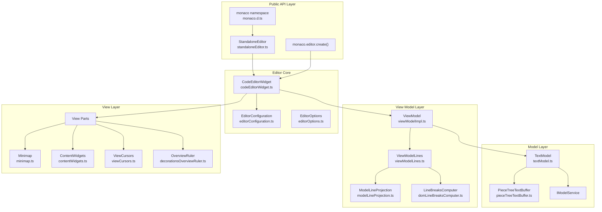
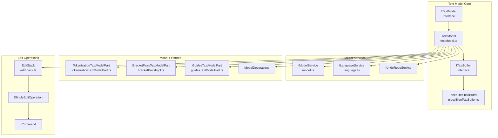
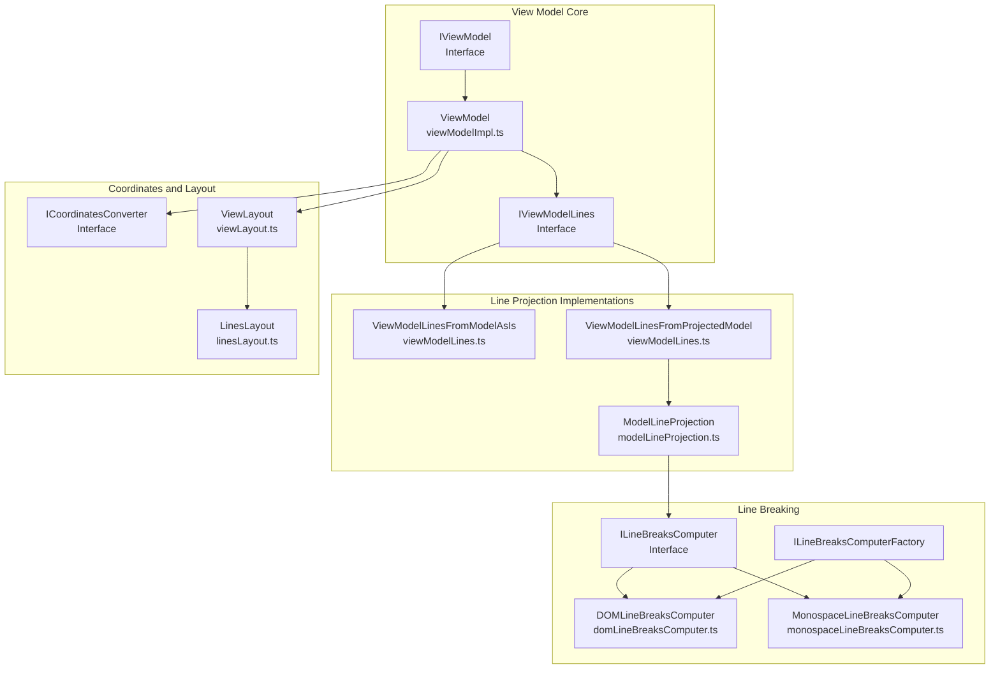
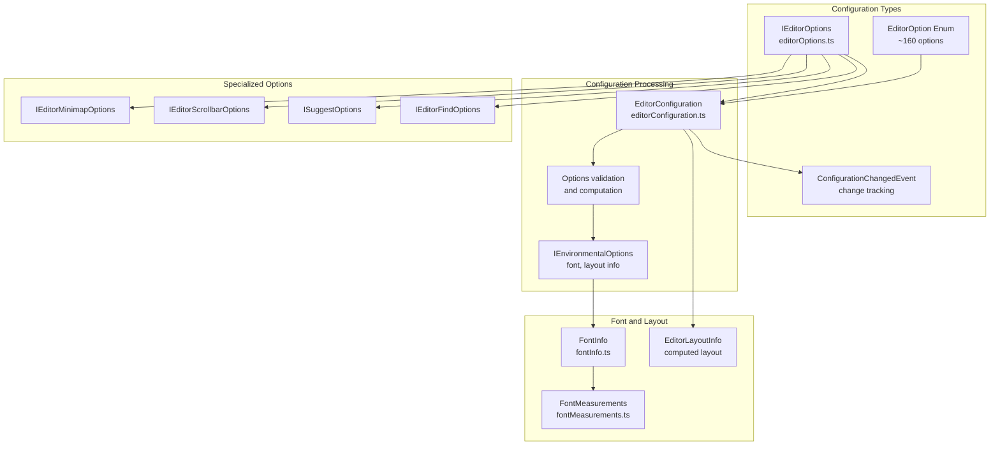
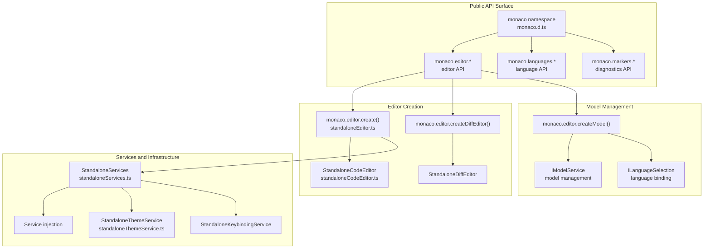

# Monaco Editor

<details>
<summary>Relevant source files</summary>

The following files were used as context for generating this wiki page:

- [build/monaco/monaco.d.ts.recipe](build/monaco/monaco.d.ts.recipe)
- [extensions/vscode-colorize-perf-tests/test/colorize-fixtures/test-treeView.ts](extensions/vscode-colorize-perf-tests/test/colorize-fixtures/test-treeView.ts)
- [src/vs/editor/browser/config/charWidthReader.ts](src/vs/editor/browser/config/charWidthReader.ts)
- [src/vs/editor/browser/editorBrowser.ts](src/vs/editor/browser/editorBrowser.ts)
- [src/vs/editor/browser/view/domLineBreaksComputer.ts](src/vs/editor/browser/view/domLineBreaksComputer.ts)
- [src/vs/editor/browser/view/renderingContext.ts](src/vs/editor/browser/view/renderingContext.ts)
- [src/vs/editor/browser/viewParts/contentWidgets/contentWidgets.ts](src/vs/editor/browser/viewParts/contentWidgets/contentWidgets.ts)
- [src/vs/editor/browser/viewParts/margin/margin.ts](src/vs/editor/browser/viewParts/margin/margin.ts)
- [src/vs/editor/browser/viewParts/minimap/minimap.ts](src/vs/editor/browser/viewParts/minimap/minimap.ts)
- [src/vs/editor/browser/viewParts/minimap/minimapCharRenderer.ts](src/vs/editor/browser/viewParts/minimap/minimapCharRenderer.ts)
- [src/vs/editor/browser/viewParts/minimap/minimapCharRendererFactory.ts](src/vs/editor/browser/viewParts/minimap/minimapCharRendererFactory.ts)
- [src/vs/editor/browser/viewParts/minimap/minimapCharSheet.ts](src/vs/editor/browser/viewParts/minimap/minimapCharSheet.ts)
- [src/vs/editor/browser/viewParts/minimap/minimapPreBaked.ts](src/vs/editor/browser/viewParts/minimap/minimapPreBaked.ts)
- [src/vs/editor/browser/viewParts/overlayWidgets/overlayWidgets.ts](src/vs/editor/browser/viewParts/overlayWidgets/overlayWidgets.ts)
- [src/vs/editor/browser/viewParts/overviewRuler/decorationsOverviewRuler.ts](src/vs/editor/browser/viewParts/overviewRuler/decorationsOverviewRuler.ts)
- [src/vs/editor/browser/viewParts/scrollDecoration/scrollDecoration.ts](src/vs/editor/browser/viewParts/scrollDecoration/scrollDecoration.ts)
- [src/vs/editor/browser/viewParts/viewCursors/viewCursor.ts](src/vs/editor/browser/viewParts/viewCursors/viewCursor.ts)
- [src/vs/editor/browser/viewParts/viewCursors/viewCursors.ts](src/vs/editor/browser/viewParts/viewCursors/viewCursors.ts)
- [src/vs/editor/browser/viewParts/viewZones/viewZones.ts](src/vs/editor/browser/viewParts/viewZones/viewZones.ts)
- [src/vs/editor/browser/widget/codeEditor/codeEditorWidget.ts](src/vs/editor/browser/widget/codeEditor/codeEditorWidget.ts)
- [src/vs/editor/common/config/editorOptions.ts](src/vs/editor/common/config/editorOptions.ts)
- [src/vs/editor/common/config/fontInfo.ts](src/vs/editor/common/config/fontInfo.ts)
- [src/vs/editor/common/editorCommon.ts](src/vs/editor/common/editorCommon.ts)
- [src/vs/editor/common/model.ts](src/vs/editor/common/model.ts)
- [src/vs/editor/common/model/guidesTextModelPart.ts](src/vs/editor/common/model/guidesTextModelPart.ts)
- [src/vs/editor/common/model/textModel.ts](src/vs/editor/common/model/textModel.ts)
- [src/vs/editor/common/standalone/standaloneEnums.ts](src/vs/editor/common/standalone/standaloneEnums.ts)
- [src/vs/editor/common/textModelGuides.ts](src/vs/editor/common/textModelGuides.ts)
- [src/vs/editor/common/viewLayout/linesLayout.ts](src/vs/editor/common/viewLayout/linesLayout.ts)
- [src/vs/editor/common/viewLayout/viewLayout.ts](src/vs/editor/common/viewLayout/viewLayout.ts)
- [src/vs/editor/common/viewLayout/viewLinesViewportData.ts](src/vs/editor/common/viewLayout/viewLinesViewportData.ts)
- [src/vs/editor/common/viewModel.ts](src/vs/editor/common/viewModel.ts)
- [src/vs/editor/common/viewModel/minimapTokensColorTracker.ts](src/vs/editor/common/viewModel/minimapTokensColorTracker.ts)
- [src/vs/editor/common/viewModel/modelLineProjection.ts](src/vs/editor/common/viewModel/modelLineProjection.ts)
- [src/vs/editor/common/viewModel/monospaceLineBreaksComputer.ts](src/vs/editor/common/viewModel/monospaceLineBreaksComputer.ts)
- [src/vs/editor/common/viewModel/viewModelDecorations.ts](src/vs/editor/common/viewModel/viewModelDecorations.ts)
- [src/vs/editor/common/viewModel/viewModelImpl.ts](src/vs/editor/common/viewModel/viewModelImpl.ts)
- [src/vs/editor/common/viewModel/viewModelLines.ts](src/vs/editor/common/viewModel/viewModelLines.ts)
- [src/vs/editor/standalone/browser/standaloneCodeEditor.ts](src/vs/editor/standalone/browser/standaloneCodeEditor.ts)
- [src/vs/editor/standalone/browser/standaloneEditor.ts](src/vs/editor/standalone/browser/standaloneEditor.ts)
- [src/vs/editor/test/browser/view/minimapCharRenderer.test.ts](src/vs/editor/test/browser/view/minimapCharRenderer.test.ts)
- [src/vs/editor/test/browser/viewModel/modelLineProjection.test.ts](src/vs/editor/test/browser/viewModel/modelLineProjection.test.ts)
- [src/vs/editor/test/common/model/modelInjectedText.test.ts](src/vs/editor/test/common/model/modelInjectedText.test.ts)
- [src/vs/editor/test/common/viewLayout/linesLayout.test.ts](src/vs/editor/test/common/viewLayout/linesLayout.test.ts)
- [src/vs/editor/test/common/viewModel/lineBreakData.test.ts](src/vs/editor/test/common/viewModel/lineBreakData.test.ts)
- [src/vs/editor/test/common/viewModel/monospaceLineBreaksComputer.test.ts](src/vs/editor/test/common/viewModel/monospaceLineBreaksComputer.test.ts)
- [src/vs/monaco.d.ts](src/vs/monaco.d.ts)

</details>


This document covers the Monaco Editor system, which serves as the core text editor engine that powers VS Code's editing experience. Monaco Editor provides a rich, feature-complete code editor that can be embedded in web applications or used as a standalone component.

For information about the overall VS Code architecture, see [VS Code Architecture Overview](#1). For details about the extension system that builds upon Monaco Editor, see [Extension System](#4).

## Overview and Architecture

Monaco Editor implements a Model-View-ViewModel (MVVM) architecture that separates document representation, visual presentation, and user interaction concerns. The system is designed to handle large files efficiently while providing rich editing features like syntax highlighting, IntelliSense, and advanced text manipulation.



Sources: [src/vs/monaco.d.ts:1-50](), [src/vs/editor/standalone/browser/standaloneEditor.ts:1-100](), [src/vs/editor/browser/widget/codeEditor/codeEditorWidget.ts:1-100](), [src/vs/editor/common/viewModel/viewModelImpl.ts:1-100]()

## Text Model System

The text model system represents the underlying document content and provides efficient text manipulation capabilities. The `TextModel` class serves as the primary interface for document operations, while the `PieceTreeTextBuffer` handles the actual text storage using a piece table data structure for efficient insertions and deletions.



The `TextModel` class [src/vs/editor/common/model/textModel.ts:180-700]() provides comprehensive document management including:

- **Content Management**: Text insertion, deletion, and replacement operations
- **Decoration System**: Visual annotations and markers attached to text ranges  
- **Event System**: Change notifications for content, decorations, and language modifications
- **Undo/Redo**: Integration with VS Code's undo/redo infrastructure
- **Language Features**: Tokenization, bracket matching, and indent guides

Key text model interfaces and classes:

| Component | Purpose | Key Methods |
|-----------|---------|-------------|
| `ITextModel` | Core document interface | `getValue()`, `setValue()`, `applyEdits()` |
| `TextModel` | Main implementation | `onDidChangeContent`, `deltaDecorations()` |
| `PieceTreeTextBuffer` | Efficient text storage | `insert()`, `delete()`, `getValueInRange()` |
| `EditStack` | Undo/redo management | `pushEditOperation()`, `undo()`, `redo()` |

Sources: [src/vs/editor/common/model/textModel.ts:180-500](), [src/vs/editor/common/model.ts:400-800](), [src/vs/editor/common/model/editStack.ts:1-50]()

## View Model and Line Projection

The view model system transforms the logical text model into a visual representation that handles line wrapping, hidden areas, and injected text. The `ViewModel` class coordinates between the text model and the rendering system, while specialized line projection components handle the complex logic of converting model lines to view lines.



The view model handles several critical transformations:

**Line Wrapping**: The `ILineBreaksComputer` implementations [src/vs/editor/browser/view/domLineBreaksComputer.ts:20-50]() and [src/vs/editor/common/viewModel/monospaceLineBreaksComputer.ts:15-30]() calculate where lines should wrap based on:
- Available width and font metrics
- Word breaking rules and character classification
- Wrapping indentation preferences
- Injected text and decorations

**Coordinate Conversion**: The `ICoordinatesConverter` interface provides bidirectional mapping between:
- Model positions (line/column in source text)
- View positions (line/column in wrapped/visual representation)  
- Screen coordinates (pixel positions)

**Performance Optimization**: For large files, the system uses `ViewModelLinesFromModelAsIs` [src/vs/editor/common/viewModel/viewModelLines.ts:800-900]() which bypasses line wrapping for better performance.

Sources: [src/vs/editor/common/viewModel/viewModelImpl.ts:47-200](), [src/vs/editor/common/viewModel/viewModelLines.ts:22-100](), [src/vs/editor/browser/view/domLineBreaksComputer.ts:1-50](), [src/vs/editor/common/viewModel/monospaceLineBreaksComputer.ts:1-30]()

## Editor Configuration System

Monaco Editor provides an extensive configuration system that controls every aspect of editor behavior and appearance. The configuration system uses a type-safe, enumerated approach where each option has a unique identifier and validation logic.



The configuration system operates on several key principles:

**Type Safety**: Each option is defined with specific types and validation. The `EditorOption` enum [src/vs/editor/common/config/editorOptions.ts:176-337]() contains approximately 160 different configuration options, from basic settings like `fontSize` to complex objects like `minimap` configuration.

**Reactive Updates**: When configuration changes, the `ConfigurationChangedEvent` [src/vs/editor/common/config/editorOptions.ts:960-971]() tracks exactly which options changed, allowing components to update efficiently.

**Environment Dependency**: Some options depend on environmental factors like screen density, available space, and font measurements. The `IEnvironmentalOptions` interface [src/vs/editor/common/config/editorOptions.ts:985-1001]() captures these dependencies.

Key configuration categories:

| Category | Key Options | Purpose |
|----------|-------------|---------|
| **Font & Rendering** | `fontFamily`, `fontSize`, `lineHeight` | Text appearance and metrics |
| **Layout** | `minimap`, `scrollbar`, `rulers` | Editor layout and auxiliary UI |
| **Behavior** | `wordWrap`, `tabSize`, `autoIndent` | Editing behavior and formatting |
| **Features** | `suggest`, `hover`, `lightbulb` | IntelliSense and coding assistance |
| **Accessibility** | `accessibilitySupport`, `screenReaderAnnounceInlineSuggestion` | Screen reader support |

Sources: [src/vs/editor/common/config/editorOptions.ts:51-797](), [src/vs/editor/browser/config/editorConfiguration.ts:1-100](), [src/vs/editor/common/config/fontInfo.ts:1-50]()

## Rendering System and View Parts

The Monaco Editor rendering system is composed of modular view parts that each handle specific visual aspects of the editor. This design allows for efficient updates and customization of different editor regions.

```mermaid
graph TB
    subgraph "Core Rendering"
        ViewPart["ViewPart<br/>Base class"]
        RenderingContext["RenderingContext<br/>renderingContext.ts"]
        ViewContext["ViewContext<br/>shared state"]
    end
    
    subgraph "Content Rendering"
        ViewLines["ViewLines<br/>main text content"]
        ViewCursors["ViewCursors<br/>viewCursors.ts"]
        ViewZones["ViewZones<br/>viewZones.ts"]
        ContentWidgets["ContentWidgets<br/>contentWidgets.ts"]
    end
    
    subgraph "Margin and Gutter"
        LineNumbers["LineNumbers"]
        GlyphMargin["GlyphMargin"]
        LinesDecorations["LinesDecorations"]
        Margin["Margin"]
    end
    
    subgraph "Auxiliary Views"
        Minimap["Minimap<br/>minimap.ts"]
        OverviewRuler["OverviewRuler<br/>decorationsOverviewRuler.ts"]
        OverlayWidgets["OverlayWidgets<br/>overlayWidgets.ts"]
        Scrollbars["Scrollbars"]
    end
    
    ViewPart --> RenderingContext
    ViewPart --> ViewContext
    
    ViewPart --> ViewLines
    ViewPart --> ViewCursors
    ViewPart --> ViewZones
    ViewPart --> ContentWidgets
    
    ViewPart --> LineNumbers
    ViewPart --> GlyphMargin
    ViewPart --> LinesDecorations
    ViewPart --> Margin
    
    ViewPart --> Minimap
    ViewPart --> OverviewRuler
    ViewPart --> OverlayWidgets
    ViewPart --> Scrollbars
```



**View Parts Architecture**: Each view part extends the base `ViewPart` class and implements specific event handlers for configuration changes, model updates, and scroll events. The rendering system uses a two-phase approach:

1. **Event Processing**: View parts receive events and update their internal state
2. **Rendering**: The `RenderingContext` provides the current viewport and metrics for efficient rendering

**Content Widgets**: The `ContentWidgets` system [src/vs/editor/browser/viewParts/contentWidgets/contentWidgets.ts:25-200]() manages floating UI elements that are positioned relative to text content, such as:
- IntelliSense suggestion boxes
- Parameter hints
- Hover tooltips
- Error lightbulbs

**Minimap Implementation**: The `Minimap` [src/vs/editor/browser/viewParts/minimap/minimap.ts:100-500]() provides a bird's-eye view of the entire document with several rendering modes:
- **Text mode**: Renders actual character shapes at small scale
- **Blocks mode**: Uses colored blocks to represent content
- **Proportional/Fill/Fit sizing**: Different strategies for minimap dimensions

**Cursor Rendering**: The `ViewCursors` system [src/vs/editor/browser/viewParts/viewCursors/viewCursors.ts:1-100]() handles multiple cursors with various visual styles and animations including blink patterns, smooth movement, and different cursor shapes.

Sources: [src/vs/editor/browser/view/viewPart.ts:1-50](), [src/vs/editor/browser/viewParts/contentWidgets/contentWidgets.ts:1-100](), [src/vs/editor/browser/viewParts/minimap/minimap.ts:1-200](), [src/vs/editor/browser/viewParts/viewCursors/viewCursors.ts:1-50]()

## Standalone API and Integration

Monaco Editor provides a comprehensive standalone API that allows embedding the editor in web applications independent of VS Code. The API is exposed through the global `monaco` namespace and provides both high-level convenience methods and low-level customization options.



**Editor Creation and Lifecycle**: The main entry points are `monaco.editor.create()` and `monaco.editor.createDiffEditor()` [src/vs/editor/standalone/browser/standaloneEditor.ts:48-100](). These functions:

1. Initialize the standalone service container
2. Create editor instances with specified configuration
3. Set up event listeners and lifecycle management
4. Return strongly-typed editor interfaces

**Service Architecture**: The standalone environment uses a dependency injection system through `StandaloneServices` [src/vs/editor/standalone/browser/standaloneServices.ts:1-100](). Key services include:

| Service | Purpose | Implementation |
|---------|---------|----------------|
| `IModelService` | Model creation and management | Tracks all text models |
| `ILanguageService` | Language registration and features | Syntax highlighting, IntelliSense |
| `IThemeService` | Color themes and styling | `StandaloneThemeService` |
| `IKeybindingService` | Keyboard shortcuts | `StandaloneKeybindingService` |
| `IMarkerService` | Error/warning markers | Diagnostic management |

**API Capabilities**: The standalone API provides extensive customization options:

- **Custom Languages**: Register new programming languages with syntax highlighting
- **Custom Themes**: Define color themes with `monaco.editor.defineTheme()`
- **Actions and Commands**: Add custom editor actions and keybindings
- **Web Workers**: Offload language processing to background threads
- **Markers and Decorations**: Add custom visual annotations

**Integration Examples**:
```typescript
// Basic editor creation
const editor = monaco.editor.create(document.getElementById('container'), {
    value: 'console.log("Hello Monaco");',
    language: 'javascript',
    theme: 'vs-dark'
});

// Model management
const model = monaco.editor.createModel(content, 'typescript', monaco.Uri.parse('file:///example.ts'));
editor.setModel(model);
```

Sources: [src/vs/monaco.d.ts:1-100](), [src/vs/editor/standalone/browser/standaloneEditor.ts:1-200](), [src/vs/editor/standalone/browser/standaloneCodeEditor.ts:1-100](), [src/vs/editor/standalone/browser/standaloneServices.ts:1-50]()