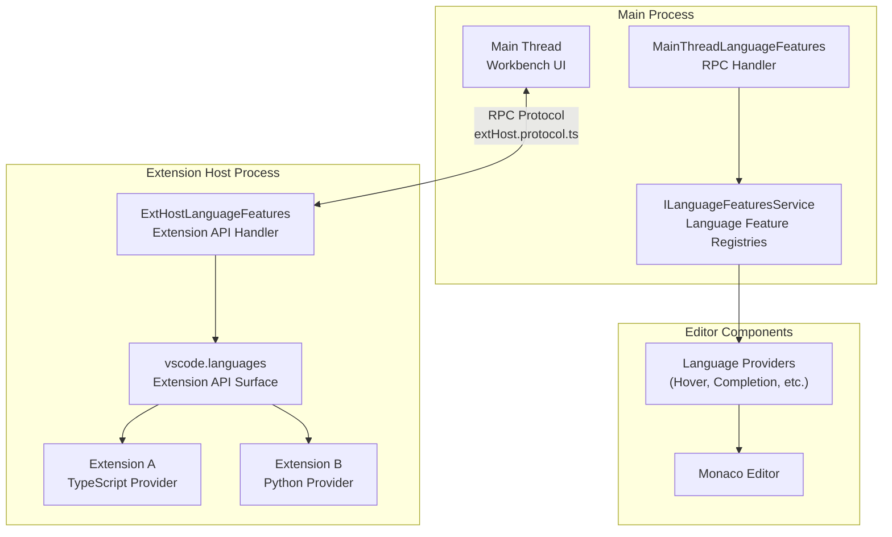
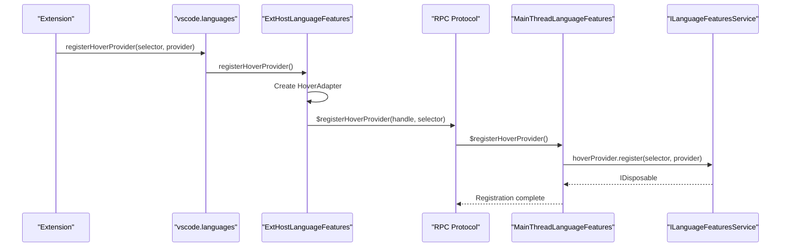
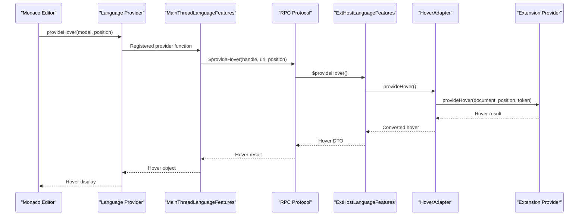
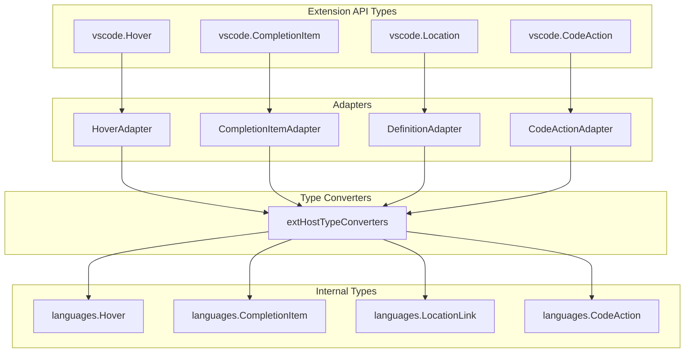
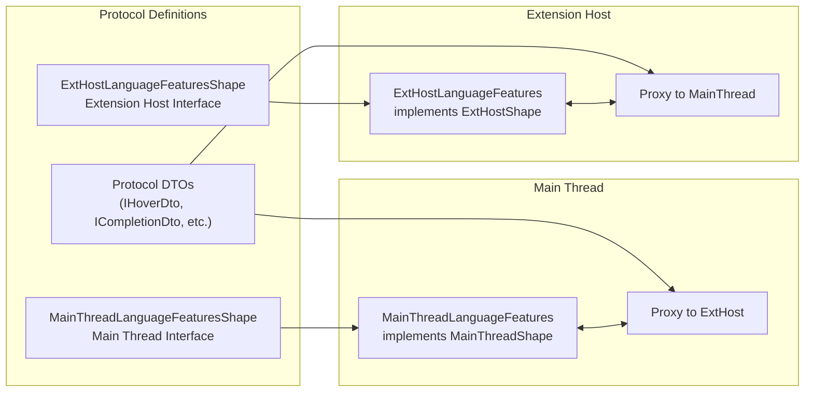
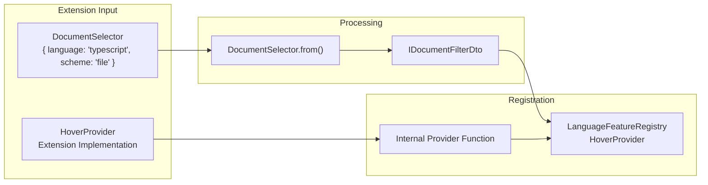

# Extension Host and Language Features

<details>
<summary>Relevant source files</summary>

The following files were used as context for generating this wiki page:

- [extensions/vscode-api-tests/package.json](extensions/vscode-api-tests/package.json)
- [src/vs/editor/common/languages.ts](src/vs/editor/common/languages.ts)
- [src/vs/editor/common/services/languageFeatures.ts](src/vs/editor/common/services/languageFeatures.ts)
- [src/vs/editor/common/services/languageFeaturesService.ts](src/vs/editor/common/services/languageFeaturesService.ts)
- [src/vs/editor/contrib/gotoSymbol/browser/goToCommands.ts](src/vs/editor/contrib/gotoSymbol/browser/goToCommands.ts)
- [src/vs/editor/contrib/gotoSymbol/browser/goToSymbol.ts](src/vs/editor/contrib/gotoSymbol/browser/goToSymbol.ts)
- [src/vs/editor/contrib/gotoSymbol/browser/link/clickLinkGesture.ts](src/vs/editor/contrib/gotoSymbol/browser/link/clickLinkGesture.ts)
- [src/vs/editor/contrib/gotoSymbol/browser/link/goToDefinitionAtPosition.css](src/vs/editor/contrib/gotoSymbol/browser/link/goToDefinitionAtPosition.css)
- [src/vs/editor/contrib/gotoSymbol/browser/link/goToDefinitionAtPosition.ts](src/vs/editor/contrib/gotoSymbol/browser/link/goToDefinitionAtPosition.ts)
- [src/vs/editor/contrib/inPlaceReplace/browser/inPlaceReplace.css](src/vs/editor/contrib/inPlaceReplace/browser/inPlaceReplace.css)
- [src/vs/editor/contrib/inPlaceReplace/browser/inPlaceReplace.ts](src/vs/editor/contrib/inPlaceReplace/browser/inPlaceReplace.ts)
- [src/vs/editor/contrib/inlayHints/browser/inlayHintsLocations.ts](src/vs/editor/contrib/inlayHints/browser/inlayHintsLocations.ts)
- [src/vs/editor/contrib/links/browser/links.css](src/vs/editor/contrib/links/browser/links.css)
- [src/vs/editor/contrib/links/browser/links.ts](src/vs/editor/contrib/links/browser/links.ts)
- [src/vs/editor/standalone/browser/standaloneLanguages.ts](src/vs/editor/standalone/browser/standaloneLanguages.ts)
- [src/vs/workbench/api/browser/extensionHost.contribution.ts](src/vs/workbench/api/browser/extensionHost.contribution.ts)
- [src/vs/workbench/api/browser/mainThreadLanguageFeatures.ts](src/vs/workbench/api/browser/mainThreadLanguageFeatures.ts)
- [src/vs/workbench/api/common/extHost.api.impl.ts](src/vs/workbench/api/common/extHost.api.impl.ts)
- [src/vs/workbench/api/common/extHost.protocol.ts](src/vs/workbench/api/common/extHost.protocol.ts)
- [src/vs/workbench/api/common/extHostLanguageFeatures.ts](src/vs/workbench/api/common/extHostLanguageFeatures.ts)
- [src/vs/workbench/api/common/extHostTypeConverters.ts](src/vs/workbench/api/common/extHostTypeConverters.ts)
- [src/vs/workbench/api/common/extHostTypes.ts](src/vs/workbench/api/common/extHostTypes.ts)
- [src/vs/workbench/api/node/extHostExtensionService.ts](src/vs/workbench/api/node/extHostExtensionService.ts)
- [src/vs/workbench/api/test/browser/extHostLanguageFeatures.test.ts](src/vs/workbench/api/test/browser/extHostLanguageFeatures.test.ts)
- [src/vscode-dts/vscode.d.ts](src/vscode-dts/vscode.d.ts)

</details>


This document covers VS Code's extension host architecture and how it enables third-party extensions to provide language features such as IntelliSense, hover information, go-to-definition, and other language-specific functionality. For information about the core Monaco editor features, see [Monaco Editor](#3). For details about extension management and activation, see [Extension Management](#4.2).

## Architecture Overview

The extension host system provides a secure, isolated environment where extensions can run while seamlessly integrating with VS Code's language features. Extensions run in a separate process and communicate with the main workbench through a well-defined RPC protocol.

### Process Architecture



Sources: [src/vs/workbench/api/common/extHost.protocol.ts:1-913](), [src/vs/workbench/api/common/extHostLanguageFeatures.ts:1-228](), [src/vs/workbench/api/browser/mainThreadLanguageFeatures.ts:1-138]()

### Key Components

| Component | Location | Purpose |
|-----------|----------|---------|
| `ExtHostLanguageFeatures` | [src/vs/workbench/api/common/extHostLanguageFeatures.ts]() | Extension host side language feature management |
| `MainThreadLanguageFeatures` | [src/vs/workbench/api/browser/mainThreadLanguageFeatures.ts]() | Main thread RPC handler and feature registration |
| `ILanguageFeaturesService` | [src/vs/editor/common/services/languageFeatures.ts]() | Core service managing language feature registries |
| Language Feature Adapters | [src/vs/workbench/api/common/extHostLanguageFeatures.ts:43-4000]() | Bridge extension providers to internal APIs |

## Language Feature Registration Flow

Extensions register language features through the `vscode.languages` API, which gets translated into internal VS Code language feature registrations.



Sources: [src/vs/workbench/api/common/extHost.api.impl.ts:536-700](), [src/vs/workbench/api/common/extHostLanguageFeatures.ts:4500-4600](), [src/vs/workbench/api/browser/mainThreadLanguageFeatures.ts:250-270]()

## Language Feature Execution Flow

When language features are requested (e.g., user hovers over code), the system routes the request back to the appropriate extension through the RPC protocol.



Sources: [src/vs/workbench/api/common/extHostLanguageFeatures.ts:262-320](), [src/vs/workbench/api/browser/mainThreadLanguageFeatures.ts:257-270](), [src/vs/editor/common/languages.ts:201-208]()

## Core Language Feature Adapters

The extension host contains adapter classes that bridge the extension API with VS Code's internal language feature interfaces.

### Adapter Architecture



Sources: [src/vs/workbench/api/common/extHostLanguageFeatures.ts:262-4000](), [src/vs/workbench/api/common/extHostTypeConverters.ts:1-343]()

### Major Language Feature Categories

| Category | Adapters | Purpose |
|----------|----------|---------|
| **Navigation** | `DefinitionAdapter`, `DeclarationAdapter`, `ImplementationAdapter`, `TypeDefinitionAdapter` | Go-to-definition, find references |
| **IntelliSense** | `CompletionItemAdapter`, `SignatureHelpAdapter`, `HoverAdapter` | Code completion and information |
| **Code Actions** | `CodeActionAdapter`, `CodeLensAdapter` | Quick fixes, refactoring |
| **Formatting** | `DocumentFormattingEditProvider`, `RangeFormattingEditProvider` | Code formatting |
| **Symbols** | `DocumentSymbolAdapter`, `WorkspaceSymbolAdapter` | Symbol search and outline |

## RPC Protocol and Communication

Communication between the main thread and extension host uses a strongly-typed RPC protocol defined in `extHost.protocol.ts`.

### Protocol Interface Definition



Sources: [src/vs/workbench/api/common/extHost.protocol.ts:457-503](), [src/vs/workbench/api/common/extHost.protocol.ts:110-528]()

### Key Protocol Methods

| Method Category | Main Thread → Extension Host | Extension Host → Main Thread |
|-----------------|------------------------------|-------------------------------|
| **Registration** | N/A | `$registerHoverProvider`, `$registerCompletionProvider` |
| **Feature Requests** | `$provideHover`, `$provideCompletionItems` | N/A |
| **Lifecycle** | `$releaseHover`, `$releaseCodeLenses` | `$unregister` |

## Extension API Surface

Extensions interact with language features through the `vscode.languages` namespace, which provides a clean, TypeScript-friendly API.

### API Registration Methods

```typescript
// From vscode.d.ts API surface
namespace languages {
    export function registerHoverProvider(
        selector: DocumentSelector, 
        provider: HoverProvider
    ): Disposable;
    
    export function registerCompletionItemProvider(
        selector: DocumentSelector,
        provider: CompletionItemProvider,
        ...triggerCharacters: string[]
    ): Disposable;
    
    export function registerDefinitionProvider(
        selector: DocumentSelector,
        provider: DefinitionProvider
    ): Disposable;
}
```

This API is implemented in `ExtHostLanguageFeatures` through adapter classes that handle the conversion between extension-provided objects and VS Code's internal representations.

Sources: [src/vscode-dts/vscode.d.ts:1-288](), [src/vs/workbench/api/common/extHost.api.impl.ts:536-700](), [src/vs/workbench/api/common/extHostLanguageFeatures.ts:4470-4600]()

### Document Selectors and Provider Registration

Extensions specify which files their language features apply to using document selectors, which are converted to internal filter objects and used by the language feature registries.



Sources: [src/vs/workbench/api/common/extHostTypeConverters.ts:174-210](), [src/vs/workbench/api/common/extHost.protocol.ts:394-402](), [src/vs/editor/common/languageFeatureRegistry.ts]()

## Error Handling and Performance

The language features system includes robust error handling and performance monitoring to ensure extensions cannot break the editor experience.

### Error Isolation

Each extension's language feature providers are wrapped in error-catching adapters that prevent exceptions from propagating to the main editor. Failed providers are logged and may be disabled automatically.

### Caching and Lifecycle Management

Many language features use caching mechanisms to improve performance, with proper cleanup when providers are unregistered or extensions are deactivated.

Sources: [src/vs/workbench/api/common/extHostLanguageFeatures.ts:105-190](), [src/vs/workbench/api/common/extHostLanguageFeatures.ts:262-320]()