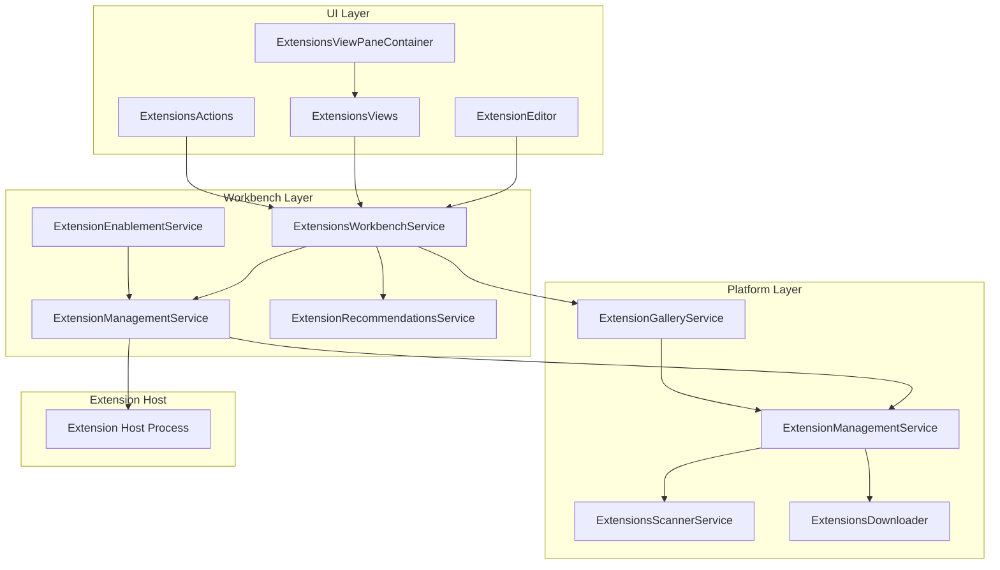
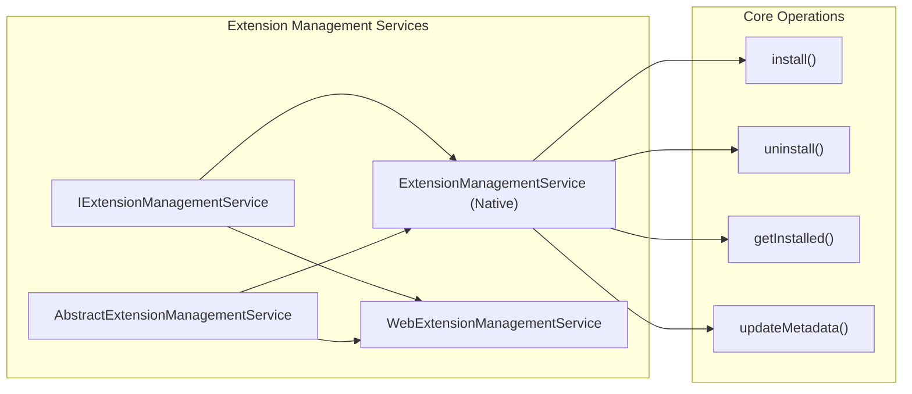
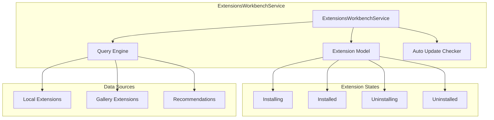
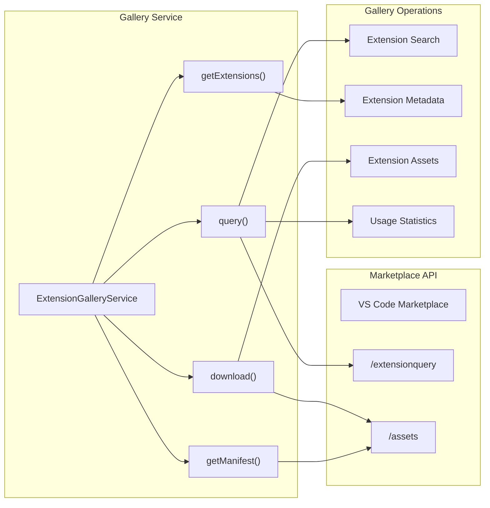
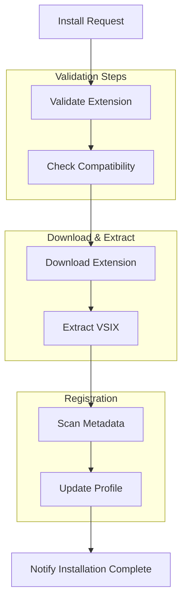
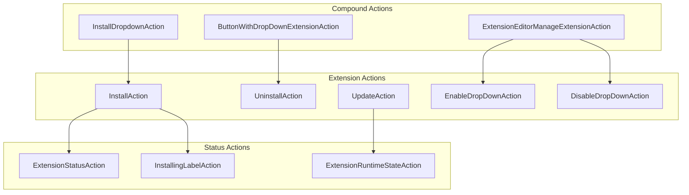
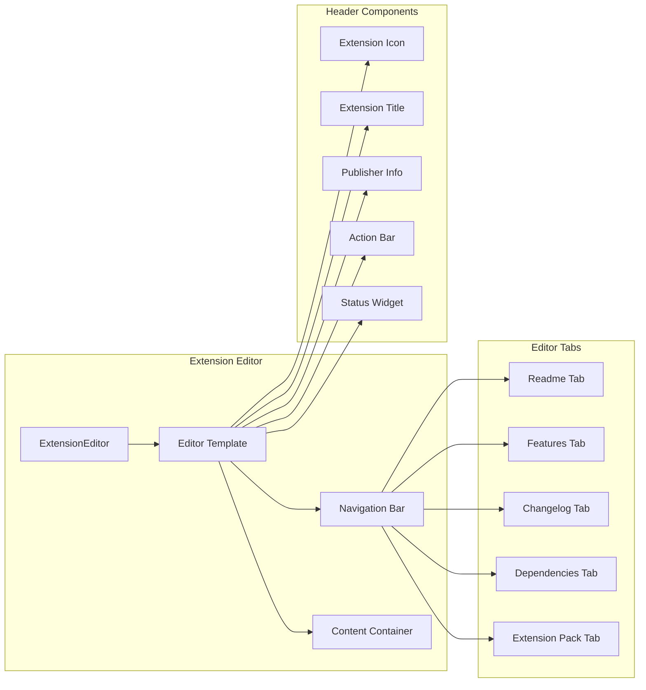
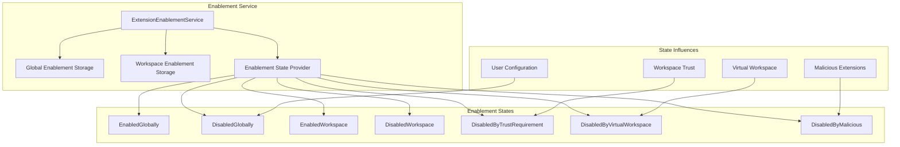

# Extension Management

Relevant source files

The following files were used as context for generating this wiki page:

- [src/vs/platform/extensionManagement/common/abstractExtensionManagementService.ts](src/vs/platform/extensionManagement/common/abstractExtensionManagementService.ts)
- [src/vs/platform/extensionManagement/common/extensionGalleryService.ts](src/vs/platform/extensionManagement/common/extensionGalleryService.ts)
- [src/vs/platform/extensionManagement/common/extensionManagement.ts](src/vs/platform/extensionManagement/common/extensionManagement.ts)
- [src/vs/platform/extensionManagement/common/extensionManagementIpc.ts](src/vs/platform/extensionManagement/common/extensionManagementIpc.ts)
- [src/vs/platform/extensionManagement/common/extensionManagementUtil.ts](src/vs/platform/extensionManagement/common/extensionManagementUtil.ts)
- [src/vs/platform/extensionManagement/node/extensionManagementService.ts](src/vs/platform/extensionManagement/node/extensionManagementService.ts)
- [src/vs/workbench/contrib/extensions/browser/extensionEditor.ts](src/vs/workbench/contrib/extensions/browser/extensionEditor.ts)
- [src/vs/workbench/contrib/extensions/browser/extensions.contribution.ts](src/vs/workbench/contrib/extensions/browser/extensions.contribution.ts)
- [src/vs/workbench/contrib/extensions/browser/extensionsActions.ts](src/vs/workbench/contrib/extensions/browser/extensionsActions.ts)
- [src/vs/workbench/contrib/extensions/browser/extensionsList.ts](src/vs/workbench/contrib/extensions/browser/extensionsList.ts)
- [src/vs/workbench/contrib/extensions/browser/extensionsViewer.ts](src/vs/workbench/contrib/extensions/browser/extensionsViewer.ts)
- [src/vs/workbench/contrib/extensions/browser/extensionsViewlet.ts](src/vs/workbench/contrib/extensions/browser/extensionsViewlet.ts)
- [src/vs/workbench/contrib/extensions/browser/extensionsViews.ts](src/vs/workbench/contrib/extensions/browser/extensionsViews.ts)
- [src/vs/workbench/contrib/extensions/browser/extensionsWidgets.ts](src/vs/workbench/contrib/extensions/browser/extensionsWidgets.ts)
- [src/vs/workbench/contrib/extensions/browser/extensionsWorkbenchService.ts](src/vs/workbench/contrib/extensions/browser/extensionsWorkbenchService.ts)
- [src/vs/workbench/contrib/extensions/browser/media/extension.css](src/vs/workbench/contrib/extensions/browser/media/extension.css)
- [src/vs/workbench/contrib/extensions/browser/media/extensionActions.css](src/vs/workbench/contrib/extensions/browser/media/extensionActions.css)
- [src/vs/workbench/contrib/extensions/browser/media/extensionEditor.css](src/vs/workbench/contrib/extensions/browser/media/extensionEditor.css)
- [src/vs/workbench/contrib/extensions/browser/media/extensionsViewlet.css](src/vs/workbench/contrib/extensions/browser/media/extensionsViewlet.css)
- [src/vs/workbench/contrib/extensions/browser/media/extensionsWidgets.css](src/vs/workbench/contrib/extensions/browser/media/extensionsWidgets.css)
- [src/vs/workbench/contrib/extensions/common/extensions.ts](src/vs/workbench/contrib/extensions/common/extensions.ts)
- [src/vs/workbench/contrib/extensions/test/electron-browser/extensionRecommendationsService.test.ts](src/vs/workbench/contrib/extensions/test/electron-browser/extensionRecommendationsService.test.ts)
- [src/vs/workbench/contrib/extensions/test/electron-browser/extensionsActions.test.ts](src/vs/workbench/contrib/extensions/test/electron-browser/extensionsActions.test.ts)
- [src/vs/workbench/contrib/extensions/test/electron-browser/extensionsViews.test.ts](src/vs/workbench/contrib/extensions/test/electron-browser/extensionsViews.test.ts)
- [src/vs/workbench/contrib/extensions/test/electron-browser/extensionsWorkbenchService.test.ts](src/vs/workbench/contrib/extensions/test/electron-browser/extensionsWorkbenchService.test.ts)
- [src/vs/workbench/services/extensionManagement/browser/extensionEnablementService.ts](src/vs/workbench/services/extensionManagement/browser/extensionEnablementService.ts)
- [src/vs/workbench/services/extensionManagement/common/extensionManagement.ts](src/vs/workbench/services/extensionManagement/common/extensionManagement.ts)
- [src/vs/workbench/services/extensionManagement/common/extensionManagementChannelClient.ts](src/vs/workbench/services/extensionManagement/common/extensionManagementChannelClient.ts)
- [src/vs/workbench/services/extensionManagement/common/extensionManagementServerService.ts](src/vs/workbench/services/extensionManagement/common/extensionManagementServerService.ts)
- [src/vs/workbench/services/extensionManagement/common/extensionManagementService.ts](src/vs/workbench/services/extensionManagement/common/extensionManagementService.ts)
- [src/vs/workbench/services/extensionManagement/common/webExtensionManagementService.ts](src/vs/workbench/services/extensionManagement/common/webExtensionManagementService.ts)
- [src/vs/workbench/services/extensionManagement/electron-browser/extensionManagementServerService.ts](src/vs/workbench/services/extensionManagement/electron-browser/extensionManagementServerService.ts)
- [src/vs/workbench/services/extensionManagement/electron-browser/remoteExtensionManagementService.ts](src/vs/workbench/services/extensionManagement/electron-browser/remoteExtensionManagementService.ts)
- [src/vs/workbench/services/extensionManagement/test/browser/extensionEnablementService.test.ts](src/vs/workbench/services/extensionManagement/test/browser/extensionEnablementService.test.ts)

This document covers VS Code's extension management system, which handles the discovery, installation, updating, and lifecycle management of extensions within the workbench. The system encompasses both platform-level services for core extension operations and workbench-level components for user interface and interaction.

For information about the extension host and runtime execution of extensions, see [Extension Host and Language Features](#4.1). For details about the build system that packages extensions, see [Build System and Package Management](#1.2).

## Architecture Overview

The extension management system is organized into multiple layers that separate platform concerns from workbench-specific functionality:

### Extension Management System Architecture

Sources: [src/vs/workbench/contrib/extensions/browser/extensions.contribution.ts:88-91](), [src/vs/workbench/services/extensionManagement/common/extensionManagementService.ts:59-129](), [src/vs/platform/extensionManagement/node/extensionManagementService.ts:72-106]()

## Core Extension Management Services

### IExtensionManagementService

The `IExtensionManagementService` is the primary interface for extension lifecycle operations. The platform-level implementation handles the actual installation, uninstallation, and scanning of extensions.

Key responsibilities include:
- Installing extensions from VSIX files or gallery
- Uninstalling extensions and cleaning up files
- Scanning installed extensions
- Managing extension metadata and profiles

Sources: [src/vs/platform/extensionManagement/common/extensionManagement.ts:525-543](), [src/vs/platform/extensionManagement/node/extensionManagementService.ts:72-243]()

### ExtensionsWorkbenchService

The `ExtensionsWorkbenchService` provides the main workbench-level API for extension operations:

The service manages:
- Extension state tracking and notifications
- Auto-update functionality
- Extension queries and filtering
- Integration with gallery and local extension sources

Sources: [src/vs/workbench/contrib/extensions/browser/extensionsWorkbenchService.ts:591-735](), [src/vs/workbench/contrib/extensions/common/extensions.ts:39-44]()

## Extension Gallery Integration

### ExtensionGalleryService

The `ExtensionGalleryService` handles communication with the VS Code Marketplace:

Key capabilities:
- Searching and filtering extensions in the marketplace
- Downloading extension packages and assets
- Retrieving extension manifests and metadata
- Reporting usage statistics

Sources: [src/vs/platform/extensionManagement/common/extensionGalleryService.ts:396-421](), [src/vs/platform/extensionManagement/common/extensionManagement.ts:396-421]()

## Extension Installation and Management

### Installation Process

The extension installation process involves multiple coordinated steps:

The `InstallExtensionTask` class coordinates this process:

Sources: [src/vs/platform/extensionManagement/node/extensionManagementService.ts:280-293](), [src/vs/platform/extensionManagement/common/abstractExtensionManagementService.ts:37-50]()

### Extension Actions

Extension actions provide the user interface for extension operations:

Action classes extend `ExtensionAction` and provide:
- Context-sensitive visibility and enablement
- Integration with extension state changes
- Dropdown menus for complex operations

Sources: [src/vs/workbench/contrib/extensions/browser/extensionsActions.ts:285-319](), [src/vs/workbench/contrib/extensions/browser/extensionsActions.ts:428-496]()

## Extension Views and UI

### Extensions Viewlet Structure

The Extensions viewlet organizes extension management into multiple specialized views:

```mermaid
graph TB
    subgraph "Extensions Viewlet"
        ViewPaneContainer["ExtensionsViewPaneContainer"]
        SearchInput["Extension Search Input"]
        ViewRegistry["Views Registry"]
    end
    
    subgraph "Extension Views"
        InstalledView["Server Installed Extensions View"]
        RecommendedView["Recommended Extensions View"]
        PopularView["Popular Extensions View"]
        EnabledView["Enabled Extensions View"]
        DisabledView["Disabled Extensions View"]
        OutdatedView["Outdated Extensions View"]
        BuiltinView["Built-in Extensions View"]
    end
    
    subgraph "Specialized Views"
        WorkspaceRec["Workspace Recommendations"]
        UntrustedView["Untrusted Workspace Extensions"]
        VirtualView["Virtual Workspace Extensions"]
        DeprecatedView["Deprecated Extensions"]
    end
    
    ViewPaneContainer --> SearchInput
    ViewPaneContainer --> ViewRegistry
    
    ViewRegistry --> InstalledView
    ViewRegistry --> RecommendedView
    ViewRegistry --> PopularView
    ViewRegistry --> EnabledView
    ViewRegistry --> DisabledView
    ViewRegistry --> OutdatedView
    ViewRegistry --> BuiltinView
    
    ViewRegistry --> WorkspaceRec
    ViewRegistry --> UntrustedView
    ViewRegistry --> VirtualView
    ViewRegistry --> DeprecatedView
```

Each view is registered dynamically based on context and provides filtered extension lists with specific query criteria.

Sources: [src/vs/workbench/contrib/extensions/browser/extensionsViewlet.ts:111-132](), [src/vs/workbench/contrib/extensions/browser/extensionsViews.ts:112-171]()

### Extension Editor

The `ExtensionEditor` displays detailed information about individual extensions:

The editor provides comprehensive extension information including manifests, readme content, and interactive actions.

Sources: [src/vs/workbench/contrib/extensions/browser/extensionEditor.ts:209-256](), [src/vs/workbench/contrib/extensions/browser/extensionEditor.ts:426-456]()

## Extension Enablement and State Management

### Extension Enablement Service

The `ExtensionEnablementService` manages the enabled/disabled state of extensions:

The service considers multiple factors when determining extension enablement including workspace trust, virtual workspace support, and malicious extension detection.

Sources: [src/vs/workbench/services/extensionManagement/browser/extensionEnablementService.ts:1-49](), [src/vs/workbench/services/extensionManagement/common/extensionManagement.ts:85-128]()

## Extension Lifecycle Events

### Event Flow Architecture

Extension management operations trigger events that coordinate updates across the system:

```mermaid
graph TD
    subgraph "Installation Events"
        InstallStart["onInstallExtension"]
        InstallComplete["onDidInstallExtensions"]
        InstallError["Installation Error"]
    end
    
    subgraph "Uninstallation Events"
        UninstallStart["onUninstallExtension"]
        UninstallComplete["onDidUninstallExtension"]
        UninstallError["Uninstallation Error"]
    end
    
    subgraph "State Change Events"
        EnablementChange["onEnablementChanged"]
        MetadataUpdate["onDidUpdateExtensionMetadata"]
        ProfileChange["onDidChangeProfile"]
    end
    
    subgraph "Listeners"
        WorkbenchService["ExtensionsWorkbenchService"]
        StatusUpdater["StatusUpdater"]
        ActivityService["ActivityService"]
        RecommendationService["RecommendationService"]
    end
    
    InstallStart --> WorkbenchService
    InstallComplete --> WorkbenchService
    InstallComplete --> StatusUpdater
    
    UninstallComplete --> WorkbenchService
    UninstallComplete --> ActivityService
    
    EnablementChange --> WorkbenchService
    MetadataUpdate --> WorkbenchService
    ProfileChange --> RecommendationService
```

Event coordination ensures that UI components stay synchronized with extension state changes and that dependent services are notified of relevant changes.

Sources: [src/vs/workbench/contrib/extensions/browser/extensionsWorkbenchService.ts:593-622](), [src/vs/workbench/services/extensionManagement/common/extensionManagementService.ts:65-87]()