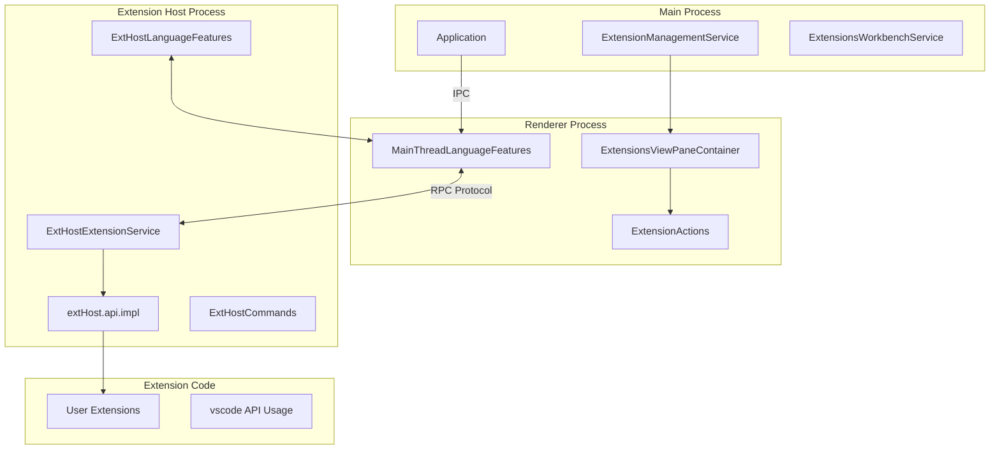
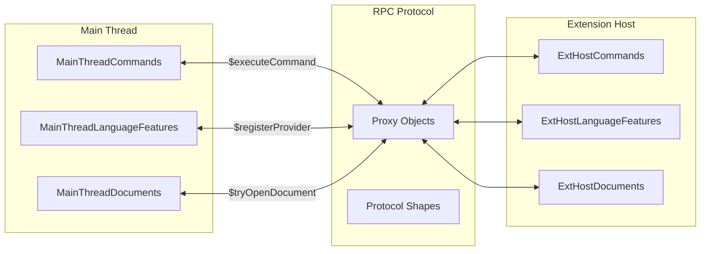
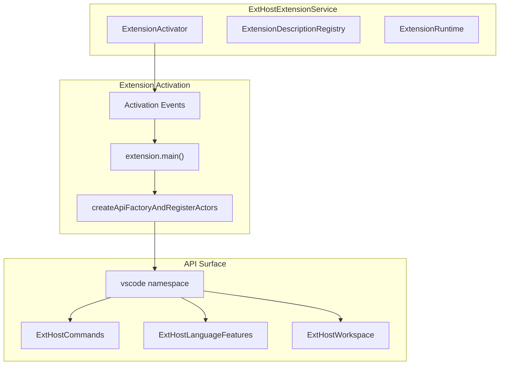
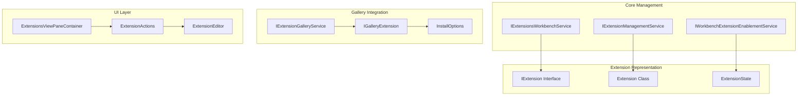
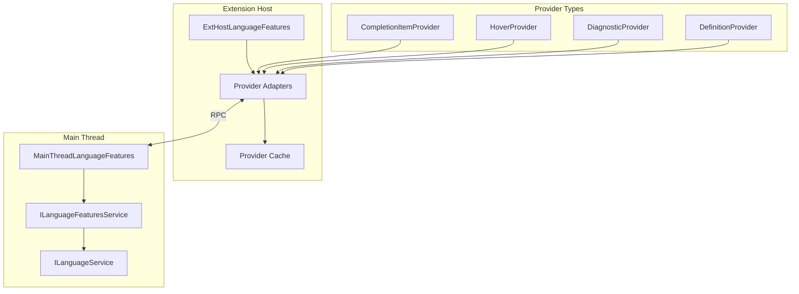
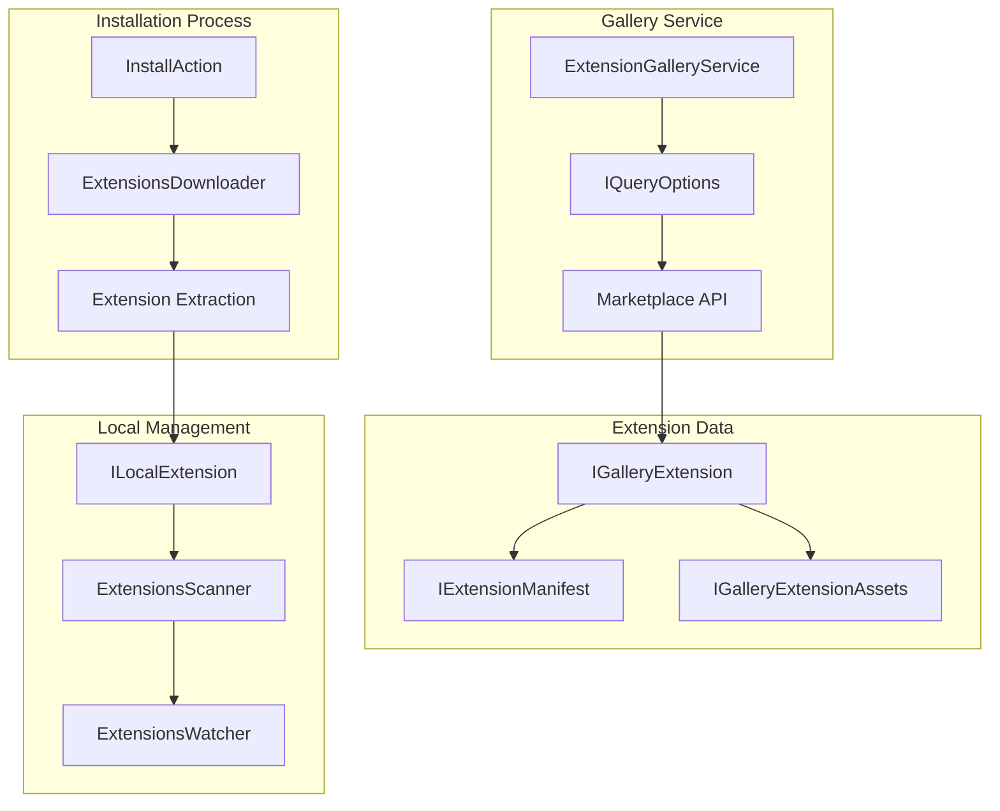
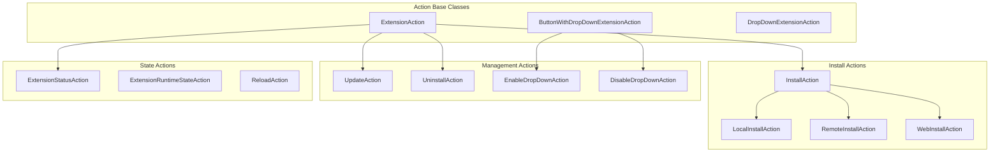

# Extension System

Relevant source files

The following files were used as context for generating this wiki page:

- [extensions/vscode-api-tests/package.json](extensions/vscode-api-tests/package.json)
- [src/vs/editor/common/languages.ts](src/vs/editor/common/languages.ts)
- [src/vs/editor/common/services/languageFeatures.ts](src/vs/editor/common/services/languageFeatures.ts)
- [src/vs/editor/common/services/languageFeaturesService.ts](src/vs/editor/common/services/languageFeaturesService.ts)
- [src/vs/editor/contrib/gotoSymbol/browser/goToCommands.ts](src/vs/editor/contrib/gotoSymbol/browser/goToCommands.ts)
- [src/vs/editor/contrib/gotoSymbol/browser/goToSymbol.ts](src/vs/editor/contrib/gotoSymbol/browser/goToSymbol.ts)
- [src/vs/editor/contrib/gotoSymbol/browser/link/clickLinkGesture.ts](src/vs/editor/contrib/gotoSymbol/browser/link/clickLinkGesture.ts)
- [src/vs/editor/contrib/gotoSymbol/browser/link/goToDefinitionAtPosition.css](src/vs/editor/contrib/gotoSymbol/browser/link/goToDefinitionAtPosition.css)
- [src/vs/editor/contrib/gotoSymbol/browser/link/goToDefinitionAtPosition.ts](src/vs/editor/contrib/gotoSymbol/browser/link/goToDefinitionAtPosition.ts)
- [src/vs/editor/contrib/inPlaceReplace/browser/inPlaceReplace.css](src/vs/editor/contrib/inPlaceReplace/browser/inPlaceReplace.css)
- [src/vs/editor/contrib/inPlaceReplace/browser/inPlaceReplace.ts](src/vs/editor/contrib/inPlaceReplace/browser/inPlaceReplace.ts)
- [src/vs/editor/contrib/inlayHints/browser/inlayHintsLocations.ts](src/vs/editor/contrib/inlayHints/browser/inlayHintsLocations.ts)
- [src/vs/editor/contrib/links/browser/links.css](src/vs/editor/contrib/links/browser/links.css)
- [src/vs/editor/contrib/links/browser/links.ts](src/vs/editor/contrib/links/browser/links.ts)
- [src/vs/editor/standalone/browser/standaloneLanguages.ts](src/vs/editor/standalone/browser/standaloneLanguages.ts)
- [src/vs/platform/extensionManagement/common/abstractExtensionManagementService.ts](src/vs/platform/extensionManagement/common/abstractExtensionManagementService.ts)
- [src/vs/platform/extensionManagement/common/extensionGalleryService.ts](src/vs/platform/extensionManagement/common/extensionGalleryService.ts)
- [src/vs/platform/extensionManagement/common/extensionManagement.ts](src/vs/platform/extensionManagement/common/extensionManagement.ts)
- [src/vs/platform/extensionManagement/common/extensionManagementIpc.ts](src/vs/platform/extensionManagement/common/extensionManagementIpc.ts)
- [src/vs/platform/extensionManagement/common/extensionManagementUtil.ts](src/vs/platform/extensionManagement/common/extensionManagementUtil.ts)
- [src/vs/platform/extensionManagement/node/extensionManagementService.ts](src/vs/platform/extensionManagement/node/extensionManagementService.ts)
- [src/vs/workbench/api/browser/extensionHost.contribution.ts](src/vs/workbench/api/browser/extensionHost.contribution.ts)
- [src/vs/workbench/api/browser/mainThreadLanguageFeatures.ts](src/vs/workbench/api/browser/mainThreadLanguageFeatures.ts)
- [src/vs/workbench/api/common/extHost.api.impl.ts](src/vs/workbench/api/common/extHost.api.impl.ts)
- [src/vs/workbench/api/common/extHost.protocol.ts](src/vs/workbench/api/common/extHost.protocol.ts)
- [src/vs/workbench/api/common/extHostLanguageFeatures.ts](src/vs/workbench/api/common/extHostLanguageFeatures.ts)
- [src/vs/workbench/api/common/extHostTypeConverters.ts](src/vs/workbench/api/common/extHostTypeConverters.ts)
- [src/vs/workbench/api/common/extHostTypes.ts](src/vs/workbench/api/common/extHostTypes.ts)
- [src/vs/workbench/api/node/extHostExtensionService.ts](src/vs/workbench/api/node/extHostExtensionService.ts)
- [src/vs/workbench/api/test/browser/extHostLanguageFeatures.test.ts](src/vs/workbench/api/test/browser/extHostLanguageFeatures.test.ts)
- [src/vs/workbench/contrib/extensions/browser/extensionEditor.ts](src/vs/workbench/contrib/extensions/browser/extensionEditor.ts)
- [src/vs/workbench/contrib/extensions/browser/extensions.contribution.ts](src/vs/workbench/contrib/extensions/browser/extensions.contribution.ts)
- [src/vs/workbench/contrib/extensions/browser/extensionsActions.ts](src/vs/workbench/contrib/extensions/browser/extensionsActions.ts)
- [src/vs/workbench/contrib/extensions/browser/extensionsList.ts](src/vs/workbench/contrib/extensions/browser/extensionsList.ts)
- [src/vs/workbench/contrib/extensions/browser/extensionsViewer.ts](src/vs/workbench/contrib/extensions/browser/extensionsViewer.ts)
- [src/vs/workbench/contrib/extensions/browser/extensionsViewlet.ts](src/vs/workbench/contrib/extensions/browser/extensionsViewlet.ts)
- [src/vs/workbench/contrib/extensions/browser/extensionsViews.ts](src/vs/workbench/contrib/extensions/browser/extensionsViews.ts)
- [src/vs/workbench/contrib/extensions/browser/extensionsWidgets.ts](src/vs/workbench/contrib/extensions/browser/extensionsWidgets.ts)
- [src/vs/workbench/contrib/extensions/browser/extensionsWorkbenchService.ts](src/vs/workbench/contrib/extensions/browser/extensionsWorkbenchService.ts)
- [src/vs/workbench/contrib/extensions/browser/media/extension.css](src/vs/workbench/contrib/extensions/browser/media/extension.css)
- [src/vs/workbench/contrib/extensions/browser/media/extensionActions.css](src/vs/workbench/contrib/extensions/browser/media/extensionActions.css)
- [src/vs/workbench/contrib/extensions/browser/media/extensionEditor.css](src/vs/workbench/contrib/extensions/browser/media/extensionEditor.css)
- [src/vs/workbench/contrib/extensions/browser/media/extensionsViewlet.css](src/vs/workbench/contrib/extensions/browser/media/extensionsViewlet.css)
- [src/vs/workbench/contrib/extensions/browser/media/extensionsWidgets.css](src/vs/workbench/contrib/extensions/browser/media/extensionsWidgets.css)
- [src/vs/workbench/contrib/extensions/common/extensions.ts](src/vs/workbench/contrib/extensions/common/extensions.ts)
- [src/vs/workbench/contrib/extensions/test/electron-browser/extensionRecommendationsService.test.ts](src/vs/workbench/contrib/extensions/test/electron-browser/extensionRecommendationsService.test.ts)
- [src/vs/workbench/contrib/extensions/test/electron-browser/extensionsActions.test.ts](src/vs/workbench/contrib/extensions/test/electron-browser/extensionsActions.test.ts)
- [src/vs/workbench/contrib/extensions/test/electron-browser/extensionsViews.test.ts](src/vs/workbench/contrib/extensions/test/electron-browser/extensionsViews.test.ts)
- [src/vs/workbench/contrib/extensions/test/electron-browser/extensionsWorkbenchService.test.ts](src/vs/workbench/contrib/extensions/test/electron-browser/extensionsWorkbenchService.test.ts)
- [src/vs/workbench/services/extensionManagement/browser/extensionEnablementService.ts](src/vs/workbench/services/extensionManagement/browser/extensionEnablementService.ts)
- [src/vs/workbench/services/extensionManagement/common/extensionManagement.ts](src/vs/workbench/services/extensionManagement/common/extensionManagement.ts)
- [src/vs/workbench/services/extensionManagement/common/extensionManagementChannelClient.ts](src/vs/workbench/services/extensionManagement/common/extensionManagementChannelClient.ts)
- [src/vs/workbench/services/extensionManagement/common/extensionManagementServerService.ts](src/vs/workbench/services/extensionManagement/common/extensionManagementServerService.ts)
- [src/vs/workbench/services/extensionManagement/common/extensionManagementService.ts](src/vs/workbench/services/extensionManagement/common/extensionManagementService.ts)
- [src/vs/workbench/services/extensionManagement/common/webExtensionManagementService.ts](src/vs/workbench/services/extensionManagement/common/webExtensionManagementService.ts)
- [src/vs/workbench/services/extensionManagement/electron-browser/extensionManagementServerService.ts](src/vs/workbench/services/extensionManagement/electron-browser/extensionManagementServerService.ts)
- [src/vs/workbench/services/extensionManagement/electron-browser/remoteExtensionManagementService.ts](src/vs/workbench/services/extensionManagement/electron-browser/remoteExtensionManagementService.ts)
- [src/vs/workbench/services/extensionManagement/test/browser/extensionEnablementService.test.ts](src/vs/workbench/services/extensionManagement/test/browser/extensionEnablementService.test.ts)
- [src/vscode-dts/vscode.d.ts](src/vscode-dts/vscode.d.ts)

This document covers VS Code's extension system, which enables third-party functionality through a secure, performant architecture. The extension system includes the extension host process, API surface, extension management services, and integration points for language features.

For information about the build system and package management, see [Build System and Package Management](#1.2). For details about Monaco Editor integration, see [Monaco Editor](#3).

## Architecture Overview

VS Code's extension system uses a multi-process architecture to isolate extension code from the main application while providing rich integration capabilities.

### Process Architecture

**Sources:** [src/vs/workbench/api/common/extHost.protocol.ts:105-106](), [src/vs/workbench/api/common/extHost.api.impl.ts:127-244](), [src/vs/workbench/contrib/extensions/browser/extensionsWorkbenchService.ts:1-100]()

The extension system separates concerns across processes:

- **Main Process**: Handles extension installation, management, and lifecycle
- **Renderer Process**: Provides UI for extension management and main thread API implementations  
- **Extension Host Process**: Runs extension code in isolation with access to the VS Code API

### Extension Host Communication

**Sources:** [src/vs/workbench/api/common/extHost.protocol.ts:115-121](), [src/vs/workbench/api/browser/mainThreadLanguageFeatures.ts:38-53](), [src/vs/workbench/api/common/extHostLanguageFeatures.ts:1-50]()

## Extension Host Process

The extension host runs extension code in a separate Node.js process, providing security isolation and preventing extensions from blocking the main UI.

### Extension Host Service

The `ExtHostExtensionService` manages extension activation and lifecycle within the extension host process:

**Sources:** [src/vs/workbench/api/node/extHostExtensionService.ts:1-50](), [src/vs/workbench/api/common/extHost.api.impl.ts:127-155]()

### Extension API Implementation

The extension API is implemented through a factory pattern that creates the `vscode` namespace for each extension:

Key API namespaces include:
- `commands`: Command registration and execution via `ExtHostCommands`
- `languages`: Language feature providers via `ExtHostLanguageFeatures`  
- `workspace`: Workspace operations via `ExtHostWorkspace`
- `window`: UI interactions via `ExtHostWindow`
- `extensions`: Extension management via `ExtHostExtensionService`

**Sources:** [src/vs/workbench/api/common/extHost.api.impl.ts:244-533](), [src/vscode-dts/vscode.d.ts:1-50]()

## Extension Management

Extension management encompasses discovery, installation, enablement, and lifecycle operations.

### Extension Management Services

**Sources:** [src/vs/platform/extensionManagement/common/extensionManagement.ts:1-50](), [src/vs/workbench/contrib/extensions/browser/extensionsWorkbenchService.ts:77-114](), [src/vs/workbench/contrib/extensions/browser/extensionsActions.ts:285-320]()

### Extension States and Lifecycle

Extensions progress through various states managed by the `ExtensionsWorkbenchService`:

| State | Description | Code Location |
|-------|-------------|---------------|
| `Uninstalled` | Extension not installed | [ExtensionState enum]() |
| `Installing` | Installation in progress | [ExtensionState enum]() |
| `Installed` | Installed but not enabled | [ExtensionState enum]() |
| `Enabling` | Enablement in progress | [ExtensionState enum]() |
| `Enabled` | Active and functional | [ExtensionState enum]() |

**Sources:** [src/vs/workbench/contrib/extensions/common/extensions.ts:1-50](), [src/vs/workbench/contrib/extensions/browser/extensionsWorkbenchService.ts:92-165]()

## Language Features Integration

Extensions integrate with VS Code's language features through provider-based APIs that register capabilities like completion, diagnostics, and hover information.

### Language Feature Providers

**Sources:** [src/vs/workbench/api/common/extHostLanguageFeatures.ts:1-100](), [src/vs/workbench/api/browser/mainThreadLanguageFeatures.ts:38-100]()

### Provider Registration Flow

The language feature registration follows this pattern:

1. Extension calls `vscode.languages.registerXProvider()`
2. `ExtHostLanguageFeatures` creates adapter and caches provider
3. RPC call to `MainThreadLanguageFeatures.$registerXProvider()`
4. Main thread registers with `ILanguageFeaturesService`
5. Editor requests trigger provider calls through RPC back to extension host

**Sources:** [src/vs/workbench/api/common/extHostLanguageFeatures.ts:43-103](), [src/vs/workbench/api/browser/mainThreadLanguageFeatures.ts:457-503]()

## Extension Discovery and Installation

Extensions are discovered through the marketplace and installed via the extension management infrastructure.

### Extension Gallery Service

**Sources:** [src/vs/platform/extensionManagement/common/extensionGalleryService.ts:1-100](), [src/vs/platform/extensionManagement/node/extensionManagementService.ts:1-100](), [src/vs/workbench/contrib/extensions/browser/extensionsActions.ts:79-278]()

### Extension Package Structure

Extensions follow a standardized package structure with a `package.json` manifest:

- Extension manifest contains activation events, contribution points, and dependencies
- Main entry point specified in `main` field loads extension code
- Contribution points define how extension extends VS Code (commands, languages, etc.)

**Sources:** [src/vscode-dts/vscode.d.ts:1-50](), [extensions/vscode-api-tests/package.json:1-50]()

## Extension Actions and UI

The Extensions viewlet provides a comprehensive UI for managing extensions through various action classes.

### Extension Action Hierarchy

**Sources:** [src/vs/workbench/contrib/extensions/browser/extensionsActions.ts:285-330](), [src/vs/workbench/contrib/extensions/browser/extensionsActions.ts:2500-2600]()

### Extension Views and Filtering

The Extensions viewlet provides multiple views for different extension categories:

- **Installed**: Shows locally installed extensions
- **Popular**: Displays popular marketplace extensions  
- **Recommended**: Extensions recommended for current workspace
- **Disabled**: Shows disabled extensions
- **Outdated**: Extensions with available updates

**Sources:** [src/vs/workbench/contrib/extensions/browser/extensionsViews.ts:1-100](), [src/vs/workbench/contrib/extensions/browser/extensionsViewlet.ts:1-100]()

This extension system provides a robust, secure foundation for extending VS Code's functionality while maintaining performance and stability through process isolation and well-defined APIs.