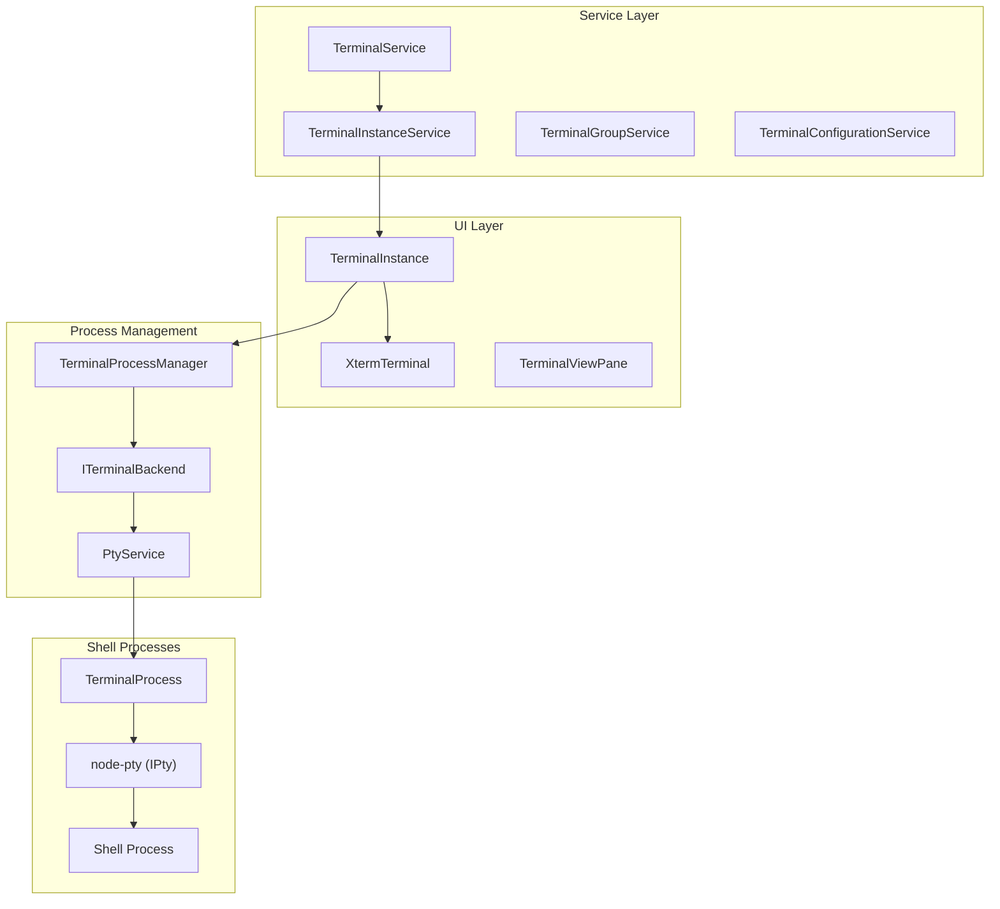
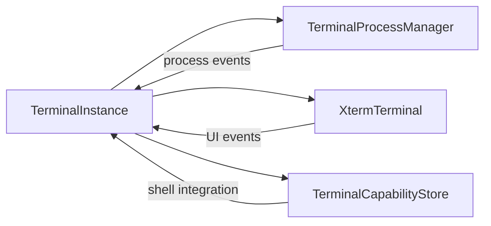
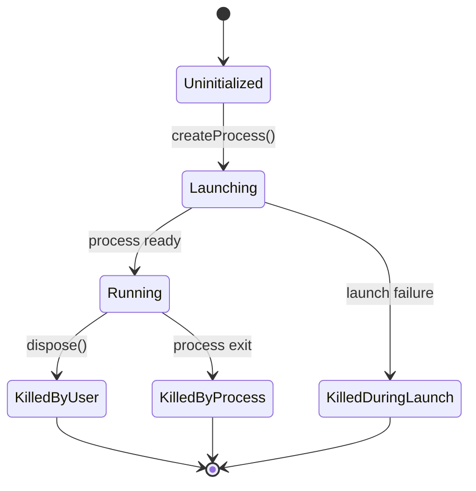
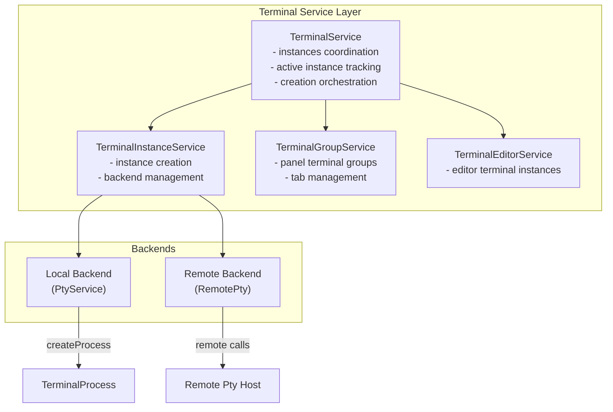
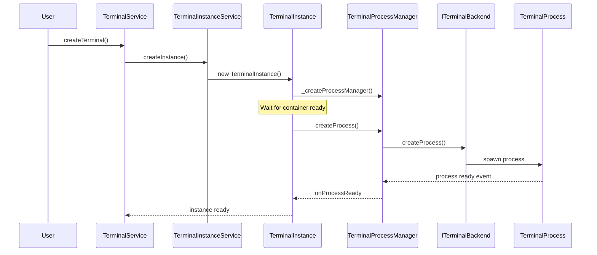
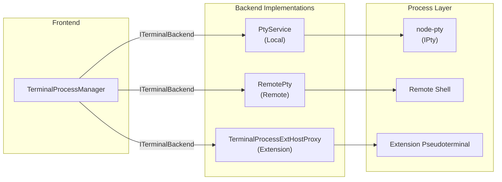
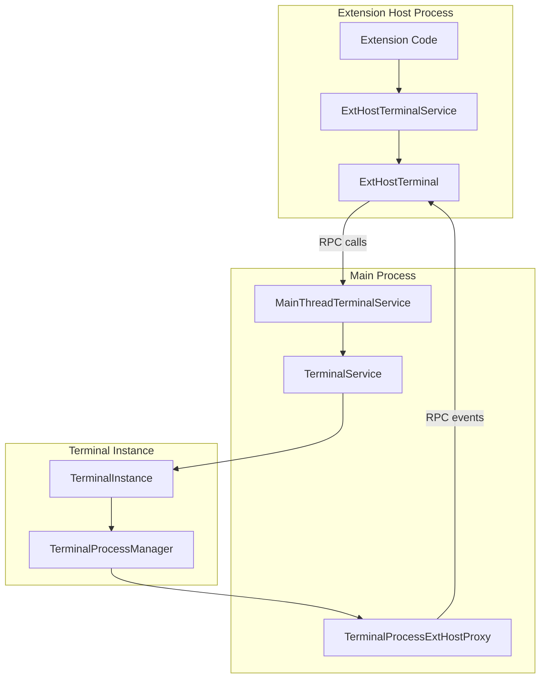

# Terminal Architecture and Process Management

Relevant source files

The following files were used as context for generating this wiki page:

- [src/vs/platform/terminal/common/terminal.ts](src/vs/platform/terminal/common/terminal.ts)
- [src/vs/platform/terminal/node/ptyHostService.ts](src/vs/platform/terminal/node/ptyHostService.ts)
- [src/vs/platform/terminal/node/ptyService.ts](src/vs/platform/terminal/node/ptyService.ts)
- [src/vs/platform/terminal/node/terminalProcess.ts](src/vs/platform/terminal/node/terminalProcess.ts)
- [src/vs/workbench/api/browser/mainThreadTerminalService.ts](src/vs/workbench/api/browser/mainThreadTerminalService.ts)
- [src/vs/workbench/api/common/extHostTerminalService.ts](src/vs/workbench/api/common/extHostTerminalService.ts)
- [src/vs/workbench/api/node/extHostTerminalService.ts](src/vs/workbench/api/node/extHostTerminalService.ts)
- [src/vs/workbench/contrib/terminal/browser/media/terminal.css](src/vs/workbench/contrib/terminal/browser/media/terminal.css)
- [src/vs/workbench/contrib/terminal/browser/media/xterm.css](src/vs/workbench/contrib/terminal/browser/media/xterm.css)
- [src/vs/workbench/contrib/terminal/browser/remotePty.ts](src/vs/workbench/contrib/terminal/browser/remotePty.ts)
- [src/vs/workbench/contrib/terminal/browser/terminal.contribution.ts](src/vs/workbench/contrib/terminal/browser/terminal.contribution.ts)
- [src/vs/workbench/contrib/terminal/browser/terminal.ts](src/vs/workbench/contrib/terminal/browser/terminal.ts)
- [src/vs/workbench/contrib/terminal/browser/terminalActions.ts](src/vs/workbench/contrib/terminal/browser/terminalActions.ts)
- [src/vs/workbench/contrib/terminal/browser/terminalEditor.ts](src/vs/workbench/contrib/terminal/browser/terminalEditor.ts)
- [src/vs/workbench/contrib/terminal/browser/terminalEditorInput.ts](src/vs/workbench/contrib/terminal/browser/terminalEditorInput.ts)
- [src/vs/workbench/contrib/terminal/browser/terminalEditorService.ts](src/vs/workbench/contrib/terminal/browser/terminalEditorService.ts)
- [src/vs/workbench/contrib/terminal/browser/terminalGroup.ts](src/vs/workbench/contrib/terminal/browser/terminalGroup.ts)
- [src/vs/workbench/contrib/terminal/browser/terminalGroupService.ts](src/vs/workbench/contrib/terminal/browser/terminalGroupService.ts)
- [src/vs/workbench/contrib/terminal/browser/terminalInstance.ts](src/vs/workbench/contrib/terminal/browser/terminalInstance.ts)
- [src/vs/workbench/contrib/terminal/browser/terminalMenus.ts](src/vs/workbench/contrib/terminal/browser/terminalMenus.ts)
- [src/vs/workbench/contrib/terminal/browser/terminalProcessExtHostProxy.ts](src/vs/workbench/contrib/terminal/browser/terminalProcessExtHostProxy.ts)
- [src/vs/workbench/contrib/terminal/browser/terminalProcessManager.ts](src/vs/workbench/contrib/terminal/browser/terminalProcessManager.ts)
- [src/vs/workbench/contrib/terminal/browser/terminalProfileResolverService.ts](src/vs/workbench/contrib/terminal/browser/terminalProfileResolverService.ts)
- [src/vs/workbench/contrib/terminal/browser/terminalProfileService.ts](src/vs/workbench/contrib/terminal/browser/terminalProfileService.ts)
- [src/vs/workbench/contrib/terminal/browser/terminalService.ts](src/vs/workbench/contrib/terminal/browser/terminalService.ts)
- [src/vs/workbench/contrib/terminal/browser/terminalTabbedView.ts](src/vs/workbench/contrib/terminal/browser/terminalTabbedView.ts)
- [src/vs/workbench/contrib/terminal/browser/terminalTabsList.ts](src/vs/workbench/contrib/terminal/browser/terminalTabsList.ts)
- [src/vs/workbench/contrib/terminal/browser/terminalView.ts](src/vs/workbench/contrib/terminal/browser/terminalView.ts)
- [src/vs/workbench/contrib/terminal/browser/xterm/xtermTerminal.ts](src/vs/workbench/contrib/terminal/browser/xterm/xtermTerminal.ts)
- [src/vs/workbench/contrib/terminal/common/terminal.ts](src/vs/workbench/contrib/terminal/common/terminal.ts)
- [src/vs/workbench/contrib/terminal/common/terminalColorRegistry.ts](src/vs/workbench/contrib/terminal/common/terminalColorRegistry.ts)
- [src/vs/workbench/contrib/terminal/common/terminalConfiguration.ts](src/vs/workbench/contrib/terminal/common/terminalConfiguration.ts)
- [src/vs/workbench/contrib/terminal/common/terminalStrings.ts](src/vs/workbench/contrib/terminal/common/terminalStrings.ts)

This document covers the core architecture of VS Code's integrated terminal system, focusing on process management, service coordination, and the lifecycle of terminal instances. It explains how terminal instances are created, managed, and coordinated with underlying shell processes.

For information about the Monaco editor system that powers text editing, see [3](#3). For details about extension system integration, see [4](#4).

## Purpose and Scope

The terminal system in VS Code provides integrated shell access through a multi-layered architecture that separates UI concerns from process management. The system handles terminal instance lifecycle, process coordination, and communication between the frontend UI and backend shell processes.

## Overall Terminal Architecture

The terminal architecture follows a layered approach with clear separation between UI, service coordination, and process management:

Sources: [src/vs/workbench/contrib/terminal/browser/terminalInstance.ts:127-649](), [src/vs/workbench/contrib/terminal/browser/terminalService.ts:62-241](), [src/vs/workbench/contrib/terminal/browser/terminalProcessManager.ts:70-155]()

## Core Terminal Components

### TerminalInstance - The Central Terminal Representation

`TerminalInstance` serves as the primary representation of a single terminal within VS Code. It coordinates between the UI layer (xterm.js) and the process management layer:

| Component | Responsibility |
|-----------|----------------|
| `_processManager` | Manages the underlying shell process |
| `xterm` | The xterm.js terminal UI instance |
| `capabilities` | Terminal capability detection and management |
| `statusList` | Terminal status and diagnostic information |

Sources: [src/vs/workbench/contrib/terminal/browser/terminalInstance.ts:127-218](), [src/vs/workbench/contrib/terminal/browser/terminalInstance.ts:364-449]()

### TerminalProcessManager - Process Lifecycle Management

`TerminalProcessManager` handles all aspects of the underlying shell process lifecycle:

The process manager coordinates with backends through the `ITerminalBackend` interface, which abstracts local and remote process creation.

Sources: [src/vs/workbench/contrib/terminal/browser/terminalProcessManager.ts:70-133](), [src/vs/workbench/contrib/terminal/common/terminal.ts:313-330]()

## Terminal Service Coordination

The service layer provides centralized coordination and management of terminal instances:

Sources: [src/vs/workbench/contrib/terminal/browser/terminalService.ts:95-127](), [src/vs/workbench/contrib/terminal/browser/terminal.ts:61-98]()

## Process Creation and Management Flow

The terminal creation process follows a specific sequence through the service layers:

Key steps in the process creation:

1. **Service Coordination**: `TerminalService.createTerminal()` orchestrates the creation
2. **Instance Creation**: `TerminalInstanceService.createInstance()` creates the `TerminalInstance`
3. **Process Manager Setup**: `TerminalInstance` creates its `TerminalProcessManager`
4. **Backend Communication**: Process manager communicates with appropriate backend
5. **Process Spawning**: Backend creates the actual shell process
6. **Event Propagation**: Process events flow back up the chain

Sources: [src/vs/workbench/contrib/terminal/browser/terminalService.ts:282-339](), [src/vs/workbench/contrib/terminal/browser/terminalInstance.ts:510-563](), [src/vs/workbench/contrib/terminal/browser/terminalProcessManager.ts:185-245]()

## Backend Abstraction and Process Types

The system supports different types of backends through the `ITerminalBackend` interface:

| Backend Type | Implementation | Use Case |
|--------------|----------------|----------|
| **Local** | `PtyService` | Local shell processes |
| **Remote** | Remote connection | SSH/WSL/Dev Containers |
| **Extension** | `TerminalProcessExtHostProxy` | Extension-owned terminals |

Sources: [src/vs/workbench/contrib/terminal/browser/terminalProcessManager.ts:170-180](), [src/vs/platform/terminal/node/ptyService.ts:71-124](), [src/vs/workbench/contrib/terminal/browser/terminalProcessExtHostProxy.ts:1-50]()

## Extension Integration Architecture

Extensions can create and manage their own terminals through a proxy system that bridges the extension host and main processes:

The extension integration uses RPC communication to bridge the process boundary, allowing extensions to:
- Create custom terminals with `vscode.Pseudoterminal`
- Send and receive data from terminal processes
- Manage terminal lifecycle and properties

Sources: [src/vs/workbench/api/common/extHostTerminalService.ts:79-162](), [src/vs/workbench/api/browser/mainThreadTerminalService.ts:1-50](), [src/vs/workbench/contrib/terminal/browser/terminalProcessExtHostProxy.ts:1-100]()