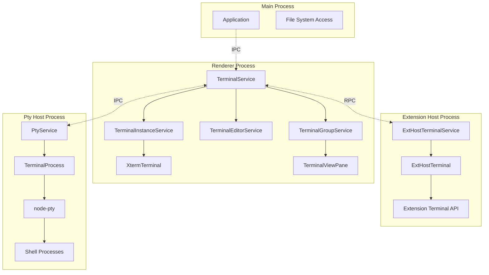
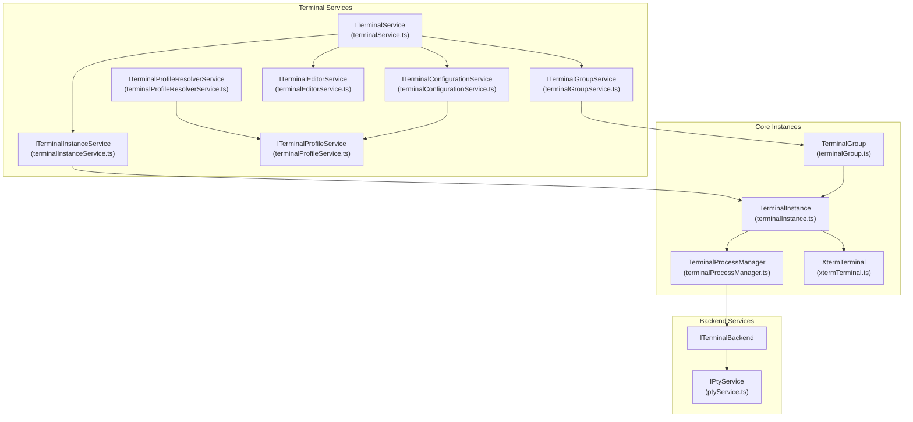
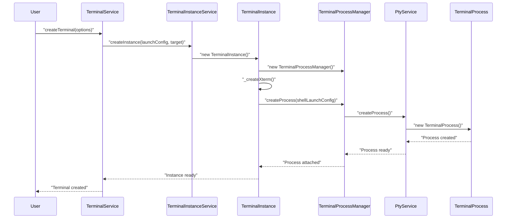
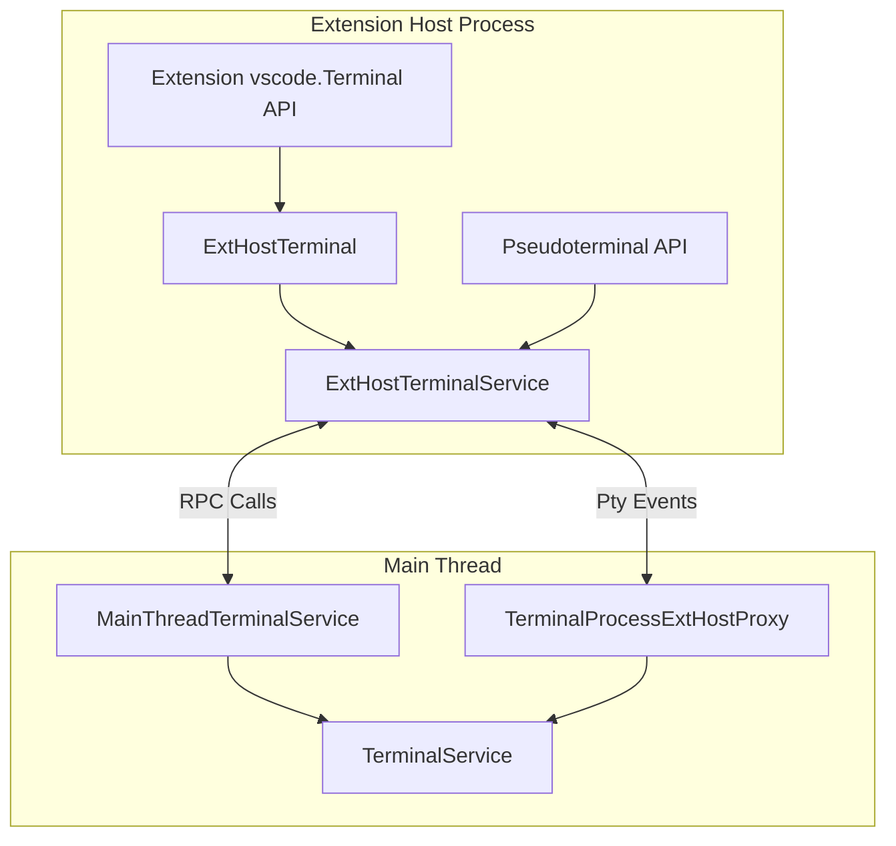

# Integrated Terminal

Relevant source files

The following files were used as context for generating this wiki page:

- [src/vs/platform/terminal/common/terminal.ts](src/vs/platform/terminal/common/terminal.ts)
- [src/vs/platform/terminal/node/ptyHostService.ts](src/vs/platform/terminal/node/ptyHostService.ts)
- [src/vs/platform/terminal/node/ptyService.ts](src/vs/platform/terminal/node/ptyService.ts)
- [src/vs/platform/terminal/node/terminalProcess.ts](src/vs/platform/terminal/node/terminalProcess.ts)
- [src/vs/workbench/api/browser/mainThreadTerminalService.ts](src/vs/workbench/api/browser/mainThreadTerminalService.ts)
- [src/vs/workbench/api/common/extHostTerminalService.ts](src/vs/workbench/api/common/extHostTerminalService.ts)
- [src/vs/workbench/api/node/extHostTerminalService.ts](src/vs/workbench/api/node/extHostTerminalService.ts)
- [src/vs/workbench/contrib/terminal/browser/media/terminal.css](src/vs/workbench/contrib/terminal/browser/media/terminal.css)
- [src/vs/workbench/contrib/terminal/browser/media/xterm.css](src/vs/workbench/contrib/terminal/browser/media/xterm.css)
- [src/vs/workbench/contrib/terminal/browser/remotePty.ts](src/vs/workbench/contrib/terminal/browser/remotePty.ts)
- [src/vs/workbench/contrib/terminal/browser/terminal.contribution.ts](src/vs/workbench/contrib/terminal/browser/terminal.contribution.ts)
- [src/vs/workbench/contrib/terminal/browser/terminal.ts](src/vs/workbench/contrib/terminal/browser/terminal.ts)
- [src/vs/workbench/contrib/terminal/browser/terminalActions.ts](src/vs/workbench/contrib/terminal/browser/terminalActions.ts)
- [src/vs/workbench/contrib/terminal/browser/terminalEditor.ts](src/vs/workbench/contrib/terminal/browser/terminalEditor.ts)
- [src/vs/workbench/contrib/terminal/browser/terminalEditorInput.ts](src/vs/workbench/contrib/terminal/browser/terminalEditorInput.ts)
- [src/vs/workbench/contrib/terminal/browser/terminalEditorService.ts](src/vs/workbench/contrib/terminal/browser/terminalEditorService.ts)
- [src/vs/workbench/contrib/terminal/browser/terminalGroup.ts](src/vs/workbench/contrib/terminal/browser/terminalGroup.ts)
- [src/vs/workbench/contrib/terminal/browser/terminalGroupService.ts](src/vs/workbench/contrib/terminal/browser/terminalGroupService.ts)
- [src/vs/workbench/contrib/terminal/browser/terminalInstance.ts](src/vs/workbench/contrib/terminal/browser/terminalInstance.ts)
- [src/vs/workbench/contrib/terminal/browser/terminalMenus.ts](src/vs/workbench/contrib/terminal/browser/terminalMenus.ts)
- [src/vs/workbench/contrib/terminal/browser/terminalProcessExtHostProxy.ts](src/vs/workbench/contrib/terminal/browser/terminalProcessExtHostProxy.ts)
- [src/vs/workbench/contrib/terminal/browser/terminalProcessManager.ts](src/vs/workbench/contrib/terminal/browser/terminalProcessManager.ts)
- [src/vs/workbench/contrib/terminal/browser/terminalProfileResolverService.ts](src/vs/workbench/contrib/terminal/browser/terminalProfileResolverService.ts)
- [src/vs/workbench/contrib/terminal/browser/terminalProfileService.ts](src/vs/workbench/contrib/terminal/browser/terminalProfileService.ts)
- [src/vs/workbench/contrib/terminal/browser/terminalService.ts](src/vs/workbench/contrib/terminal/browser/terminalService.ts)
- [src/vs/workbench/contrib/terminal/browser/terminalTabbedView.ts](src/vs/workbench/contrib/terminal/browser/terminalTabbedView.ts)
- [src/vs/workbench/contrib/terminal/browser/terminalTabsList.ts](src/vs/workbench/contrib/terminal/browser/terminalTabsList.ts)
- [src/vs/workbench/contrib/terminal/browser/terminalView.ts](src/vs/workbench/contrib/terminal/browser/terminalView.ts)
- [src/vs/workbench/contrib/terminal/browser/xterm/xtermTerminal.ts](src/vs/workbench/contrib/terminal/browser/xterm/xtermTerminal.ts)
- [src/vs/workbench/contrib/terminal/common/terminal.ts](src/vs/workbench/contrib/terminal/common/terminal.ts)
- [src/vs/workbench/contrib/terminal/common/terminalColorRegistry.ts](src/vs/workbench/contrib/terminal/common/terminalColorRegistry.ts)
- [src/vs/workbench/contrib/terminal/common/terminalConfiguration.ts](src/vs/workbench/contrib/terminal/common/terminalConfiguration.ts)
- [src/vs/workbench/contrib/terminal/common/terminalStrings.ts](src/vs/workbench/contrib/terminal/common/terminalStrings.ts)

The Integrated Terminal system provides command-line access directly within VS Code, enabling users to run shell commands, scripts, and development tools without leaving the editor. This system manages terminal processes, user interfaces, extension APIs, and integrates with VS Code's workbench architecture.

For information about terminal contributions and extensions, see the Extension System documentation. For task-related terminal usage, see the Task System documentation.

## Architecture Overview

The terminal system operates across multiple processes and follows VS Code's layered architecture:

### Process Architecture

Sources: [src/vs/workbench/contrib/terminal/browser/terminalService.ts:62-241](), [src/vs/platform/terminal/node/ptyService.ts:71-122](), [src/vs/workbench/api/common/extHostTerminalService.ts:32-61]()

### Core Service Dependencies

Sources: [src/vs/workbench/contrib/terminal/browser/terminal.ts:36-41](), [src/vs/workbench/contrib/terminal/browser/terminalService.ts:170-192](), [src/vs/workbench/contrib/terminal/common/terminal.ts:44-87]()

## Core Services

### TerminalService

The `TerminalService` is the primary orchestrator for all terminal operations, implementing `ITerminalService` and serving as the main entry point for terminal management.

**Key Responsibilities:**
- Creating and disposing terminal instances
- Managing active terminals across panel and editor locations
- Coordinating between different terminal hosts
- Handling terminal reconnection and persistence
- Managing backend connections

**Core Methods:**
- `createTerminal(options?: ICreateTerminalOptions): Promise<ITerminalInstance>`
- `getActiveOrCreateInstance(): Promise<ITerminalInstance>`
- `setActiveInstance(value: ITerminalInstance): void`
- `moveToEditor(source: ITerminalInstance): void`
- `safeDisposeTerminal(instance: ITerminalInstance): Promise<void>`

Sources: [src/vs/workbench/contrib/terminal/browser/terminalService.ts:62-342](), [src/vs/workbench/contrib/terminal/browser/terminal.ts:246-358]()

### TerminalInstance

`TerminalInstance` represents individual terminal instances and manages their lifecycle, UI rendering, and process communication.

**Key Properties:**
- `instanceId: number` - Unique identifier
- `processId: number | undefined` - Shell process ID
- `target: TerminalLocation` - Panel or editor location
- `xterm?: XtermTerminal` - xterm.js wrapper
- `capabilities: ITerminalCapabilityStore` - Terminal capabilities

**Key Events:**
- `onData: Event<string>` - Terminal output data
- `onExit: Event<number | ITerminalLaunchError | undefined>` - Process exit
- `onTitleChanged: Event<ITerminalInstance>` - Title updates

Sources: [src/vs/workbench/contrib/terminal/browser/terminalInstance.ts:127-648](), [src/vs/workbench/contrib/terminal/browser/terminal.ts:477-766]()

### TerminalProcessManager

`TerminalProcessManager` handles the communication between terminal instances and their underlying processes, managing process state and capabilities.

**Process States:**
- `Uninitialized` - Not yet created
- `Launching` - Being created
- `Running` - Active process
- `KilledDuringLaunch` - Failed to start
- `KilledByUser` - User terminated
- `KilledByProcess` - Process terminated itself

**Key Methods:**
- `createProcess(shellLaunchConfig, cols, rows): Promise<ITerminalLaunchError | undefined>`
- `write(data: string): Promise<void>`
- `setDimensions(cols: number, rows: number): Promise<void>`

Sources: [src/vs/workbench/contrib/terminal/browser/terminalProcessManager.ts:70-155](), [src/vs/workbench/contrib/terminal/common/terminal.ts:314-331]()

## Terminal Lifecycle

### Terminal Creation Flow

Sources: [src/vs/workbench/contrib/terminal/browser/terminalService.ts:516-650](), [src/vs/workbench/contrib/terminal/browser/terminalInstance.ts:514-563](), [src/vs/workbench/contrib/terminal/browser/terminalProcessManager.ts:260-380]()

### Process Communication

```mermaid
graph LR
    subgraph "Renderer Process"
        TerminalInstance["TerminalInstance"]
        XtermTerminal["XtermTerminal"]
        TerminalProcessManager["TerminalProcessManager"]
    end
    
    subgraph "Pty Host Process"
        PtyService["PtyService"]
        TerminalProcess["TerminalProcess"]
        NodePty["node-pty IPty"]
    end
    
    subgraph "Shell Process"
        Shell["bash/zsh/pwsh/cmd"]
    end
    
    TerminalInstance --> XtermTerminal
    TerminalInstance --> TerminalProcessManager
    XtermTerminal -->|"onData"| TerminalProcessManager
    TerminalProcessManager -->|"IPC write()"| PtyService
    PtyService --> TerminalProcess
    TerminalProcess -->|"pty.write()"| NodePty
    NodePty --> Shell
    
    Shell -->|"stdout/stderr"| NodePty
    NodePty -->|"onData"| TerminalProcess
    TerminalProcess -->|"_onProcessData"| PtyService
    PtyService -->|"IPC onProcessData"| TerminalProcessManager
    TerminalProcessManager -->|"onProcessData"| XtermTerminal
    XtermTerminal -->|"terminal.write()"| TerminalInstance
```

Sources: [src/vs/workbench/contrib/terminal/browser/terminalProcessManager.ts:680-740](), [src/vs/platform/terminal/node/ptyService.ts:400-450](), [src/vs/platform/terminal/node/terminalProcess.ts:200-300]()

## User Interface Components

### Terminal Panel View

The terminal panel is managed by `TerminalViewPane` which hosts either individual terminals or a tabbed interface through `TerminalTabbedView`.

**Key Components:**
- **TerminalViewPane**: Main panel container implementing `ViewPane`
- **TerminalTabbedView**: Manages tabs and split terminal groups
- **TerminalTabList**: Displays terminal tabs with status indicators
- **TerminalGroup**: Container for related terminal instances

Sources: [src/vs/workbench/contrib/terminal/browser/terminalView.ts:56-400](), [src/vs/workbench/contrib/terminal/browser/terminalTabbedView.ts:37-150]()

### Terminal Editor

Terminals can also appear as editors through `TerminalEditor`, managed by `TerminalEditorService`.

**Editor Integration:**
- Implements `EditorPane` interface
- Uses `TerminalEditorInput` as input type
- Supports multi-group editor layouts
- Handles editor-specific actions and context menus

Sources: [src/vs/workbench/contrib/terminal/browser/terminalEditor.ts:30-200](), [src/vs/workbench/contrib/terminal/browser/terminalEditorService.ts:20-150]()

### XtermTerminal Integration

`XtermTerminal` wraps the xterm.js library and provides VS Code-specific functionality:

**Key Features:**
- Theme integration with VS Code colors
- Font and rendering configuration
- Clipboard integration
- Accessibility support
- Shell integration addons
- Search and navigation

**Core Addons:**
- `SearchAddon` - Find in terminal
- `Unicode11Addon` - Unicode support
- `WebglAddon` - GPU acceleration
- `ShellIntegrationAddon` - Command tracking
- `DecorationAddon` - Visual decorations

Sources: [src/vs/workbench/contrib/terminal/browser/xterm/xtermTerminal.ts:70-400](), [src/vs/workbench/contrib/terminal/browser/xterm/xtermTerminal.ts:800-1000]()

## Extension API Integration

### Extension Host Communication

Sources: [src/vs/workbench/api/common/extHostTerminalService.ts:80-200](), [src/vs/workbench/api/browser/mainThreadTerminalService.ts:30-150](), [src/vs/workbench/contrib/terminal/browser/terminalProcessExtHostProxy.ts:20-100]()

### Extension API Surface

The extension API provides several interfaces for terminal integration:

**Terminal Creation:**
- `vscode.window.createTerminal(options?: TerminalOptions): Terminal`
- `vscode.window.createTerminalFromOptions(options: ExtensionTerminalOptions): Terminal`

**Terminal Control:**
- `Terminal.sendText(text: string, shouldExecute?: boolean): void`
- `Terminal.show(preserveFocus?: boolean): void`
- `Terminal.dispose(): void`

**Pseudoterminal Implementation:**
- `Pseudoterminal` interface for custom terminal backends
- `onDidWriteData` and `onDidChangeDimensions` events
- `handleInput(data: string): void` method

Sources: [src/vs/workbench/api/common/extHostTerminalService.ts:82-163](), [src/vs/workbench/api/common/extHostTerminalService.ts:540-700]()

## Configuration and Profiles

### Terminal Configuration

Terminal behavior is managed through `TerminalConfigurationService` which handles:

**Font Settings:**
- `terminal.integrated.fontFamily`
- `terminal.integrated.fontSize`
- `terminal.integrated.lineHeight`
- `terminal.integrated.letterSpacing`

**Shell Configuration:**
- `terminal.integrated.defaultProfile.*`
- `terminal.integrated.profiles.*`
- `terminal.integrated.shell.*` (legacy)

**Behavior Settings:**
- `terminal.integrated.confirmOnKill`
- `terminal.integrated.enablePersistentSessions`
- `terminal.integrated.splitCwd`

Sources: [src/vs/workbench/contrib/terminal/common/terminalConfiguration.ts:43-500](), [src/vs/workbench/contrib/terminal/browser/terminalConfigurationService.ts:20-200]()

### Profile Management

`TerminalProfileService` manages terminal profiles across platforms:

**Profile Resolution:**
- Detects available shells on the system
- Resolves profile-specific settings
- Handles contributed profiles from extensions
- Manages profile icons and colors

**Profile Types:**
- Built-in profiles (bash, zsh, PowerShell, etc.)
- User-configured profiles
- Extension-contributed profiles
- Automation profiles for tasks

Sources: [src/vs/workbench/contrib/terminal/browser/terminalProfileService.ts:50-200](), [src/vs/workbench/contrib/terminal/browser/terminalProfileResolverService.ts:30-150]()