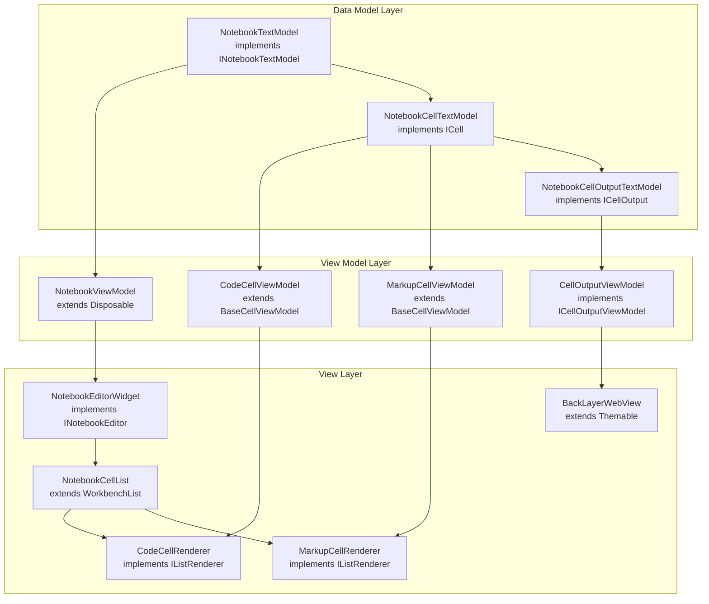
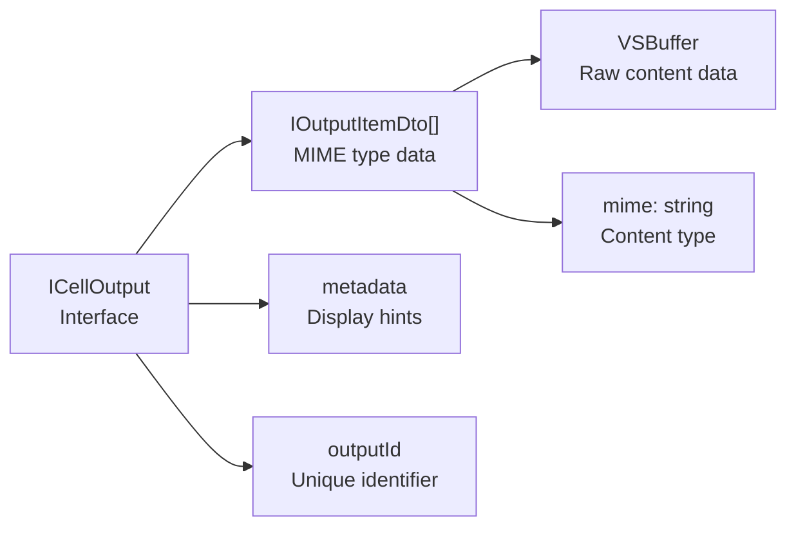
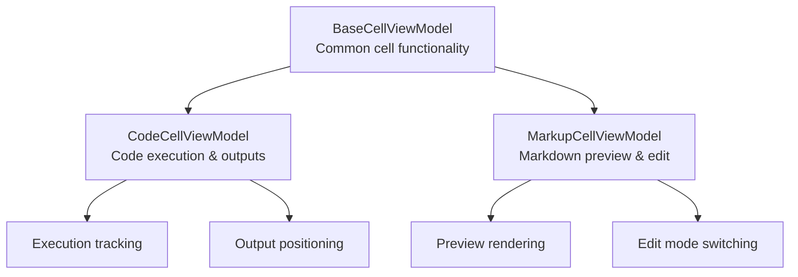
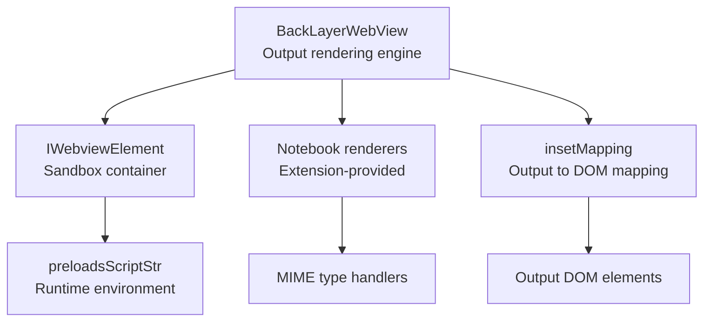
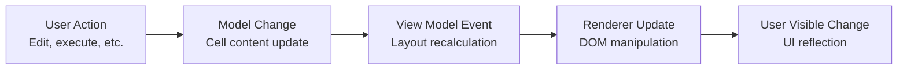

# Notebook Model and Components

Relevant source files

The following files were used as context for generating this wiki page:

- [src/vs/workbench/api/browser/mainThreadNotebook.ts](src/vs/workbench/api/browser/mainThreadNotebook.ts)
- [src/vs/workbench/api/common/extHostNotebook.ts](src/vs/workbench/api/common/extHostNotebook.ts)
- [src/vs/workbench/contrib/notebook/browser/media/notebook.css](src/vs/workbench/contrib/notebook/browser/media/notebook.css)
- [src/vs/workbench/contrib/notebook/browser/notebook.contribution.ts](src/vs/workbench/contrib/notebook/browser/notebook.contribution.ts)
- [src/vs/workbench/contrib/notebook/browser/notebookBrowser.ts](src/vs/workbench/contrib/notebook/browser/notebookBrowser.ts)
- [src/vs/workbench/contrib/notebook/browser/notebookEditor.ts](src/vs/workbench/contrib/notebook/browser/notebookEditor.ts)
- [src/vs/workbench/contrib/notebook/browser/notebookEditorWidget.ts](src/vs/workbench/contrib/notebook/browser/notebookEditorWidget.ts)
- [src/vs/workbench/contrib/notebook/browser/view/notebookCellList.ts](src/vs/workbench/contrib/notebook/browser/view/notebookCellList.ts)
- [src/vs/workbench/contrib/notebook/browser/view/renderers/backLayerWebView.ts](src/vs/workbench/contrib/notebook/browser/view/renderers/backLayerWebView.ts)
- [src/vs/workbench/contrib/notebook/browser/view/renderers/cellRenderer.ts](src/vs/workbench/contrib/notebook/browser/view/renderers/cellRenderer.ts)
- [src/vs/workbench/contrib/notebook/browser/view/renderers/webviewMessages.ts](src/vs/workbench/contrib/notebook/browser/view/renderers/webviewMessages.ts)
- [src/vs/workbench/contrib/notebook/browser/view/renderers/webviewPreloads.ts](src/vs/workbench/contrib/notebook/browser/view/renderers/webviewPreloads.ts)
- [src/vs/workbench/contrib/notebook/browser/viewModel/baseCellViewModel.ts](src/vs/workbench/contrib/notebook/browser/viewModel/baseCellViewModel.ts)
- [src/vs/workbench/contrib/notebook/browser/viewModel/codeCellViewModel.ts](src/vs/workbench/contrib/notebook/browser/viewModel/codeCellViewModel.ts)
- [src/vs/workbench/contrib/notebook/browser/viewModel/markupCellViewModel.ts](src/vs/workbench/contrib/notebook/browser/viewModel/markupCellViewModel.ts)
- [src/vs/workbench/contrib/notebook/common/model/notebookCellTextModel.ts](src/vs/workbench/contrib/notebook/common/model/notebookCellTextModel.ts)
- [src/vs/workbench/contrib/notebook/common/model/notebookTextModel.ts](src/vs/workbench/contrib/notebook/common/model/notebookTextModel.ts)
- [src/vs/workbench/contrib/notebook/common/notebookCommon.ts](src/vs/workbench/contrib/notebook/common/notebookCommon.ts)
- [src/vs/workbench/contrib/notebook/common/notebookEditorModel.ts](src/vs/workbench/contrib/notebook/common/notebookEditorModel.ts)
- [src/vs/workbench/contrib/notebook/common/notebookService.ts](src/vs/workbench/contrib/notebook/common/notebookService.ts)

This document covers the core data model, view model architecture, and rendering components that power VS Code's notebook editor functionality. It focuses on the internal structure of notebooks, cells, and their visual representation.

For information about notebook services and extension APIs, see [Notebook Service](). For details about the notebook editor UI and user interactions, see [Notebook Editor Widget]().

## Core Architecture Overview

The notebook system follows a Model-View-ViewModel (MVVM) pattern with clear separation between data representation, business logic, and UI rendering. The architecture consists of three main layers:

**Data Model Layer**: Represents the notebook document structure and cell content  
**View Model Layer**: Manages UI state and provides computed properties for rendering  
**View Layer**: Handles actual rendering and user interactions through specialized components

### Notebook Model Hierarchy

Sources: [src/vs/workbench/contrib/notebook/common/model/notebookTextModel.ts:295-311](), [src/vs/workbench/contrib/notebook/browser/viewModel/notebookViewModelImpl.ts:73-100](), [src/vs/workbench/contrib/notebook/browser/notebookEditorWidget.ts:138-210](), [src/vs/workbench/contrib/notebook/browser/view/renderers/cellRenderer.ts:112-237]()

## Data Model Components

### NotebookTextModel

The `NotebookTextModel` serves as the primary document model, managing the notebook's cells, metadata, and change events. It implements the `INotebookTextModel` interface and provides the foundation for all notebook operations.

Key responsibilities:
- Cell collection management (`cells` property)
- Document metadata handling (`metadata` property)  
- Change tracking and events (`onDidChangeContent`)
- Undo/redo coordination with cell-level operations
- Snapshot creation for backup/restore scenarios

### NotebookCellTextModel

Individual cells are represented by `NotebookCellTextModel`, which wraps the text content and metadata for each cell:

- **Content Management**: Maintains the cell's source code or markdown text
- **Output Handling**: Manages execution outputs for code cells (`outputs` property)
- **Metadata Storage**: Cell-specific metadata and internal execution state
- **Language Services**: Integration with Monaco editor for language features

### Cell Output Model

Cell outputs are managed through the `ICellOutput` interface and `NotebookCellOutputTextModel` implementation:

Sources: [src/vs/workbench/contrib/notebook/common/model/notebookTextModel.ts:295-311](), [src/vs/workbench/contrib/notebook/common/model/notebookCellTextModel.ts:25-50](), [src/vs/workbench/contrib/notebook/common/notebookCommon.ts:229-245]()

## View Model Architecture

### NotebookViewModel

The `NotebookViewModel` bridges the data model and UI components, providing:

- **Cell View Management**: Maintains `viewCells` array of cell view models
- **Selection State**: Tracks focused and selected cells
- **Layout Information**: Manages notebook-level layout properties
- **Folding Support**: Handles cell folding and hidden ranges
- **Change Propagation**: Converts model events to view events

### Cell View Models

Cell view models extend `BaseCellViewModel` and provide cell-specific UI state:

#### CodeCellViewModel
- **Execution State**: Tracks running/idle status and execution results
- **Output Layout**: Manages output container sizing and positioning  
- **Editor Integration**: Coordinates with Monaco editor instances
- **Collapse State**: Handles input/output expansion/collapse

#### MarkupCellViewModel  
- **Preview Rendering**: Manages markdown rendering and height calculation
- **Edit State**: Switches between preview and edit modes
- **Layout Optimization**: Handles dynamic height based on content

Sources: [src/vs/workbench/contrib/notebook/browser/viewModel/baseCellViewModel.ts:30-50](), [src/vs/workbench/contrib/notebook/browser/viewModel/codeCellViewModel.ts:30-51](), [src/vs/workbench/contrib/notebook/browser/viewModel/markupCellViewModel.ts:22-40]()

## Rendering Components

### NotebookEditorWidget

The main editor container orchestrates all notebook UI components:

- **Cell List Management**: Uses `NotebookCellList` for virtualized rendering
- **Webview Coordination**: Manages `BackLayerWebView` for output rendering
- **Focus Management**: Handles focus between cells and outputs
- **Event Coordination**: Bridges view model events to UI updates

### Cell Renderers

Cell rendering is handled by specialized renderer classes:

#### CodeCellRenderer
- **Template Management**: Creates reusable DOM templates for code cells
- **Editor Integration**: Embeds Monaco editors using `NotebookCellEditorPool`
- **Toolbar Rendering**: Manages cell action toolbars and execution buttons
- **Output Container**: Provides mounting points for output rendering

#### MarkupCellRenderer
- **Preview Container**: Manages markdown preview rendering area
- **Edit Mode Support**: Switches between preview and editor modes
- **Content Sizing**: Handles dynamic height based on rendered content

### BackLayerWebView

Output rendering is delegated to a specialized webview component:

Sources: [src/vs/workbench/contrib/notebook/browser/notebookEditorWidget.ts:138-250](), [src/vs/workbench/contrib/notebook/browser/view/renderers/cellRenderer.ts:112-136](), [src/vs/workbench/contrib/notebook/browser/view/renderers/backLayerWebView.ts:128-150]()

## Key Interfaces and Contracts

### INotebookEditor Interface

The primary editor interface defines the contract for notebook editor implementations:

| Property/Method | Purpose |
|----------------|---------|
| `textModel` | Access to underlying `NotebookTextModel` |
| `viewModel` | Access to `NotebookViewModel` for UI state |
| `activeCodeEditor` | Currently focused Monaco editor instance |
| `visibleRanges` | Currently visible cell ranges for virtualization |
| `focusNotebookCell()` | Programmatic cell focus management |
| `executeNotebookCells()` | Cell execution coordination |

### ICellViewModel Interface

Cell view models implement this interface for consistent behavior:

| Property/Method | Purpose |
|----------------|---------|
| `model` | Reference to underlying `NotebookCellTextModel` |
| `layoutInfo` | Cell layout dimensions and positioning |
| `focusMode` | Current focus state (editor, container, output) |
| `outputsViewModels` | Array of output view models |
| `onDidChangeLayout` | Layout change event for rerendering |

### INotebookWebviewMessage

Communication between the editor and output webview uses a message-based protocol:

| Message Type | Purpose |
|-------------|---------|
| `dimension` | Output size updates for layout calculation |
| `outputFocus`/`outputBlur` | Focus state changes in outputs |
| `scroll-to-reveal` | Coordinate scrolling between editor and webview |
| `clicked-link` | Handle link navigation from rendered outputs |

Sources: [src/vs/workbench/contrib/notebook/browser/notebookBrowser.ts:512-625](), [src/vs/workbench/contrib/notebook/browser/notebookBrowser.ts:240-286](), [src/vs/workbench/contrib/notebook/browser/view/renderers/webviewMessages.ts:10-50]()

## Cell Lifecycle and State Management

### Cell Creation and Initialization

New cells follow a standardized creation process:

1. **Model Creation**: `NotebookCellTextModel` instantiation with cell data
2. **View Model Wrapping**: Creation of appropriate `CellViewModel` subclass  
3. **Renderer Assignment**: Association with `CodeCellRenderer` or `MarkupCellRenderer`
4. **Editor Integration**: Monaco editor creation and configuration
5. **Event Wire-up**: Connection of model/view model events to UI updates

### State Synchronization

The notebook system maintains consistency between layers through event propagation:

Sources: [src/vs/workbench/contrib/notebook/browser/view/renderers/cellRenderer.ts:210-235](), [src/vs/workbench/contrib/notebook/browser/viewModel/notebookViewModelImpl.ts:200-250]()

## Output Rendering Pipeline

### MIME Type Resolution

Output rendering begins with MIME type negotiation:

1. **Available Types**: Extract MIME types from `ICellOutput.outputs`
2. **Renderer Matching**: Find compatible notebook renderers via `INotebookRendererInfo`
3. **Priority Ordering**: Apply user preferences and renderer capabilities
4. **Fallback Handling**: Default to built-in text/HTML renderers if needed

### Webview Integration

Rich outputs are rendered in the `BackLayerWebView` component:

- **Sandboxing**: Isolated execution environment for renderer scripts
- **Message Protocol**: Bi-directional communication for sizing and events
- **Resource Loading**: Secure loading of renderer assets and dependencies
- **DOM Management**: Output element lifecycle and cleanup

Sources: [src/vs/workbench/contrib/notebook/browser/view/renderers/backLayerWebView.ts:501-525](), [src/vs/workbench/contrib/notebook/browser/notebookBrowser.ts:104-123]()