# Notebook Editor

Relevant source files

The following files were used as context for generating this wiki page:

- [src/vs/workbench/api/browser/mainThreadNotebook.ts](src/vs/workbench/api/browser/mainThreadNotebook.ts)
- [src/vs/workbench/api/common/extHostNotebook.ts](src/vs/workbench/api/common/extHostNotebook.ts)
- [src/vs/workbench/contrib/notebook/browser/media/notebook.css](src/vs/workbench/contrib/notebook/browser/media/notebook.css)
- [src/vs/workbench/contrib/notebook/browser/notebook.contribution.ts](src/vs/workbench/contrib/notebook/browser/notebook.contribution.ts)
- [src/vs/workbench/contrib/notebook/browser/notebookBrowser.ts](src/vs/workbench/contrib/notebook/browser/notebookBrowser.ts)
- [src/vs/workbench/contrib/notebook/browser/notebookEditor.ts](src/vs/workbench/contrib/notebook/browser/notebookEditor.ts)
- [src/vs/workbench/contrib/notebook/browser/notebookEditorWidget.ts](src/vs/workbench/contrib/notebook/browser/notebookEditorWidget.ts)
- [src/vs/workbench/contrib/notebook/browser/view/notebookCellList.ts](src/vs/workbench/contrib/notebook/browser/view/notebookCellList.ts)
- [src/vs/workbench/contrib/notebook/browser/view/renderers/backLayerWebView.ts](src/vs/workbench/contrib/notebook/browser/view/renderers/backLayerWebView.ts)
- [src/vs/workbench/contrib/notebook/browser/view/renderers/cellRenderer.ts](src/vs/workbench/contrib/notebook/browser/view/renderers/cellRenderer.ts)
- [src/vs/workbench/contrib/notebook/browser/view/renderers/webviewMessages.ts](src/vs/workbench/contrib/notebook/browser/view/renderers/webviewMessages.ts)
- [src/vs/workbench/contrib/notebook/browser/view/renderers/webviewPreloads.ts](src/vs/workbench/contrib/notebook/browser/view/renderers/webviewPreloads.ts)
- [src/vs/workbench/contrib/notebook/browser/viewModel/baseCellViewModel.ts](src/vs/workbench/contrib/notebook/browser/viewModel/baseCellViewModel.ts)
- [src/vs/workbench/contrib/notebook/browser/viewModel/codeCellViewModel.ts](src/vs/workbench/contrib/notebook/browser/viewModel/codeCellViewModel.ts)
- [src/vs/workbench/contrib/notebook/browser/viewModel/markupCellViewModel.ts](src/vs/workbench/contrib/notebook/browser/viewModel/markupCellViewModel.ts)
- [src/vs/workbench/contrib/notebook/common/model/notebookCellTextModel.ts](src/vs/workbench/contrib/notebook/common/model/notebookCellTextModel.ts)
- [src/vs/workbench/contrib/notebook/common/model/notebookTextModel.ts](src/vs/workbench/contrib/notebook/common/model/notebookTextModel.ts)
- [src/vs/workbench/contrib/notebook/common/notebookCommon.ts](src/vs/workbench/contrib/notebook/common/notebookCommon.ts)
- [src/vs/workbench/contrib/notebook/common/notebookEditorModel.ts](src/vs/workbench/contrib/notebook/common/notebookEditorModel.ts)
- [src/vs/workbench/contrib/notebook/common/notebookService.ts](src/vs/workbench/contrib/notebook/common/notebookService.ts)

This document covers the Notebook Editor system in VS Code, which provides the interactive editing experience for Jupyter notebooks and other notebook formats. The Notebook Editor enables users to create, edit, and execute code and markdown cells within a unified interface.

The scope includes the editor widget architecture, cell rendering pipeline, webview integration for outputs, and the underlying data models. For information about notebook services and kernel management, see [Notebook System](#6.1). For details about the extension API for notebooks, refer to the Extension System documentation.

## Architecture Overview

The Notebook Editor follows a layered architecture with clear separation between the editor pane, widget implementation, cell management, and underlying data models.

### High-Level Component Structure

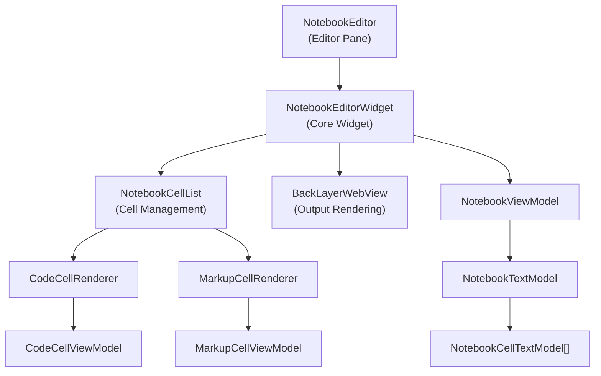

Sources: [src/vs/workbench/contrib/notebook/browser/notebookEditor.ts:54-105](), [src/vs/workbench/contrib/notebook/browser/notebookEditorWidget.ts:138-471](), [src/vs/workbench/contrib/notebook/browser/view/notebookCellList.ts:80-131]()

### Editor Pane and Widget Separation

The `NotebookEditor` serves as the editor pane that integrates with VS Code's editor system, while `NotebookEditorWidget` contains the actual notebook editing implementation.

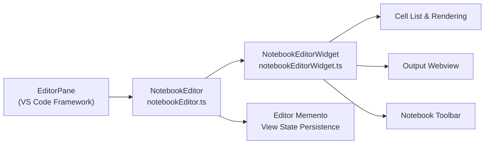

Sources: [src/vs/workbench/contrib/notebook/browser/notebookEditor.ts:54-143](), [src/vs/workbench/contrib/notebook/browser/notebookEditorWidget.ts:138-298]()

## Cell Rendering System

The notebook editor uses specialized renderers for different cell types, with a sophisticated rendering pipeline that handles both code and markup cells.

### Cell Renderer Architecture

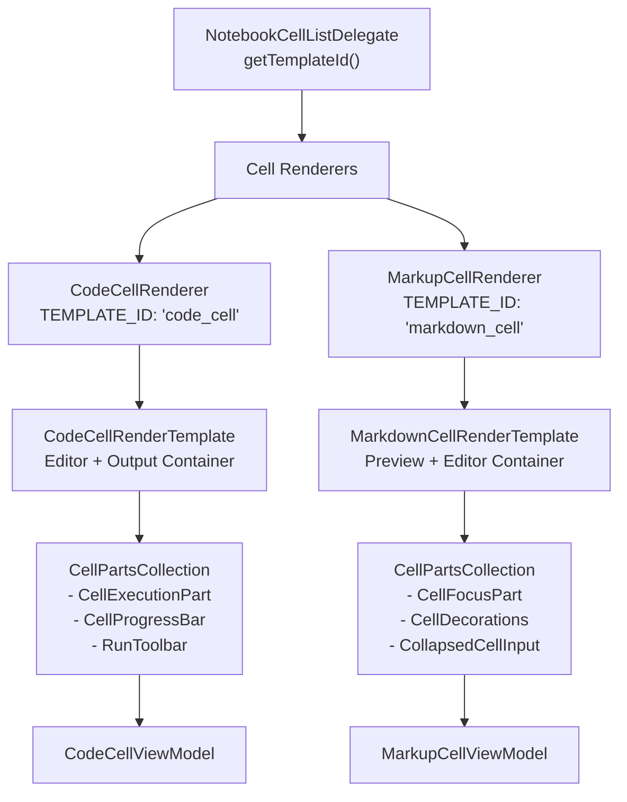

Sources: [src/vs/workbench/contrib/notebook/browser/view/renderers/cellRenderer.ts:57-85](), [src/vs/workbench/contrib/notebook/browser/view/renderers/cellRenderer.ts:112-235](), [src/vs/workbench/contrib/notebook/browser/view/renderers/cellRenderer.ts:237-354]()

### Cell Parts System

Each cell is composed of multiple parts that handle different aspects of the cell's functionality and rendering.

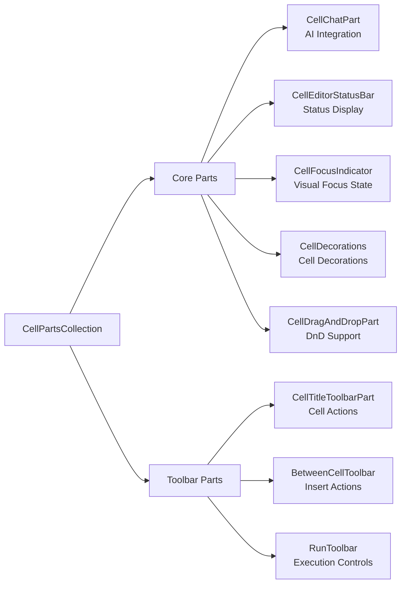

Sources: [src/vs/workbench/contrib/notebook/browser/view/renderers/cellRenderer.ts:175-189](), [src/vs/workbench/contrib/notebook/browser/view/renderers/cellRenderer.ts:298-320]()

## Output Rendering and Webview Integration

The notebook editor uses a sophisticated webview-based system for rendering cell outputs, particularly for rich content like HTML, images, and interactive widgets.

### BackLayerWebView Architecture

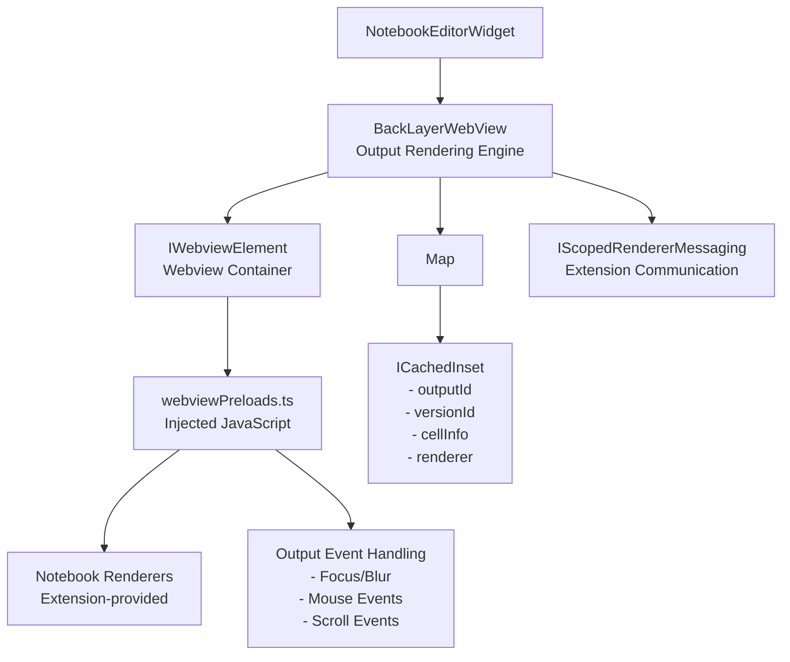

Sources: [src/vs/workbench/contrib/notebook/browser/view/renderers/backLayerWebView.ts:128-225](), [src/vs/workbench/contrib/notebook/browser/view/renderers/webviewPreloads.ts:92-500]()

### Output Rendering Pipeline

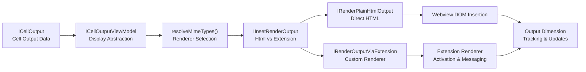

Sources: [src/vs/workbench/contrib/notebook/browser/notebookBrowser.ts:103-121](), [src/vs/workbench/contrib/notebook/browser/view/renderers/backLayerWebView.ts:535-670]()

## Data Model Layer

The notebook editor operates on a multi-layered data model that separates text content, cell metadata, and view state.

### Model Hierarchy

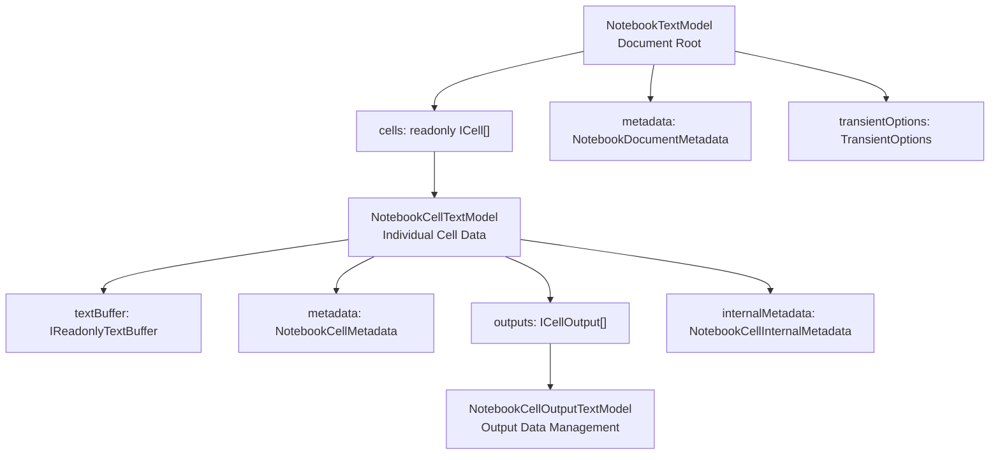

Sources: [src/vs/workbench/contrib/notebook/common/model/notebookTextModel.ts:570-615](), [src/vs/workbench/contrib/notebook/common/model/notebookCellTextModel.ts:25-125]()

### View Model Layer

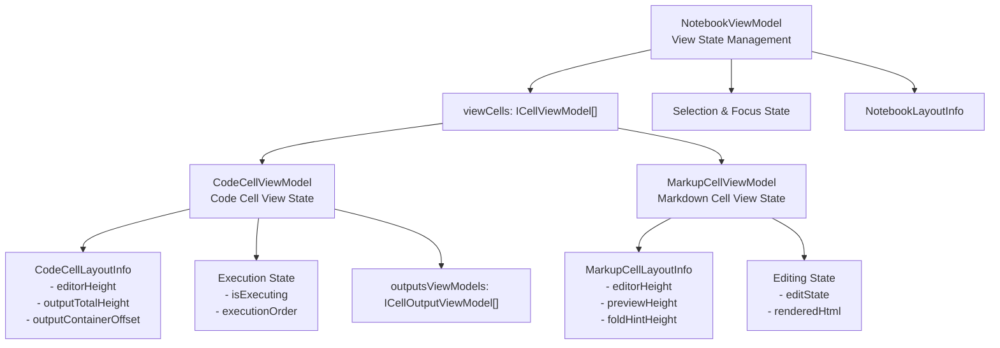

Sources: [src/vs/workbench/contrib/notebook/browser/viewModel/notebookViewModelImpl.ts:40-100](), [src/vs/workbench/contrib/notebook/browser/viewModel/codeCellViewModel.ts:30-125](), [src/vs/workbench/contrib/notebook/browser/viewModel/markupCellViewModel.ts:22-110]()

## Cell List Management

The `NotebookCellList` manages the virtual scrolling and rendering of cells within the notebook editor.

### Cell List Architecture

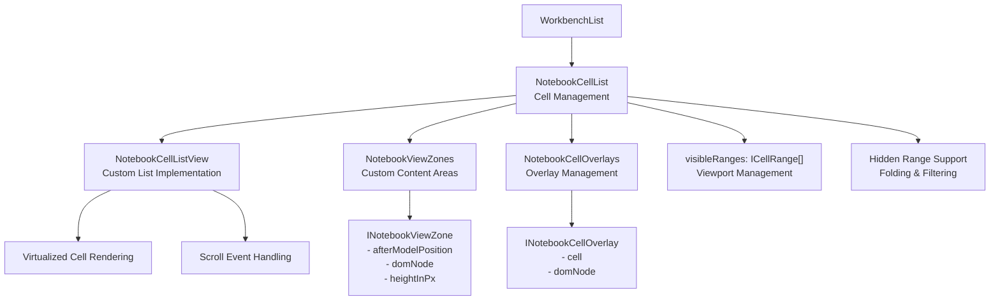

Sources: [src/vs/workbench/contrib/notebook/browser/view/notebookCellList.ts:80-131](), [src/vs/workbench/contrib/notebook/browser/view/notebookCellListView.ts:1-100]()

## Toolbar and UI Components

The notebook editor includes multiple toolbar areas and UI components for notebook and cell-level actions.

### Toolbar System

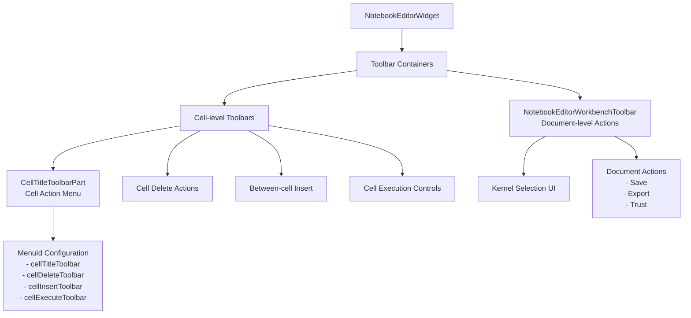

Sources: [src/vs/workbench/contrib/notebook/browser/notebookEditorWidget.ts:189-194](), [src/vs/workbench/contrib/notebook/browser/viewParts/notebookEditorToolbar.ts:1-50]()

## Event System and State Management

The notebook editor uses a sophisticated event system to coordinate between different layers and components.

### Event Flow

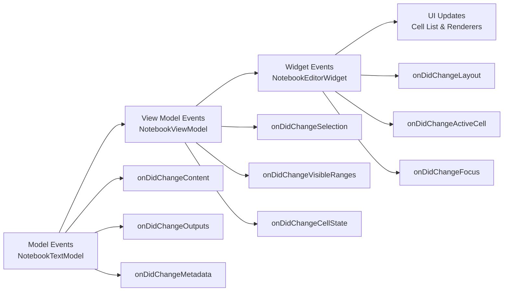

Sources: [src/vs/workbench/contrib/notebook/browser/notebookEditorWidget.ts:140-185](), [src/vs/workbench/contrib/notebook/browser/notebookViewEvents.ts:1-100]()

## Integration Points

The Notebook Editor integrates with various VS Code systems and provides extension points for customization.

### Extension Integration

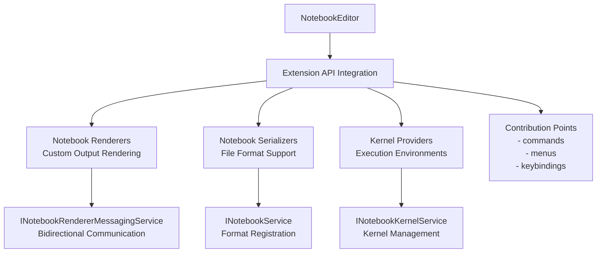

Sources: [src/vs/workbench/contrib/notebook/browser/notebookEditorWidget.ts:309-361](), [src/vs/workbench/contrib/notebook/common/notebookRendererMessagingService.ts:1-50]()

The Notebook Editor provides a comprehensive editing experience for interactive documents, combining rich text editing, code execution, and extensible output rendering in a unified interface that integrates seamlessly with VS Code's editor framework.