# Chat System Architecture

<details>
<summary>Relevant source files</summary>

The following files were used as context for generating this wiki page:

- [extensions/vscode-api-tests/src/singlefolder-tests/chat.test.ts](extensions/vscode-api-tests/src/singlefolder-tests/chat.test.ts)
- [src/vs/base/browser/ui/hover/hoverWidget.css](src/vs/base/browser/ui/hover/hoverWidget.css)
- [src/vs/editor/browser/services/hoverService/hover.css](src/vs/editor/browser/services/hoverService/hover.css)
- [src/vs/workbench/api/browser/mainThreadChatAgents2.ts](src/vs/workbench/api/browser/mainThreadChatAgents2.ts)
- [src/vs/workbench/api/browser/mainThreadChatStatus.ts](src/vs/workbench/api/browser/mainThreadChatStatus.ts)
- [src/vs/workbench/api/common/extHostChatAgents2.ts](src/vs/workbench/api/common/extHostChatAgents2.ts)
- [src/vs/workbench/api/common/extHostChatStatus.ts](src/vs/workbench/api/common/extHostChatStatus.ts)
- [src/vs/workbench/contrib/chat/browser/actions/chatActions.ts](src/vs/workbench/contrib/chat/browser/actions/chatActions.ts)
- [src/vs/workbench/contrib/chat/browser/actions/chatClearActions.ts](src/vs/workbench/contrib/chat/browser/actions/chatClearActions.ts)
- [src/vs/workbench/contrib/chat/browser/actions/chatContextActions.ts](src/vs/workbench/contrib/chat/browser/actions/chatContextActions.ts)
- [src/vs/workbench/contrib/chat/browser/actions/chatDeveloperActions.ts](src/vs/workbench/contrib/chat/browser/actions/chatDeveloperActions.ts)
- [src/vs/workbench/contrib/chat/browser/actions/chatExecuteActions.ts](src/vs/workbench/contrib/chat/browser/actions/chatExecuteActions.ts)
- [src/vs/workbench/contrib/chat/browser/actions/chatGettingStarted.ts](src/vs/workbench/contrib/chat/browser/actions/chatGettingStarted.ts)
- [src/vs/workbench/contrib/chat/browser/actions/chatMoveActions.ts](src/vs/workbench/contrib/chat/browser/actions/chatMoveActions.ts)
- [src/vs/workbench/contrib/chat/browser/actions/chatQuickInputActions.ts](src/vs/workbench/contrib/chat/browser/actions/chatQuickInputActions.ts)
- [src/vs/workbench/contrib/chat/browser/actions/chatTitleActions.ts](src/vs/workbench/contrib/chat/browser/actions/chatTitleActions.ts)
- [src/vs/workbench/contrib/chat/browser/chat.contribution.ts](src/vs/workbench/contrib/chat/browser/chat.contribution.ts)
- [src/vs/workbench/contrib/chat/browser/chat.ts](src/vs/workbench/contrib/chat/browser/chat.ts)
- [src/vs/workbench/contrib/chat/browser/chatEditor.ts](src/vs/workbench/contrib/chat/browser/chatEditor.ts)
- [src/vs/workbench/contrib/chat/browser/chatEditorInput.ts](src/vs/workbench/contrib/chat/browser/chatEditorInput.ts)
- [src/vs/workbench/contrib/chat/browser/chatInputPart.ts](src/vs/workbench/contrib/chat/browser/chatInputPart.ts)
- [src/vs/workbench/contrib/chat/browser/chatListRenderer.ts](src/vs/workbench/contrib/chat/browser/chatListRenderer.ts)
- [src/vs/workbench/contrib/chat/browser/chatQuick.ts](src/vs/workbench/contrib/chat/browser/chatQuick.ts)
- [src/vs/workbench/contrib/chat/browser/chatSetup.ts](src/vs/workbench/contrib/chat/browser/chatSetup.ts)
- [src/vs/workbench/contrib/chat/browser/chatStatus.ts](src/vs/workbench/contrib/chat/browser/chatStatus.ts)
- [src/vs/workbench/contrib/chat/browser/chatStatusItemService.ts](src/vs/workbench/contrib/chat/browser/chatStatusItemService.ts)
- [src/vs/workbench/contrib/chat/browser/chatViewPane.ts](src/vs/workbench/contrib/chat/browser/chatViewPane.ts)
- [src/vs/workbench/contrib/chat/browser/chatWidget.ts](src/vs/workbench/contrib/chat/browser/chatWidget.ts)
- [src/vs/workbench/contrib/chat/browser/media/chat.css](src/vs/workbench/contrib/chat/browser/media/chat.css)
- [src/vs/workbench/contrib/chat/browser/media/chatStatus.css](src/vs/workbench/contrib/chat/browser/media/chatStatus.css)
- [src/vs/workbench/contrib/chat/common/chatAgents.ts](src/vs/workbench/contrib/chat/common/chatAgents.ts)
- [src/vs/workbench/contrib/chat/common/chatContextKeys.ts](src/vs/workbench/contrib/chat/common/chatContextKeys.ts)
- [src/vs/workbench/contrib/chat/common/chatEntitlementService.ts](src/vs/workbench/contrib/chat/common/chatEntitlementService.ts)
- [src/vs/workbench/contrib/chat/common/chatModel.ts](src/vs/workbench/contrib/chat/common/chatModel.ts)
- [src/vs/workbench/contrib/chat/common/chatService.ts](src/vs/workbench/contrib/chat/common/chatService.ts)
- [src/vs/workbench/contrib/chat/common/chatServiceImpl.ts](src/vs/workbench/contrib/chat/common/chatServiceImpl.ts)
- [src/vs/workbench/contrib/chat/common/chatViewModel.ts](src/vs/workbench/contrib/chat/common/chatViewModel.ts)
- [src/vs/workbench/contrib/chat/common/constants.ts](src/vs/workbench/contrib/chat/common/constants.ts)
- [src/vs/workbench/contrib/chat/test/common/chatService.test.ts](src/vs/workbench/contrib/chat/test/common/chatService.test.ts)
- [src/vs/workbench/contrib/chat/test/common/voiceChatService.test.ts](src/vs/workbench/contrib/chat/test/common/voiceChatService.test.ts)
- [src/vscode-dts/vscode.proposed.chatParticipantAdditions.d.ts](src/vscode-dts/vscode.proposed.chatParticipantAdditions.d.ts)
- [src/vscode-dts/vscode.proposed.chatStatusItem.d.ts](src/vscode-dts/vscode.proposed.chatStatusItem.d.ts)
- [src/vscode-dts/vscode.proposed.defaultChatParticipant.d.ts](src/vscode-dts/vscode.proposed.defaultChatParticipant.d.ts)

</details>


This document covers VS Code's chat system architecture, including UI components, service layer, and agent integration patterns. The chat system provides a conversational interface for interacting with AI assistants like GitHub Copilot through a modular, extensible architecture.

## System Architecture Overview

VS Code's chat system is built on a multi-layered architecture that separates UI components, business logic, and agent integration. The system supports multiple chat modes (Ask, Edit, Agent) and provides extensible patterns for integrating various AI providers.

### High-Level System Architecture

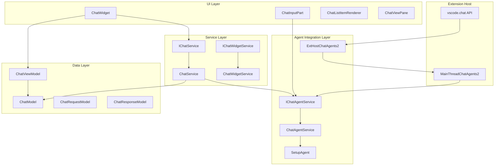

### Core System Components

| Layer | Component | Purpose | Key Implementation |
|-------|-----------|---------|-------------------|
| UI | `ChatWidget` | Main chat container | [chatWidget.ts:106-692]() |
| UI | `ChatInputPart` | User input handling | [chatInputPart.ts:140-1815]() |
| UI | `ChatListItemRenderer` | Message rendering | [chatListRenderer.ts:127-458]() |
| Service | `ChatService` | Message orchestration | [chatServiceImpl.ts:108-756]() |
| Service | `ChatAgentService` | Agent management | [chatAgents.ts:600-950]() |
| Agent | `SetupAgent` | Default agent implementation | [chatSetup.ts:107-194]() |
| Data | `ChatModel` | Session data model | [chatModel.ts:534-1150]() |

Sources:
- [src/vs/workbench/contrib/chat/browser/chatWidget.ts:106-250]()
- [src/vs/workbench/contrib/chat/browser/chatInputPart.ts:140-378]()
- [src/vs/workbench/contrib/chat/common/chatServiceImpl.ts:108-200]()
- [src/vs/workbench/contrib/chat/common/chatAgents.ts:600-750]()
- [src/vs/workbench/contrib/chat/browser/chatSetup.ts:107-194]()

## UI Components

The chat UI is built around several key components that work together to provide the chat experience.

### ChatWidget Architecture

The `ChatWidget` serves as the main container component that orchestrates the chat experience. It implements the `IChatWidget` interface and manages the view model, message list, input handling, and user interactions.

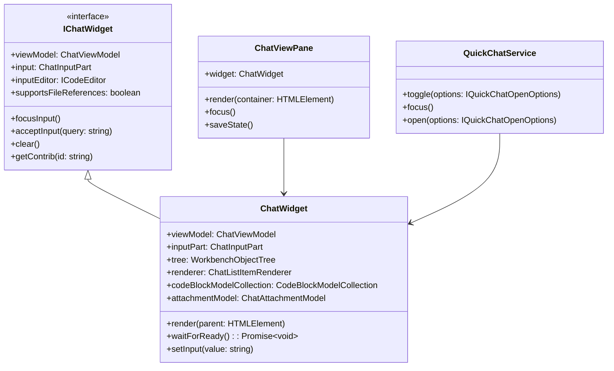

### Widget Registration and Lifecycle

Chat widgets are registered with the `IChatWidgetService` to enable coordination and access patterns:

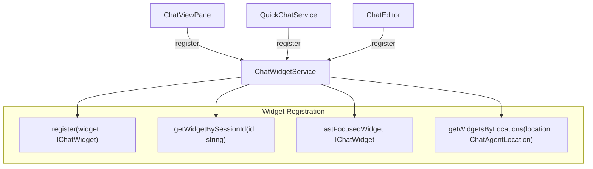

Sources:
- [src/vs/workbench/contrib/chat/browser/chatWidget.ts:106-250]()
- [src/vs/workbench/contrib/chat/browser/chat.ts:28-101]()
- [src/vs/workbench/contrib/chat/browser/chatViewPane.ts:60-150]()
- [src/vs/workbench/contrib/chat/browser/chatQuick.ts:50-200]()

## Chat Input Part

The `ChatInputPart` is a sophisticated component that handles user input. It includes:
- An input editor for text entry
- Support for variable attachments (files, code snippets, etc.)
- UI for showing which mode is active (Ask, Edit, Agent)
- Toolbar with actions (send, switch model, etc.)
- History navigation

### Input Part Structure

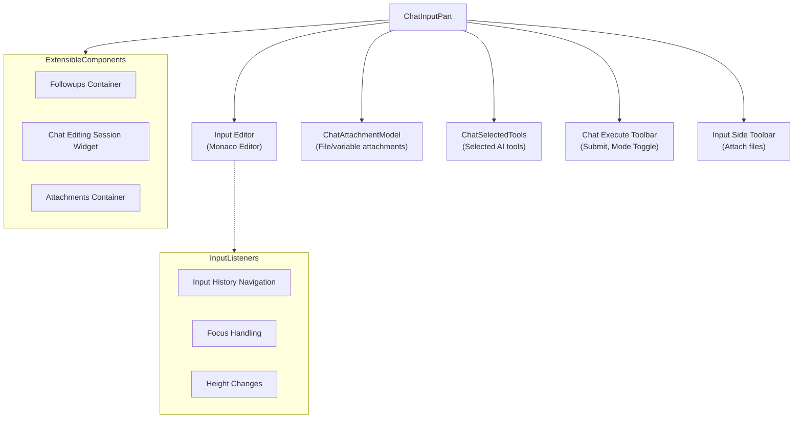

The `ChatInputPart` input section has a modular design to support different features:
- Input editor for text entry with Monaco editor features
- Support for attaching context (files, code snippets, images)
- Followups for suggested responses
- Editing session for showing files being modified

Sources:
- [src/vs/workbench/contrib/chat/browser/chatInputPart.ts:134-1815]()
- [src/vs/workbench/contrib/chat/browser/media/chat.css:583-1092]()

### Input Modes

The chat input supports several modes:

| Mode | Description | UI Components | Primary Action |
|------|-------------|--------------|----------------|
| Ask | Standard chat queries | Text input, context attachments | ChatSubmitAction |
| Edit | Modify workspace files | Text input, working set files | ChatEditingSessionSubmitAction |
| Agent | Tool-augmented responses | Text input, tools selection | ChatAgentSubmitAction |

The input part adapts its UI based on the active mode:

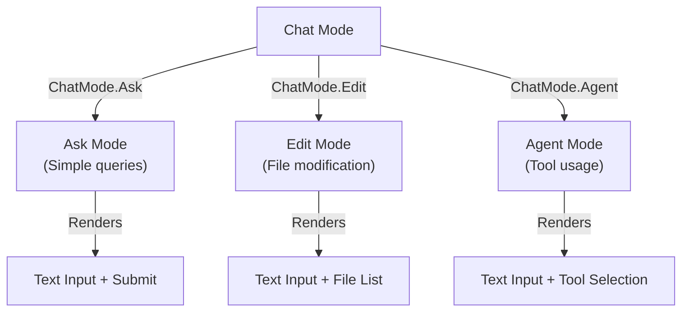

Sources:
- [src/vs/workbench/contrib/chat/browser/actions/chatExecuteActions.ts:50-229]()
- [src/vs/workbench/contrib/chat/browser/chatInputPart.ts:475-497]()
- [src/vs/workbench/contrib/chat/common/constants.ts]()

### Attachments

The input part includes robust support for attachments through the `ChatAttachmentModel`:

| Attachment Type | Description | Icon | Implementation |
|-----------------|-------------|------|----------------|
| File | Workspace file | File icon | IChatRequestFileEntry |
| Directory | Workspace folder | Folder icon | IChatRequestDirectoryEntry |
| Code Paste | Code snippet | Code icon | IChatRequestPasteVariableEntry |
| Image | Image data | Image icon | IImageVariableEntry |
| Tool | AI tool reference | Tool icon | IChatRequestToolEntry |
| Implicit Context | Active editor content | File icon | IChatRequestImplicitVariableEntry |
| Diagnostic | Error information | Error icon | IDiagnosticVariableEntry |

Sources:
- [src/vs/workbench/contrib/chat/common/chatModel.ts:34-211]()
- [src/vs/workbench/contrib/chat/browser/chatInputPart.ts:158-218]()
- [src/vs/workbench/contrib/chat/browser/actions/chatContextActions.ts:68-113]()

## Service Layer

The service layer provides the core business logic and coordination for the chat system. It handles message routing, session management, and integration with various chat agents.

### ChatService Architecture

The `ChatService` orchestrates chat sessions and manages communication between the UI and chat agents:

```mermaid
flowchart TD
    IChatService["IChatService\n(Interface)"]
    ChatService["ChatService\n(Implementation)"]
    
    subgraph "Session Management"
        SessionModels["_sessionModels: DisposableMap~string, ChatModel~"]
        PendingRequests["_pendingRequests: DisposableMap~string, CancellableRequest~"]
        SessionStore["ChatSessionStore"]
    end
    
    subgraph "Request Processing"
        SendRequestWithProgress["sendRequestWithProgress()"]
        AddCompleteRequest["addCompleteRequest()"]
        RemoveRequest["removeRequest()"]
    end
    
    subgraph "Integration Points"
        ChatAgentService["IChatAgentService"]
        LanguageModelsService["ILanguageModelsService"]
        ChatSlashCommandService["IChatSlashCommandService"]
    end
    
    IChatService <|-- ChatService
    ChatService --> SessionModels
    ChatService --> PendingRequests
    ChatService --> SessionStore
    ChatService --> SendRequestWithProgress
    ChatService --> AddCompleteRequest
    ChatService --> RemoveRequest
    
    SendRequestWithProgress --> ChatAgentService
    SendRequestWithProgress --> LanguageModelsService
    ChatService --> ChatSlashCommandService
```

### Request Flow and Processing

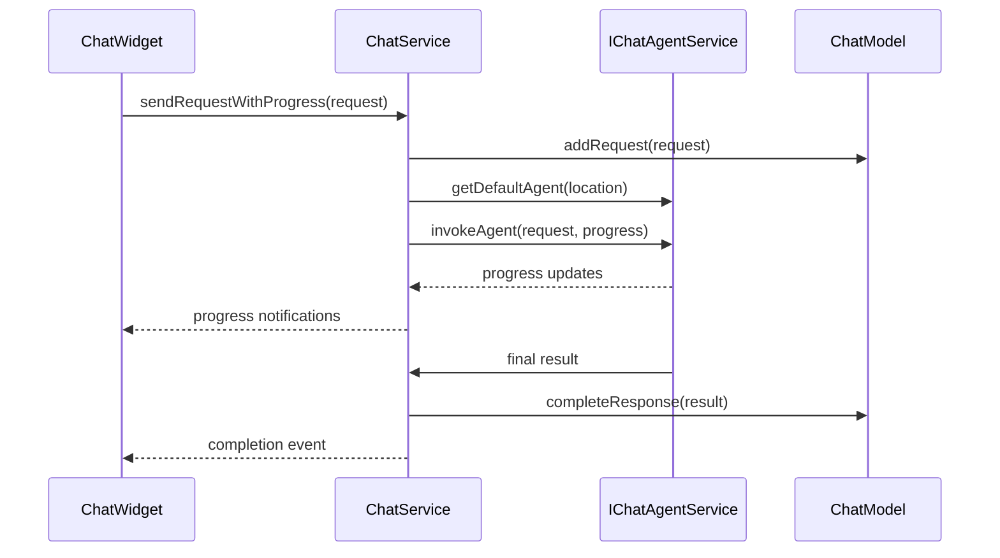

### Service Interface and Capabilities

| Service Method | Purpose | Parameters | Return Type |
|----------------|---------|------------|-------------|
| `sendRequestWithProgress` | Send chat request | `sessionId`, `request`, `options` | `Promise<IChatSendRequestResponseState>` |
| `getHistory` | Get session history | `sessionId` | `IChatModel` |
| `clearSession` | Clear chat session | `sessionId` | `void` |
| `addCompleteRequest` | Add pre-completed request | `sessionId`, `message`, `response` | `void` |
| `removeRequest` | Remove request from session | `sessionId`, `requestId` | `Promise<void>` |

Sources:
- [src/vs/workbench/contrib/chat/common/chatService.ts:280-350]()
- [src/vs/workbench/contrib/chat/common/chatServiceImpl.ts:108-756]()
- [src/vs/workbench/contrib/chat/common/chatModel.ts:534-600]()

### Widget Service Integration

The `IChatWidgetService` manages widget registration and provides access patterns for the UI layer:

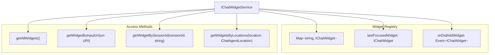

Sources:
- [src/vs/workbench/contrib/chat/browser/chat.ts:28-70]()
- [src/vs/workbench/contrib/chat/browser/chatWidget.ts:536-560]()

## Agent Integration

The agent integration layer provides extensible patterns for integrating various AI providers and chat agents with the VS Code chat system.

### Agent Service Architecture

The `IChatAgentService` manages registration, discovery, and invocation of chat agents:

```mermaid
flowchart TD
    IChatAgentService["IChatAgentService"]
    
    subgraph "Agent Registration"
        RegisterAgent["registerAgent(id: string, data: IChatAgentData)"]
        RegisterImplementation["registerAgentImplementation(id: string, agent: IChatAgentImplementation)"]
        UpdateAgent["updateAgent(id: string, updateMetadata: IChatAgentData)"]
    end
    
    subgraph "Agent Discovery"
        GetAgent["getAgent(id: string)"]
        GetAgents["getAgents()"]
        GetDefaultAgent["getDefaultAgent(location: ChatAgentLocation)"]
        GetActivatedAgents["getActivatedAgents()"]
    end
    
    subgraph "Agent Invocation"
        InvokeAgent["invokeAgent(id: string, request: IChatAgentRequest, progress: Function)"]
        GetAgentsByName["getAgentsByName(name: string)"]
    end
    
    IChatAgentService --> RegisterAgent
    IChatAgentService --> RegisterImplementation
    IChatAgentService --> UpdateAgent
    IChatAgentService --> GetAgent
    IChatAgentService --> GetAgents
    IChatAgentService --> GetDefaultAgent
    IChatAgentService --> GetActivatedAgents
    IChatAgentService --> InvokeAgent
    IChatAgentService --> GetAgentsByName
```

### Agent Implementation Patterns

Chat agents implement the `IChatAgentImplementation` interface and follow specific patterns for integration:

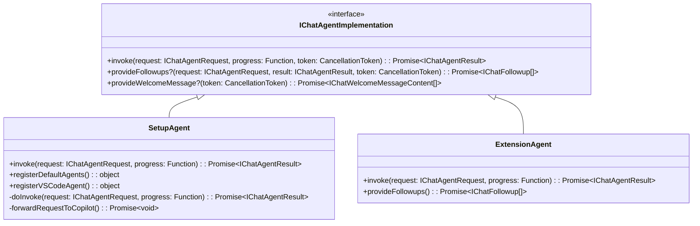

### Extension Host Communication

Chat agents running in extensions communicate with the main thread through the extension host protocol:

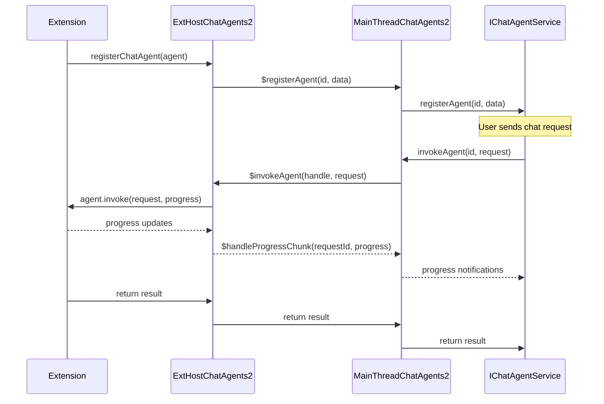

### Agent Registration and Metadata

| Agent Property | Purpose | Example | Required |
|----------------|---------|---------|----------|
| `id` | Unique identifier | `"github.copilot-chat"` | Yes |
| `name` | Display name | `"Copilot"` | Yes |
| `locations` | Supported locations | `[ChatAgentLocation.Panel]` | Yes |
| `modes` | Supported chat modes | `[ChatMode.Ask, ChatMode.Edit]` | No |
| `when` | Activation context | `"config.github.copilot.enable"` | No |
| `slashCommands` | Available commands | `[{name: "explain", description: "..."}]` | No |
| `isDefault` | Default for location | `true` | No |

Sources:
- [src/vs/workbench/contrib/chat/common/chatAgents.ts:600-950]()
- [src/vs/workbench/contrib/chat/browser/chatSetup.ts:107-194]()
- [src/vs/workbench/api/common/extHostChatAgents2.ts:50-200]()
- [src/vs/workbench/api/browser/mainThreadChatAgents2.ts:50-300]()

## Chat Styling

The chat UI uses a consistent styling system defined in CSS:

### Message Containers

```
.interactive-session                     (Main container)
├── .interactive-list                    (Message list)
│   └── .monaco-list-row                 (List row)
│       └── .interactive-item-container  (Message container)
│           ├── .header                  (Contains user info)
│           │   ├── .user                (User section)
│           │   │   ├── .avatar-container (Avatar)
│           │   │   └── .username        (Username)
│           │   └── .monaco-toolbar      (Message toolbar)
│           ├── .value                   (Message content)
│           │   └── .rendered-markdown   (Markdown content)
│           └── .chat-footer-toolbar     (Vote buttons, etc.)
└── .interactive-input-part             (Input container)
    └── .chat-input-container           (Input editor)
```

Sources:
- [src/vs/workbench/contrib/chat/browser/media/chat.css:6-800]()
- [src/vs/workbench/contrib/chat/browser/chatListRenderer.ts:265-307]()

### Input Part Styling

The input part has its own styling structure:

```
.interactive-input-part
├── .chat-input-container               (Main input container)
│   ├── .chat-editor-container          (Editor container)
│   └── .chat-input-toolbars            (Input toolbars container)
│       ├── .chat-execute-toolbar       (Submit button, model picker)
│       └── [other toolbars]
├── .chat-attachments-container         (Attachments area)
│   ├── .chat-attachment-toolbar        (Attachment actions)
│   ├── .chat-attached-context          (Attached files/variables)
│   └── .chat-related-files             (Related files section)
└── .interactive-input-followups        (Followups section)
```

Sources:
- [src/vs/workbench/contrib/chat/browser/media/chat.css:583-948]()
- [src/vs/workbench/contrib/chat/browser/chatInputPart.ts:825-867]()

## Widget Registration and Service Integration

The chat UI components integrate with VS Code's service architecture through several services:

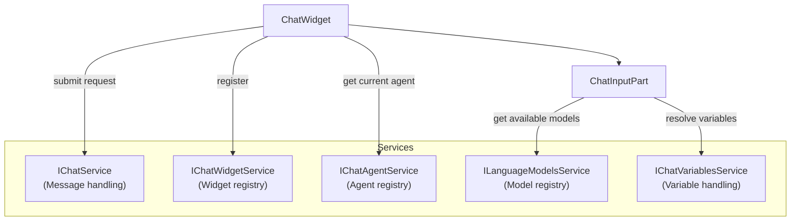

The `ChatWidgetService` serves as a registry for all chat widgets, allowing coordination between them and providing access to the most recently focused widget.

Sources:
- [src/vs/workbench/contrib/chat/browser/chat.ts:28-62]()
- [src/vs/workbench/contrib/chat/browser/chatWidget.ts:482-499]()
- [src/vs/workbench/contrib/chat/browser/chat.contribution.ts:350-443]()

## Conclusion

The VS Code Chat UI Components form a comprehensive and extensible system for conversational interfaces. The architecture employs a modular approach with specialized components for input handling, message rendering, and code block interactions. The system integrates with VS Code services for chat agent management, language model access, and widget registration.

This modular design allows for:
1. Multiple chat implementations (panel, editor, quick chat)
2. Extensibility through custom content parts
3. Rich interactions with code blocks and other content
4. Efficient rendering of large chat histories

Understanding these components provides a foundation for extending VS Code's chat capabilities or implementing similar conversational interfaces.