# Chat and AI Integration

<details>
<summary>Relevant source files</summary>

The following files were used as context for generating this wiki page:

- [extensions/vscode-api-tests/src/singlefolder-tests/chat.test.ts](extensions/vscode-api-tests/src/singlefolder-tests/chat.test.ts)
- [src/vs/base/browser/ui/hover/hoverWidget.css](src/vs/base/browser/ui/hover/hoverWidget.css)
- [src/vs/editor/browser/services/hoverService/hover.css](src/vs/editor/browser/services/hoverService/hover.css)
- [src/vs/workbench/api/browser/mainThreadChatAgents2.ts](src/vs/workbench/api/browser/mainThreadChatAgents2.ts)
- [src/vs/workbench/api/browser/mainThreadChatStatus.ts](src/vs/workbench/api/browser/mainThreadChatStatus.ts)
- [src/vs/workbench/api/common/extHostChatAgents2.ts](src/vs/workbench/api/common/extHostChatAgents2.ts)
- [src/vs/workbench/api/common/extHostChatStatus.ts](src/vs/workbench/api/common/extHostChatStatus.ts)
- [src/vs/workbench/contrib/chat/browser/actions/chatActions.ts](src/vs/workbench/contrib/chat/browser/actions/chatActions.ts)
- [src/vs/workbench/contrib/chat/browser/actions/chatClearActions.ts](src/vs/workbench/contrib/chat/browser/actions/chatClearActions.ts)
- [src/vs/workbench/contrib/chat/browser/actions/chatContextActions.ts](src/vs/workbench/contrib/chat/browser/actions/chatContextActions.ts)
- [src/vs/workbench/contrib/chat/browser/actions/chatDeveloperActions.ts](src/vs/workbench/contrib/chat/browser/actions/chatDeveloperActions.ts)
- [src/vs/workbench/contrib/chat/browser/actions/chatExecuteActions.ts](src/vs/workbench/contrib/chat/browser/actions/chatExecuteActions.ts)
- [src/vs/workbench/contrib/chat/browser/actions/chatGettingStarted.ts](src/vs/workbench/contrib/chat/browser/actions/chatGettingStarted.ts)
- [src/vs/workbench/contrib/chat/browser/actions/chatMoveActions.ts](src/vs/workbench/contrib/chat/browser/actions/chatMoveActions.ts)
- [src/vs/workbench/contrib/chat/browser/actions/chatQuickInputActions.ts](src/vs/workbench/contrib/chat/browser/actions/chatQuickInputActions.ts)
- [src/vs/workbench/contrib/chat/browser/actions/chatTitleActions.ts](src/vs/workbench/contrib/chat/browser/actions/chatTitleActions.ts)
- [src/vs/workbench/contrib/chat/browser/chat.contribution.ts](src/vs/workbench/contrib/chat/browser/chat.contribution.ts)
- [src/vs/workbench/contrib/chat/browser/chat.ts](src/vs/workbench/contrib/chat/browser/chat.ts)
- [src/vs/workbench/contrib/chat/browser/chatEditor.ts](src/vs/workbench/contrib/chat/browser/chatEditor.ts)
- [src/vs/workbench/contrib/chat/browser/chatEditorInput.ts](src/vs/workbench/contrib/chat/browser/chatEditorInput.ts)
- [src/vs/workbench/contrib/chat/browser/chatInputPart.ts](src/vs/workbench/contrib/chat/browser/chatInputPart.ts)
- [src/vs/workbench/contrib/chat/browser/chatListRenderer.ts](src/vs/workbench/contrib/chat/browser/chatListRenderer.ts)
- [src/vs/workbench/contrib/chat/browser/chatQuick.ts](src/vs/workbench/contrib/chat/browser/chatQuick.ts)
- [src/vs/workbench/contrib/chat/browser/chatSetup.ts](src/vs/workbench/contrib/chat/browser/chatSetup.ts)
- [src/vs/workbench/contrib/chat/browser/chatStatus.ts](src/vs/workbench/contrib/chat/browser/chatStatus.ts)
- [src/vs/workbench/contrib/chat/browser/chatStatusItemService.ts](src/vs/workbench/contrib/chat/browser/chatStatusItemService.ts)
- [src/vs/workbench/contrib/chat/browser/chatViewPane.ts](src/vs/workbench/contrib/chat/browser/chatViewPane.ts)
- [src/vs/workbench/contrib/chat/browser/chatWidget.ts](src/vs/workbench/contrib/chat/browser/chatWidget.ts)
- [src/vs/workbench/contrib/chat/browser/media/chat.css](src/vs/workbench/contrib/chat/browser/media/chat.css)
- [src/vs/workbench/contrib/chat/browser/media/chatStatus.css](src/vs/workbench/contrib/chat/browser/media/chatStatus.css)
- [src/vs/workbench/contrib/chat/common/chatAgents.ts](src/vs/workbench/contrib/chat/common/chatAgents.ts)
- [src/vs/workbench/contrib/chat/common/chatContextKeys.ts](src/vs/workbench/contrib/chat/common/chatContextKeys.ts)
- [src/vs/workbench/contrib/chat/common/chatEntitlementService.ts](src/vs/workbench/contrib/chat/common/chatEntitlementService.ts)
- [src/vs/workbench/contrib/chat/common/chatModel.ts](src/vs/workbench/contrib/chat/common/chatModel.ts)
- [src/vs/workbench/contrib/chat/common/chatService.ts](src/vs/workbench/contrib/chat/common/chatService.ts)
- [src/vs/workbench/contrib/chat/common/chatServiceImpl.ts](src/vs/workbench/contrib/chat/common/chatServiceImpl.ts)
- [src/vs/workbench/contrib/chat/common/chatViewModel.ts](src/vs/workbench/contrib/chat/common/chatViewModel.ts)
- [src/vs/workbench/contrib/chat/common/constants.ts](src/vs/workbench/contrib/chat/common/constants.ts)
- [src/vs/workbench/contrib/chat/test/common/chatService.test.ts](src/vs/workbench/contrib/chat/test/common/chatService.test.ts)
- [src/vs/workbench/contrib/chat/test/common/voiceChatService.test.ts](src/vs/workbench/contrib/chat/test/common/voiceChatService.test.ts)
- [src/vscode-dts/vscode.proposed.chatParticipantAdditions.d.ts](src/vscode-dts/vscode.proposed.chatParticipantAdditions.d.ts)
- [src/vscode-dts/vscode.proposed.chatStatusItem.d.ts](src/vscode-dts/vscode.proposed.chatStatusItem.d.ts)
- [src/vscode-dts/vscode.proposed.defaultChatParticipant.d.ts](src/vscode-dts/vscode.proposed.defaultChatParticipant.d.ts)

</details>


VS Code's chat and AI integration system enables conversational AI features including Copilot Chat, inline editing assistance, and agent-based tool execution. The system orchestrates interactions between users and language models through a multi-layered architecture spanning UI components, services, data models, and extension APIs.

The chat system supports multiple interaction modes (`ChatMode.Ask`, `ChatMode.Edit`, `ChatMode.Agent`) and various integration points (`ChatAgentLocation.Panel`, `ChatAgentLocation.Editor`, etc.) throughout the VS Code interface.

## Architecture Overview

The chat system comprises UI components, core services, data models, and extension APIs organized in distinct layers. The architecture bridges user interactions through `ChatWidget` down to language model invocations via `IChatAgentImplementation`.

**Chat System Architecture**

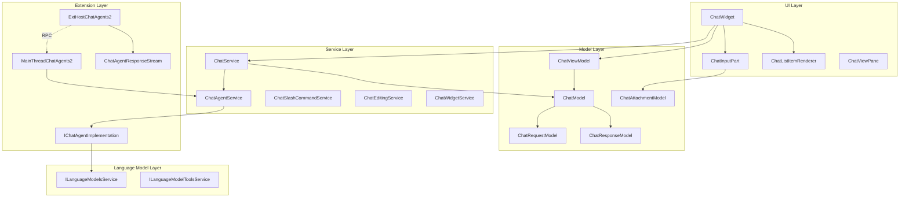

Sources:
- [src/vs/workbench/contrib/chat/browser/chatWidget.ts:106-440]()
- [src/vs/workbench/contrib/chat/common/chatServiceImpl.ts:108-198]()
- [src/vs/workbench/contrib/chat/common/chatAgents.ts:650-720]()
- [src/vs/workbench/contrib/chat/browser/chatInputPart.ts:140-498]()
- [src/vs/workbench/contrib/chat/browser/chatListRenderer.ts:127-200]()

## Chat Request-Response Flow

The chat system processes user inputs and generates responses through a series of interactions between components. This flow starts with user input and ends with a rendered response.

**Chat Request-Response Flow**

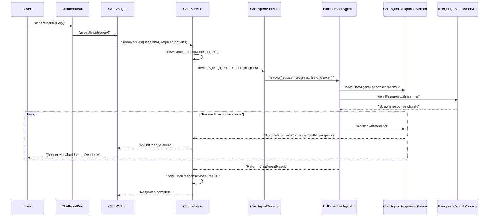

Sources:
- [src/vs/workbench/contrib/chat/browser/chatWidget.ts:1260-1310]()
- [src/vs/workbench/contrib/chat/common/chatServiceImpl.ts:460-580]()
- [src/vs/workbench/contrib/chat/browser/chatInputPart.ts:760-830]()
- [src/vs/workbench/contrib/chat/common/chatAgents.ts:125-145]()

## Key Components

### Chat Widget

`ChatWidget` is the primary UI orchestrator implementing `IChatWidget`. It coordinates between the input area (`ChatInputPart`), message list (`WorkbenchObjectTree<ChatTreeItem>`), and view model (`ChatViewModel`).

Core responsibilities:
- Session lifecycle via `initForNewChatModel()` and `clear()`
- Input processing through `acceptInput()` and `getInput()`
- Message rendering using `ChatListItemRenderer`
- Extension integration via `ChatWidget.CONTRIBS` contributions
- Focus management with `focusInput()` and `hasInputFocus()`

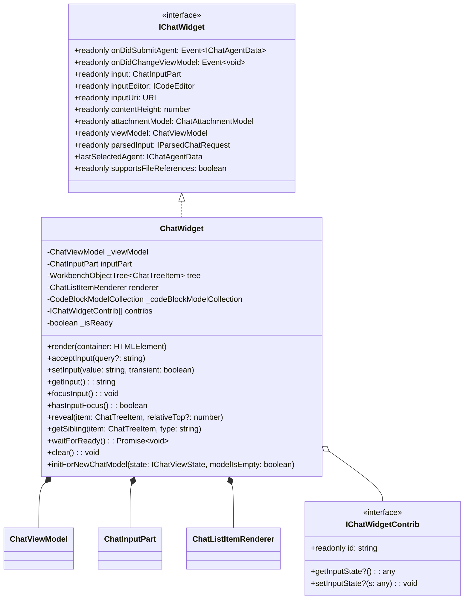

Sources:
- [src/vs/workbench/contrib/chat/browser/chatWidget.ts:106-492]()
- [src/vs/workbench/contrib/chat/browser/chat.ts:98-180]()

### Chat Input Part

`ChatInputPart` manages the input area including the `CodeEditorWidget` for text input, `ChatAttachmentModel` for context variables, and mode switching between `ChatMode.Ask`, `ChatMode.Edit`, and `ChatMode.Agent`.

Key implementation details:
- Input editor via `createInput()` using `PROMPT_LANGUAGE_ID`
- Context collection through `getAttachedAndImplicitContext(sessionId)`
- History navigation using `HistoryNavigator2<IChatHistoryEntry>`
- Mode management via `setChatMode2()` and `currentMode2` property
- Tool selection through `ChatSelectedTools.selectedToolsModel`

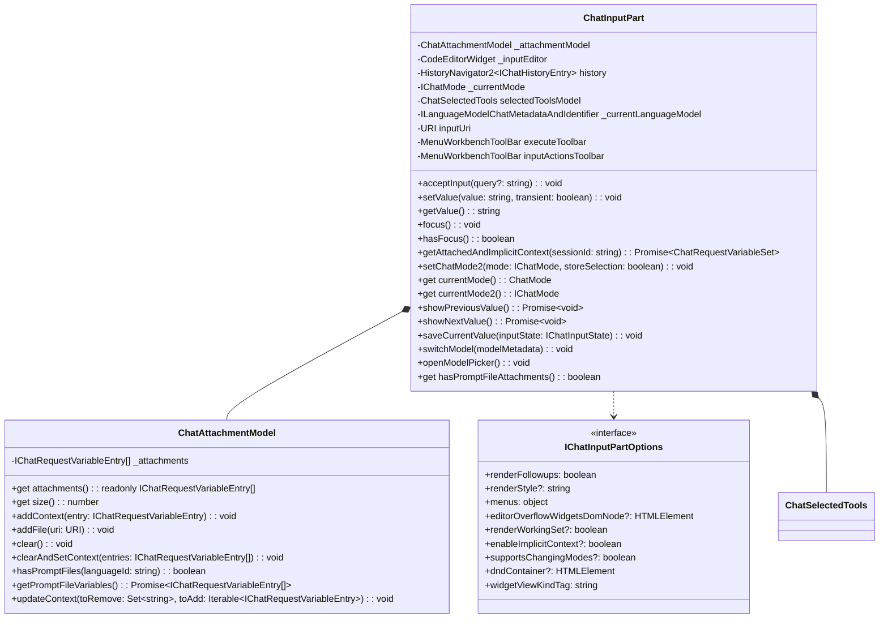

Sources:
- [src/vs/workbench/contrib/chat/browser/chatInputPart.ts:140-498]()
- [src/vs/workbench/contrib/chat/browser/chatInputPart.ts:118-132]()
- [src/vs/workbench/contrib/chat/browser/chatAttachmentModel.ts]()

### Chat Service

`ChatService` implements `IChatService` for session management, request processing, and agent coordination. It maintains session state through `ChatModel` instances and handles persistence via `ChatSessionStore`.

Core methods and data structures:
- Session creation: `startSession(location: ChatAgentLocation, token?: CancellationToken)`
- Request dispatch: `sendRequest(sessionId: string, request: string, options?: IChatSendRequestOptions)`
- Model management: `getSession(sessionId: string)` and `getOrRestoreSession(sessionId: string)`
- Agent invocation: `doSendRequest()` → `invokeAgent()` flow
- Progress handling: `handleProgress()` for streaming responses

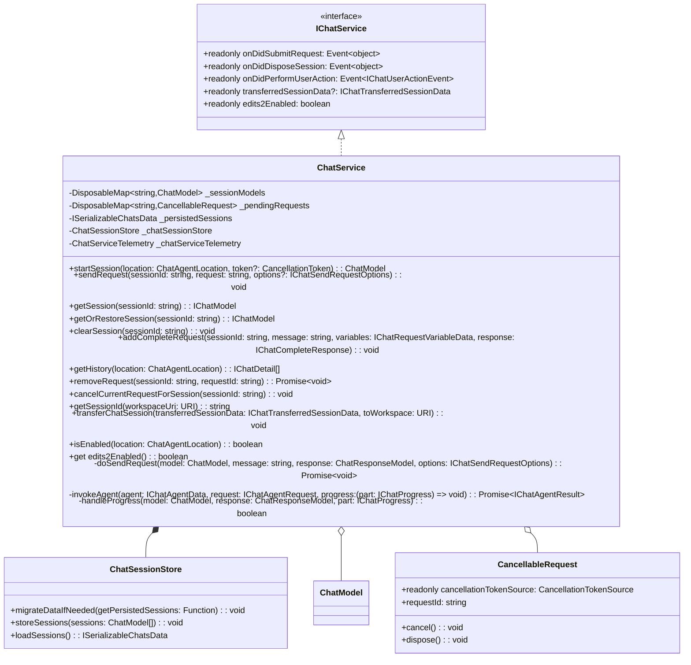

Sources:
- [src/vs/workbench/contrib/chat/common/chatServiceImpl.ts:108-240]()
- [src/vs/workbench/contrib/chat/common/chatServiceImpl.ts:88-106]()
- [src/vs/workbench/contrib/chat/common/chatService.ts:277-400]()

### Chat Agents

Chat agents implement `IChatAgentImplementation` to process user queries through language models. The `ChatAgentService` manages registration, selection, and invocation of agents including default system agents and extension-contributed agents.

Agent system components:
- `ChatAgentService.registerAgent()` for registration with `IChatAgentData`
- `ChatAgentService.invokeAgent()` for request dispatch
- `SetupAgent` for initial setup flow when Copilot isn't configured
- Extension agents via `ExtHostChatAgents2` implementing the agent protocol

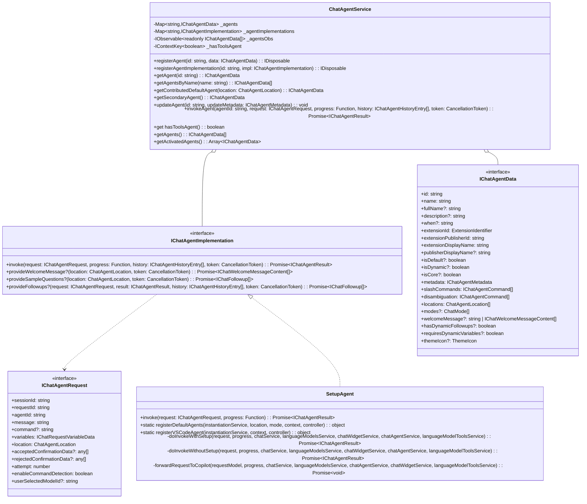

Sources:
- [src/vs/workbench/contrib/chat/common/chatAgents.ts:650-850]()
- [src/vs/workbench/contrib/chat/common/chatAgents.ts:125-170]()
- [src/vs/workbench/contrib/chat/common/chatAgents.ts:40-85]()
- [src/vs/workbench/contrib/chat/common/chatAgents.ts:240-290]()

### Chat List Renderer

`ChatListItemRenderer` implements `ITreeRenderer<ChatTreeItem>` to render chat messages in the `WorkbenchObjectTree`. It manages content part rendering, editor pools for code blocks, and interactive elements through various specialized components.

Rendering architecture:
- Template creation via `renderTemplate()` returning `IChatListItemTemplate`
- Element rendering through `renderChatTreeItem()` with content part diffing
- Code block management using `EditorPool` and `DiffEditorPool`
- Progressive rendering based on `getProgressiveRenderRate()`
- Content parts: `ChatMarkdownContentPart`, `ChatTextEditContentPart`, `ChatTreeContentPart`, etc.

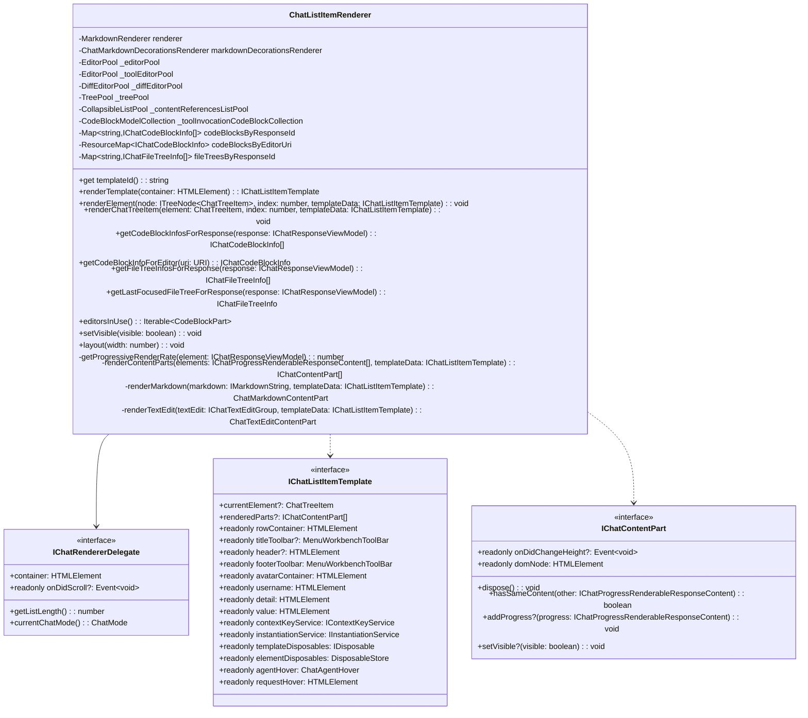

Sources:
- [src/vs/workbench/contrib/chat/browser/chatListRenderer.ts:127-191]()
- [src/vs/workbench/contrib/chat/browser/chatListRenderer.ts:280-384]()
- [src/vs/workbench/contrib/chat/browser/chatListRenderer.ts:85-106]()
- [src/vs/workbench/contrib/chat/browser/chatListRenderer.ts:117-124]()

### Content Parts System

Chat responses are rendered using a modular content part system that supports various content types:

| Content Part Type | Description |
|------------------|-------------|
| `ChatMarkdownContentPart` | Renders markdown content including text and simple formatting |
| `ChatCodeBlockPart` | Renders code with syntax highlighting and actions |
| `ChatTextEditContentPart` | Shows text edits with diff viewer |
| `ChatTreeContentPart` | Displays file trees and hierarchical data |
| `ChatAttachmentsContentPart` | Shows attached files and resources |
| `ChatToolInvocationPart` | Shows tool execution and results |
| `ChatProgressContentPart` | Shows loading and progress indicators |
| `ChatFollowups` | Displays suggested follow-up questions |

Sources:
- [src/vs/workbench/contrib/chat/browser/chatContentParts/chatMarkdownContentPart.ts]()
- [src/vs/workbench/contrib/chat/browser/codeBlockPart.ts:1-100]()
- [src/vs/workbench/contrib/chat/browser/chatFollowups.ts]()

## Chat Modes and Agent Locations

The chat system supports different modes and locations within VS Code:

### Chat Modes

VS Code's chat system supports three primary modes:

1. **Ask Mode (`ChatMode.Ask`)**: Standard chat interaction for asking questions and getting information.
2. **Edit Mode (`ChatMode.Edit`)**: Focuses on making edits to code files based on natural language instructions.
3. **Agent Mode (`ChatMode.Agent`)**: Advanced mode where the AI can use tools and perform complex tasks.

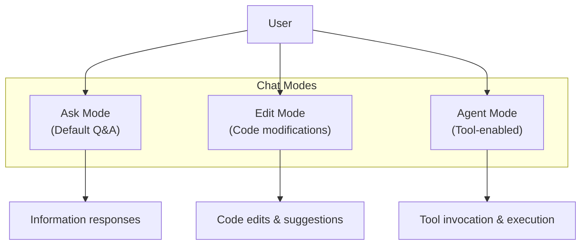

### Chat Locations

Chat can be used in multiple locations within VS Code:

| Location | Description | Use Cases |
|----------|-------------|-----------|
| `ChatAgentLocation.Panel` | Main chat panel view | General Q&A, workspace-wide tasks |
| `ChatAgentLocation.Editor` | Inline editor chat | Context-specific code help |
| `ChatAgentLocation.Terminal` | Terminal integration | Command assistance |
| `ChatAgentLocation.Notebook` | Notebook integration | Data analysis and explanation |

Sources:
- [src/vs/workbench/contrib/chat/common/constants.ts:8-38]()
- [src/vs/workbench/contrib/chat/browser/actions/chatExecuteActions.ts:50-150]()
- [src/vs/workbench/contrib/chat/browser/chatInputPart.ts:480-490]()

## Chat Request Variables and Context

The chat system supports various types of context that can be attached to chat requests for better results:

### Variable Types

| Variable Type | Interface | Description | Usage |
|---------------|-----------|-------------|-------|
| File Entry | `IChatRequestFileEntry` | A file from the workspace | Providing context from code files |
| Directory Entry | `IChatRequestDirectoryEntry` | A folder from the workspace | Including multiple related files |
| Paste Variable | `IChatRequestPasteVariableEntry` | Copied code snippet with metadata | Sharing code without saving to a file |
| Symbol Variable | `ISymbolVariableEntry` | Code symbol reference with location | Referencing specific functions/classes |
| Image Variable | `IImageVariableEntry` | Image data with MIME type | Sharing screenshots or images |
| Implicit Variable | `IChatRequestImplicitVariableEntry` | Automatically attached context | Current file or selection |
| Tool Variable | `IChatRequestToolEntry` | Reference to available tools | Allowing AI to use specific tools |
| Tool Set Variable | `IChatRequestToolSetEntry` | Collection of related tools | Group tool functionality |
| Diagnostic Variable | `IDiagnosticVariableEntry` | Code problems with severity | Asking about errors or warnings |
| Command Result | `ICommandResultVariableEntry` | Output from executed commands | Including command results |
| Notebook Output | `INotebookOutputVariableEntry` | Cell execution output | Notebook context |
| Element Variable | `IElementVariableEntry` | Web/UI element reference | Browser elements |
| SCM History Item | `ISCMHistoryItemVariableEntry` | Source control history | Git commits and changes |

Variables can be referenced in prompts using the `#` prefix, and the system manages their serialization and attachment to requests.

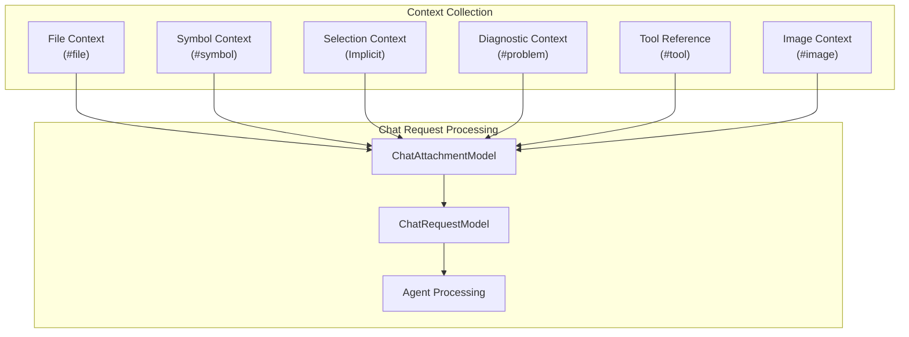

Sources:
- [src/vs/workbench/contrib/chat/common/chatModel.ts:35-223]()
- [src/vs/workbench/contrib/chat/browser/chatInputPart.ts:169-206]()
- [src/vs/workbench/contrib/chat/browser/actions/chatContextActions.ts:68-163]()

## Chat UI Components

### Core UI Structure

The chat UI is composed of several key components:

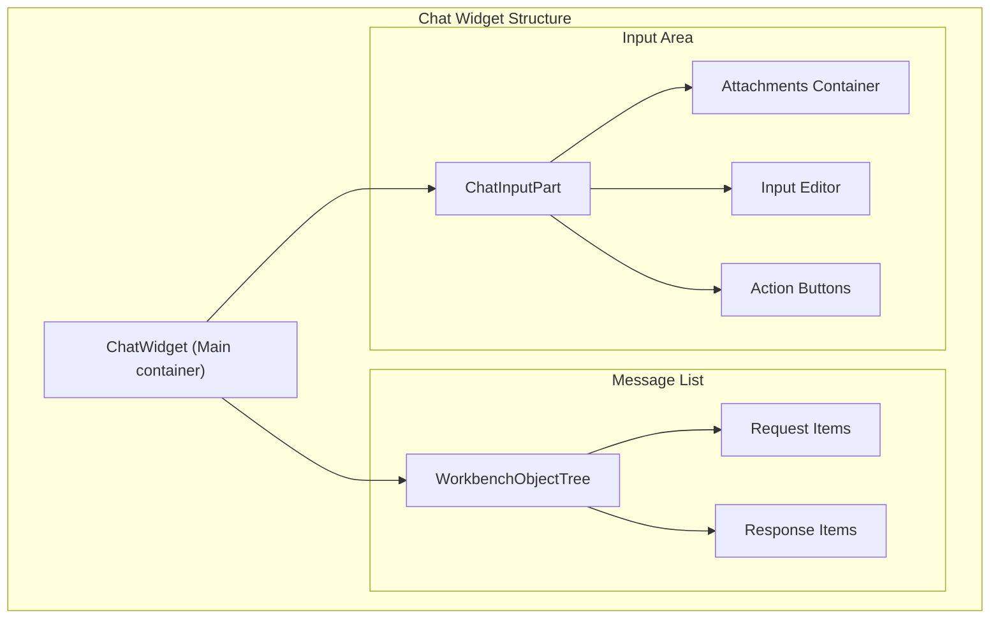

### Message Rendering Structure

Chat messages are rendered using a component-based approach:

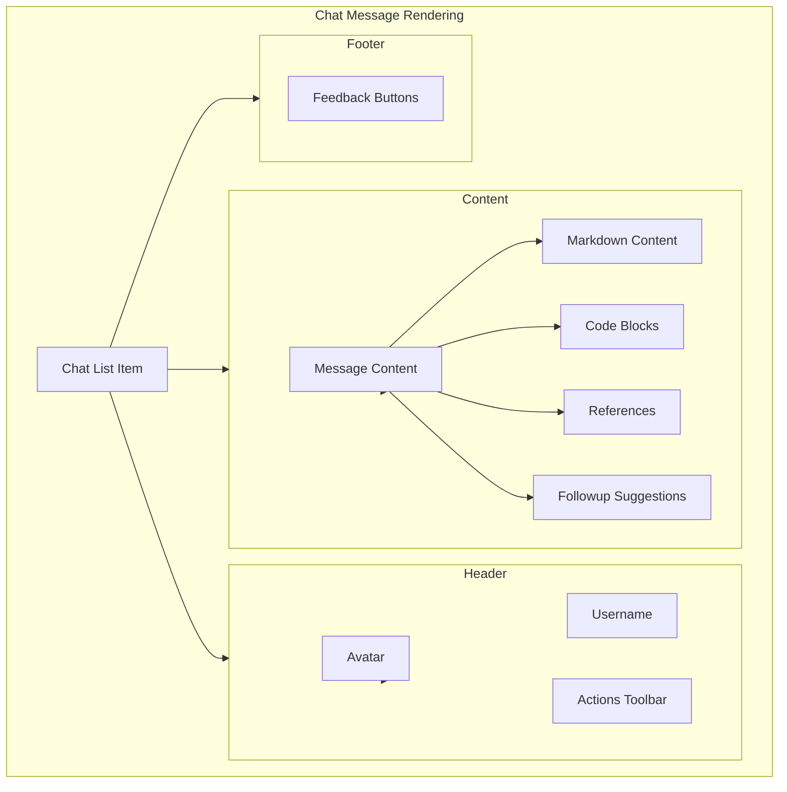

Sources:
- [src/vs/workbench/contrib/chat/browser/media/chat.css:17-100]()
- [src/vs/workbench/contrib/chat/browser/chatListRenderer.ts:119-185]()
- [src/vs/workbench/contrib/chat/browser/chatWidget.ts:140-200]()

## Chat Actions and Commands

The chat system provides numerous actions and commands for interacting with chat:

| Action Category | Examples | Purpose |
|----------------|----------|---------|
| Chat Execution | Submit, Cancel, Retry | Control chat requests |
| Chat Navigation | New Chat, History, Clear | Manage chat sessions |
| Context Actions | Attach File, Attach Selection | Add context to chats |
| Code Actions | Insert, Copy, Apply | Work with code from responses |
| Editing Actions | Accept Changes, Show Changes | Manage AI-suggested edits |
| Feedback Actions | Helpful, Not Helpful | Provide feedback on responses |

Sources:
- [src/vs/workbench/contrib/chat/browser/actions/chatActions.ts:104-188]()
- [src/vs/workbench/contrib/chat/browser/actions/chatExecuteActions.ts:50-97]()
- [src/vs/workbench/contrib/chat/browser/actions/chatContextActions.ts:68-95]()
- [src/vs/workbench/contrib/chat/browser/actions/chatCodeblockActions.ts:68-95]()

## Chat Editing Integration

The chat system includes powerful capabilities for code editing:

### Edit Flow

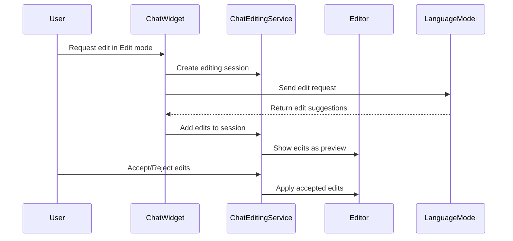

### Editing Features

- Preview changes before applying
- Accept/reject individual edits
- View diffs of proposed changes
- Apply edits to multiple files
- Track edit history for undo/redo

Sources:
- [src/vs/workbench/contrib/chat/browser/chatEditing/chatEditingActions.ts:1-40]()
- [src/vs/workbench/contrib/chat/common/chatEditingService.ts]()
- [src/vs/workbench/contrib/chat/browser/actions/chatExecuteActions.ts:248-310]()

## Extension Integration

Extensions contribute chat agents through the `vscode.chat` API via `ExtHostChatAgents2` which implements the extension host side of the chat protocol. Extensions register `ChatParticipant` objects that get bridged to `IChatAgentImplementation` in the main thread.

Extension API flow:
- Registration: `vscode.chat.createChatParticipant(id, handler)` 
- Invocation: Extension `handler(request, context, stream, token)` → `ChatAgentResponseStream`
- Streaming: `stream.markdown()`, `stream.reference()`, `stream.progress()` etc.
- Tooling: `vscode.lm.tools` for tool access in agent mode

```mermaid
graph TD
    subgraph "Extension_Host" ["Extension Host Process"]
        ExtensionCode["Extension Code\n(vscode.chat.createChatParticipant)"]
        ExtHostChatAgents2["ExtHostChatAgents2"]
        ChatAgentResponseStream["ChatAgentResponseStream"]
        ExtHostLanguageModelTools["ExtHostLanguageModelTools"]
    end
    
    subgraph "Main_Thread" ["Main Thread Process"]
        MainThreadChatAgents2["MainThreadChatAgents2"]
        ChatAgentService["ChatAgentService"]
        ChatService["ChatService"]
    end
    
    subgraph "Extension_API" ["Extension APIs"]
        vscode_chat["vscode.chat API"]
        vscode_lm["vscode.lm API"]
        ChatParticipant["ChatParticipant interface"]
        ChatRequest["ChatRequest interface"]
        ChatResponseStream_API["ChatResponseStream interface"]
    end
    
    ExtensionCode --> vscode_chat
    vscode_chat --> ChatParticipant
    ExtensionCode --> ExtHostChatAgents2
    ExtHostChatAgents2 --> ChatAgentResponseStream
    ExtHostChatAgents2 -.->|"$registerAgent\n$handleRequest\n$handleProgressChunk"| MainThreadChatAgents2
    MainThreadChatAgents2 --> ChatAgentService
    ChatAgentService --> ChatService
    
    ExtensionCode --> vscode_lm
    vscode_lm --> ExtHostLanguageModelTools
    
    ChatParticipant ..> ChatRequest
    ChatParticipant ..> ChatResponseStream_API
```

Sources:
- [src/vs/workbench/api/common/extHostChatAgents2.ts:27-110]()
- [src/vs/workbench/api/browser/mainThreadChatAgents2.ts:1-50]()
- [src/vscode-dts/vscode.proposed.chatParticipantAdditions.d.ts:8-43]()
- [src/vs/workbench/contrib/chat/browser/chat.contribution.ts:54-107]()

## Conclusion

VS Code's Chat and AI Integration system provides a comprehensive framework for AI-assisted development. The modular architecture separates concerns between UI, services, and AI interactions, enabling a flexible and extensible chat experience. The system supports various usage modes from simple Q&A to complex agent-based interactions with tools, and integrates with multiple parts of the VS Code UI.

The combination of rich context capabilities, detailed response rendering, and editing integration makes this system powerful for developers seeking AI assistance throughout their development workflow.