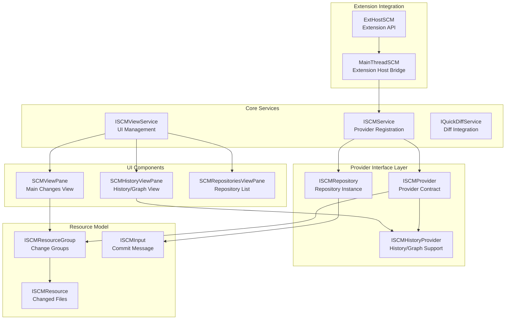
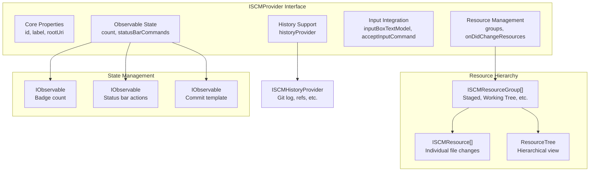
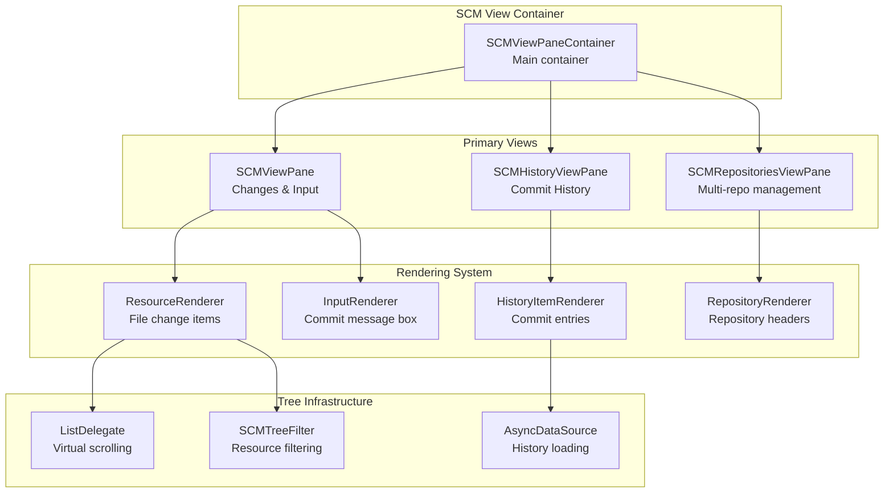
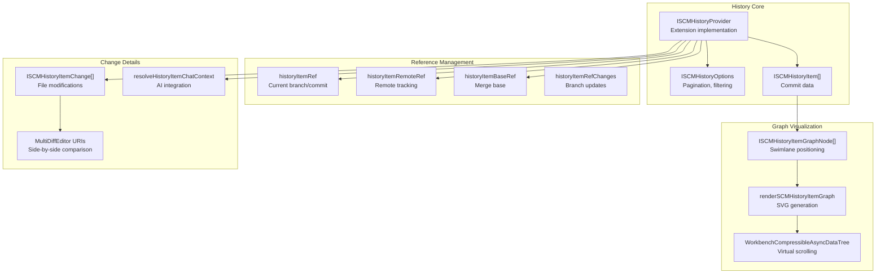
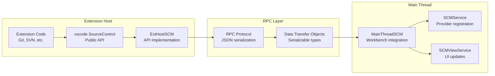

# SCM Framework

<details>
<summary>Relevant source files</summary>

The following files were used as context for generating this wiki page:

- [extensions/git/src/historyProvider.ts](extensions/git/src/historyProvider.ts)
- [src/vs/workbench/api/browser/mainThreadSCM.ts](src/vs/workbench/api/browser/mainThreadSCM.ts)
- [src/vs/workbench/api/common/extHostSCM.ts](src/vs/workbench/api/common/extHostSCM.ts)
- [src/vs/workbench/contrib/scm/browser/activity.ts](src/vs/workbench/contrib/scm/browser/activity.ts)
- [src/vs/workbench/contrib/scm/browser/media/scm.css](src/vs/workbench/contrib/scm/browser/media/scm.css)
- [src/vs/workbench/contrib/scm/browser/menus.ts](src/vs/workbench/contrib/scm/browser/menus.ts)
- [src/vs/workbench/contrib/scm/browser/scm.contribution.ts](src/vs/workbench/contrib/scm/browser/scm.contribution.ts)
- [src/vs/workbench/contrib/scm/browser/scmHistory.ts](src/vs/workbench/contrib/scm/browser/scmHistory.ts)
- [src/vs/workbench/contrib/scm/browser/scmHistoryViewPane.ts](src/vs/workbench/contrib/scm/browser/scmHistoryViewPane.ts)
- [src/vs/workbench/contrib/scm/browser/scmRepositoriesViewPane.ts](src/vs/workbench/contrib/scm/browser/scmRepositoriesViewPane.ts)
- [src/vs/workbench/contrib/scm/browser/scmRepositoryRenderer.ts](src/vs/workbench/contrib/scm/browser/scmRepositoryRenderer.ts)
- [src/vs/workbench/contrib/scm/browser/scmViewPane.ts](src/vs/workbench/contrib/scm/browser/scmViewPane.ts)
- [src/vs/workbench/contrib/scm/browser/scmViewService.ts](src/vs/workbench/contrib/scm/browser/scmViewService.ts)
- [src/vs/workbench/contrib/scm/browser/util.ts](src/vs/workbench/contrib/scm/browser/util.ts)
- [src/vs/workbench/contrib/scm/common/history.ts](src/vs/workbench/contrib/scm/common/history.ts)
- [src/vs/workbench/contrib/scm/common/scm.ts](src/vs/workbench/contrib/scm/common/scm.ts)
- [src/vs/workbench/contrib/scm/test/browser/scmHistory.test.ts](src/vs/workbench/contrib/scm/test/browser/scmHistory.test.ts)
- [src/vscode-dts/vscode.proposed.scmHistoryProvider.d.ts](src/vscode-dts/vscode.proposed.scmHistoryProvider.d.ts)

</details>


The SCM Framework provides VS Code's core abstraction layer for source control management, enabling multiple source control providers (Git, SVN, etc.) to integrate seamlessly with the editor. This framework defines the interfaces, services, and UI components that allow extensions to register source control providers and display repository information, file changes, and commit interfaces.

For information about the Git extension's specific implementation of SCM providers, see [Git Extension](#8.2). For details about the Monaco editor integration, see [Monaco Editor](#3).

## Purpose and Scope

The SCM Framework serves as the foundation for all source control functionality in VS Code by:

- Defining standardized interfaces (`ISCMProvider`, `ISCMRepository`, `ISCMResource`) that source control extensions implement
- Managing provider registration, lifecycle, and UI integration through `ISCMService` and `ISCMViewService`
- Providing reusable UI components for displaying changes, commit inputs, and repository status
- Supporting advanced features like history visualization, quick diff, and multi-repository workflows
- Abstracting provider-specific implementations behind common interfaces

## Core Architecture

The SCM Framework follows a layered architecture with clear separation between core services, provider interfaces, and UI components.

### Framework Architecture Overview



Sources: [src/vs/workbench/contrib/scm/common/scm.ts:34-242](), [src/vs/workbench/contrib/scm/browser/scmViewService.ts:1-25](), [src/vs/workbench/api/browser/mainThreadSCM.ts:1-30]()

### Service Layer Components

| Component | Purpose | Key Responsibilities |
|-----------|---------|---------------------|
| `ISCMService` | Provider Management | Repository registration, provider discovery, lifecycle management |
| `ISCMViewService` | UI Coordination | View state management, repository visibility, menu integration |
| `IQuickDiffService` | Diff Integration | Editor gutter decorations, inline diff providers |
| `SCMMenus` | Action Integration | Context menus, toolbar actions, command routing |

Sources: [src/vs/workbench/contrib/scm/common/scm.ts:170-242](), [src/vs/workbench/contrib/scm/browser/menus.ts:17-30]()

## Provider Interface

The SCM Framework defines a comprehensive provider interface that extensions implement to integrate with VS Code's source control system.

### Provider Contract



Sources: [src/vs/workbench/contrib/scm/common/scm.ts:71-91](), [src/vs/workbench/contrib/scm/common/scm.ts:55-69]()

### Resource Model

The framework organizes changed files into a hierarchical structure:

```typescript
interface ISCMResource {
  readonly resourceGroup: ISCMResourceGroup;
  readonly sourceUri: URI;
  readonly decorations: ISCMResourceDecorations;
  readonly contextValue: string | undefined;
  readonly command: Command | undefined;
}

interface ISCMResourceGroup {
  readonly id: string;
  readonly provider: ISCMProvider;
  readonly resources: readonly ISCMResource[];
  readonly resourceTree: ResourceTree<ISCMResource, ISCMResourceGroup>;
  readonly label: string;
  readonly hideWhenEmpty: boolean;
}
```

Sources: [src/vs/workbench/contrib/scm/common/scm.ts:44-69]()

## UI Integration

The SCM Framework provides several view components that automatically render provider data and handle user interactions.

### View Component Hierarchy



Sources: [src/vs/workbench/contrib/scm/browser/scmViewPane.ts:1-50](), [src/vs/workbench/contrib/scm/browser/scmHistoryViewPane.ts:1-40](), [src/vs/workbench/contrib/scm/browser/scmRepositoriesViewPane.ts:1-30]()

### Input System

The commit input system provides a rich text editing experience with validation and history:

| Component | Purpose | Implementation |
|-----------|---------|----------------|
| `SCMInputWidget` | Rich text editor | Monaco editor integration |
| `IInputValidator` | Message validation | Async validation with decorations |
| `SCMInputBox` | Extension API | Bridge to extension host |
| History navigation | Previous commits | Up/down arrow navigation |

Sources: [src/vs/workbench/contrib/scm/browser/scmViewPane.ts:292-421](), [src/vs/workbench/api/common/extHostSCM.ts:272-384]()

## History System

The SCM Framework includes a sophisticated history system for displaying commit graphs, branches, and file changes over time.

### History Provider Interface



Sources: [src/vs/workbench/contrib/scm/common/history.ts:18-30](), [src/vs/workbench/contrib/scm/browser/scmHistory.ts:1-50](), [src/vs/workbench/contrib/scm/browser/scmHistoryViewPane.ts:30-80]()

### Graph Rendering

The history view renders commit graphs using SVG with swimlane visualization:

```typescript
interface ISCMHistoryItemViewModel {
  readonly historyItem: ISCMHistoryItem;
  readonly isCurrent: boolean;
  readonly inputSwimlanes: ISCMHistoryItemGraphNode[];
  readonly outputSwimlanes: ISCMHistoryItemGraphNode[];
}
```

The graph rendering system creates visual connections between commits using colored paths and circles, with each branch getting its own swimlane.

Sources: [src/vs/workbench/contrib/scm/common/history.ts:81-86](), [src/vs/workbench/contrib/scm/browser/scmHistory.ts:200-300]()

## Extension Integration

The SCM Framework bridges between the core VS Code workbench and extension host through a well-defined RPC protocol.

### Extension Host Bridge



Sources: [src/vs/workbench/api/common/extHostSCM.ts:1-50](), [src/vs/workbench/api/browser/mainThreadSCM.ts:1-50]()

### Provider Registration Flow

1. **Extension Activation**: Extension creates `vscode.SourceControl` instance
2. **Proxy Creation**: `ExtHostSCM` creates provider proxy with unique handle
3. **RPC Registration**: `MainThreadSCM` receives registration via RPC protocol
4. **Service Integration**: Provider registered with `ISCMService` and `ISCMViewService`
5. **UI Creation**: View components automatically render provider data

Sources: [src/vs/workbench/api/common/extHostSCM.ts:750-800](), [src/vs/workbench/api/browser/mainThreadSCM.ts:390-450]()

### Configuration Integration

The framework provides extensive configuration options that affect both core behavior and provider implementations:

| Setting | Purpose | Default |
|---------|---------|---------|
| `scm.defaultViewMode` | List vs. tree view | `list` |
| `scm.alwaysShowRepositories` | Multi-repo visibility | `false` |
| `scm.countBadge` | Activity bar badge | `all` |
| `scm.autoReveal` | Auto-select changed files | `true` |
| `scm.inputFontFamily` | Commit message font | `default` |

Sources: [src/vs/workbench/contrib/scm/browser/scm.contribution.ts:174-400]()