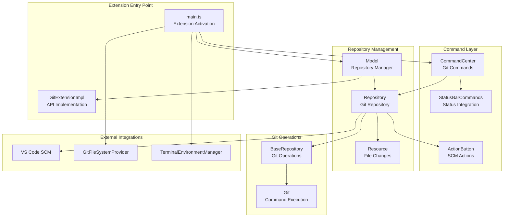
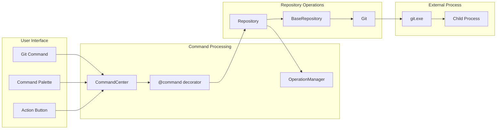
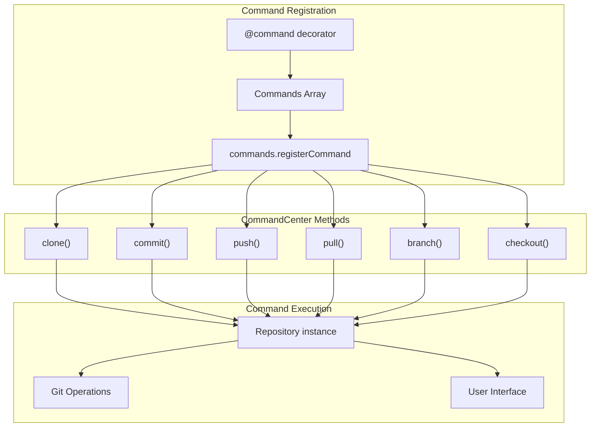
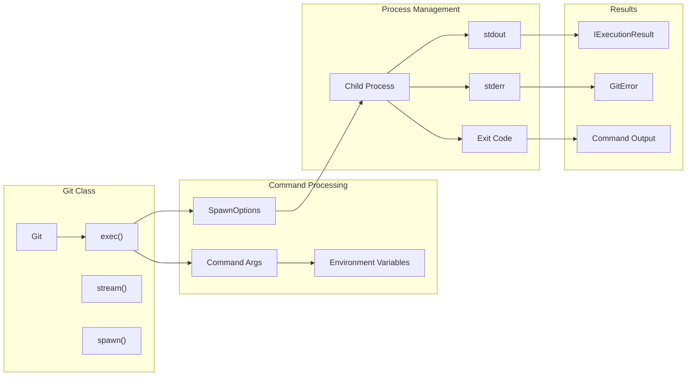
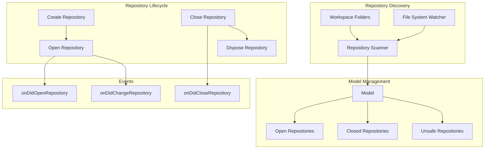
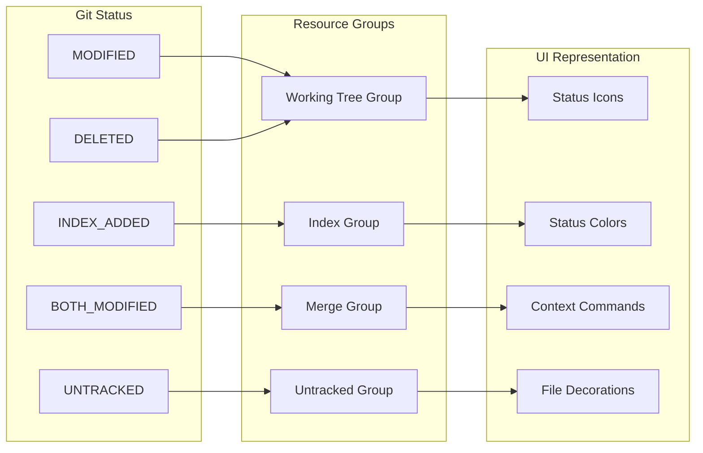
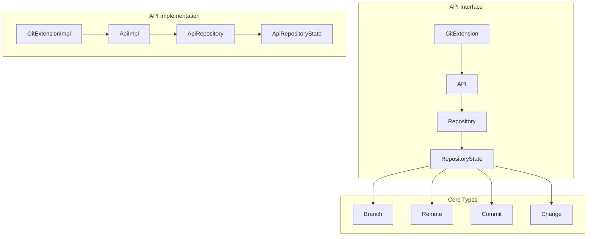
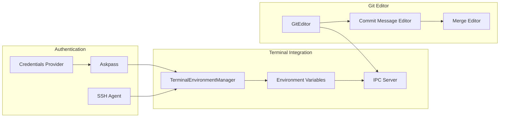

# Git Extension

Relevant source files

The following files were used as context for generating this wiki page:

- [extensions/git/package.json](extensions/git/package.json)
- [extensions/git/package.nls.json](extensions/git/package.nls.json)
- [extensions/git/src/actionButton.ts](extensions/git/src/actionButton.ts)
- [extensions/git/src/api/api1.ts](extensions/git/src/api/api1.ts)
- [extensions/git/src/api/extension.ts](extensions/git/src/api/extension.ts)
- [extensions/git/src/api/git.d.ts](extensions/git/src/api/git.d.ts)
- [extensions/git/src/askpass-empty.sh](extensions/git/src/askpass-empty.sh)
- [extensions/git/src/askpass-main.ts](extensions/git/src/askpass-main.ts)
- [extensions/git/src/askpass.sh](extensions/git/src/askpass.sh)
- [extensions/git/src/askpass.ts](extensions/git/src/askpass.ts)
- [extensions/git/src/autofetch.ts](extensions/git/src/autofetch.ts)
- [extensions/git/src/commands.ts](extensions/git/src/commands.ts)
- [extensions/git/src/git.ts](extensions/git/src/git.ts)
- [extensions/git/src/gitEditor.ts](extensions/git/src/gitEditor.ts)
- [extensions/git/src/ipc/ipcClient.ts](extensions/git/src/ipc/ipcClient.ts)
- [extensions/git/src/ipc/ipcServer.ts](extensions/git/src/ipc/ipcServer.ts)
- [extensions/git/src/main.ts](extensions/git/src/main.ts)
- [extensions/git/src/model.ts](extensions/git/src/model.ts)
- [extensions/git/src/postCommitCommands.ts](extensions/git/src/postCommitCommands.ts)
- [extensions/git/src/repository.ts](extensions/git/src/repository.ts)
- [extensions/git/src/ssh-askpass-empty.sh](extensions/git/src/ssh-askpass-empty.sh)
- [extensions/git/src/ssh-askpass.sh](extensions/git/src/ssh-askpass.sh)
- [extensions/git/src/statusbar.ts](extensions/git/src/statusbar.ts)
- [extensions/git/src/terminal.ts](extensions/git/src/terminal.ts)
- [extensions/git/src/test/git.test.ts](extensions/git/src/test/git.test.ts)
- [extensions/git/src/util.ts](extensions/git/src/util.ts)
- [extensions/git/tsconfig.json](extensions/git/tsconfig.json)

The Git Extension is VS Code's built-in source control extension that provides comprehensive Git functionality within the editor. It implements Git operations, repository management, and integrates with VS Code's Source Control Management (SCM) framework to provide version control capabilities directly in the editor interface.

For information about the generic SCM framework that this extension uses, see [SCM Framework](#8.1).

## Extension Architecture

The Git extension follows a layered architecture with clear separation between low-level Git operations, repository management, and user interface components.

### Core System Overview

**Sources:** [extensions/git/src/main.ts:39-138](), [extensions/git/src/model.ts:174](), [extensions/git/src/commands.ts:718](), [extensions/git/src/repository.ts:673]()

### Git Command Execution Flow

**Sources:** [extensions/git/src/commands.ts:316-326](), [extensions/git/src/repository.ts:673-1500](), [extensions/git/src/git.ts:372-485]()

## Key Components

### CommandCenter Class

The `CommandCenter` class implements all Git commands exposed through VS Code's command palette and UI. It uses a decorator pattern to register commands and handles repository operations.

**Sources:** [extensions/git/src/commands.ts:316-326](), [extensions/git/src/commands.ts:718-728](), [extensions/git/src/commands.ts:889-1025]()

### Repository Management

The `Repository` class represents a Git repository and provides high-level operations. It integrates with VS Code's SCM API and manages resource states.

| Component | Purpose | Key Methods |
|-----------|---------|-------------|
| `Repository` | Git repository representation | `commit()`, `push()`, `pull()`, `checkout()` |
| `Resource` | File change representation | `open()`, `openFile()`, `openChange()` |
| `ResourceCommandResolver` | Command resolution for resources | `resolveDefaultCommand()`, `resolveChangeCommand()` |
| `GitResourceGroup` | Groups of resources | Staging, working tree, merge, untracked |

**Sources:** [extensions/git/src/repository.ts:673-700](), [extensions/git/src/repository.ts:49-333](), [extensions/git/src/repository.ts:491-653]()

### Git Command Execution

The `Git` class handles low-level Git command execution through child processes.

**Sources:** [extensions/git/src/git.ts:372-410](), [extensions/git/src/git.ts:564-627](), [extensions/git/src/git.ts:174-261]()

### Model and Repository Discovery

The `Model` class manages multiple repositories and handles repository discovery across the workspace.

**Sources:** [extensions/git/src/model.ts:174-289](), [extensions/git/src/model.ts:292-400](), [extensions/git/src/model.ts:52-172]()

## Source Control Integration

### SCM API Integration

The Git extension integrates deeply with VS Code's Source Control Management API to provide native Git functionality.

| SCM Component | Git Implementation | Purpose |
|---------------|-------------------|---------|
| `SourceControl` | `Repository.sourceControl` | Main SCM provider |
| `SourceControlResourceGroup` | `GitResourceGroup` | Groups files by status |
| `SourceControlResourceState` | `Resource` | Individual file changes |
| `SourceControlInputBox` | `Repository.inputBox` | Commit message input |

**Sources:** [extensions/git/src/repository.ts:701-710](), [extensions/git/src/repository.ts:335-344](), [extensions/git/src/repository.ts:49-84]()

### Resource State Management

Git file states are mapped to VS Code's SCM resource states with visual decorations and commands.

**Sources:** [extensions/git/src/repository.ts:42-47](), [extensions/git/src/repository.ts:51-143](), [extensions/git/src/repository.ts:186-233]()

## Extension API

### Public API Structure

The Git extension exposes an API for other extensions to interact with Git repositories.

**Sources:** [extensions/git/src/api/git.d.ts:9-396](), [extensions/git/src/api/extension.ts:23-46](), [extensions/git/src/api/api1.ts:74-277]()

### Extension Points

The Git extension provides several extension points for other extensions:

| Extension Point | Interface | Purpose |
|----------------|-----------|---------|
| Remote Source Publishers | `RemoteSourcePublisher` | Publish repositories to remote services |
| Credentials Providers | `CredentialsProvider` | Provide authentication credentials |
| Post-Commit Commands | `PostCommitCommandsProvider` | Commands to run after commits |
| Branch Protection | `BranchProtectionProvider` | Define protected branches |
| Push Error Handlers | `PushErrorHandler` | Handle push operation errors |

**Sources:** [extensions/git/src/api/git.d.ts:285-330](), [extensions/git/src/model.ts:221-241]()

## Configuration and Settings

### Extension Configuration

The Git extension provides extensive configuration options through VS Code settings.

**Sources:** [extensions/git/package.nls.json:142-280](), [extensions/git/package.json:66-1095]()

## Terminal and Authentication Integration

### Terminal Environment Management

The Git extension configures terminal environments to provide seamless Git authentication and editor integration.

**Sources:** [extensions/git/src/terminal.ts:15-73](), [extensions/git/src/askpass.ts:13-104](), [extensions/git/src/gitEditor.ts:31-149]()

## Operation Management

### Git Operation Coordination

The extension uses an operation management system to coordinate Git operations and provide progress feedback.

| Operation Type | Description | Exclusive |
|----------------|-------------|-----------|
| `Commit` | Commit changes | Yes |
| `Push` | Push to remote | No |
| `Pull` | Pull from remote | No |
| `Fetch` | Fetch from remote | No |
| `Checkout` | Checkout branch/commit | Yes |
| `Merge` | Merge branches | Yes |
| `Rebase` | Rebase current branch | Yes |

**Sources:** [extensions/git/src/operation.ts:7-79](), [extensions/git/src/repository.ts:2090-2140]()