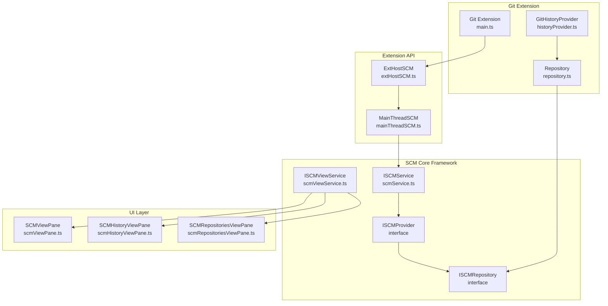
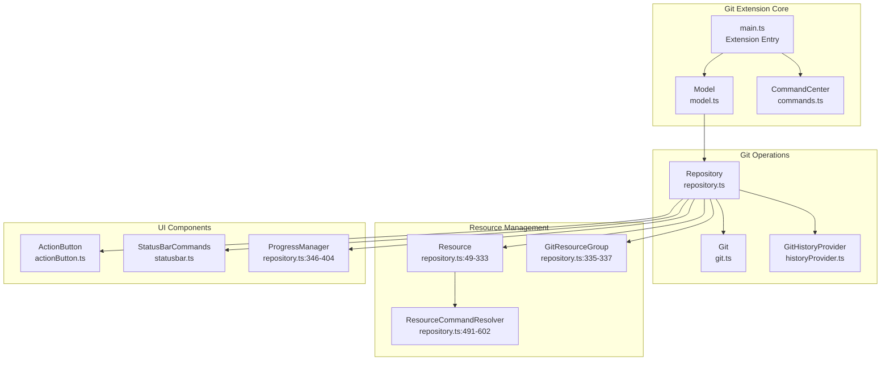
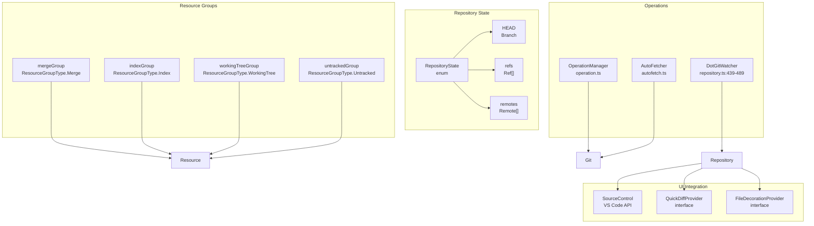
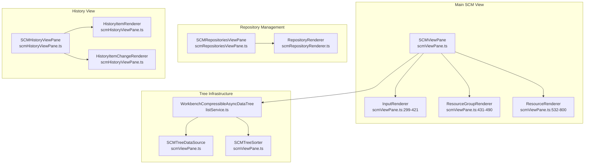
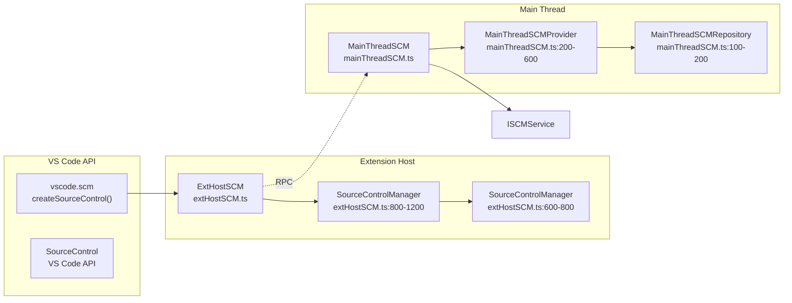
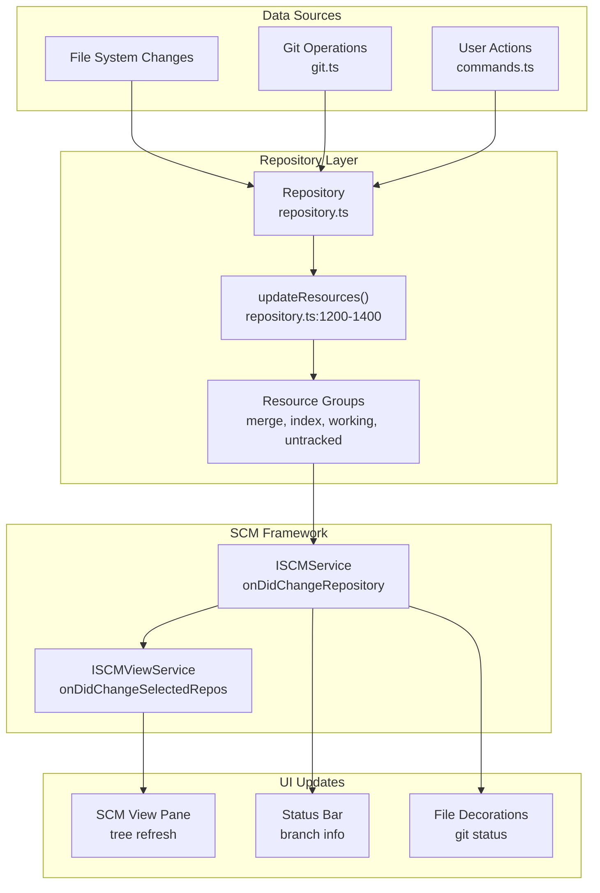
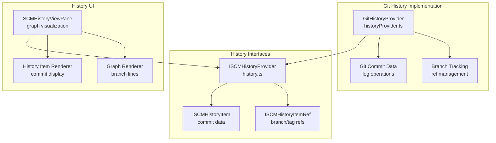

# Source Control Management

Relevant source files

The following files were used as context for generating this wiki page:

- [extensions/git/package.json](extensions/git/package.json)
- [extensions/git/package.nls.json](extensions/git/package.nls.json)
- [extensions/git/src/actionButton.ts](extensions/git/src/actionButton.ts)
- [extensions/git/src/api/api1.ts](extensions/git/src/api/api1.ts)
- [extensions/git/src/api/extension.ts](extensions/git/src/api/extension.ts)
- [extensions/git/src/api/git.d.ts](extensions/git/src/api/git.d.ts)
- [extensions/git/src/askpass-empty.sh](extensions/git/src/askpass-empty.sh)
- [extensions/git/src/askpass-main.ts](extensions/git/src/askpass-main.ts)
- [extensions/git/src/askpass.sh](extensions/git/src/askpass.sh)
- [extensions/git/src/askpass.ts](extensions/git/src/askpass.ts)
- [extensions/git/src/autofetch.ts](extensions/git/src/autofetch.ts)
- [extensions/git/src/commands.ts](extensions/git/src/commands.ts)
- [extensions/git/src/git.ts](extensions/git/src/git.ts)
- [extensions/git/src/gitEditor.ts](extensions/git/src/gitEditor.ts)
- [extensions/git/src/historyProvider.ts](extensions/git/src/historyProvider.ts)
- [extensions/git/src/ipc/ipcClient.ts](extensions/git/src/ipc/ipcClient.ts)
- [extensions/git/src/ipc/ipcServer.ts](extensions/git/src/ipc/ipcServer.ts)
- [extensions/git/src/main.ts](extensions/git/src/main.ts)
- [extensions/git/src/model.ts](extensions/git/src/model.ts)
- [extensions/git/src/postCommitCommands.ts](extensions/git/src/postCommitCommands.ts)
- [extensions/git/src/repository.ts](extensions/git/src/repository.ts)
- [extensions/git/src/ssh-askpass-empty.sh](extensions/git/src/ssh-askpass-empty.sh)
- [extensions/git/src/ssh-askpass.sh](extensions/git/src/ssh-askpass.sh)
- [extensions/git/src/statusbar.ts](extensions/git/src/statusbar.ts)
- [extensions/git/src/terminal.ts](extensions/git/src/terminal.ts)
- [extensions/git/src/test/git.test.ts](extensions/git/src/test/git.test.ts)
- [extensions/git/src/util.ts](extensions/git/src/util.ts)
- [extensions/git/tsconfig.json](extensions/git/tsconfig.json)
- [src/vs/workbench/api/browser/mainThreadSCM.ts](src/vs/workbench/api/browser/mainThreadSCM.ts)
- [src/vs/workbench/api/common/extHostSCM.ts](src/vs/workbench/api/common/extHostSCM.ts)
- [src/vs/workbench/contrib/scm/browser/activity.ts](src/vs/workbench/contrib/scm/browser/activity.ts)
- [src/vs/workbench/contrib/scm/browser/media/scm.css](src/vs/workbench/contrib/scm/browser/media/scm.css)
- [src/vs/workbench/contrib/scm/browser/menus.ts](src/vs/workbench/contrib/scm/browser/menus.ts)
- [src/vs/workbench/contrib/scm/browser/scm.contribution.ts](src/vs/workbench/contrib/scm/browser/scm.contribution.ts)
- [src/vs/workbench/contrib/scm/browser/scmHistory.ts](src/vs/workbench/contrib/scm/browser/scmHistory.ts)
- [src/vs/workbench/contrib/scm/browser/scmHistoryViewPane.ts](src/vs/workbench/contrib/scm/browser/scmHistoryViewPane.ts)
- [src/vs/workbench/contrib/scm/browser/scmRepositoriesViewPane.ts](src/vs/workbench/contrib/scm/browser/scmRepositoriesViewPane.ts)
- [src/vs/workbench/contrib/scm/browser/scmRepositoryRenderer.ts](src/vs/workbench/contrib/scm/browser/scmRepositoryRenderer.ts)
- [src/vs/workbench/contrib/scm/browser/scmViewPane.ts](src/vs/workbench/contrib/scm/browser/scmViewPane.ts)
- [src/vs/workbench/contrib/scm/browser/scmViewService.ts](src/vs/workbench/contrib/scm/browser/scmViewService.ts)
- [src/vs/workbench/contrib/scm/browser/util.ts](src/vs/workbench/contrib/scm/browser/util.ts)
- [src/vs/workbench/contrib/scm/common/history.ts](src/vs/workbench/contrib/scm/common/history.ts)
- [src/vs/workbench/contrib/scm/common/scm.ts](src/vs/workbench/contrib/scm/common/scm.ts)
- [src/vs/workbench/contrib/scm/test/browser/scmHistory.test.ts](src/vs/workbench/contrib/scm/test/browser/scmHistory.test.ts)
- [src/vscode-dts/vscode.proposed.scmHistoryProvider.d.ts](src/vscode-dts/vscode.proposed.scmHistoryProvider.d.ts)

This document covers VS Code's Source Control Management (SCM) system, which provides a generic framework for integrating version control systems like Git into the editor. The SCM system consists of a core framework that defines common abstractions for source control providers, along with built-in implementations like the Git extension.

For information about the Extension System that enables third-party SCM providers, see [Extension System](#4). For details about UI Components like Trees and Lists used in SCM views, see [UI Components: Lists and Trees](#2.3).

## SCM Framework Architecture

The SCM framework provides a provider-based architecture where different version control systems can register providers that implement common interfaces. The core abstractions include repositories, resource groups, resources, and input boxes for commit messages.

The `ISCMService` acts as the central registry for SCM providers, while `ISCMViewService` manages the visual presentation of source control information. Each provider implements `ISCMProvider` and can create multiple `ISCMRepository` instances.

Sources: [src/vs/workbench/contrib/scm/common/scm.ts:34-200](), [src/vs/workbench/contrib/scm/common/scmService.ts](), [src/vs/workbench/contrib/scm/browser/scmViewService.ts]()

## SCM Provider Interface

The `ISCMProvider` interface defines the contract that all source control providers must implement. It includes methods for managing repositories, handling input validation, and providing commands.

| Component | Purpose | Key Methods |
|-----------|---------|-------------|
| `ISCMProvider` | Core provider interface | `getOriginalResource()`, `createRepository()` |
| `ISCMRepository` | Repository abstraction | `provider`, `input`, `resourceGroups` |
| `ISCMResourceGroup` | Groups of related resources | `id`, `label`, `resourceStates` |
| `ISCMResource` | Individual file resources | `resourceUri`, `command`, `decorations` |
| `ISCMInput` | Commit message input | `value`, `placeholder`, `validateInput()` |

The provider system supports features like input validation, action buttons, and history providers through optional interfaces.

Sources: [src/vs/workbench/contrib/scm/common/scm.ts:92-180]()

## Git Extension Implementation

The Git extension serves as the primary implementation of the SCM framework, providing comprehensive Git functionality within VS Code.

The Git extension creates a `Repository` instance for each Git repository, which implements the `ISCMRepository` interface and manages resource states, commands, and history.

Sources: [extensions/git/src/main.ts:39-150](), [extensions/git/src/model.ts:174-550](), [extensions/git/src/repository.ts:1-50]()

## Git Repository Model

The `Repository` class is the core of Git integration, managing repository state and providing Git operations through the SCM framework.

Each `Repository` maintains four resource groups that categorize files by their Git status, and provides operations through the `OperationManager` to ensure thread safety.

Sources: [extensions/git/src/repository.ts:37-47](), [extensions/git/src/repository.ts:603-1500](), [extensions/git/src/operation.ts]()

## SCM View Components

The SCM UI consists of multiple view panes that present source control information in different ways.

The main `SCMViewPane` uses a tree structure with specialized renderers for different node types, while the history view provides a graph visualization of commit history.

Sources: [src/vs/workbench/contrib/scm/browser/scmViewPane.ts:115-2500](), [src/vs/workbench/contrib/scm/browser/scmHistoryViewPane.ts:1-2000](), [src/vs/workbench/contrib/scm/browser/scmRepositoriesViewPane.ts]()

## Extension API Bridge

The SCM system exposes its functionality to extensions through a bridge between the extension host and main thread.

Extensions create SCM providers through the `vscode.scm.createSourceControl()` API, which creates proxy objects that communicate with the main thread via RPC.

Sources: [src/vs/workbench/api/common/extHostSCM.ts:1-1500](), [src/vs/workbench/api/browser/mainThreadSCM.ts:1-1000]()

## SCM Data Flow

The SCM system processes repository changes through a pipeline that updates UI components and notifies extensions.

Repository state changes trigger updates through the SCM service, which notifies views and other components to refresh their display.

Sources: [extensions/git/src/repository.ts:1200-1500](), [src/vs/workbench/contrib/scm/browser/scmViewPane.ts:2000-2500](), [src/vs/workbench/contrib/scm/browser/activity.ts]()

## History Provider System

The SCM framework includes support for history providers that can display commit graphs and timeline information.

The Git extension implements the history provider interface to display commit graphs, branch relationships, and commit details in the SCM history view.

Sources: [src/vs/workbench/contrib/scm/common/history.ts](), [extensions/git/src/historyProvider.ts:40-400](), [src/vs/workbench/contrib/scm/browser/scmHistoryViewPane.ts:300-800]()