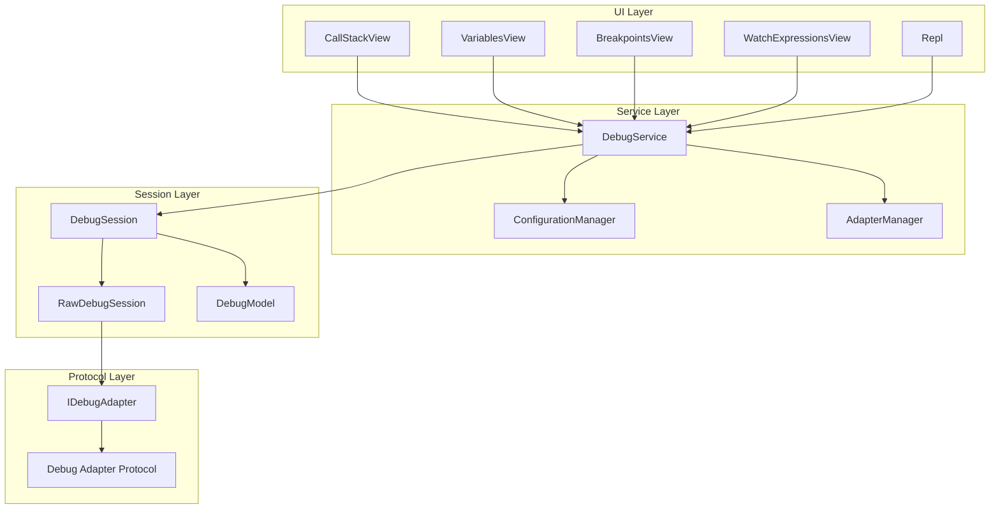
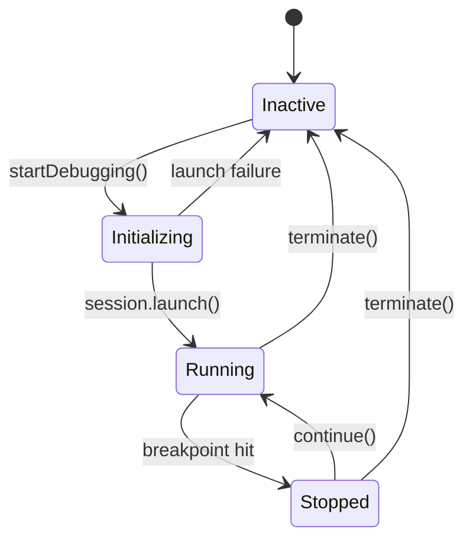
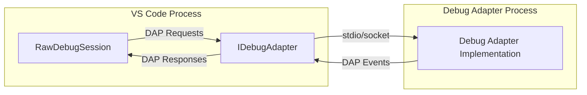
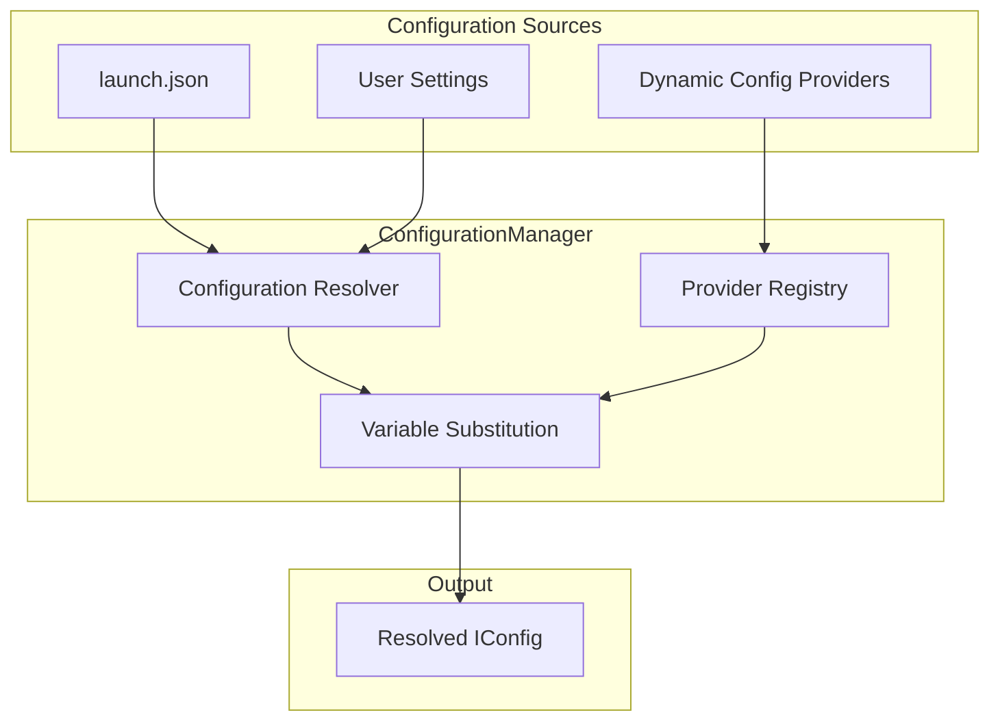
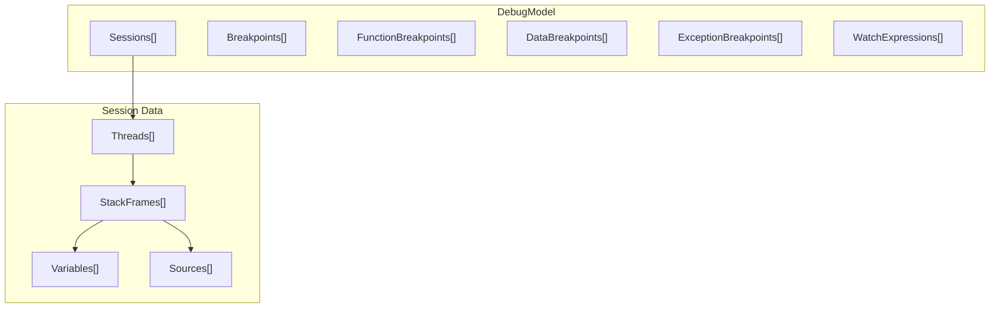
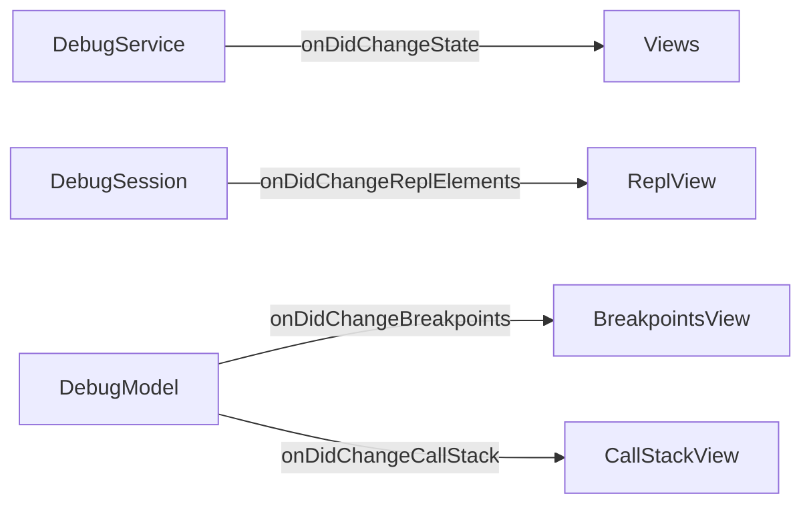

# Debug Service and Protocol

<details>
<summary>Relevant source files</summary>

The following files were used as context for generating this wiki page:

- [src/vs/editor/contrib/hover/browser/glyphHoverWidget.ts](src/vs/editor/contrib/hover/browser/glyphHoverWidget.ts)
- [src/vs/workbench/api/browser/mainThreadDebugService.ts](src/vs/workbench/api/browser/mainThreadDebugService.ts)
- [src/vs/workbench/api/common/extHostDebugService.ts](src/vs/workbench/api/common/extHostDebugService.ts)
- [src/vs/workbench/contrib/debug/browser/baseDebugView.ts](src/vs/workbench/contrib/debug/browser/baseDebugView.ts)
- [src/vs/workbench/contrib/debug/browser/breakpointEditorContribution.ts](src/vs/workbench/contrib/debug/browser/breakpointEditorContribution.ts)
- [src/vs/workbench/contrib/debug/browser/breakpointWidget.ts](src/vs/workbench/contrib/debug/browser/breakpointWidget.ts)
- [src/vs/workbench/contrib/debug/browser/breakpointsView.ts](src/vs/workbench/contrib/debug/browser/breakpointsView.ts)
- [src/vs/workbench/contrib/debug/browser/callStackEditorContribution.ts](src/vs/workbench/contrib/debug/browser/callStackEditorContribution.ts)
- [src/vs/workbench/contrib/debug/browser/callStackView.ts](src/vs/workbench/contrib/debug/browser/callStackView.ts)
- [src/vs/workbench/contrib/debug/browser/debug.contribution.ts](src/vs/workbench/contrib/debug/browser/debug.contribution.ts)
- [src/vs/workbench/contrib/debug/browser/debugActionViewItems.ts](src/vs/workbench/contrib/debug/browser/debugActionViewItems.ts)
- [src/vs/workbench/contrib/debug/browser/debugCommands.ts](src/vs/workbench/contrib/debug/browser/debugCommands.ts)
- [src/vs/workbench/contrib/debug/browser/debugConfigurationManager.ts](src/vs/workbench/contrib/debug/browser/debugConfigurationManager.ts)
- [src/vs/workbench/contrib/debug/browser/debugEditorActions.ts](src/vs/workbench/contrib/debug/browser/debugEditorActions.ts)
- [src/vs/workbench/contrib/debug/browser/debugEditorContribution.ts](src/vs/workbench/contrib/debug/browser/debugEditorContribution.ts)
- [src/vs/workbench/contrib/debug/browser/debugHover.ts](src/vs/workbench/contrib/debug/browser/debugHover.ts)
- [src/vs/workbench/contrib/debug/browser/debugService.ts](src/vs/workbench/contrib/debug/browser/debugService.ts)
- [src/vs/workbench/contrib/debug/browser/debugSession.ts](src/vs/workbench/contrib/debug/browser/debugSession.ts)
- [src/vs/workbench/contrib/debug/browser/debugToolBar.ts](src/vs/workbench/contrib/debug/browser/debugToolBar.ts)
- [src/vs/workbench/contrib/debug/browser/debugViewlet.ts](src/vs/workbench/contrib/debug/browser/debugViewlet.ts)
- [src/vs/workbench/contrib/debug/browser/disassemblyView.ts](src/vs/workbench/contrib/debug/browser/disassemblyView.ts)
- [src/vs/workbench/contrib/debug/browser/exceptionWidget.ts](src/vs/workbench/contrib/debug/browser/exceptionWidget.ts)
- [src/vs/workbench/contrib/debug/browser/loadedScriptsView.ts](src/vs/workbench/contrib/debug/browser/loadedScriptsView.ts)
- [src/vs/workbench/contrib/debug/browser/media/breakpointWidget.css](src/vs/workbench/contrib/debug/browser/media/breakpointWidget.css)
- [src/vs/workbench/contrib/debug/browser/media/callStackEditorContribution.css](src/vs/workbench/contrib/debug/browser/media/callStackEditorContribution.css)
- [src/vs/workbench/contrib/debug/browser/media/debug.contribution.css](src/vs/workbench/contrib/debug/browser/media/debug.contribution.css)
- [src/vs/workbench/contrib/debug/browser/media/debugHover.css](src/vs/workbench/contrib/debug/browser/media/debugHover.css)
- [src/vs/workbench/contrib/debug/browser/media/debugToolBar.css](src/vs/workbench/contrib/debug/browser/media/debugToolBar.css)
- [src/vs/workbench/contrib/debug/browser/media/debugViewlet.css](src/vs/workbench/contrib/debug/browser/media/debugViewlet.css)
- [src/vs/workbench/contrib/debug/browser/media/exceptionWidget.css](src/vs/workbench/contrib/debug/browser/media/exceptionWidget.css)
- [src/vs/workbench/contrib/debug/browser/media/repl.css](src/vs/workbench/contrib/debug/browser/media/repl.css)
- [src/vs/workbench/contrib/debug/browser/rawDebugSession.ts](src/vs/workbench/contrib/debug/browser/rawDebugSession.ts)
- [src/vs/workbench/contrib/debug/browser/repl.ts](src/vs/workbench/contrib/debug/browser/repl.ts)
- [src/vs/workbench/contrib/debug/browser/replFilter.ts](src/vs/workbench/contrib/debug/browser/replFilter.ts)
- [src/vs/workbench/contrib/debug/browser/replViewer.ts](src/vs/workbench/contrib/debug/browser/replViewer.ts)
- [src/vs/workbench/contrib/debug/browser/variablesView.ts](src/vs/workbench/contrib/debug/browser/variablesView.ts)
- [src/vs/workbench/contrib/debug/browser/watchExpressionsView.ts](src/vs/workbench/contrib/debug/browser/watchExpressionsView.ts)
- [src/vs/workbench/contrib/debug/common/debug.ts](src/vs/workbench/contrib/debug/common/debug.ts)
- [src/vs/workbench/contrib/debug/common/debugModel.ts](src/vs/workbench/contrib/debug/common/debugModel.ts)
- [src/vs/workbench/contrib/debug/common/debugStorage.ts](src/vs/workbench/contrib/debug/common/debugStorage.ts)
- [src/vs/workbench/contrib/debug/common/debugViewModel.ts](src/vs/workbench/contrib/debug/common/debugViewModel.ts)
- [src/vs/workbench/contrib/debug/common/replModel.ts](src/vs/workbench/contrib/debug/common/replModel.ts)
- [src/vs/workbench/contrib/debug/test/browser/baseDebugView.test.ts](src/vs/workbench/contrib/debug/test/browser/baseDebugView.test.ts)
- [src/vs/workbench/contrib/debug/test/browser/breakpoints.test.ts](src/vs/workbench/contrib/debug/test/browser/breakpoints.test.ts)
- [src/vs/workbench/contrib/debug/test/browser/callStack.test.ts](src/vs/workbench/contrib/debug/test/browser/callStack.test.ts)
- [src/vs/workbench/contrib/debug/test/browser/debugHover.test.ts](src/vs/workbench/contrib/debug/test/browser/debugHover.test.ts)
- [src/vs/workbench/contrib/debug/test/browser/debugSource.test.ts](src/vs/workbench/contrib/debug/test/browser/debugSource.test.ts)
- [src/vs/workbench/contrib/debug/test/browser/debugViewModel.test.ts](src/vs/workbench/contrib/debug/test/browser/debugViewModel.test.ts)
- [src/vs/workbench/contrib/debug/test/browser/mockDebugModel.ts](src/vs/workbench/contrib/debug/test/browser/mockDebugModel.ts)
- [src/vs/workbench/contrib/debug/test/browser/rawDebugSession.test.ts](src/vs/workbench/contrib/debug/test/browser/rawDebugSession.test.ts)
- [src/vs/workbench/contrib/debug/test/browser/repl.test.ts](src/vs/workbench/contrib/debug/test/browser/repl.test.ts)
- [src/vs/workbench/contrib/debug/test/browser/watch.test.ts](src/vs/workbench/contrib/debug/test/browser/watch.test.ts)
- [src/vs/workbench/contrib/debug/test/common/debugModel.test.ts](src/vs/workbench/contrib/debug/test/common/debugModel.test.ts)
- [src/vs/workbench/contrib/debug/test/common/mockDebug.ts](src/vs/workbench/contrib/debug/test/common/mockDebug.ts)
- [src/vs/workbench/contrib/files/browser/views/emptyView.ts](src/vs/workbench/contrib/files/browser/views/emptyView.ts)
- [src/vs/workbench/contrib/files/browser/views/openEditorsView.ts](src/vs/workbench/contrib/files/browser/views/openEditorsView.ts)

</details>


The Debug Service and Protocol system provides VS Code's debugging infrastructure, implementing the Debug Adapter Protocol (DAP) to communicate with debug adapters and managing the complete debugging experience from UI to adapter communication.

This document covers the core debug service architecture, DAP implementation, and session management. For information about specific debug views and UI components, see the individual view documentation. For extension API related to debugging, see the Extension API documentation.

## Architecture Overview

The debug system is built around a layered architecture that separates protocol handling, session management, and UI concerns:



Sources: [src/vs/workbench/contrib/debug/common/debug.ts:1-1000](), [src/vs/workbench/contrib/debug/browser/debugService.ts:1-100](), [src/vs/workbench/contrib/debug/browser/debugSession.ts:1-100]()

## Core Debug Service

The `DebugService` class serves as the central coordinator for all debugging activities, implementing the `IDebugService` interface:

### Key Service Responsibilities

| Component | Responsibility |
|-----------|---------------|
| Session Management | Creating, tracking, and terminating debug sessions |
| Breakpoint Management | Managing breakpoints across sessions and files |
| Configuration Handling | Loading and resolving launch configurations |
| State Management | Tracking debug state and notifying consumers |
| Adapter Coordination | Working with debug adapters through the adapter manager |

### Debug Service State Management



Sources: [src/vs/workbench/contrib/debug/browser/debugService.ts:62-300](), [src/vs/workbench/contrib/debug/common/debug.ts:203-217]()

### Service Interface Structure

The `IDebugService` provides these key operations:

```typescript
interface IDebugService {
    // Session management
    startDebugging(launch: ILaunch, config: IConfig, options?: IDebugSessionOptions): Promise<boolean>
    
    // State access
    getModel(): IDebugModel
    getViewModel(): IViewModel
    get state(): State
    
    // Event handling
    onDidChangeState: Event<State>
    onDidNewSession: Event<IDebugSession>
    onDidEndSession: Event<{ session: IDebugSession; restart: boolean }>
}
```

Sources: [src/vs/workbench/contrib/debug/common/debug.ts:1070-1150]()

## Debug Session Management

### Session Lifecycle

Debug sessions follow a well-defined lifecycle managed by the `DebugSession` class:

```mermaid
sequenceSequence
    participant DS as "DebugService"
    participant Session as "DebugSession" 
    participant Raw as "RawDebugSession"
    participant Adapter as "DebugAdapter"
    
    DS->>Session: createSession()
    Session->>Raw: initialize()
    Raw->>Adapter: initialize request
    Adapter-->>Raw: initialize response
    Raw-->>Session: initialized event
    Session->>Raw: launchOrAttach()
    Raw->>Adapter: launch/attach request
    Adapter-->>Raw: launch/attach response
    Raw-->>Session: process events
    Session-->>DS: state changes
```

### Session Types and Options

The debug system supports various session configurations through `IDebugSessionOptions`:

| Option | Purpose |
|--------|---------|
| `noDebug` | Run without debugging capabilities |
| `parentSession` | Link to parent session for multi-session debugging |
| `compact` | Reduced UI footprint |
| `suppressDebugToolbar` | Hide debug toolbar |
| `testRun` | Associate with test execution |

Sources: [src/vs/workbench/contrib/debug/browser/debugSession.ts:53-188](), [src/vs/workbench/contrib/debug/common/debug.ts:237-254]()

## Debug Adapter Protocol Implementation

### RawDebugSession Protocol Handling

The `RawDebugSession` class implements the actual DAP communication:



### Key DAP Message Types

The protocol implementation handles these essential message categories:

| Message Type | Examples | Handler |
|--------------|----------|---------|
| Requests | `initialize`, `launch`, `setBreakpoints` | Request/response pattern |
| Events | `stopped`, `continued`, `terminated` | Event emission |
| Responses | Success/error responses | Promise resolution |

### Protocol Event Flow

```mermaid
sequenceSequence
    participant UI as "Debug UI"
    participant Session as "DebugSession"
    participant Raw as "RawDebugSession"
    participant Adapter as "Debug Adapter"
    
    UI->>Session: continue()
    Session->>Raw: continue(threadId)
    Raw->>Adapter: continue request
    Adapter-->>Raw: continue response
    Raw-->>Session: continued event
    Session-->>UI: state update
    
    Note over Adapter: Program hits breakpoint
    Adapter-->>Raw: stopped event
    Raw-->>Session: stopped event
    Session-->>UI: stopped state
```

Sources: [src/vs/workbench/contrib/debug/browser/rawDebugSession.ts:42-200](), [src/vs/workbench/contrib/debug/browser/debugSession.ts:335-500]()

## Configuration and Adapter Management

### Configuration Manager Role

The `ConfigurationManager` handles launch configuration resolution and debug configuration providers:



### Adapter Manager Responsibilities

The `AdapterManager` coordinates with debug adapters and extension contributions:

| Function | Description |
|----------|-------------|
| Adapter Registration | Managing debug adapter contributions from extensions |
| Debugger Activation | Activating debugger extensions when needed |
| Adapter Creation | Creating appropriate debug adapter instances |
| Capability Management | Tracking adapter capabilities and features |

Sources: [src/vs/workbench/contrib/debug/browser/debugConfigurationManager.ts:52-150](), [src/vs/workbench/contrib/debug/browser/debugAdapterManager.ts:1-100]()

## Debug Model and Data Flow

### Debug Model Structure

The debug model provides a structured representation of debugging state:



### Expression Evaluation Flow

Variable and expression evaluation follows this pattern:

```mermaid
sequenceSequence
    participant UI as "Variables View"
    participant Container as "ExpressionContainer"
    participant Session as "DebugSession"
    participant Raw as "RawDebugSession"
    participant Adapter as "Debug Adapter"
    
    UI->>Container: getChildren()
    Container->>Session: variables(variablesReference)
    Session->>Raw: variables request
    Raw->>Adapter: variables request
    Adapter-->>Raw: variables response
    Raw-->>Session: variables response
    Session-->>Container: Variable[]
    Container-->>UI: IExpression[]
```

Sources: [src/vs/workbench/contrib/debug/common/debugModel.ts:1-100](), [src/vs/workbench/contrib/debug/common/debugModel.ts:37-240]()

## Integration Points

### Context Key Management

The debug system extensively uses context keys for UI state management:

| Context Key | Purpose |
|-------------|---------|
| `CONTEXT_IN_DEBUG_MODE` | Whether any debug session is active |
| `CONTEXT_DEBUG_STATE` | Current debug state (inactive/running/stopped) |
| `CONTEXT_BREAKPOINTS_EXIST` | Whether any breakpoints are set |
| `CONTEXT_VARIABLES_FOCUSED` | Variables view has focus |

### Extension API Integration

Extensions interact with the debug system through:

- `vscode.debug` API for programmatic debugging
- Debug configuration providers for dynamic configurations  
- Debug adapter factories for custom adapters
- Debug visualizers for custom variable displays

### Event System

The debug service publishes key events that drive UI updates:



Sources: [src/vs/workbench/contrib/debug/common/debug.ts:44-108](), [src/vs/workbench/contrib/debug/browser/debugService.ts:319-335]()