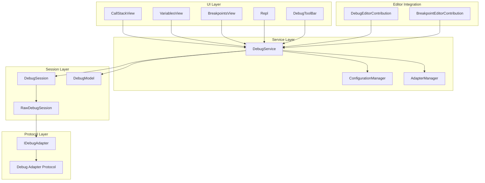
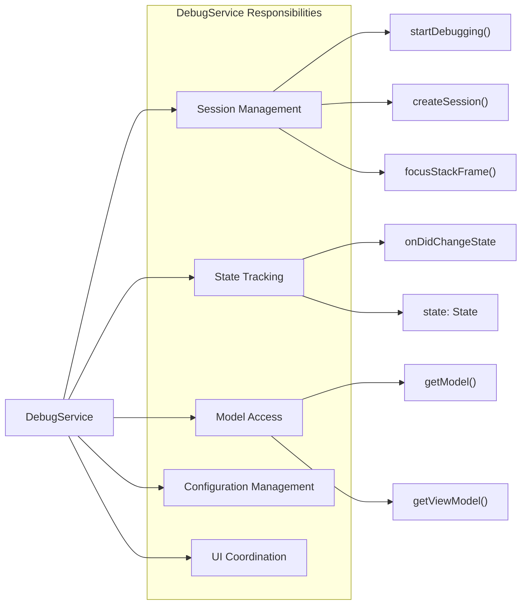
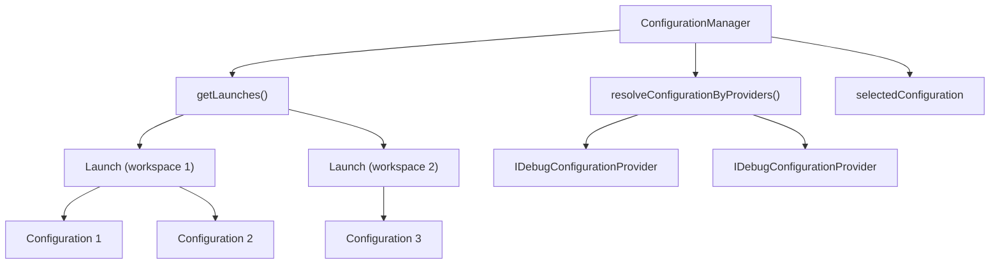
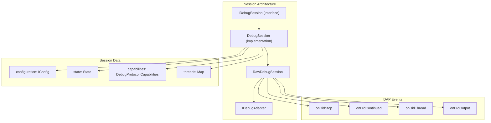
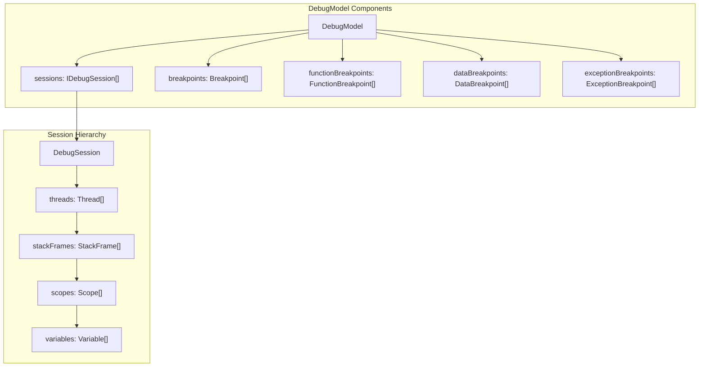
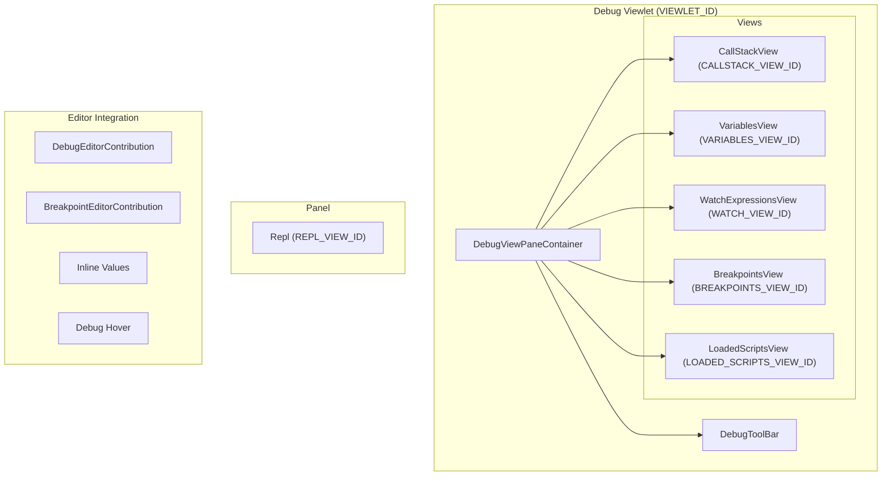
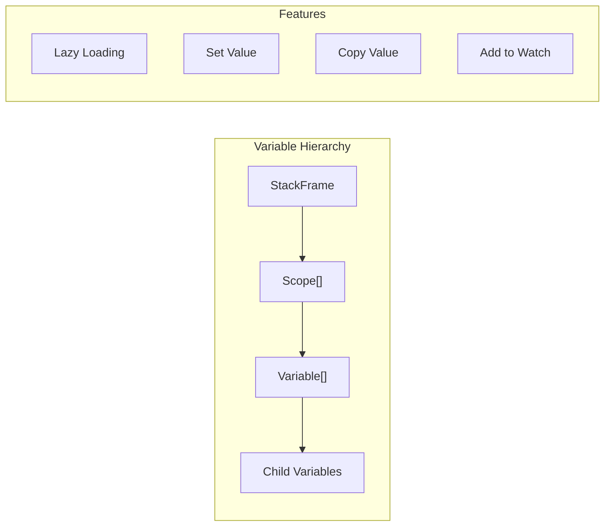
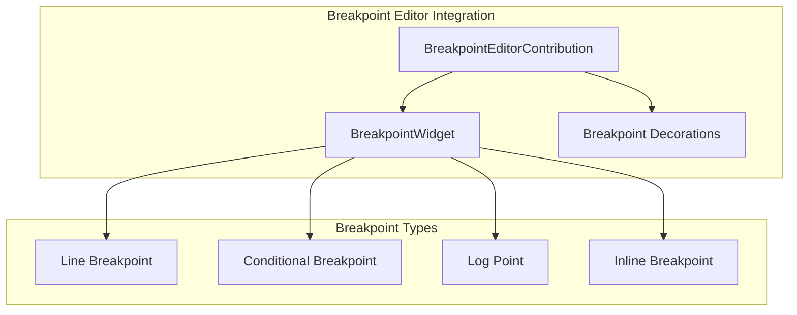
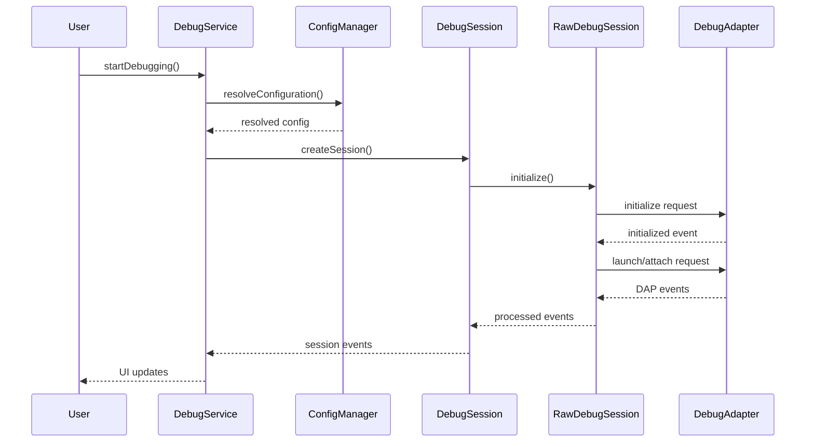

# Debugging System

Relevant source files

The following files were used as context for generating this wiki page:

- [src/vs/editor/contrib/hover/browser/glyphHoverWidget.ts](src/vs/editor/contrib/hover/browser/glyphHoverWidget.ts)
- [src/vs/workbench/api/browser/mainThreadDebugService.ts](src/vs/workbench/api/browser/mainThreadDebugService.ts)
- [src/vs/workbench/api/common/extHostDebugService.ts](src/vs/workbench/api/common/extHostDebugService.ts)
- [src/vs/workbench/contrib/debug/browser/baseDebugView.ts](src/vs/workbench/contrib/debug/browser/baseDebugView.ts)
- [src/vs/workbench/contrib/debug/browser/breakpointEditorContribution.ts](src/vs/workbench/contrib/debug/browser/breakpointEditorContribution.ts)
- [src/vs/workbench/contrib/debug/browser/breakpointWidget.ts](src/vs/workbench/contrib/debug/browser/breakpointWidget.ts)
- [src/vs/workbench/contrib/debug/browser/breakpointsView.ts](src/vs/workbench/contrib/debug/browser/breakpointsView.ts)
- [src/vs/workbench/contrib/debug/browser/callStackEditorContribution.ts](src/vs/workbench/contrib/debug/browser/callStackEditorContribution.ts)
- [src/vs/workbench/contrib/debug/browser/callStackView.ts](src/vs/workbench/contrib/debug/browser/callStackView.ts)
- [src/vs/workbench/contrib/debug/browser/debug.contribution.ts](src/vs/workbench/contrib/debug/browser/debug.contribution.ts)
- [src/vs/workbench/contrib/debug/browser/debugActionViewItems.ts](src/vs/workbench/contrib/debug/browser/debugActionViewItems.ts)
- [src/vs/workbench/contrib/debug/browser/debugCommands.ts](src/vs/workbench/contrib/debug/browser/debugCommands.ts)
- [src/vs/workbench/contrib/debug/browser/debugConfigurationManager.ts](src/vs/workbench/contrib/debug/browser/debugConfigurationManager.ts)
- [src/vs/workbench/contrib/debug/browser/debugEditorActions.ts](src/vs/workbench/contrib/debug/browser/debugEditorActions.ts)
- [src/vs/workbench/contrib/debug/browser/debugEditorContribution.ts](src/vs/workbench/contrib/debug/browser/debugEditorContribution.ts)
- [src/vs/workbench/contrib/debug/browser/debugHover.ts](src/vs/workbench/contrib/debug/browser/debugHover.ts)
- [src/vs/workbench/contrib/debug/browser/debugService.ts](src/vs/workbench/contrib/debug/browser/debugService.ts)
- [src/vs/workbench/contrib/debug/browser/debugSession.ts](src/vs/workbench/contrib/debug/browser/debugSession.ts)
- [src/vs/workbench/contrib/debug/browser/debugToolBar.ts](src/vs/workbench/contrib/debug/browser/debugToolBar.ts)
- [src/vs/workbench/contrib/debug/browser/debugViewlet.ts](src/vs/workbench/contrib/debug/browser/debugViewlet.ts)
- [src/vs/workbench/contrib/debug/browser/disassemblyView.ts](src/vs/workbench/contrib/debug/browser/disassemblyView.ts)
- [src/vs/workbench/contrib/debug/browser/exceptionWidget.ts](src/vs/workbench/contrib/debug/browser/exceptionWidget.ts)
- [src/vs/workbench/contrib/debug/browser/loadedScriptsView.ts](src/vs/workbench/contrib/debug/browser/loadedScriptsView.ts)
- [src/vs/workbench/contrib/debug/browser/media/breakpointWidget.css](src/vs/workbench/contrib/debug/browser/media/breakpointWidget.css)
- [src/vs/workbench/contrib/debug/browser/media/callStackEditorContribution.css](src/vs/workbench/contrib/debug/browser/media/callStackEditorContribution.css)
- [src/vs/workbench/contrib/debug/browser/media/debug.contribution.css](src/vs/workbench/contrib/debug/browser/media/debug.contribution.css)
- [src/vs/workbench/contrib/debug/browser/media/debugHover.css](src/vs/workbench/contrib/debug/browser/media/debugHover.css)
- [src/vs/workbench/contrib/debug/browser/media/debugToolBar.css](src/vs/workbench/contrib/debug/browser/media/debugToolBar.css)
- [src/vs/workbench/contrib/debug/browser/media/debugViewlet.css](src/vs/workbench/contrib/debug/browser/media/debugViewlet.css)
- [src/vs/workbench/contrib/debug/browser/media/exceptionWidget.css](src/vs/workbench/contrib/debug/browser/media/exceptionWidget.css)
- [src/vs/workbench/contrib/debug/browser/media/repl.css](src/vs/workbench/contrib/debug/browser/media/repl.css)
- [src/vs/workbench/contrib/debug/browser/rawDebugSession.ts](src/vs/workbench/contrib/debug/browser/rawDebugSession.ts)
- [src/vs/workbench/contrib/debug/browser/repl.ts](src/vs/workbench/contrib/debug/browser/repl.ts)
- [src/vs/workbench/contrib/debug/browser/replFilter.ts](src/vs/workbench/contrib/debug/browser/replFilter.ts)
- [src/vs/workbench/contrib/debug/browser/replViewer.ts](src/vs/workbench/contrib/debug/browser/replViewer.ts)
- [src/vs/workbench/contrib/debug/browser/variablesView.ts](src/vs/workbench/contrib/debug/browser/variablesView.ts)
- [src/vs/workbench/contrib/debug/browser/watchExpressionsView.ts](src/vs/workbench/contrib/debug/browser/watchExpressionsView.ts)
- [src/vs/workbench/contrib/debug/common/debug.ts](src/vs/workbench/contrib/debug/common/debug.ts)
- [src/vs/workbench/contrib/debug/common/debugModel.ts](src/vs/workbench/contrib/debug/common/debugModel.ts)
- [src/vs/workbench/contrib/debug/common/debugStorage.ts](src/vs/workbench/contrib/debug/common/debugStorage.ts)
- [src/vs/workbench/contrib/debug/common/debugViewModel.ts](src/vs/workbench/contrib/debug/common/debugViewModel.ts)
- [src/vs/workbench/contrib/debug/common/replModel.ts](src/vs/workbench/contrib/debug/common/replModel.ts)
- [src/vs/workbench/contrib/debug/test/browser/baseDebugView.test.ts](src/vs/workbench/contrib/debug/test/browser/baseDebugView.test.ts)
- [src/vs/workbench/contrib/debug/test/browser/breakpoints.test.ts](src/vs/workbench/contrib/debug/test/browser/breakpoints.test.ts)
- [src/vs/workbench/contrib/debug/test/browser/callStack.test.ts](src/vs/workbench/contrib/debug/test/browser/callStack.test.ts)
- [src/vs/workbench/contrib/debug/test/browser/debugHover.test.ts](src/vs/workbench/contrib/debug/test/browser/debugHover.test.ts)
- [src/vs/workbench/contrib/debug/test/browser/debugSource.test.ts](src/vs/workbench/contrib/debug/test/browser/debugSource.test.ts)
- [src/vs/workbench/contrib/debug/test/browser/debugViewModel.test.ts](src/vs/workbench/contrib/debug/test/browser/debugViewModel.test.ts)
- [src/vs/workbench/contrib/debug/test/browser/mockDebugModel.ts](src/vs/workbench/contrib/debug/test/browser/mockDebugModel.ts)
- [src/vs/workbench/contrib/debug/test/browser/rawDebugSession.test.ts](src/vs/workbench/contrib/debug/test/browser/rawDebugSession.test.ts)
- [src/vs/workbench/contrib/debug/test/browser/repl.test.ts](src/vs/workbench/contrib/debug/test/browser/repl.test.ts)
- [src/vs/workbench/contrib/debug/test/browser/watch.test.ts](src/vs/workbench/contrib/debug/test/browser/watch.test.ts)
- [src/vs/workbench/contrib/debug/test/common/debugModel.test.ts](src/vs/workbench/contrib/debug/test/common/debugModel.test.ts)
- [src/vs/workbench/contrib/debug/test/common/mockDebug.ts](src/vs/workbench/contrib/debug/test/common/mockDebug.ts)
- [src/vs/workbench/contrib/files/browser/views/emptyView.ts](src/vs/workbench/contrib/files/browser/views/emptyView.ts)
- [src/vs/workbench/contrib/files/browser/views/openEditorsView.ts](src/vs/workbench/contrib/files/browser/views/openEditorsView.ts)

This document covers VS Code's comprehensive debugging infrastructure, which enables users to debug various programming languages and runtimes through a unified interface. The system implements the Debug Adapter Protocol (DAP) and provides multiple specialized views for managing breakpoints, variables, call stacks, and interactive debugging sessions.

For information about individual language debugging extensions, see the Extension System documentation. For details about the underlying editor features that support debugging (like hover and inline values), see the Monaco Editor documentation.

## Architecture Overview

The debugging system follows a layered architecture with clear separation between protocol handling, session management, UI components, and editor integration.

### Core Architecture Diagram

Sources: [src/vs/workbench/contrib/debug/browser/debugService.ts:62-116](), [src/vs/workbench/contrib/debug/browser/debugSession.ts:53-188](), [src/vs/workbench/contrib/debug/common/debugModel.ts:1-31]()

## Core Services

### DebugService

The `DebugService` is the central orchestrator for all debugging operations. It implements `IDebugService` and manages the entire debugging lifecycle.

Key responsibilities include:
- **Session Lifecycle**: Creating, managing, and terminating debug sessions via `startDebugging()` and `createSession()`
- **State Management**: Tracking debugging state (Inactive, Initializing, Running, Stopped) through context keys
- **UI Coordination**: Coordinating between different debug views and the editor
- **Model Access**: Providing access to `DebugModel` and `ViewModel` instances

Sources: [src/vs/workbench/contrib/debug/browser/debugService.ts:237-250](), [src/vs/workbench/contrib/debug/browser/debugService.ts:352-449]()

### ConfigurationManager

The `ConfigurationManager` handles debug configurations from `launch.json` files and dynamic configuration providers.

Sources: [src/vs/workbench/contrib/debug/browser/debugConfigurationManager.ts:52-95](), [src/vs/workbench/contrib/debug/browser/debugConfigurationManager.ts:127-151]()

## Debug Sessions and Protocol

### Session Hierarchy

The `DebugSession` class manages individual debugging sessions and wraps the `RawDebugSession` which handles the Debug Adapter Protocol communication.

Key session methods:
- **Control Operations**: `continue()`, `pause()`, `stepIn()`, `stepOut()`, `stepOver()`
- **Breakpoint Management**: `sendBreakpoints()`, `sendFunctionBreakpoints()`, `sendDataBreakpoints()`
- **Evaluation**: `evaluate()`, `variables()`, `stackTrace()`

Sources: [src/vs/workbench/contrib/debug/browser/debugSession.ts:372-487](), [src/vs/workbench/contrib/debug/browser/rawDebugSession.ts:42-68]()

## Data Model

### DebugModel Structure

The model provides a hierarchical view of debugging data:
- **Breakpoints**: Line breakpoints with conditions, hit counts, and log messages
- **Function Breakpoints**: Breakpoints on function names  
- **Data Breakpoints**: Watchpoints on variable values
- **Call Stack**: Thread → StackFrame → Scope → Variable hierarchy

Sources: [src/vs/workbench/contrib/debug/common/debugModel.ts:1089-1150](), [src/vs/workbench/contrib/debug/common/debugModel.ts:37-240]()

## UI Components

### Debug Views Integration

### Call Stack View

The `CallStackView` displays the current execution state with sessions, threads, and stack frames in a tree structure.

Key features:
- **Multi-session Support**: Shows multiple debug sessions simultaneously
- **Thread Management**: Displays all threads per session with their states
- **Stack Frame Navigation**: Clicking stack frames changes editor focus
- **Compression**: Uses `CallStackCompressionDelegate` to group similar items

Sources: [src/vs/workbench/contrib/debug/browser/callStackView.ts:135-213](), [src/vs/workbench/contrib/debug/browser/callStackView.ts:287-331]()

### Variables View

The `VariablesView` shows variable values in the current scope using a tree structure with lazy loading.

Sources: [src/vs/workbench/contrib/debug/browser/variablesView.ts:87-142]()

### REPL (Read-Eval-Print Loop)

The `Repl` component provides an interactive console for expression evaluation during debugging.

Key capabilities:
- **Expression Evaluation**: Evaluate arbitrary expressions in the current context
- **Command History**: Navigate through previous commands using arrow keys
- **Auto-completion**: IntelliSense support for variables and functions
- **Multi-session Support**: Switch between different debug session REPLs

Sources: [src/vs/workbench/contrib/debug/browser/repl.ts:95-168](), [src/vs/workbench/contrib/debug/browser/repl.ts:255-325]()

## Editor Integration

### Breakpoint Management

The `BreakpointEditorContribution` manages breakpoint visualization and interaction in editors:
- **Gutter Decorations**: Shows breakpoint icons in the editor gutter
- **Hover Messages**: Displays breakpoint status and conditions on hover
- **Inline Widgets**: Provides UI for conditional breakpoints and log points
- **Context Menus**: Right-click options for breakpoint management

Sources: [src/vs/workbench/contrib/debug/browser/breakpointEditorContribution.ts:61-81](), [src/vs/workbench/contrib/debug/browser/breakpointEditorContribution.ts:680-750]()

### Debug Hover and Inline Values

The `DebugEditorContribution` provides runtime value display during debugging:
- **Variable Hover**: Shows variable values when hovering over identifiers
- **Inline Values**: Displays variable values inline at the end of lines
- **Expression Evaluation**: Evaluates selected expressions in hover

Sources: [src/vs/workbench/contrib/debug/browser/debugEditorContribution.ts:70-99](), [src/vs/workbench/contrib/debug/browser/debugHover.ts:1-50]()

## Data Flow and Communication

### Debug Session Lifecycle

Sources: [src/vs/workbench/contrib/debug/browser/debugService.ts:352-449](), [src/vs/workbench/contrib/debug/browser/debugSession.ts:339-404]()

The debugging system provides a comprehensive, extensible platform for debugging various programming languages through a unified interface. It separates concerns between protocol handling, session management, data modeling, and user interface components while maintaining tight integration with VS Code's editor and extension systems.